# Component Diagram - Task Creation API System

## Document Information
- **System**: Task Creation API
- **Version**: 1.0
- **Date**: 2024
- **Related ADR**: DEMO-2350
- **Generated From**: HLD Document and API Contract Outline

---

## Overview

This component diagram illustrates the architectural structure of the Task Creation API system, showing all components, their relationships, dependencies, and interfaces. The diagram follows C4 model principles and maps directly to the requirements specified in ADR DEMO-2350.

---

## Component Diagram: Task Creation API Architecture

```mermaid
C4Component
    title Component Diagram - Task Creation API System
    
    Container_Boundary(apiSystem, "Task Creation API System") {
        
        %% Presentation Layer Components
        Component(apiGateway, "API Gateway", "Kong/NGINX", "Rate limiting, SSL termination, request routing, CORS handling")
        Component(loadBalancer, "Load Balancer", "HAProxy/ALB", "Traffic distribution, health checks, failover")
        
        %% Application Layer Components
        Component(taskController, "TaskController", "NestJS Controller", "HTTP request handling, response formatting, OpenAPI documentation generation")
        Component(createTaskDto, "CreateTaskDto", "TypeScript Class", "Input validation with decorators: @IsNotEmpty, @MaxLength, @IsEnum, @IsDateString")
        Component(validationPipe, "ValidationPipe", "NestJS Pipe", "Automatic DTO validation, error transformation, custom validation rules")
        Component(authGuard, "AuthenticationGuard", "NestJS Guard", "JWT token validation, user context extraction, RBAC enforcement")
        Component(rateLimitGuard, "RateLimitGuard", "NestJS Guard", "Request rate limiting per user, IP-based throttling")
        
        %% Business Logic Layer Components
        Component(taskService, "TaskService", "NestJS Service", "Business logic validation, data sanitization, due date validation, user verification")
        Component(taskRepository, "TaskRepository", "TypeORM Repository", "Database abstraction, CRUD operations, query optimization")
        Component(userService, "UserService", "NestJS Service", "User validation, existence checks, permission verification")
        Component(auditService, "AuditService", "NestJS Service", "Operation logging, compliance tracking, audit trail generation")
        
        %% Data Transfer Objects
        Component(taskResponseDto, "TaskResponseDto", "TypeScript Class", "Response data formatting, field mapping, serialization")
        Component(errorResponseDto, "ErrorResponseDto", "TypeScript Class", "Error response standardization, validation error formatting")
        
        %% Cross-Cutting Concerns
        Component(logger, "Logger Service", "Winston/NestJS Logger", "Structured logging, correlation ID tracking, log level management")
        Component(configService, "Configuration Service", "NestJS Config", "Environment variable management, feature flags, runtime configuration")
        Component(healthCheck, "Health Check Service", "NestJS Health", "Liveness/readiness probes, dependency health monitoring")
        Component(metricsService, "Metrics Service", "Prometheus Client", "Custom metrics collection, performance monitoring, business metrics")
        
        %% Security Components
        Component(jwtService, "JWT Service", "NestJS JWT", "Token generation, validation, refresh token handling")
        Component(encryptionService, "Encryption Service", "Crypto Module", "Data encryption/decryption, hashing, key management")
        Component(sanitizationService, "Sanitization Service", "Custom Service", "Input sanitization, XSS prevention, data cleaning")
    }
    
    %% External Systems
    ContainerDb(database, "PostgreSQL Database", "PostgreSQL 14+", "Primary data store with ACID compliance, connection pooling")
    ContainerDb(redisCache, "Redis Cache", "Redis 7+", "Session storage, caching layer, rate limiting counters")
    Container_Ext(authService, "Authentication Service", "OAuth 2.0/OIDC", "User authentication, token validation, user profile management")
    Container_Ext(auditStore, "Audit Log Store", "ELK Stack", "Centralized audit logging, compliance reporting, log retention")
    Container_Ext(monitoring, "Monitoring System", "Prometheus/Grafana", "Metrics collection, alerting, performance dashboards")
    Container_Ext(notificationService, "Notification Service", "Email/SMS Gateway", "Task notifications, user communications")
    
    %% Client Applications
    Person(webClient, "Web Application", "Frontend application consuming the API")
    Person(mobileClient, "Mobile Application", "Mobile app with task management features")
    Person(thirdPartyClient, "Third-Party Integration", "External systems integrating with the API")
    
    %% Component Relationships - Request Flow
    Rel(webClient, apiGateway, "HTTPS Requests", "POST /api/tasks")
    Rel(mobileClient, apiGateway, "HTTPS Requests", "Mobile API calls")
    Rel(thirdPartyClient, apiGateway, "HTTPS Requests", "Integration API calls")
    
    Rel(apiGateway, loadBalancer, "Route Requests", "Load balancing")
    Rel(loadBalancer, taskController, "HTTP Requests", "Balanced traffic")
    
    %% Controller Layer Relationships
    Rel(taskController, authGuard, "Uses", "Authentication check")
    Rel(taskController, rateLimitGuard, "Uses", "Rate limiting")
    Rel(taskController, validationPipe, "Uses", "Input validation")
    Rel(taskController, createTaskDto, "Validates", "DTO validation")
    Rel(taskController, taskService, "Calls", "Business logic")
    Rel(taskController, taskResponseDto, "Uses", "Response formatting")
    Rel(taskController, errorResponseDto, "Uses", "Error responses")
    
    %% Service Layer Relationships
    Rel(taskService, taskRepository, "Uses", "Data persistence")
    Rel(taskService, userService, "Calls", "User validation")
    Rel(taskService, auditService, "Calls", "Audit logging")
    Rel(taskService, sanitizationService, "Uses", "Data sanitization")
    
    %% Repository and Data Access
    Rel(taskRepository, database, "Queries", "SQL operations")
    Rel(userService, database, "Queries", "User data access")
    
    %% Authentication and Security
    Rel(authGuard, jwtService, "Uses", "Token validation")
    Rel(authGuard, authService, "Validates", "User authentication")
    Rel(jwtService, redisCache, "Stores", "Token blacklist")
    
    %% Cross-Cutting Services
    Rel(taskService, logger, "Uses", "Operation logging")
    Rel(taskController, logger, "Uses", "Request logging")
    Rel(auditService, auditStore, "Sends", "Audit events")
    Rel(metricsService, monitoring, "Exports", "Performance metrics")
    Rel(healthCheck, database, "Checks", "Database health")
    Rel(healthCheck, redisCache, "Checks", "Cache health")
    
    %% Configuration and Utilities
    Rel(taskService, configService, "Uses", "Configuration")
    Rel(taskController, configService, "Uses", "Feature flags")
    Rel(encryptionService, configService, "Uses", "Encryption keys")
    
    %% External Integrations
    Rel(auditService, notificationService, "Triggers", "Task notifications")
    Rel(rateLimitGuard, redisCache, "Uses", "Rate counters")
```



---

## Component Descriptions

### **Presentation Layer Components**

#### API Gateway
- **Technology**: Kong/NGINX
- **Responsibilities**: 
  - SSL/TLS termination with TLS 1.3
  - Rate limiting enforcement (100 req/min per user)
  - CORS policy management
  - Request/response logging
  - API versioning support
- **ADR Mapping**: Entry point for all API requests

#### Load Balancer
- **Technology**: HAProxy/AWS ALB
- **Responsibilities**:
  - Traffic distribution across multiple instances
  - Health check monitoring
  - Automatic failover
  - Session affinity management

### **Application Layer Components**

#### TaskController
- **Technology**: NestJS Controller
- **ADR Mapping**: Direct implementation of DEMO-2350 requirement
- **Responsibilities**:
  - HTTP request handling for POST /api/tasks
  - Response formatting with proper status codes (201, 400, 401, 403, 409, 422, 429, 500)
  - OpenAPI documentation generation with decorators
  - Error handling and exception management
- **Key Methods**:
  - `createTask(@Body() createTaskDto: CreateTaskDto)`
  - Error handling with proper HTTP status codes

#### CreateTaskDto
- **Technology**: TypeScript Class with Validation Decorators
- **ADR Mapping**: Core validation requirement from DEMO-2350
- **Validation Decorators**:
  - `@IsNotEmpty()` - Required field validation
  - `@MaxLength(255)` - Title length constraint
  - `@MaxLength(1000)` - Description length constraint
  - `@IsEnum(TaskStatus)` - Status enumeration validation
  - `@IsDateString()` - Date format validation
  - `@IsUUID()` - User ID format validation
- **Properties**:
  ```typescript
  title: string;        // Required, max 255 chars
  description?: string; // Optional, max 1000 chars
  status: TaskStatus;   // Enum: TODO, IN_PROGRESS, DONE
  dueDate: string;      // ISO 8601 date string
  assignedTo?: string;  // UUID format
  priority?: Priority;  // Enum: LOW, MEDIUM, HIGH, CRITICAL
  ```

#### ValidationPipe
- **Technology**: NestJS Built-in Pipe
- **Responsibilities**:
  - Automatic DTO validation execution
  - Error message transformation
  - Custom validation rule processing
  - Whitelist and transform options

#### AuthenticationGuard
- **Technology**: NestJS Guard
- **Responsibilities**:
  - JWT token validation with 1-hour expiration
  - User context extraction
  - Role-Based Access Control (RBAC)
  - Request authorization

#### RateLimitGuard
- **Technology**: NestJS Guard with Redis
- **Responsibilities**:
  - Per-user rate limiting (100 requests/minute)
  - IP-based throttling
  - Sliding window rate limiting
  - Rate limit header management

### **Business Logic Layer Components**

#### TaskService
- **Technology**: NestJS Service
- **ADR Mapping**: Core business logic from DEMO-2350
- **Responsibilities**:
  - Business logic validation
  - Data sanitization and transformation
  - Due date validation (prevent past dates)
  - User existence and activity verification
  - Audit logging integration
- **Key Methods**:
  - `createTask(createTaskDto: CreateTaskDto): Promise<Task>`
  - `validateDueDate(dueDate: string): boolean`
  - `sanitizeTaskData(data: CreateTaskDto): SanitizedTaskData`

#### TaskRepository
- **Technology**: TypeORM Repository Pattern
- **Responsibilities**:
  - Database abstraction layer
  - CRUD operations with type safety
  - Query optimization
  - Transaction management
  - Connection pooling

#### UserService
- **Technology**: NestJS Service
- **Responsibilities**:
  - User validation and existence checks
  - Permission verification
  - User profile data access
  - Active user status validation

#### AuditService
- **Technology**: NestJS Service
- **Responsibilities**:
  - Operation logging for compliance
  - Before/after state capture
  - User activity tracking
  - IP address and timestamp logging
  - Audit trail generation

### **Data Transfer Objects**

#### TaskResponseDto
- **Technology**: TypeScript Class
- **Responsibilities**:
  - Response data formatting
  - Field mapping and serialization
  - Sensitive data exclusion
  - Consistent response structure

#### ErrorResponseDto
- **Technology**: TypeScript Class
- **Responsibilities**:
  - Standardized error response format
  - Validation error formatting
  - Error code mapping
  - Correlation ID inclusion

### **Cross-Cutting Concern Components**

#### Logger Service
- **Technology**: Winston/NestJS Logger
- **Responsibilities**:
  - Structured JSON logging
  - Correlation ID tracking
  - Log level management
  - Centralized log aggregation

#### Configuration Service
- **Technology**: NestJS Config Module
- **Responsibilities**:
  - Environment variable management
  - Feature flag support
  - Runtime configuration
  - Secure secret management

#### Health Check Service
- **Technology**: NestJS Health Module
- **Responsibilities**:
  - Kubernetes liveness probes
  - Readiness probe implementation
  - Dependency health monitoring
  - Service status reporting

#### Metrics Service
- **Technology**: Prometheus Client
- **Responsibilities**:
  - Custom metrics collection
  - Performance monitoring
  - Business metrics tracking
  - SLA monitoring

### **Security Components**

#### JWT Service
- **Technology**: NestJS JWT Module
- **Responsibilities**:
  - Token generation and validation
  - RS256 algorithm implementation
  - Token expiration management
  - Refresh token handling

#### Encryption Service
- **Technology**: Node.js Crypto Module
- **Responsibilities**:
  - AES-256 encryption for sensitive data
  - Password hashing with bcrypt
  - Key management
  - Data at rest encryption

#### Sanitization Service
- **Technology**: Custom NestJS Service
- **Responsibilities**:
  - XSS prevention through input sanitization
  - HTML entity encoding
  - SQL injection prevention
  - Data cleaning and normalization

---

## Component Interactions and Data Flow

### **Request Processing Flow**

1. **Client Request** → API Gateway → Load Balancer → TaskController
2. **Authentication** → AuthGuard → JWT Service → Authentication Service
3. **Rate Limiting** → RateLimitGuard → Redis Cache
4. **Validation** → ValidationPipe → CreateTaskDto (with decorators)
5. **Business Logic** → TaskService → Data Sanitization → Due Date Validation
6. **Data Persistence** → TaskRepository → PostgreSQL Database
7. **Audit Logging** → AuditService → ELK Stack
8. **Response** → TaskResponseDto → TaskController → Client

### **Error Handling Flow**

1. **Validation Errors** → ValidationPipe → ErrorResponseDto → 400 Bad Request
2. **Authentication Errors** → AuthGuard → 401 Unauthorized
3. **Authorization Errors** → AuthGuard → 403 Forbidden
4. **Business Rule Violations** → TaskService → 422 Unprocessable Entity
5. **Rate Limiting** → RateLimitGuard → 429 Too Many Requests
6. **System Errors** → Exception Filters → 500 Internal Server Error

---

## Component Dependencies

### **Internal Dependencies**
- TaskController → TaskService → TaskRepository
- TaskController → CreateTaskDto → ValidationPipe
- TaskService → UserService → Database
- TaskService → AuditService → Audit Store
- AuthGuard → JWT Service → Redis Cache

### **External Dependencies**
- Authentication Service (OAuth 2.0/OIDC)
- PostgreSQL Database (Primary data store)
- Redis Cache (Session and rate limiting)
- ELK Stack (Centralized logging)
- Prometheus/Grafana (Monitoring)
- Notification Service (Email/SMS)

---

## Security Architecture

### **Authentication Flow**
1. Client provides JWT token in Authorization header
2. AuthGuard validates token signature and expiration
3. JWT Service extracts user claims and permissions
4. User context is attached to request for downstream processing

### **Authorization Model**
- **Role-Based Access Control (RBAC)**
- **Resource-level permissions**
- **Operation-specific authorization**
- **Context-aware access decisions**

### **Data Protection**
- **Encryption in Transit**: TLS 1.3 for all communications
- **Encryption at Rest**: AES-256 for sensitive database fields
- **Input Sanitization**: XSS and injection attack prevention
- **Output Encoding**: Safe data rendering

---

## Scalability and Performance

### **Horizontal Scaling**
- **Stateless Design**: All components are stateless for easy scaling
- **Load Balancing**: Traffic distribution across multiple instances
- **Auto-scaling**: Kubernetes HPA based on CPU/memory metrics
- **Database Scaling**: Read replicas for query optimization

### **Caching Strategy**
- **Redis Cache**: Session storage and rate limiting counters
- **Application-level Caching**: Frequently accessed data
- **Database Query Optimization**: Indexed queries and connection pooling

### **Performance Optimizations**
- **Connection Pooling**: Database connection management
- **Async Processing**: Non-blocking I/O operations
- **Lazy Loading**: On-demand data loading
- **Compression**: Response compression for large payloads

---

## Monitoring and Observability

### **Metrics Collection**
- **Application Metrics**: Response time, throughput, error rates
- **Business Metrics**: Task creation rate, user activity
- **System Metrics**: CPU, memory, database performance
- **Custom Metrics**: Domain-specific measurements

### **Logging Strategy**
- **Structured Logging**: JSON format with correlation IDs
- **Centralized Aggregation**: ELK Stack for log management
- **Log Levels**: Appropriate filtering and retention
- **Security Logging**: Authentication and authorization events

### **Health Monitoring**
- **Liveness Probes**: Application health checks
- **Readiness Probes**: Dependency availability checks
- **Dependency Monitoring**: External service health
- **Circuit Breaker**: Fault tolerance patterns

---

## Compliance and Audit

### **GDPR Compliance**
- **Data Minimization**: Only necessary data collection
- **Right to Erasure**: Data deletion capabilities
- **Audit Trail**: Complete operation logging
- **Consent Management**: User permission tracking

### **Security Standards**
- **ISO 27001**: Information security controls
- **SOC 2 Type II**: Security and availability controls
- **OWASP Top 10**: Security vulnerability mitigation
- **PCI-DSS**: Payment data security (if applicable)

### **Audit Requirements**
- **Operation Logging**: All CRUD operations logged
- **User Activity Tracking**: IP address and timestamp logging
- **Data Change History**: Before/after state capture
- **Compliance Reporting**: Automated audit report generation

---

## Deployment Architecture

### **Container Strategy**
- **Docker Containers**: Application packaging
- **Kubernetes Orchestration**: Container management
- **Multi-AZ Deployment**: High availability setup
- **Rolling Updates**: Zero-downtime deployments

### **Environment Configuration**
- **Development**: Local Docker containers
- **Staging**: Single-replica Kubernetes deployment
- **Production**: Multi-replica, multi-AZ deployment
- **Configuration Management**: Environment-specific settings

---

## Technology Stack Summary

### **Core Technologies**
- **Runtime**: Node.js 18+ with TypeScript
- **Framework**: NestJS with Express
- **Database**: PostgreSQL 14+ with TypeORM
- **Cache**: Redis 7+ for session and rate limiting
- **Authentication**: JWT with RS256 algorithm

### **Infrastructure**
- **Container Platform**: Kubernetes
- **Load Balancer**: HAProxy/AWS ALB
- **API Gateway**: Kong/NGINX
- **Monitoring**: Prometheus + Grafana
- **Logging**: ELK Stack (Elasticsearch, Logstash, Kibana)

### **Development Tools**
- **API Documentation**: OpenAPI 3.0 with Swagger UI
- **Testing**: Jest for unit and integration tests
- **Code Quality**: ESLint, Prettier, SonarQube
- **CI/CD**: GitLab CI/GitHub Actions

---

*This component diagram represents the complete architectural structure of the Task Creation API system as specified in ADR DEMO-2350, implementing all validation, security, and compliance requirements outlined in the HLD document.*