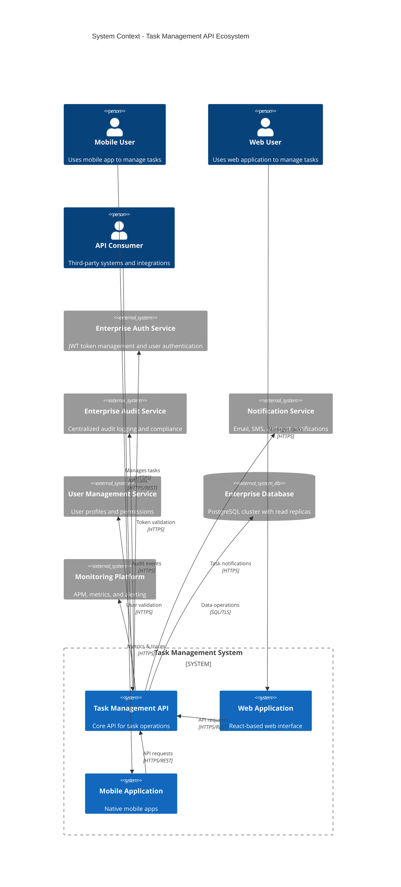
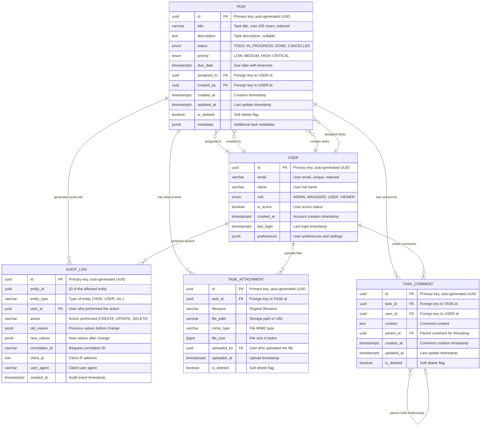
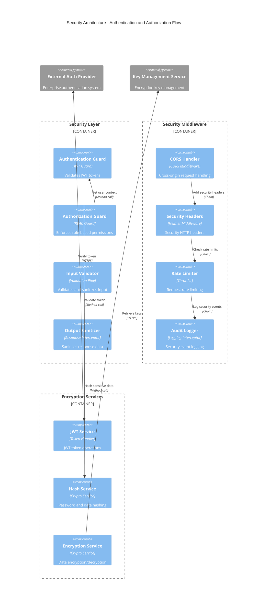
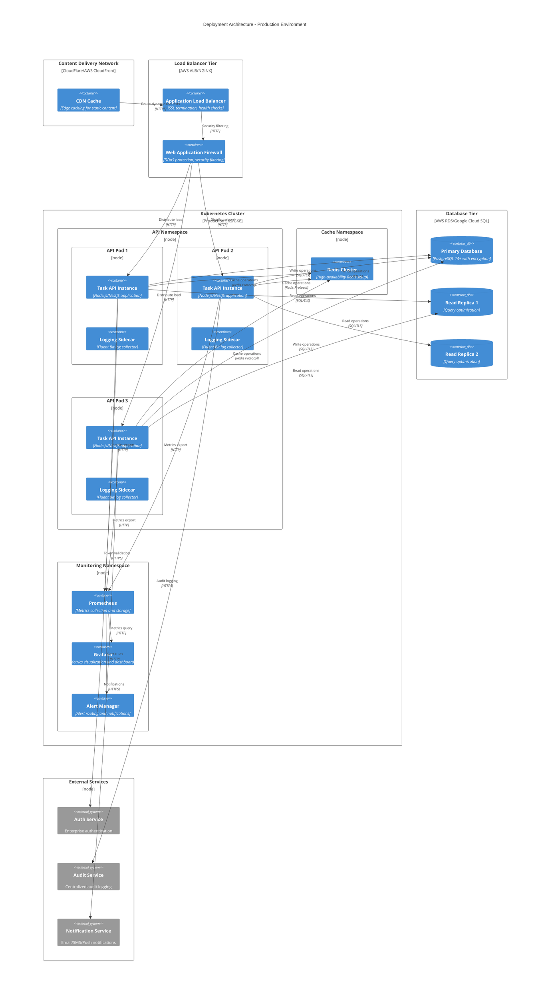
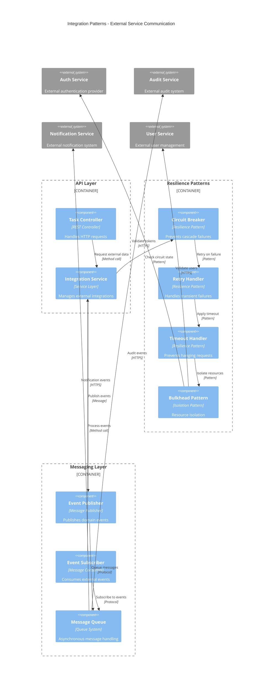

# Component Diagram - Task Management API
## System Architecture and Component Relationships

### Version: 1.0
### Date: 2024
### Generated from: HLD Document and API Contract Outline

---

## Overview

This component diagram illustrates the complete architecture of the Task Management API system, showing all components, their relationships, dependencies, and data flows. The architecture follows enterprise patterns with clear separation of concerns, security layers, and scalability considerations.

## High-Level System Architecture

## Container-Level Architecture

```mermaid
C4Container
    title Container Diagram - Task Management API Internal Architecture
    
    Person(user, "API Consumer", "External clients and applications")
    
    System_Boundary(infrastructure, "Infrastructure Layer") {
        Container(loadBalancer, "Load Balancer", "NGINX/AWS ALB", "SSL termination, load distribution")
        Container(apiGateway, "API Gateway", "Kong/AWS API Gateway", "Rate limiting, routing, monitoring")
    }
    
    System_Boundary(application, "Application Layer") {
        Container(taskController, "Task Controller", "NestJS Controller", "HTTP request handling, response formatting")
        Container(authMiddleware, "Auth Middleware", "NestJS Guard", "JWT validation, user context")
        Container(validationMiddleware, "Validation Middleware", "class-validator", "Input validation, DTO transformation")
        Container(errorMiddleware, "Error Middleware", "NestJS Filter", "Global error handling, response formatting")
        Container(loggingMiddleware, "Logging Middleware", "Winston/NestJS", "Request/response logging, correlation IDs")
    }
    
    System_Boundary(business, "Business Logic Layer") {
        Container(taskService, "Task Service", "NestJS Service", "Business logic, validation rules")
        Container(userService, "User Service", "NestJS Service", "User-related operations")
        Container(auditService, "Audit Service", "NestJS Service", "Audit trail management")
        Container(notificationService, "Notification Service", "NestJS Service", "Task notifications")
    }
    
    System_Boundary(data, "Data Access Layer") {
        Container(taskRepository, "Task Repository", "TypeORM Repository", "Task data access, CRUD operations")
        Container(userRepository, "User Repository", "TypeORM Repository", "User data access")
        Container(auditRepository, "Audit Repository", "TypeORM Repository", "Audit log persistence")
        Container(cacheService, "Cache Service", "Redis Client", "Performance caching, session storage")
    }
    
    System_Boundary(external, "External Systems") {
        SystemDb(database, "PostgreSQL Database", "Primary data store")
        SystemDb(readReplica, "Read Replica", "Query optimization")
        System_Ext(redisCluster, "Redis Cluster", "Caching and session storage")
        System_Ext(authProvider, "Auth Provider", "JWT validation service")
        System_Ext(auditSystem, "Audit System", "Enterprise audit platform")
    }
    
    %% User interactions
    Rel(user, loadBalancer, "HTTPS requests", "REST API")
    
    %% Infrastructure flow
    Rel(loadBalancer, apiGateway, "Route requests", "HTTP")
    Rel(apiGateway, taskController, "Forward requests", "HTTP")
    
    %% Middleware chain
    Rel(taskController, authMiddleware, "Authenticate", "Method call")
    Rel(authMiddleware, validationMiddleware, "Validate input", "Method call")
    Rel(validationMiddleware, loggingMiddleware, "Log request", "Method call")
    Rel(loggingMiddleware, errorMiddleware, "Handle errors", "Method call")
    
    %% Controller to services
    Rel(taskController, taskService, "Business operations", "Method call")
    
    %% Service interactions
    Rel(taskService, userService, "User validation", "Method call")
    Rel(taskService, auditService, "Audit logging", "Method call")
    Rel(taskService, notificationService, "Send notifications", "Method call")
    
    %% Data access
    Rel(taskService, taskRepository, "Data operations", "Method call")
    Rel(userService, userRepository, "User queries", "Method call")
    Rel(auditService, auditRepository, "Audit persistence", "Method call")
    Rel(taskService, cacheService, "Cache operations", "Method call")
    
    %% External dependencies
    Rel(taskRepository, database, "Write operations", "SQL")
    Rel(taskRepository, readReplica, "Read operations", "SQL")
    Rel(cacheService, redisCluster, "Cache operations", "Redis Protocol")
    Rel(authMiddleware, authProvider, "Token validation", "HTTPS")
    Rel(auditService, auditSystem, "Audit events", "HTTPS")
```

## Component-Level Architecture

```mermaid
C4Component
    title Component Diagram - Task Service Internal Structure
    
    Container_Boundary(taskController, "Task Controller Layer") {
        Component(createTaskEndpoint, "Create Task Endpoint", "@Post('/tasks')", "Handles task creation requests")
        Component(responseFormatter, "Response Formatter", "ResponseInterceptor", "Formats API responses")
        Component(requestValidator, "Request Validator", "ValidationPipe", "Validates incoming requests")
    }
    
    Container_Boundary(middleware, "Middleware Layer") {
        Component(jwtGuard, "JWT Guard", "AuthGuard", "JWT token validation")
        Component(rbacGuard, "RBAC Guard", "RolesGuard", "Role-based access control")
        Component(rateLimitGuard, "Rate Limit Guard", "ThrottlerGuard", "Request rate limiting")
        Component(correlationMiddleware, "Correlation Middleware", "Interceptor", "Request correlation tracking")
    }
    
    Container_Boundary(businessLogic, "Business Logic Layer") {
        Component(taskCreationService, "Task Creation Service", "Service Class", "Core task creation logic")
        Component(businessValidator, "Business Validator", "Validator Class", "Business rule validation")
        Component(dataSanitizer, "Data Sanitizer", "Sanitizer Class", "Input sanitization and security")
        Component(duplicationChecker, "Duplication Checker", "Service Class", "Duplicate task detection")
    }
    
    Container_Boundary(dataAccess, "Data Access Layer") {
        Component(taskEntity, "Task Entity", "TypeORM Entity", "Task data model")
        Component(taskRepository, "Task Repository", "Repository Pattern", "Data access abstraction")
        Component(queryBuilder, "Query Builder", "TypeORM QueryBuilder", "Dynamic query construction")
        Component(transactionManager, "Transaction Manager", "EntityManager", "Database transaction handling")
    }
    
    Container_Boundary(integration, "Integration Layer") {
        Component(auditPublisher, "Audit Publisher", "Event Publisher", "Publishes audit events")
        Component(notificationPublisher, "Notification Publisher", "Event Publisher", "Publishes notification events")
        Component(cacheManager, "Cache Manager", "Cache Service", "Manages caching operations")
        Component(metricsCollector, "Metrics Collector", "Metrics Service", "Collects performance metrics")
    }
    
    %% Request flow
    Rel(createTaskEndpoint, requestValidator, "Validate request", "Pipe")
    Rel(requestValidator, jwtGuard, "Authenticate", "Guard")
    Rel(jwtGuard, rbacGuard, "Authorize", "Guard")
    Rel(rbacGuard, rateLimitGuard, "Check limits", "Guard")
    Rel(rateLimitGuard, correlationMiddleware, "Add correlation", "Interceptor")
    
    %% Business logic flow
    Rel(createTaskEndpoint, taskCreationService, "Process request", "Method call")
    Rel(taskCreationService, businessValidator, "Validate rules", "Method call")
    Rel(businessValidator, dataSanitizer, "Sanitize data", "Method call")
    Rel(dataSanitizer, duplicationChecker, "Check duplicates", "Method call")
    
    %% Data operations
    Rel(taskCreationService, taskRepository, "Persist data", "Method call")
    Rel(taskRepository, taskEntity, "Map to entity", "ORM")
    Rel(taskRepository, queryBuilder, "Build queries", "Method call")
    Rel(taskRepository, transactionManager, "Manage transactions", "Method call")
    
    %% Integration operations
    Rel(taskCreationService, auditPublisher, "Publish audit event", "Event")
    Rel(taskCreationService, notificationPublisher, "Publish notification", "Event")
    Rel(taskCreationService, cacheManager, "Update cache", "Method call")
    Rel(taskCreationService, metricsCollector, "Record metrics", "Method call")
    
    %% Response flow
    Rel(taskCreationService, responseFormatter, "Format response", "Interceptor")
    Rel(responseFormatter, createTaskEndpoint, "Return response", "HTTP")
```

## Data Model and Relationships

## Security Architecture

## Deployment Architecture

## Integration Patterns

---

## Component Characteristics

### Performance Requirements
- **API Response Time**: < 200ms (P95)
- **Database Query Time**: < 100ms (P95)
- **Cache Hit Ratio**: > 90% for frequently accessed data
- **Throughput**: 1000+ requests per second

### Scalability Features
- **Horizontal Scaling**: Stateless application design
- **Auto-scaling**: Kubernetes HPA based on CPU/memory
- **Database Scaling**: Read replicas for query distribution
- **Cache Scaling**: Redis cluster with sharding

### Security Components
- **Authentication**: JWT-based with external provider integration
- **Authorization**: Role-based access control (RBAC)
- **Input Validation**: Multi-layer validation and sanitization
- **Audit Trail**: Comprehensive audit logging for compliance

### Reliability Patterns
- **Circuit Breaker**: Prevents cascade failures
- **Retry Logic**: Exponential backoff for transient failures
- **Health Checks**: Kubernetes liveness and readiness probes
- **Graceful Shutdown**: Proper connection cleanup on termination

### Monitoring and Observability
- **Metrics Collection**: Prometheus-based metrics
- **Distributed Tracing**: Request correlation across services
- **Structured Logging**: JSON-formatted logs with correlation IDs
- **Alerting**: Real-time alerts for critical issues

---

## Technology Stack

### Application Layer
- **Framework**: NestJS (Node.js)
- **Language**: TypeScript
- **Validation**: class-validator, class-transformer
- **Documentation**: Swagger/OpenAPI 3.0

### Data Layer
- **Database**: PostgreSQL 14+
- **ORM**: TypeORM
- **Caching**: Redis Cluster
- **Migration**: TypeORM migrations

### Infrastructure
- **Container**: Docker
- **Orchestration**: Kubernetes
- **Load Balancer**: AWS ALB / NGINX
- **Service Mesh**: Istio (optional)

### Monitoring
- **Metrics**: Prometheus + Grafana
- **Logging**: ELK Stack / Fluent Bit
- **Tracing**: Jaeger / AWS X-Ray
- **APM**: New Relic / DataDog

---

## Compliance and Standards

### Security Standards
- **OWASP Top 10**: Protection against common vulnerabilities
- **JWT Security**: Secure token handling and validation
- **Data Encryption**: AES-256 encryption at rest and in transit
- **Input Sanitization**: XSS and injection prevention

### Regulatory Compliance
- **GDPR**: Data privacy and user rights
- **SOC 2**: Security and availability controls
- **ISO 27001**: Information security management
- **PCI DSS**: Payment card data protection (if applicable)

### API Standards
- **REST**: RESTful API design principles
- **OpenAPI 3.0**: API specification and documentation
- **HTTP**: Proper use of HTTP methods and status codes
- **JSON**: RFC 7159 compliant JSON responses

---

**Document Metadata**
- **Generated From**: HLD Document v1.0, API Contract Outline v1.0
- **Architecture Style**: Layered Architecture with Microservices patterns
- **Design Patterns**: Repository, Service Layer, Dependency Injection, Circuit Breaker
- **Technology Stack**: Node.js/NestJS, PostgreSQL, Redis, Kubernetes
- **Compliance**: GDPR, ISO27001, SOC2, OWASP Top 10
- **Performance**: < 200ms response time, 1000+ RPS, 99.9% availability