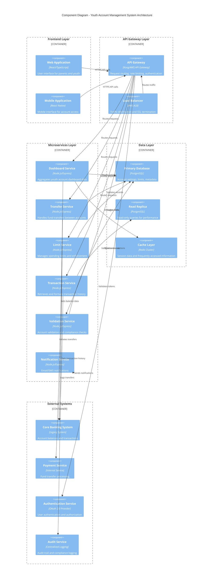
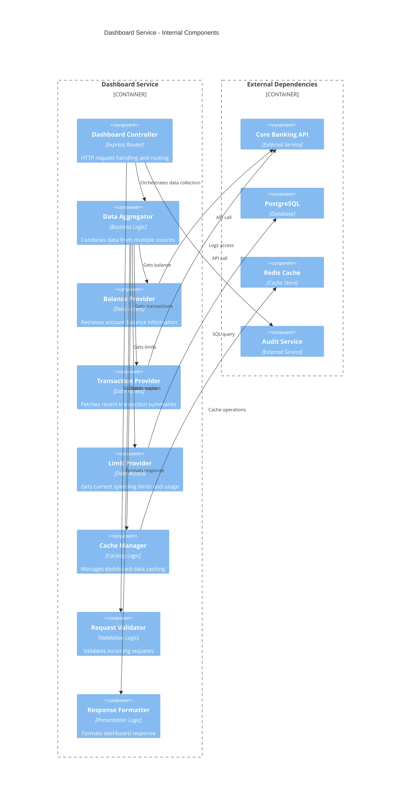
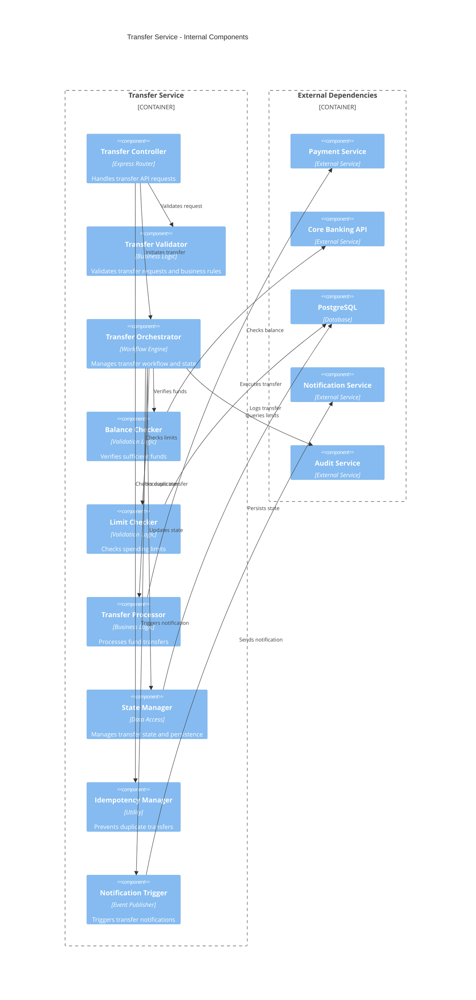
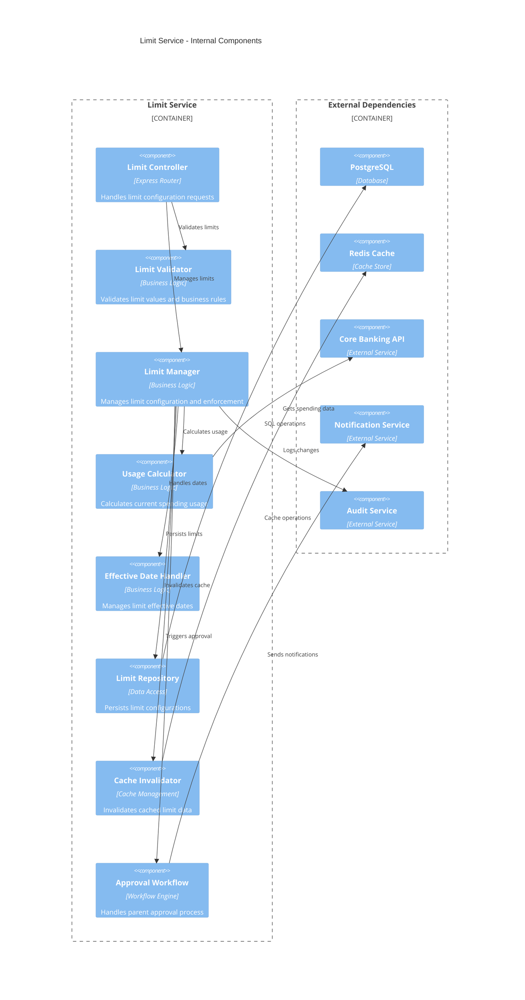
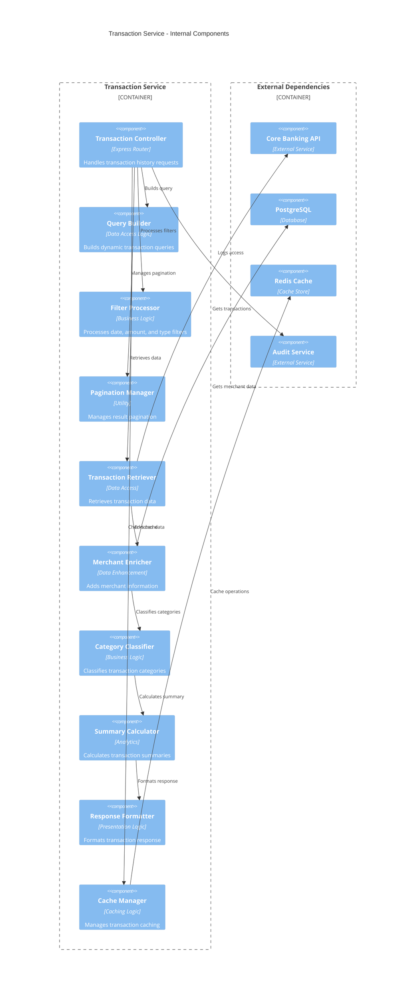
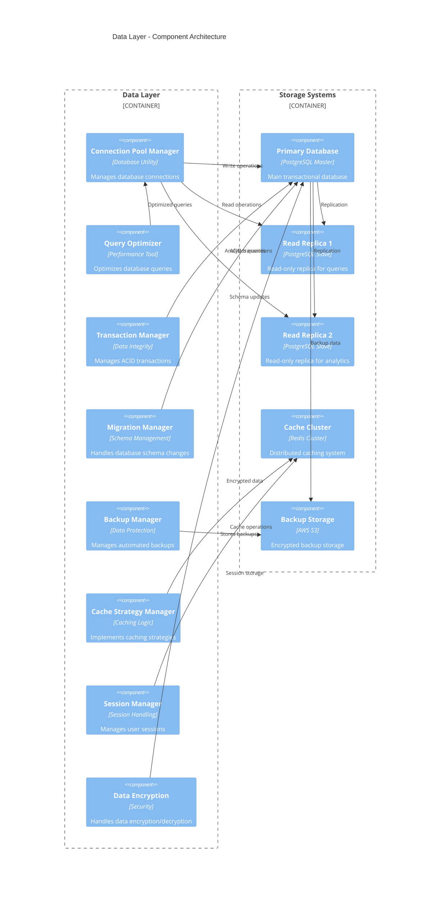
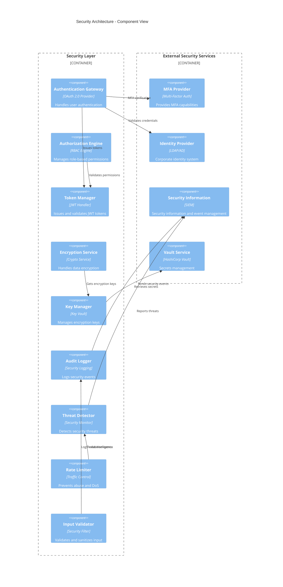
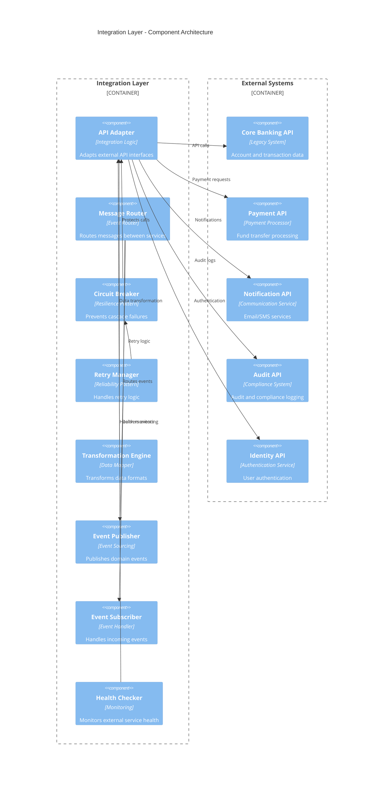
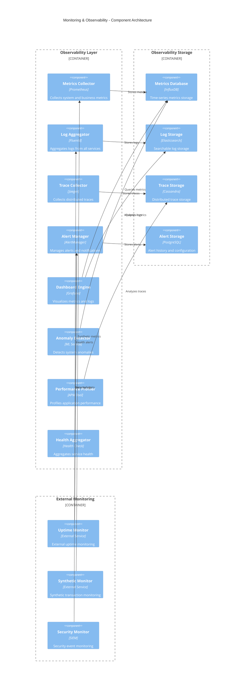

# Component Diagrams
## Youth Account Management System

### Version: 1.0
### Date: 2024
### Classification: Internal

---

## 1. High-Level System Architecture

**Overall system component view showing major subsystems and their relationships**



---

## 2. Dashboard Service Component Architecture

**Mapped to ADR**: SCIB-26 - Create API to retrieve youth account dashboard details



---

## 3. Transfer Service Component Architecture

**Mapped to ADR**: SCIB-27 - Create API for parent to transfer funds to youth account



---

## 4. Limit Service Component Architecture

**Mapped to ADR**: SCIB-28 - Create API for configuring youth spending limit



---

## 5. Transaction Service Component Architecture

**Mapped to ADR**: SCIB-29 - Create API to retrieve youth account transaction history



---

## 6. Data Layer Component Architecture

**Database and caching components with their relationships**



---

## 7. Security Component Architecture

**Security components and their integration points**



---

## 8. Integration Component Architecture

**External system integration components**



---

## 9. Monitoring and Observability Components

**Monitoring, logging, and observability architecture**



---

## 10. Deployment Component Architecture

**Containerized deployment architecture with orchestration**

```mermaid
C4Deployment
    title Deployment Architecture - Component View
    
    Deployment_Node(cdn, "CDN Layer", "CloudFlare") {
        Container(staticAssets, "Static Assets", "React Build", "Optimized frontend assets")
        Container(apiCache, "API Cache", "Edge Cache", "Cached API responses")
    }
    
    Deployment_Node(loadBalancer, "Load Balancer", "AWS ALB") {
        Container(albController, "ALB Controller", "Traffic Router", "Intelligent traffic routing")
        Container(sslTermination, "SSL Termination", "Certificate Manager", "TLS/SSL handling")
        Container(wafProtection, "WAF Protection", "Security Filter", "Web application firewall")
    }
    
    Deployment_Node(computeCluster, "Compute Cluster", "AWS ECS Fargate") {
        Container(webTier, "Web Tier", "Container Group", "Frontend application containers")
        Container(apiTier, "API Tier", "Container Group", "Microservice containers")
        Container(workerTier, "Worker Tier", "Container Group", "Background job processors")
    }
    
    Deployment_Node(dataCluster, "Data Cluster", "AWS RDS/ElastiCache") {
        Container(primaryDB, "Primary DB", "PostgreSQL", "Master database instance")
        Container(readReplicas, "Read Replicas", "PostgreSQL", "Read-only database replicas")
        Container(cacheCluster, "Cache Cluster", "Redis", "Distributed cache cluster")
    }
    
    Deployment_Node(monitoring, "Monitoring Stack", "AWS CloudWatch + ELK") {
        Container(metricsStack, "Metrics Stack", "Prometheus/Grafana", "Metrics collection and visualization")
        Container(loggingStack, "Logging Stack", "ELK Stack", "Centralized logging system")
        Container(alertingStack, "Alerting Stack", "AlertManager", "Alert management system")
    }
    
    Rel(cdn, loadBalancer, "Serves cached content")
    Rel(loadBalancer, computeCluster, "Routes traffic")
    Rel(computeCluster, dataCluster, "Data operations")
    Rel(computeCluster, monitoring, "Sends telemetry")
    Rel(dataCluster, monitoring, "Database metrics")
```

---

## Component Architecture Summary

### Key Architectural Patterns:

1. **Microservices Architecture**: Loosely coupled, independently deployable services
2. **API Gateway Pattern**: Centralized API management and routing
3. **Database per Service**: Each service owns its data
4. **CQRS (Command Query Responsibility Segregation)**: Separate read and write models
5. **Event-Driven Architecture**: Asynchronous communication via events
6. **Circuit Breaker Pattern**: Resilience against external service failures
7. **Bulkhead Pattern**: Isolation of critical resources
8. **Saga Pattern**: Distributed transaction management

### Technology Stack:

**Frontend Layer:**
- React/TypeScript for web application
- React Native for mobile application
- Redux for state management

**API Layer:**
- Kong/AWS API Gateway for request routing
- OAuth 2.0 for authentication
- Rate limiting and throttling

**Service Layer:**
- Node.js/Express for microservices
- Docker containers for deployment
- AWS ECS Fargate for orchestration

**Data Layer:**
- PostgreSQL for transactional data
- Redis for caching and sessions
- AWS S3 for backup storage

**Integration Layer:**
- REST APIs for synchronous communication
- Event streaming for asynchronous communication
- Circuit breakers for resilience

**Monitoring Layer:**
- Prometheus for metrics collection
- ELK stack for logging
- Jaeger for distributed tracing
- Grafana for visualization

### Security Components:

1. **Authentication Gateway**: OAuth 2.0 with MFA support
2. **Authorization Engine**: RBAC with fine-grained permissions
3. **Encryption Service**: AES-256 encryption for data at rest
4. **Key Management**: Secure key rotation and storage
5. **Audit Logging**: Comprehensive security event logging
6. **Threat Detection**: Real-time security monitoring

### Performance Optimizations:

1. **Caching Strategy**: Multi-level caching (CDN, API, Database)
2. **Database Optimization**: Read replicas and query optimization
3. **Connection Pooling**: Efficient database connection management
4. **Async Processing**: Non-blocking operations where possible
5. **Load Balancing**: Intelligent traffic distribution

### Scalability Features:

1. **Horizontal Scaling**: Auto-scaling based on metrics
2. **Database Scaling**: Read replicas and sharding capabilities
3. **Cache Scaling**: Distributed cache clusters
4. **Geographic Distribution**: Multi-region deployment support

### Reliability Measures:

1. **Redundancy**: No single points of failure
2. **Health Monitoring**: Continuous health checks
3. **Graceful Degradation**: Fallback mechanisms
4. **Disaster Recovery**: Cross-region backup and failover
5. **Circuit Breakers**: Protection against cascade failures

---

**Document Version**: 1.0
**Last Updated**: 2024
**Review Cycle**: Monthly
**Approval**: Pending Architecture Review Board
**Classification**: Internal