# Component Diagram - Real-Time Task Creation Synchronization System

## Overview
This component diagram illustrates the architectural structure, relationships, and data flow between components in the Real-Time Task Creation Synchronization System for the SCIB collaboration platform.

## System Architecture

```mermaid
C4Component
    title Component Diagram - Task Creation Synchronization System
    
    Container_Boundary(frontend, "Angular Frontend Application") {
        Component(taskForm, "Task Creation Form", "Angular Component", "Reactive form with real-time validation and optimistic updates")
        Component(taskBoard, "Task Board Display", "Angular Component", "Real-time task visualization with WebSocket integration")
        Component(validationService, "Validation Service", "Angular Service", "Client-side validation and server validation coordination")
        Component(websocketClient, "WebSocket Client", "Angular Service", "Real-time connection management and message handling")
        Component(apiClient, "HTTP API Client", "Angular Service", "REST API communication with error handling and retry logic")
        Component(stateManager, "State Management", "NgRx Store", "Application state management with optimistic updates")
    }
    
    Container_Boundary(gateway, "API Gateway") {
        Component(authGateway, "Authentication Gateway", "Spring Cloud Gateway", "JWT validation, rate limiting, and request routing")
        Component(loadBalancer, "Load Balancer", "NGINX", "Request distribution and SSL termination")
    }
    
    Container_Boundary(backend, "Spring Boot Backend Services") {
        Component(taskController, "Task Controller", "REST Controller", "HTTP endpoints for task operations with OpenAPI documentation")
        Component(taskService, "Task Creation Service", "Spring Service", "Business logic for task creation, validation, and batch processing")
        Component(validationEngine, "Validation Engine", "Spring Service", "Comprehensive server-side validation with custom validators")
        Component(eventPublisher, "Event Publisher", "Spring Service", "Redis pub/sub event publishing for real-time notifications")
        Component(batchProcessor, "Batch Processor", "Spring Service", "Asynchronous bulk task creation with progress tracking")
        Component(auditLogger, "Audit Logger", "Spring Component", "Compliance logging and user activity tracking")
    }
    
    Container_Boundary(realtime, "Real-time Communication Layer") {
        Component(websocketHandler, "WebSocket Handler", "Spring WebSocket", "Connection management and message broadcasting")
        Component(sessionManager, "Session Manager", "Spring Component", "WebSocket session tracking and user presence management")
        Component(messageRouter, "Message Router", "Spring Component", "Board-based message routing and permission filtering")
    }
    
    Container_Boundary(data, "Data Access Layer") {
        Component(taskRepository, "Task Repository", "Spring Data JPA", "Database operations with transaction management")
        Component(userRepository, "User Repository", "Spring Data JPA", "User data access and profile management")
        Component(boardRepository, "Board Repository", "Spring Data JPA", "Board configuration and access control data")
        Component(connectionPool, "Connection Pool", "HikariCP", "Database connection pooling and performance optimization")
    }
    
    Container_Boundary(cache, "Caching Layer") {
        Component(redisCache, "Redis Cache", "Spring Data Redis", "Validation result caching and session storage")
        Component(redisPubSub, "Redis Pub/Sub", "Spring Data Redis", "Real-time message broker for event distribution")
    }
    
    Container_Boundary(database, "Database Layer") {
        ComponentDb(postgresql, "PostgreSQL Database", "Relational Database", "Primary data storage with ACID compliance and constraints")
        ComponentDb(readReplica, "Read Replica", "PostgreSQL", "Read-only replica for query load distribution")
    }
    
    Container_Boundary(external, "External Services") {
        Component(authService, "Authentication Service", "OAuth 2.0 Provider", "User authentication and JWT token management")
        Component(notificationService, "Notification Service", "External API", "Email and push notification delivery")
        Component(monitoringService, "Monitoring Service", "APM Tool", "Performance monitoring and alerting")
        Component(auditService, "Audit Service", "External System", "Compliance and regulatory audit logging")
    }
    
    %% Frontend Internal Relationships
    Rel(taskForm, validationService, "Validates input", "Service call")
    Rel(taskForm, apiClient, "Submits tasks", "HTTP POST")
    Rel(taskForm, stateManager, "Updates state", "Action dispatch")
    Rel(taskBoard, websocketClient, "Receives updates", "WebSocket message")
    Rel(taskBoard, stateManager, "Reads state", "Selector")
    Rel(websocketClient, stateManager, "Updates state", "Action dispatch")
    Rel(apiClient, stateManager, "Updates state", "Action dispatch")
    
    %% Frontend to Gateway
    Rel(apiClient, authGateway, "API requests", "HTTPS/REST")
    Rel(websocketClient, loadBalancer, "WebSocket connection", "WSS")
    
    %% Gateway to Backend
    Rel(authGateway, taskController, "Authenticated requests", "HTTP")
    Rel(loadBalancer, websocketHandler, "WebSocket traffic", "WebSocket")
    
    %% Backend Internal Relationships
    Rel(taskController, taskService, "Business operations", "Method call")
    Rel(taskController, validationEngine, "Input validation", "Method call")
    Rel(taskService, taskRepository, "Data persistence", "JPA")
    Rel(taskService, eventPublisher, "Event publishing", "Method call")
    Rel(taskService, batchProcessor, "Batch operations", "Async call")
    Rel(taskService, auditLogger, "Activity logging", "Method call")
    Rel(validationEngine, taskRepository, "Validation queries", "JPA")
    Rel(validationEngine, redisCache, "Cache validation results", "Redis")
    
    %% Real-time Layer Relationships
    Rel(websocketHandler, sessionManager, "Session management", "Method call")
    Rel(websocketHandler, messageRouter, "Message routing", "Method call")
    Rel(messageRouter, redisPubSub, "Subscribe to events", "Redis Pub/Sub")
    Rel(eventPublisher, redisPubSub, "Publish events", "Redis Pub/Sub")
    
    %% Data Access Relationships
    Rel(taskRepository, connectionPool, "Database connections", "JDBC")
    Rel(userRepository, connectionPool, "Database connections", "JDBC")
    Rel(boardRepository, connectionPool, "Database connections", "JDBC")
    Rel(connectionPool, postgresql, "Primary database", "JDBC")
    Rel(connectionPool, readReplica, "Read queries", "JDBC")
    
    %% External Service Relationships
    Rel(authGateway, authService, "Token validation", "HTTPS")
    Rel(auditLogger, auditService, "Audit events", "HTTPS")
    Rel(taskService, notificationService, "Task notifications", "HTTPS")
    Rel(taskService, monitoringService, "Performance metrics", "HTTPS")
```

## Component Responsibilities

### Frontend Components

#### Task Creation Form Component
- **Primary Responsibility**: User interface for task creation with real-time validation
- **Key Features**:
  - Reactive form validation with immediate feedback
  - Optimistic UI updates for better user experience
  - Keyboard shortcuts (Ctrl+Enter for submission)
  - Real-time duplicate title checking
  - Auto-save functionality for draft tasks
- **Dependencies**: Validation Service, API Client, State Manager
- **ADR Mapping**: DEMO-1887 - Angular reactive forms implementation

#### Task Board Display Component
- **Primary Responsibility**: Real-time visualization of tasks with smooth animations
- **Key Features**:
  - WebSocket integration for live updates
  - Smooth entrance animations for new tasks
  - Drag-and-drop task management
  - Position management and ordering
  - Filtering and search capabilities
- **Dependencies**: WebSocket Client, State Manager
- **ADR Mapping**: DEMO-1886 - Real-time appearance animations

#### WebSocket Client Service
- **Primary Responsibility**: Real-time communication management
- **Key Features**:
  - Automatic connection establishment and recovery
  - Message queuing during disconnections
  - Heartbeat and connection health monitoring
  - Board-specific subscription management
  - Message replay for missed events
- **Dependencies**: State Manager
- **Technology**: Native WebSocket API with reconnection logic

### Backend Services

#### Task Creation Service
- **Primary Responsibility**: Core business logic for task operations
- **Key Features**:
  - Single and batch task creation
  - Transaction management with rollback support
  - Event publishing for real-time updates
  - Position calculation and ordering
  - Audit trail generation
- **Dependencies**: Task Repository, Event Publisher, Audit Logger
- **ADR Mapping**: DEMO-1889, DEMO-1891 - Task creation and batch processing

#### Validation Engine
- **Primary Responsibility**: Comprehensive server-side validation
- **Key Features**:
  - Bean Validation annotations
  - Custom business rule validators
  - Async duplicate title validation
  - Validation result caching
  - Multi-language error messages
- **Dependencies**: Task Repository, Redis Cache
- **ADR Mapping**: DEMO-1888 - Backend task validation service

#### Event Publisher Service
- **Primary Responsibility**: Real-time event distribution
- **Key Features**:
  - Redis pub/sub message publishing
  - Event serialization and formatting
  - Board-specific channel management
  - Message persistence for reliability
  - Event correlation and tracking
- **Dependencies**: Redis Pub/Sub
- **Technology**: Spring Data Redis with pub/sub support

### Real-time Communication Layer

#### WebSocket Handler
- **Primary Responsibility**: WebSocket connection and message management
- **Key Features**:
  - Connection lifecycle management
  - Authentication and authorization
  - Message broadcasting to connected clients
  - Session state tracking
  - Error handling and recovery
- **Dependencies**: Session Manager, Message Router
- **Technology**: Spring WebSocket with STOMP protocol

#### Message Router
- **Primary Responsibility**: Intelligent message routing and filtering
- **Key Features**:
  - Board-based message filtering
  - Permission-based access control
  - Message transformation and enrichment
  - Delivery confirmation tracking
  - Rate limiting and throttling
- **Dependencies**: Redis Pub/Sub, Session Manager

### Data Access Layer

#### Task Repository
- **Primary Responsibility**: Task data persistence and retrieval
- **Key Features**:
  - CRUD operations with JPA
  - Complex query support
  - Transaction management
  - Optimistic locking for concurrency
  - Performance-optimized queries
- **Dependencies**: Connection Pool, PostgreSQL
- **ADR Mapping**: DEMO-1890 - Database constraints and indexes

#### Connection Pool (HikariCP)
- **Primary Responsibility**: Database connection management
- **Key Features**:
  - High-performance connection pooling
  - Connection leak detection
  - Health monitoring and metrics
  - Auto-scaling based on load
  - Failover support for read replicas
- **Configuration**: Maximum 50 connections, 30-second timeout

## Data Flow Architecture

### Task Creation Flow
1. **User Input** → Task Creation Form Component
2. **Client Validation** → Validation Service
3. **API Request** → HTTP API Client → Authentication Gateway
4. **Server Processing** → Task Controller → Task Service
5. **Data Persistence** → Task Repository → PostgreSQL
6. **Event Publishing** → Event Publisher → Redis Pub/Sub
7. **Real-time Broadcasting** → WebSocket Handler → All Connected Clients
8. **UI Updates** → Task Board Display Component

### Validation Flow
1. **Real-time Validation** → Validation Service (client)
2. **Server Validation** → Validation Engine (server)
3. **Cache Check** → Redis Cache
4. **Database Validation** → Task Repository
5. **Result Caching** → Redis Cache
6. **Response** → Client with validation results

## Security Architecture

### Authentication & Authorization
- **JWT Token Flow**: Authentication Service → API Gateway → Backend Services
- **WebSocket Authentication**: Token-based authentication for WebSocket connections
- **Permission Validation**: Board-level and resource-level access control
- **Session Management**: Secure session handling with timeout and revocation

### Data Protection
- **Input Sanitization**: XSS and injection prevention at multiple layers
- **Encryption**: TLS 1.3 for all communications, AES-256 for data at rest
- **Audit Logging**: Comprehensive activity logging for compliance
- **Rate Limiting**: API and WebSocket connection rate limiting

## Performance Optimization

### Caching Strategy
- **Validation Results**: Redis caching for expensive validation operations
- **User Sessions**: Redis-based session storage for scalability
- **Database Queries**: Query result caching for frequently accessed data
- **Static Assets**: CDN caching for frontend resources

### Database Optimization
- **Connection Pooling**: HikariCP for efficient connection management
- **Read Replicas**: Query load distribution across multiple database instances
- **Indexing Strategy**: Optimized indexes for task queries and constraints
- **Query Optimization**: Efficient JPA queries with proper fetch strategies

### Real-time Performance
- **Message Batching**: Efficient WebSocket message delivery
- **Connection Management**: Optimized WebSocket connection handling
- **Event Filtering**: Intelligent message routing to reduce unnecessary traffic
- **Compression**: Message compression for large payloads

## Scalability Design

### Horizontal Scaling
- **Stateless Services**: All backend services designed for horizontal scaling
- **Load Balancing**: NGINX load balancer with health checks
- **Session Affinity**: Sticky sessions for WebSocket connections
- **Database Scaling**: Master-slave replication with read/write splitting

### Auto-scaling Configuration
- **CPU Threshold**: Scale up at 70% CPU utilization
- **Memory Threshold**: Scale up at 80% memory utilization
- **Connection Threshold**: Scale WebSocket handlers at 80% connection capacity
- **Queue Depth**: Scale batch processors based on queue length

## Monitoring & Observability

### Component Health Monitoring
- **Health Endpoints**: Spring Boot Actuator health checks for all services
- **Database Health**: Connection pool and query performance monitoring
- **Redis Health**: Pub/sub performance and connection monitoring
- **WebSocket Health**: Connection count and message delivery monitoring

### Performance Metrics
- **Response Times**: API endpoint and database query performance
- **Throughput**: Task creation rate and message delivery rate
- **Error Rates**: Component-level error tracking and alerting
- **Resource Utilization**: CPU, memory, and network usage monitoring

### Distributed Tracing
- **Request Correlation**: Correlation IDs across all components
- **Span Tracking**: Component-level performance analysis
- **Error Attribution**: Error source identification and root cause analysis
- **Performance Bottlenecks**: Slow component identification

## Deployment Architecture

### Container Strategy
- **Docker Containers**: All components containerized for consistency
- **Kubernetes Orchestration**: Container orchestration and management
- **Service Mesh**: Istio for service-to-service communication
- **Config Management**: Kubernetes ConfigMaps and Secrets

### Environment Configuration
- **Development**: Local containers with embedded databases
- **Staging**: Kubernetes cluster with managed cloud services
- **Production**: Multi-zone Kubernetes with high availability
- **Disaster Recovery**: Cross-region replication and failover

## Integration Patterns

### External System Integration
- **Authentication Service**: OAuth 2.0/OIDC integration
- **Notification Service**: REST API integration with retry logic
- **Monitoring Service**: Metrics push integration
- **Audit Service**: Event streaming integration

### Internal Service Communication
- **Synchronous**: REST APIs for request/response operations
- **Asynchronous**: Redis pub/sub for event-driven communication
- **Circuit Breaker**: Hystrix pattern for fault tolerance
- **Retry Logic**: Exponential backoff for transient failures

## Quality Attributes

### Reliability
- **Fault Tolerance**: Circuit breaker pattern and graceful degradation
- **Data Consistency**: ACID transactions and eventual consistency
- **Error Recovery**: Automatic retry and recovery mechanisms
- **Message Delivery**: At-least-once delivery guarantee

### Maintainability
- **Modular Design**: Loosely coupled components with clear interfaces
- **Configuration Management**: Externalized configuration
- **Logging Strategy**: Structured logging with correlation IDs
- **Documentation**: Comprehensive API and component documentation

### Testability
- **Unit Testing**: Component-level testing with mocking
- **Integration Testing**: End-to-end flow testing
- **Performance Testing**: Load testing with realistic scenarios
- **Contract Testing**: API contract validation

---

**Diagram Version**: 1.0  
**Last Updated**: 2024  
**Prepared By**: Senior Solution Architect  
**Architecture Standards**: TOGAF, C4 Model, Microservices Architecture  
**Compliance**: Enterprise Architecture Guidelines, Security Standards