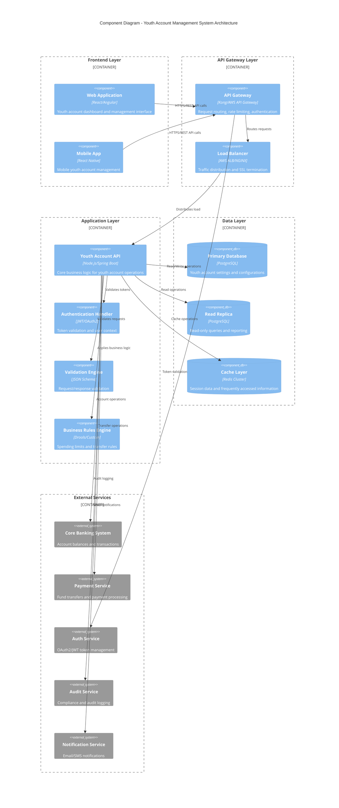
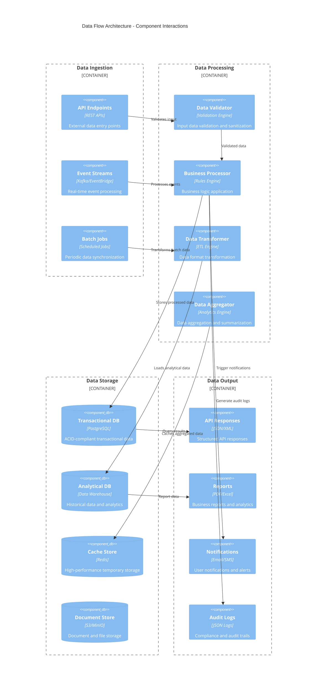
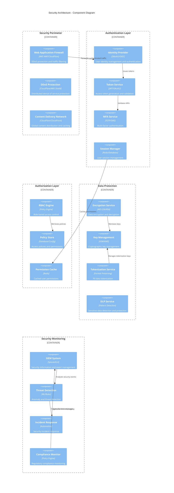
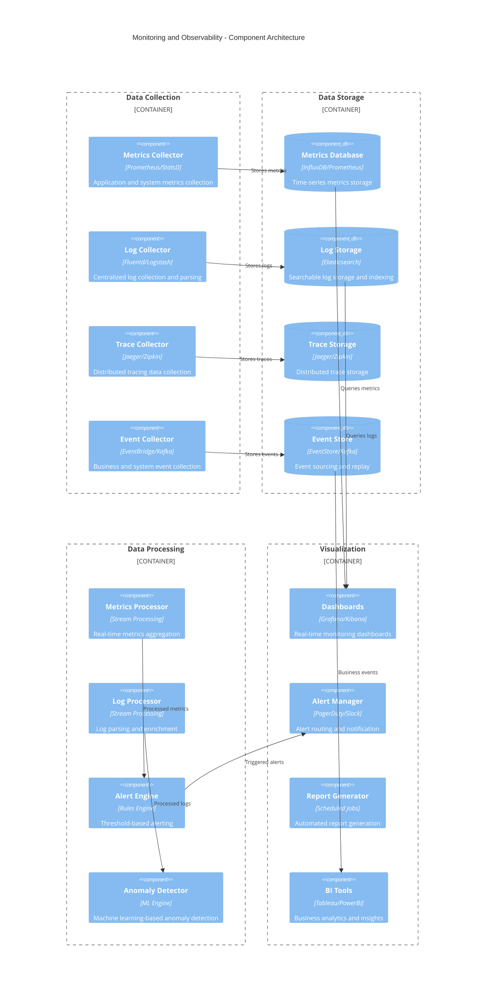
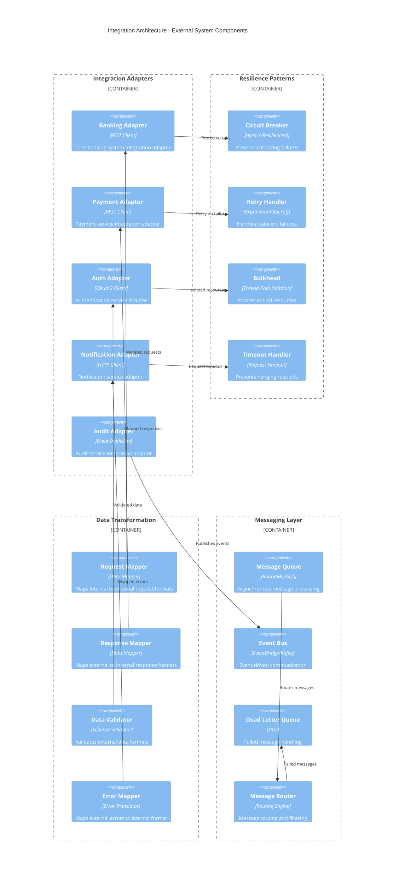

# Component Diagrams
# Youth Account Management System

## Overview
This document contains component diagrams for the Youth Account Management System, illustrating the system architecture, component relationships, dependencies, and data flows.

## 1. System Architecture - High-Level Component Diagram



## 2. Youth Account API - Detailed Component Diagram
**Reference**: Core API Components (SCIB-26, 27, 28, 29)

```mermaid
C4Component
    title Youth Account API - Internal Components
    
    Container_Boundary(controllers, "Controller Layer") {
        Component(dashboardController, "Dashboard Controller", "REST Controller", "Handles dashboard API requests (SCIB-26)")
        Component(transferController, "Transfer Controller", "REST Controller", "Handles fund transfer requests (SCIB-27)")
        Component(limitController, "Limit Controller", "REST Controller", "Handles spending limit configuration (SCIB-28)")
        Component(historyController, "History Controller", "REST Controller", "Handles transaction history requests (SCIB-29)")
    }
    
    Container_Boundary(services, "Service Layer") {
        Component(dashboardService, "Dashboard Service", "Business Service", "Dashboard data aggregation and formatting")
        Component(transferService, "Transfer Service", "Business Service", "Fund transfer business logic and validation")
        Component(limitService, "Limit Service", "Business Service", "Spending limit management and enforcement")
        Component(historyService, "History Service", "Business Service", "Transaction history retrieval and filtering")
        Component(cacheService, "Cache Service", "Utility Service", "Redis cache operations and management")
        Component(auditService, "Audit Service", "Cross-cutting Service", "Audit logging and compliance tracking")
    }
    
    Container_Boundary(repositories, "Repository Layer") {
        Component(youthAccountRepo, "Youth Account Repository", "Data Access", "Youth account CRUD operations")
        Component(settingsRepo, "Settings Repository", "Data Access", "Account settings and configuration")
        Component(transferRepo, "Transfer Repository", "Data Access", "Fund transfer records and history")
        Component(transactionRepo, "Transaction Repository", "Data Access", "Transaction history and details")
    }
    
    Container_Boundary(integrations, "Integration Layer") {
        Component(bankingClient, "Banking Client", "HTTP Client", "Core banking system integration")
        Component(paymentClient, "Payment Client", "HTTP Client", "Payment service integration")
        Component(authClient, "Auth Client", "HTTP Client", "Authentication service integration")
        Component(notificationClient, "Notification Client", "HTTP Client", "Notification service integration")
    }
    
    Container_Boundary(middleware, "Middleware Layer") {
        Component(authMiddleware, "Auth Middleware", "Security", "JWT token validation and user context")
        Component(rateLimitMiddleware, "Rate Limit Middleware", "Security", "API rate limiting and throttling")
        Component(validationMiddleware, "Validation Middleware", "Validation", "Request/response schema validation")
        Component(loggingMiddleware, "Logging Middleware", "Observability", "Request/response logging and correlation")
        Component(errorMiddleware, "Error Middleware", "Error Handling", "Centralized error handling and formatting")
    }
    
    Rel(dashboardController, dashboardService, "Delegates business logic")
    Rel(transferController, transferService, "Delegates business logic")
    Rel(limitController, limitService, "Delegates business logic")
    Rel(historyController, historyService, "Delegates business logic")
    
    Rel(dashboardService, youthAccountRepo, "Queries account data")
    Rel(dashboardService, cacheService, "Caches dashboard data")
    Rel(transferService, transferRepo, "Records transfers")
    Rel(transferService, paymentClient, "Initiates payments")
    Rel(limitService, settingsRepo, "Updates settings")
    Rel(historyService, transactionRepo, "Queries transactions")
    
    Rel(transferService, auditService, "Logs transfer events")
    Rel(limitService, auditService, "Logs limit changes")
    
    Rel(bankingClient, "Core Banking System", "HTTPS/REST")
    Rel(paymentClient, "Payment Service", "HTTPS/REST")
    Rel(authClient, "Auth Service", "HTTPS/REST")
    Rel(notificationClient, "Notification Service", "HTTPS/REST")
```

## 3. Data Flow Component Diagram
**Reference**: Data Architecture and Flow Patterns



## 4. Security Component Diagram
**Reference**: Security Architecture and Controls



## 5. Monitoring and Observability Component Diagram
**Reference**: Observability Architecture



## 6. Integration Component Diagram
**Reference**: External System Integrations



## Component Design Principles

### 1. Architectural Patterns
- **Layered Architecture**: Clear separation of concerns across layers
- **Microservices**: Loosely coupled, independently deployable services
- **Event-Driven Architecture**: Asynchronous communication via events
- **CQRS**: Command Query Responsibility Segregation for read/write operations

### 2. Design Principles
- **Single Responsibility**: Each component has a single, well-defined purpose
- **Open/Closed Principle**: Components open for extension, closed for modification
- **Dependency Inversion**: High-level modules don't depend on low-level modules
- **Interface Segregation**: Clients depend only on interfaces they use

### 3. Quality Attributes
- **Scalability**: Horizontal scaling through stateless components
- **Reliability**: Fault tolerance through redundancy and graceful degradation
- **Security**: Defense in depth with multiple security layers
- **Maintainability**: Modular design with clear interfaces and documentation

### 4. Technology Choices
- **Programming Languages**: Node.js, Java, Python for different components
- **Databases**: PostgreSQL for ACID compliance, Redis for caching
- **Message Brokers**: Kafka for event streaming, RabbitMQ for queuing
- **Monitoring**: Prometheus for metrics, ELK stack for logging

### 5. Compliance Considerations
- **PCI-DSS**: Secure handling of payment card data
- **GDPR**: Privacy by design and data protection
- **SOX**: Financial reporting controls and audit trails
- **SOC2**: Security, availability, and confidentiality controls

---

**Document Version**: 1.0
**Last Updated**: [Current Date]
**Created By**: Senior Solution Architect
**Compliance**: SOC2, PCI-DSS, GDPR
**Review Date**: [Quarterly Review]