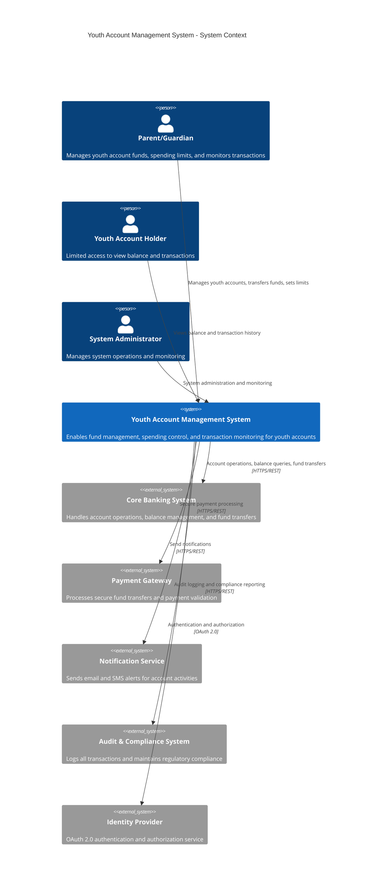
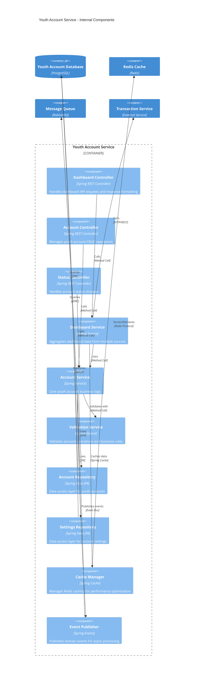
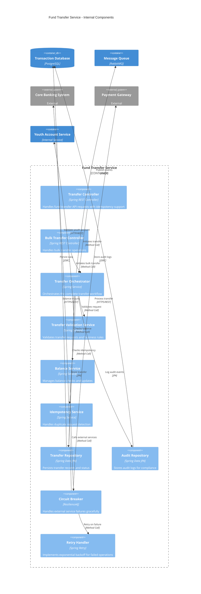
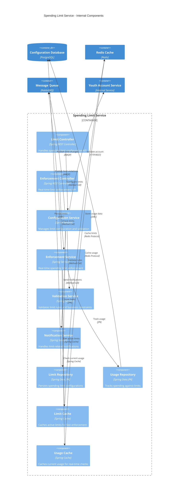
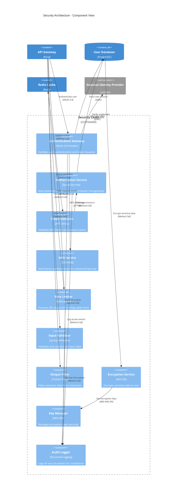
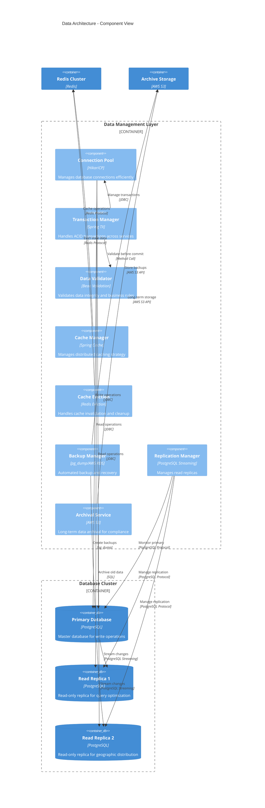

# Component Diagrams
## Youth Account Management System

### Document Information
- **Version**: 1.0
- **Date**: 2024
- **Project**: Youth Account Management System (SCIB-25)
- **Generated From**: HLD Document and API Contract Outline

---

## 1. System Context Component Diagram



---

## 2. Container Component Diagram

```mermaid
C4Container
    title Youth Account Management System - Container Architecture
    
    Person(parent, "Parent/Guardian")
    Person(youth, "Youth Account Holder")
    
    Container_Boundary(clientTier, "Client Tier") {
        Container(webApp, "Web Application", "React/TypeScript", "Responsive web interface for parents to manage youth accounts")
        Container(mobileApp, "Mobile Application", "React Native", "Mobile app for on-the-go account management")
    }
    
    Container_Boundary(apiTier, "API Tier") {
        Container(apiGateway, "API Gateway", "Kong/AWS API Gateway", "API routing, security, rate limiting, and request/response transformation")
        Container(authProxy, "Auth Proxy", "OAuth 2.0 Proxy", "Handles authentication and authorization for all requests")
    }
    
    Container_Boundary(serviceTier, "Microservices Tier") {
        Container(youthService, "Youth Account Service", "Java Spring Boot", "Core youth account management and dashboard data aggregation")
        Container(transferService, "Fund Transfer Service", "Java Spring Boot", "Handles secure fund transfers between accounts")
        Container(transactionService, "Transaction Service", "Java Spring Boot", "Transaction history management and reporting")
        Container(limitService, "Spending Limit Service", "Java Spring Boot", "Manages and enforces spending limits")
        Container(notificationService, "Notification Service", "Java Spring Boot", "Handles email and SMS notifications")
        Container(bulkService, "Bulk Operations Service", "Java Spring Boot", "Processes bulk fund transfers and operations")
    }
    
    Container_Boundary(dataTier, "Data Tier") {
        ContainerDb(youthDb, "Youth Account Database", "PostgreSQL", "Stores youth account information and settings")
        ContainerDb(transactionDb, "Transaction Database", "PostgreSQL", "Stores transaction history and audit logs")
        ContainerDb(configDb, "Configuration Database", "PostgreSQL", "Stores spending limits and system configuration")
        Container(cache, "Redis Cache", "Redis Cluster", "Caches frequently accessed data and session information")
    }
    
    Container_Boundary(messagingTier, "Messaging Tier") {
        Container(messageQueue, "Message Queue", "RabbitMQ", "Handles asynchronous processing and event-driven communication")
        Container(eventStore, "Event Store", "Apache Kafka", "Stores domain events for audit and replay capabilities")
    }
    
    %% Client Tier Relationships
    Rel(parent, webApp, "Uses", "HTTPS")
    Rel(parent, mobileApp, "Uses", "HTTPS")
    Rel(youth, webApp, "Limited access", "HTTPS")
    Rel(youth, mobileApp, "Limited access", "HTTPS")
    
    %% API Tier Relationships
    Rel(webApp, apiGateway, "API calls", "HTTPS/REST")
    Rel(mobileApp, apiGateway, "API calls", "HTTPS/REST")
    Rel(apiGateway, authProxy, "Authentication", "OAuth 2.0")
    
    %% Service Tier Relationships
    Rel(apiGateway, youthService, "Routes requests", "HTTP/REST")
    Rel(apiGateway, transferService, "Routes requests", "HTTP/REST")
    Rel(apiGateway, transactionService, "Routes requests", "HTTP/REST")
    Rel(apiGateway, limitService, "Routes requests", "HTTP/REST")
    Rel(apiGateway, bulkService, "Routes requests", "HTTP/REST")
    
    %% Inter-Service Communication
    Rel(transferService, youthService, "Validate accounts", "HTTP/REST")
    Rel(youthService, transactionService, "Get recent transactions", "HTTP/REST")
    Rel(limitService, youthService, "Validate account access", "HTTP/REST")
    
    %% Data Tier Relationships
    Rel(youthService, youthDb, "CRUD operations", "JDBC")
    Rel(transferService, transactionDb, "Write transactions", "JDBC")
    Rel(transactionService, transactionDb, "Read transactions", "JDBC")
    Rel(limitService, configDb, "Manage limits", "JDBC")
    
    %% Caching Relationships
    Rel(youthService, cache, "Cache account data", "Redis Protocol")
    Rel(transactionService, cache, "Cache query results", "Redis Protocol")
    Rel(limitService, cache, "Cache limit data", "Redis Protocol")
    
    %% Messaging Relationships
    Rel(transferService, messageQueue, "Publish transfer events", "AMQP")
    Rel(limitService, messageQueue, "Publish limit changes", "AMQP")
    Rel(messageQueue, notificationService, "Consume events", "AMQP")
    Rel(transferService, eventStore, "Store domain events", "Kafka Protocol")
    
    UpdateLayoutConfig($c4ShapeInRow="3", $c4BoundaryInRow="1")
```



---

## 3. Youth Account Service Component Diagram
**Mapped to**: SCIB-26 - Dashboard API



---

## 4. Fund Transfer Service Component Diagram
**Mapped to**: SCIB-27 - Fund Transfer API



---

## 5. Transaction Service Component Diagram
**Mapped to**: SCIB-29 - Transaction History API

```mermaid
C4Component
    title Transaction Service - Internal Components
    
    Container_Boundary(transactionService, "Transaction Service") {
        Component(historyController, "Transaction History Controller", "Spring REST Controller", "Handles transaction history API with pagination and filtering")
        Component(reportController, "Report Controller", "Spring REST Controller", "Generates transaction reports and summaries")
        
        Component(queryService, "Query Service", "Spring Service", "Optimized query execution with caching")
        Component(filterService, "Filter Service", "Spring Service", "Handles complex filtering and search operations")
        Component(paginationService, "Pagination Service", "Spring Service", "Manages pagination and result set optimization")
        Component(summaryService, "Summary Service", "Spring Service", "Calculates transaction summaries and statistics")
        
        Component(transactionRepository, "Transaction Repository", "Spring Data JPA", "Optimized data access with custom queries")
        Component(indexManager, "Index Manager", "Custom Component", "Manages database indexes for query optimization")
        
        Component(queryCache, "Query Cache", "Spring Cache", "Caches frequent queries for performance")
        Component(resultCache, "Result Cache", "Spring Cache", "Caches paginated results")
    }
    
    ContainerDb(transactionDb, "Transaction Database", "PostgreSQL")
    Container(cache, "Redis Cache", "Redis")
    Container(youthService, "Youth Account Service", "Internal Service")
    
    %% Controller Layer
    Rel(historyController, queryService, "Execute queries", "Method Call")
    Rel(reportController, summaryService, "Generate summaries", "Method Call")
    
    %% Service Layer Interactions
    Rel(queryService, filterService, "Apply filters", "Method Call")
    Rel(queryService, paginationService, "Paginate results", "Method Call")
    Rel(queryService, queryCache, "Cache queries", "Spring Cache")
    Rel(summaryService, transactionRepository, "Aggregate data", "JPA")
    
    %% Authorization Check
    Rel(queryService, youthService, "Validate access", "HTTP/REST")
    
    %% Data Access Layer
    Rel(filterService, transactionRepository, "Execute filtered queries", "JPA")
    Rel(paginationService, transactionRepository, "Execute paginated queries", "JPA")
    Rel(transactionRepository, transactionDb, "Database queries", "JDBC")
    
    %% Performance Optimization
    Rel(transactionRepository, indexManager, "Optimize indexes", "Method Call")
    Rel(indexManager, transactionDb, "Manage indexes", "SQL")
    
    %% Caching Layer
    Rel(queryCache, cache, "Store query results", "Redis Protocol")
    Rel(resultCache, cache, "Store paginated results", "Redis Protocol")
    Rel(paginationService, resultCache, "Cache pages", "Spring Cache")
    
    UpdateLayoutConfig($c4ShapeInRow="3", $c4BoundaryInRow="1")
```



---

## 6. Spending Limit Service Component Diagram
**Mapped to**: SCIB-28 - Spending Limit API



---

## 7. Security Component Diagram



---

## 8. Data Architecture Component Diagram



---

## 9. Deployment Component Diagram

```mermaid
C4Deployment
    title Youth Account Management System - Deployment Architecture
    
    Deployment_Node(cdn, "CDN", "CloudFlare") {
        Container(staticAssets, "Static Assets", "JS/CSS/Images", "Cached static content for global distribution")
    }
    
    Deployment_Node(loadBalancer, "Load Balancer", "AWS Application Load Balancer") {
        Container(alb, "Application Load Balancer", "AWS ALB", "Distributes traffic across multiple AZs")
    }
    
    Deployment_Node(webTier, "Web Tier", "AWS ECS Fargate") {
        Container(webApp, "Web Application", "React SPA", "Single Page Application served via Nginx")
        Container(nginx, "Nginx", "Web Server", "Serves static content and reverse proxy")
    }
    
    Deployment_Node(apiTier, "API Tier", "AWS ECS Fargate - Auto Scaling Group") {
        Container(apiGateway, "API Gateway", "Kong", "API management and security")
        Container(youthService, "Youth Service", "Java Spring Boot", "Containerized microservice")
        Container(transferService, "Transfer Service", "Java Spring Boot", "Containerized microservice")
        Container(transactionService, "Transaction Service", "Java Spring Boot", "Containerized microservice")
        Container(limitService, "Limit Service", "Java Spring Boot", "Containerized microservice")
    }
    
    Deployment_Node(dataTier, "Data Tier", "AWS RDS Multi-AZ") {
        ContainerDb(primaryRds, "Primary RDS", "PostgreSQL 14", "Multi-AZ deployment with automatic failover")
        ContainerDb(readReplica, "Read Replica", "PostgreSQL 14", "Cross-region read replica")
    }
    
    Deployment_Node(cacheTier, "Cache Tier", "AWS ElastiCache") {
        Container(redisCluster, "Redis Cluster", "Redis 7.0", "Multi-node cluster with sharding")
    }
    
    Deployment_Node(messagingTier, "Messaging Tier", "AWS MQ") {
        Container(rabbitMq, "RabbitMQ", "Message Broker", "Managed message queue service")
    }
    
    %% Traffic Flow
    Rel(cdn, loadBalancer, "Route traffic", "HTTPS")
    Rel(loadBalancer, webTier, "Distribute load", "HTTPS")
    Rel(webTier, apiTier, "API calls", "HTTPS")
    
    %% Service Communication
    Rel(apiTier, dataTier, "Database operations", "PostgreSQL Protocol")
    Rel(apiTier, cacheTier, "Cache operations", "Redis Protocol")
    Rel(apiTier, messagingTier, "Message publishing", "AMQP")
    
    %% Data Replication
    Rel(primaryRds, readReplica, "Async replication", "PostgreSQL Streaming")
    
    UpdateLayoutConfig($c4ShapeInRow="2", $c4BoundaryInRow="1")
```

---

## Component Diagram Standards & Compliance

### Architectural Principles
- **Microservices Architecture**: Each business capability is a separate service
- **Single Responsibility**: Each component has a single, well-defined purpose
- **Loose Coupling**: Services communicate via well-defined APIs
- **High Cohesion**: Related functionality grouped within service boundaries
- **Scalability**: Each service can be scaled independently
- **Fault Tolerance**: Circuit breakers and retry mechanisms included

### Security Architecture
- **Defense in Depth**: Multiple layers of security controls
- **Zero Trust**: Every request is authenticated and authorized
- **Data Protection**: Encryption at rest and in transit
- **Audit Logging**: Complete audit trail for compliance
- **Rate Limiting**: Protection against API abuse
- **Input Validation**: All inputs validated and sanitized

### Performance Architecture
- **Caching Strategy**: Multi-level caching for optimal performance
- **Database Optimization**: Read replicas and query optimization
- **Connection Pooling**: Efficient database connection management
- **Async Processing**: Non-blocking operations via message queues
- **Load Balancing**: Traffic distribution across multiple instances

### Reliability Architecture
- **Circuit Breakers**: Prevent cascade failures
- **Retry Logic**: Exponential backoff for transient failures
- **Health Checks**: Comprehensive service monitoring
- **Graceful Degradation**: Non-critical features fail gracefully
- **Data Consistency**: ACID transactions for financial operations

### Compliance Architecture
- **GDPR Compliance**: Data protection and privacy controls
- **PCI-DSS Compliance**: Payment card data security
- **SOX Compliance**: Financial reporting controls
- **Audit Trail**: Complete logging for regulatory requirements
- **Data Retention**: 7-year retention for financial data

### Technology Stack
- **Frontend**: React/TypeScript with responsive design
- **Backend**: Java Spring Boot microservices
- **Database**: PostgreSQL with read replicas
- **Cache**: Redis cluster for distributed caching
- **Message Queue**: RabbitMQ for async processing
- **API Gateway**: Kong for API management
- **Container Platform**: AWS ECS Fargate
- **Cloud Provider**: AWS with multi-AZ deployment

---

**Component Mappings to JIRA Requirements**

| Component | JIRA Reference | Responsibility | Performance Target |
|-----------|----------------|----------------|-------------------|
| Youth Account Service | SCIB-26 | Dashboard API and account management | <500ms response time |
| Fund Transfer Service | SCIB-27 | Secure fund transfers | <2000ms response time |
| Spending Limit Service | SCIB-28 | Limit configuration and enforcement | <300ms response time |
| Transaction Service | SCIB-29 | Transaction history and reporting | <800ms response time |
| API Gateway | SCIB-30 | OpenAPI specification compliance | Rate limiting: 1000/hour |

---

**Document Approval**
- **Solution Architect**: [Generated from HLD Document]
- **Security Architect**: [Security components included]
- **Data Architect**: [Data architecture validated]
- **DevOps Engineer**: [Deployment architecture reviewed]

**Traceability**
- **Source**: HLD Document (API Development/Requirement Documents/HLDDocument.txt)
- **API Contract**: API Contract Outline (API Development/Requirement Documents/APIContractOutline.txt)
- **JIRA Mappings**: SCIB-25 through SCIB-30
- **Generated**: 2024 via Enterprise Architecture Automation