# Component Diagrams
## Document Upload Interface with Quality Validation System

### Version: 1.0
### Date: 2024
### Generated from: HLD Document and API Contract Outline

---

## 1. System-Level Component Diagram

```mermaid
C4Component
    title Component Diagram - Document Upload System Architecture
    
    Container_Boundary(web, "Web Application Layer") {
        Component(webapp, "React Web App", "React/TypeScript", "Multi-step form interface with camera integration")
        Component(mobileapp, "Mobile App", "React Native", "Native mobile document capture")
        Component(pwa, "Progressive Web App", "PWA", "Offline-capable web application")
    }
    
    Container_Boundary(api, "API Gateway Layer") {
        Component(gateway, "API Gateway", "Node.js/Express", "Central API management and routing")
        Component(ratelimit, "Rate Limiter", "Redis", "API rate limiting and throttling")
        Component(auth_middleware, "Auth Middleware", "JWT", "Authentication and authorization")
    }
    
    Container_Boundary(services, "Business Services Layer") {
        Component(auth_service, "Authentication Service", "Node.js", "User authentication and JWT management")
        Component(form_service, "Form Management Service", "Node.js", "Multi-step form session management")
        Component(upload_service, "Upload Service", "Node.js", "Document upload coordination")
        Component(validation_service, "Quality Validation Service", "Python/ML", "Real-time document quality assessment")
        Component(component_service, "Component Library Service", "Node.js", "UI component metadata and configuration")
        Component(user_service, "User Management Service", "Node.js", "User profile and preferences")
        Component(notification_service, "Notification Service", "Node.js", "Real-time notifications")
    }
    
    Container_Boundary(data, "Data Layer") {
        ComponentDb(postgres, "PostgreSQL", "Database", "Primary data storage")
        ComponentDb(redis, "Redis Cache", "Cache", "Session and performance cache")
        ComponentDb(s3, "AWS S3", "Object Storage", "Encrypted document storage")
        ComponentDb(elasticsearch, "Elasticsearch", "Search Engine", "Document indexing and search")
    }
    
    Container_Boundary(external, "External Services") {
        Component(ml_engine, "ML Processing Engine", "TensorFlow", "Machine learning model inference")
        Component(ocr_service, "OCR Service", "AWS Textract", "Optical character recognition")
        Component(audit_service, "Audit Service", "External", "Compliance and audit logging")
        Component(kms, "Key Management", "AWS KMS", "Encryption key management")
    }
    
    Rel(webapp, gateway, "HTTPS API calls")
    Rel(mobileapp, gateway, "HTTPS API calls")
    Rel(pwa, gateway, "HTTPS API calls")
    
    Rel(gateway, ratelimit, "Rate limiting")
    Rel(gateway, auth_middleware, "Authentication")
    
    Rel(gateway, auth_service, "Authentication requests")
    Rel(gateway, form_service, "Form operations")
    Rel(gateway, upload_service, "Upload requests")
    Rel(gateway, validation_service, "Validation requests")
    Rel(gateway, component_service, "Component metadata")
    Rel(gateway, user_service, "User operations")
    
    Rel(auth_service, postgres, "User data")
    Rel(auth_service, redis, "Session cache")
    
    Rel(form_service, postgres, "Form metadata")
    Rel(form_service, redis, "Session data")
    
    Rel(upload_service, s3, "Document storage")
    Rel(upload_service, postgres, "Metadata")
    
    Rel(validation_service, ml_engine, "ML inference")
    Rel(validation_service, ocr_service, "Text extraction")
    
    Rel(upload_service, kms, "Encryption keys")
    Rel(validation_service, elasticsearch, "Document indexing")
    
    Rel(notification_service, redis, "Message queue")
    
    UpdateRelStyle(webapp, gateway, $offsetY="-10", $offsetX="-40")
    UpdateRelStyle(gateway, auth_service, $offsetY="-20", $offsetX="-60")
```



## 2. Frontend Component Architecture

```mermaid
C4Component
    title Frontend Component Architecture
    
    Container_Boundary(ui, "User Interface Layer") {
        Component(app_shell, "Application Shell", "React", "Main application container and routing")
        Component(auth_components, "Authentication Components", "React", "Login, MFA, and session management")
        Component(form_components, "Form Components", "React", "Multi-step form interface")
        Component(camera_components, "Camera Components", "React/WebRTC", "Document capture interface")
        Component(upload_components, "Upload Components", "React", "File upload and progress tracking")
    }
    
    Container_Boundary(core, "Core Component Library") {
        Component(button_lib, "Button Components", "React", "8 states: default, hover, focus, active, disabled, loading, error, success")
        Component(input_lib, "Input Components", "React", "Form inputs with validation")
        Component(card_lib, "Card Components", "React", "Content containers and layouts")
        Component(nav_lib, "Navigation Components", "React", "App navigation and breadcrumbs")
        Component(modal_lib, "Modal Components", "React", "Dialogs and overlays")
        Component(alert_lib, "Alert Components", "React", "Notifications and feedback")
        Component(progress_lib, "Progress Components", "React", "Progress indicators and steppers")
        Component(a11y_lib, "Accessibility Components", "React", "WCAG 2.1 AA compliant helpers")
    }
    
    Container_Boundary(services, "Frontend Services") {
        Component(api_client, "API Client", "Axios/TypeScript", "HTTP client with interceptors")
        Component(state_mgmt, "State Management", "Redux Toolkit", "Application state management")
        Component(cache_mgmt, "Cache Management", "React Query", "Server state caching")
        Component(theme_engine, "Theme Engine", "Styled Components", "Dynamic theming and styling")
        Component(i18n_service, "Internationalization", "React i18next", "Multi-language support")
        Component(a11y_engine, "Accessibility Engine", "React A11y", "Accessibility enforcement")
    }
    
    Container_Boundary(utils, "Utility Layer") {
        Component(validation, "Form Validation", "Yup/Formik", "Client-side validation")
        Component(error_handler, "Error Handler", "React Error Boundary", "Global error handling")
        Component(analytics, "Analytics", "Google Analytics", "User behavior tracking")
        Component(offline_mgmt, "Offline Management", "Service Worker", "Offline capability")
    }
    
    Rel(app_shell, auth_components, "Route to auth")
    Rel(app_shell, form_components, "Route to forms")
    Rel(app_shell, camera_components, "Route to camera")
    Rel(app_shell, upload_components, "Route to upload")
    
    Rel(auth_components, button_lib, "Uses buttons")
    Rel(auth_components, input_lib, "Uses inputs")
    Rel(auth_components, alert_lib, "Shows alerts")
    
    Rel(form_components, input_lib, "Uses form inputs")
    Rel(form_components, progress_lib, "Shows progress")
    Rel(form_components, card_lib, "Uses cards")
    
    Rel(camera_components, modal_lib, "Camera overlay")
    Rel(camera_components, alert_lib, "Quality feedback")
    
    Rel(upload_components, progress_lib, "Upload progress")
    Rel(upload_components, alert_lib, "Upload status")
    
    Rel(api_client, state_mgmt, "Updates state")
    Rel(api_client, cache_mgmt, "Caches responses")
    Rel(api_client, error_handler, "Handles errors")
    
    Rel(theme_engine, button_lib, "Applies themes")
    Rel(theme_engine, input_lib, "Applies themes")
    Rel(theme_engine, card_lib, "Applies themes")
    
    Rel(a11y_engine, a11y_lib, "Enforces accessibility")
    Rel(i18n_service, auth_components, "Provides translations")
    Rel(i18n_service, form_components, "Provides translations")
```



## 3. Backend Services Component Architecture

```mermaid
C4Component
    title Backend Services Architecture
    
    Container_Boundary(gateway, "API Gateway Layer") {
        Component(load_balancer, "Load Balancer", "AWS ALB", "Traffic distribution and SSL termination")
        Component(api_gateway, "API Gateway", "Express.js", "Request routing and middleware")
        Component(auth_middleware, "Authentication Middleware", "JWT", "Token validation")
        Component(rate_limiter, "Rate Limiter", "Express Rate Limit", "Request throttling")
        Component(request_logger, "Request Logger", "Winston", "API request logging")
    }
    
    Container_Boundary(auth, "Authentication Service") {
        Component(auth_controller, "Auth Controller", "Express", "Authentication endpoints")
        Component(jwt_service, "JWT Service", "jsonwebtoken", "Token generation and validation")
        Component(mfa_service, "MFA Service", "speakeasy", "Multi-factor authentication")
        Component(password_service, "Password Service", "bcrypt", "Password hashing and validation")
        Component(session_mgmt, "Session Management", "Redis", "User session tracking")
    }
    
    Container_Boundary(forms, "Form Management Service") {
        Component(form_controller, "Form Controller", "Express", "Form session endpoints")
        Component(step_engine, "Step Engine", "Node.js", "Multi-step form logic")
        Component(validation_engine, "Validation Engine", "Joi", "Form data validation")
        Component(progress_tracker, "Progress Tracker", "Node.js", "Completion tracking")
        Component(conditional_logic, "Conditional Logic", "Node.js", "Dynamic form behavior")
    }
    
    Container_Boundary(upload, "Document Upload Service") {
        Component(upload_controller, "Upload Controller", "Express", "Upload endpoints")
        Component(file_processor, "File Processor", "Multer", "File upload handling")
        Component(virus_scanner, "Virus Scanner", "ClamAV", "Malware detection")
        Component(compression, "Image Compression", "Sharp", "Image optimization")
        Component(encryption, "Encryption Service", "crypto", "File encryption")
    }
    
    Container_Boundary(validation, "Quality Validation Service") {
        Component(validation_controller, "Validation Controller", "FastAPI", "Validation endpoints")
        Component(ml_inference, "ML Inference Engine", "TensorFlow Serving", "Model inference")
        Component(image_processor, "Image Processor", "OpenCV", "Image analysis")
        Component(quality_analyzer, "Quality Analyzer", "scikit-image", "Quality metrics")
        Component(feedback_generator, "Feedback Generator", "Python", "User guidance generation")
    }
    
    Container_Boundary(components, "Component Library Service") {
        Component(component_controller, "Component Controller", "Express", "Component metadata API")
        Component(theme_manager, "Theme Manager", "Node.js", "Theme configuration")
        Component(a11y_validator, "A11y Validator", "axe-core", "Accessibility validation")
        Component(browser_compat, "Browser Compatibility", "Browserslist", "Browser support matrix")
    }
    
    Rel(load_balancer, api_gateway, "Routes traffic")
    Rel(api_gateway, auth_middleware, "Validates tokens")
    Rel(api_gateway, rate_limiter, "Applies limits")
    Rel(api_gateway, request_logger, "Logs requests")
    
    Rel(api_gateway, auth_controller, "Auth requests")
    Rel(api_gateway, form_controller, "Form requests")
    Rel(api_gateway, upload_controller, "Upload requests")
    Rel(api_gateway, validation_controller, "Validation requests")
    Rel(api_gateway, component_controller, "Component requests")
    
    Rel(auth_controller, jwt_service, "Token operations")
    Rel(auth_controller, mfa_service, "MFA operations")
    Rel(auth_controller, password_service, "Password operations")
    Rel(auth_controller, session_mgmt, "Session operations")
    
    Rel(form_controller, step_engine, "Step management")
    Rel(form_controller, validation_engine, "Data validation")
    Rel(form_controller, progress_tracker, "Progress tracking")
    Rel(form_controller, conditional_logic, "Dynamic behavior")
    
    Rel(upload_controller, file_processor, "File handling")
    Rel(upload_controller, virus_scanner, "Security scanning")
    Rel(upload_controller, compression, "Image optimization")
    Rel(upload_controller, encryption, "File encryption")
    
    Rel(validation_controller, ml_inference, "ML predictions")
    Rel(validation_controller, image_processor, "Image analysis")
    Rel(validation_controller, quality_analyzer, "Quality assessment")
    Rel(validation_controller, feedback_generator, "User feedback")
    
    Rel(component_controller, theme_manager, "Theme data")
    Rel(component_controller, a11y_validator, "A11y validation")
    Rel(component_controller, browser_compat, "Compatibility data")
```



## 4. Data Layer Component Architecture

```mermaid
C4Component
    title Data Layer Architecture
    
    Container_Boundary(primary, "Primary Data Storage") {
        ComponentDb(postgres_master, "PostgreSQL Master", "Database", "Primary write database")
        ComponentDb(postgres_replica, "PostgreSQL Read Replica", "Database", "Read-only replica for scaling")
        Component(connection_pool, "Connection Pool", "pg-pool", "Database connection management")
        Component(migration_engine, "Migration Engine", "Knex.js", "Database schema management")
    }
    
    Container_Boundary(cache, "Caching Layer") {
        ComponentDb(redis_primary, "Redis Primary", "Cache", "Primary cache instance")
        ComponentDb(redis_replica, "Redis Replica", "Cache", "Cache replica for HA")
        Component(cache_manager, "Cache Manager", "ioredis", "Cache operations and invalidation")
        Component(session_store, "Session Store", "connect-redis", "User session storage")
    }
    
    Container_Boundary(storage, "Object Storage") {
        ComponentDb(s3_primary, "S3 Primary Bucket", "Object Storage", "Encrypted document storage")
        ComponentDb(s3_backup, "S3 Backup Bucket", "Object Storage", "Cross-region backup")
        Component(storage_manager, "Storage Manager", "AWS SDK", "S3 operations and lifecycle")
        Component(cdn, "CloudFront CDN", "CDN", "Global content delivery")
    }
    
    Container_Boundary(search, "Search and Analytics") {
        ComponentDb(elasticsearch, "Elasticsearch", "Search Engine", "Document search and indexing")
        ComponentDb(kibana, "Kibana", "Analytics", "Search analytics and monitoring")
        Component(search_indexer, "Search Indexer", "Node.js", "Document indexing service")
    }
    
    Container_Boundary(monitoring, "Data Monitoring") {
        Component(db_monitor, "Database Monitor", "pg_stat_monitor", "PostgreSQL performance monitoring")
        Component(cache_monitor, "Cache Monitor", "Redis Monitor", "Redis performance monitoring")
        Component(storage_monitor, "Storage Monitor", "CloudWatch", "S3 usage and performance")
        Component(backup_manager, "Backup Manager", "pg_dump", "Automated backup management")
    }
    
    Rel(connection_pool, postgres_master, "Write operations")
    Rel(connection_pool, postgres_replica, "Read operations")
    Rel(migration_engine, postgres_master, "Schema updates")
    
    Rel(cache_manager, redis_primary, "Cache operations")
    Rel(cache_manager, redis_replica, "Read operations")
    Rel(session_store, redis_primary, "Session data")
    
    Rel(storage_manager, s3_primary, "File operations")
    Rel(storage_manager, s3_backup, "Backup operations")
    Rel(cdn, s3_primary, "Content delivery")
    
    Rel(search_indexer, elasticsearch, "Document indexing")
    Rel(kibana, elasticsearch, "Analytics queries")
    
    Rel(db_monitor, postgres_master, "Monitors")
    Rel(db_monitor, postgres_replica, "Monitors")
    Rel(cache_monitor, redis_primary, "Monitors")
    Rel(storage_monitor, s3_primary, "Monitors")
    
    Rel(backup_manager, postgres_master, "Creates backups")
    Rel(backup_manager, s3_backup, "Stores backups")
    
    Rel(postgres_master, postgres_replica, "Replication")
    Rel(redis_primary, redis_replica, "Replication")
    Rel(s3_primary, s3_backup, "Cross-region replication")
```



## 5. Security Components Architecture

```mermaid
C4Component
    title Security Architecture Components
    
    Container_Boundary(perimeter, "Security Perimeter") {
        Component(waf, "Web Application Firewall", "AWS WAF", "Layer 7 protection")
        Component(ddos_protection, "DDoS Protection", "AWS Shield", "Network layer protection")
        Component(ssl_termination, "SSL Termination", "AWS ALB", "TLS 1.3 encryption")
        Component(ip_filtering, "IP Filtering", "Security Groups", "Network access control")
    }
    
    Container_Boundary(identity, "Identity and Access Management") {
        Component(auth_service, "Authentication Service", "OAuth 2.0/OIDC", "User authentication")
        Component(rbac_engine, "RBAC Engine", "ABAC", "Role-based access control")
        Component(mfa_provider, "MFA Provider", "TOTP/SMS", "Multi-factor authentication")
        Component(identity_provider, "Identity Provider", "SAML/LDAP", "Enterprise SSO integration")
    }
    
    Container_Boundary(encryption, "Encryption Services") {
        Component(kms, "Key Management Service", "AWS KMS", "Encryption key management")
        Component(hsm, "Hardware Security Module", "AWS CloudHSM", "Hardware-based key storage")
        Component(cert_manager, "Certificate Manager", "AWS ACM", "SSL/TLS certificate management")
        Component(secrets_manager, "Secrets Manager", "AWS Secrets Manager", "Application secrets")
    }
    
    Container_Boundary(monitoring, "Security Monitoring") {
        Component(siem, "SIEM System", "Splunk/ELK", "Security information and event management")
        Component(ids_ips, "IDS/IPS", "Suricata", "Intrusion detection and prevention")
        Component(vulnerability_scanner, "Vulnerability Scanner", "Nessus", "Security vulnerability assessment")
        Component(compliance_monitor, "Compliance Monitor", "AWS Config", "Regulatory compliance monitoring")
    }
    
    Container_Boundary(data_protection, "Data Protection") {
        Component(dlp, "Data Loss Prevention", "Symantec DLP", "Sensitive data protection")
        Component(data_classifier, "Data Classifier", "AWS Macie", "Automatic data classification")
        Component(backup_encryption, "Backup Encryption", "AES-256", "Encrypted backup storage")
        Component(audit_logger, "Audit Logger", "CloudTrail", "Comprehensive audit logging")
    }
    
    Container_Boundary(app_security, "Application Security") {
        Component(input_validator, "Input Validator", "OWASP", "Input sanitization and validation")
        Component(output_encoder, "Output Encoder", "ESAPI", "Output encoding for XSS prevention")
        Component(csrf_protection, "CSRF Protection", "SameSite Cookies", "Cross-site request forgery protection")
        Component(security_headers, "Security Headers", "Helmet.js", "HTTP security headers")
    }
    
    Rel(waf, ddos_protection, "Layered protection")
    Rel(ssl_termination, waf, "Encrypted traffic")
    Rel(ip_filtering, ssl_termination, "Network filtering")
    
    Rel(auth_service, rbac_engine, "Authorization")
    Rel(auth_service, mfa_provider, "Additional verification")
    Rel(identity_provider, auth_service, "Enterprise authentication")
    
    Rel(kms, hsm, "Key storage")
    Rel(cert_manager, ssl_termination, "Certificate provisioning")
    Rel(secrets_manager, auth_service, "Application secrets")
    
    Rel(siem, ids_ips, "Security events")
    Rel(vulnerability_scanner, compliance_monitor, "Security findings")
    Rel(audit_logger, siem, "Audit events")
    
    Rel(dlp, data_classifier, "Data protection policies")
    Rel(backup_encryption, kms, "Encryption keys")
    Rel(audit_logger, compliance_monitor, "Compliance data")
    
    Rel(input_validator, output_encoder, "Secure data flow")
    Rel(csrf_protection, security_headers, "Browser security")
    Rel(security_headers, waf, "Application protection")
```



## 6. Deployment Components Architecture

```mermaid
C4Deployment
    title Deployment Architecture - Production Environment
    
    Deployment_Node(internet, "Internet", "Global") {
        Deployment_Node(cdn, "Content Delivery Network", "CloudFlare/CloudFront") {
            Container(static_assets, "Static Assets", "JS/CSS/Images")
            Container(cached_api, "Cached API Responses", "JSON")
        }
    }
    
    Deployment_Node(aws_cloud, "AWS Cloud", "Multi-Region") {
        Deployment_Node(public_subnet, "Public Subnet", "DMZ") {
            Container(alb, "Application Load Balancer", "AWS ALB")
            Container(nat_gateway, "NAT Gateway", "AWS NAT")
        }
        
        Deployment_Node(private_subnet_web, "Private Subnet - Web Tier", "10.0.1.0/24") {
            Deployment_Node(ecs_web, "ECS Fargate Cluster", "Container Orchestration") {
                Container(web_app, "Web Application", "React SPA")
                Container(api_gateway, "API Gateway", "Node.js")
            }
        }
        
        Deployment_Node(private_subnet_app, "Private Subnet - App Tier", "10.0.2.0/24") {
            Deployment_Node(ecs_app, "ECS Fargate Cluster", "Container Orchestration") {
                Container(auth_service, "Auth Service", "Node.js")
                Container(form_service, "Form Service", "Node.js")
                Container(upload_service, "Upload Service", "Node.js")
                Container(validation_service, "Validation Service", "Python")
            }
        }
        
        Deployment_Node(private_subnet_data, "Private Subnet - Data Tier", "10.0.3.0/24") {
            Deployment_Node(rds, "RDS Multi-AZ", "Managed Database") {
                ContainerDb(postgres_primary, "PostgreSQL Primary", "Database")
                ContainerDb(postgres_standby, "PostgreSQL Standby", "Database")
            }
            
            Deployment_Node(elasticache, "ElastiCache", "Managed Cache") {
                ContainerDb(redis_primary, "Redis Primary", "Cache")
                ContainerDb(redis_replica, "Redis Replica", "Cache")
            }
        }
        
        Deployment_Node(storage_tier, "Storage Tier", "Object Storage") {
            ContainerDb(s3_documents, "S3 Documents Bucket", "Encrypted Storage")
            ContainerDb(s3_backups, "S3 Backups Bucket", "Cross-Region")
            ContainerDb(s3_logs, "S3 Logs Bucket", "Audit Logs")
        }
    }
    
    Deployment_Node(monitoring, "Monitoring & Observability", "Cross-Region") {
        Container(cloudwatch, "CloudWatch", "Metrics & Logs")
        Container(xray, "X-Ray", "Distributed Tracing")
        Container(elasticsearch_logs, "Elasticsearch", "Log Analytics")
        Container(grafana, "Grafana", "Dashboards")
    }
    
    Deployment_Node(security_services, "Security Services", "Global") {
        Container(waf, "AWS WAF", "Web Application Firewall")
        Container(shield, "AWS Shield", "DDoS Protection")
        Container(kms, "AWS KMS", "Key Management")
        Container(secrets_mgr, "Secrets Manager", "Secrets Storage")
    }
    
    Rel(cdn, alb, "HTTPS")
    Rel(alb, ecs_web, "Load Balanced")
    Rel(ecs_web, ecs_app, "Internal API")
    Rel(ecs_app, rds, "Database Connections")
    Rel(ecs_app, elasticache, "Cache Operations")
    Rel(ecs_app, storage_tier, "File Operations")
    
    Rel(ecs_web, monitoring, "Metrics & Logs")
    Rel(ecs_app, monitoring, "Metrics & Logs")
    
    Rel(alb, security_services, "Security Integration")
    Rel(storage_tier, security_services, "Encryption")
    
    UpdateRelStyle(cdn, alb, $offsetY="-20")
    UpdateRelStyle(ecs_web, ecs_app, $offsetX="-30")
```

---

## Component Architecture Patterns

### 1. Microservices Architecture
- **Service Decomposition**: Each business capability as separate service
- **API Gateway Pattern**: Centralized API management and routing
- **Database per Service**: Independent data storage per service
- **Event-Driven Communication**: Asynchronous service communication

### 2. Layered Architecture
- **Presentation Layer**: User interface components
- **Business Logic Layer**: Core business services
- **Data Access Layer**: Data persistence and caching
- **Infrastructure Layer**: Cross-cutting concerns

### 3. Component Design Principles
- **Single Responsibility**: Each component has one clear purpose
- **Loose Coupling**: Minimal dependencies between components
- **High Cohesion**: Related functionality grouped together
- **Interface Segregation**: Clean, focused interfaces

### 4. Security Architecture Patterns
- **Defense in Depth**: Multiple security layers
- **Zero Trust**: Verify every request and user
- **Least Privilege**: Minimal required permissions
- **Secure by Default**: Security built into components

### 5. Scalability Patterns
- **Horizontal Scaling**: Scale out with load balancers
- **Auto-scaling**: Dynamic resource allocation
- **Caching Strategy**: Multi-layer caching implementation
- **CDN Integration**: Global content delivery

### 6. Reliability Patterns
- **Circuit Breaker**: Fault tolerance for service calls
- **Bulkhead**: Isolation of critical resources
- **Retry with Backoff**: Resilient error handling
- **Health Checks**: Proactive service monitoring

---

## Component Integration Guidelines

### 1. API Design Standards
- **RESTful APIs**: Standard HTTP methods and status codes
- **OpenAPI Specification**: Comprehensive API documentation
- **Versioning Strategy**: Backward compatibility maintenance
- **Error Handling**: Consistent error response format

### 2. Data Flow Patterns
- **Request/Response**: Synchronous API communication
- **Event Streaming**: Asynchronous data processing
- **Batch Processing**: Bulk data operations
- **Real-time Updates**: WebSocket connections

### 3. Security Integration
- **Authentication Flow**: JWT token-based authentication
- **Authorization Checks**: RBAC at component boundaries
- **Data Encryption**: End-to-end encryption implementation
- **Audit Logging**: Comprehensive activity tracking

### 4. Performance Optimization
- **Caching Strategy**: Component-level caching
- **Connection Pooling**: Efficient resource utilization
- **Lazy Loading**: On-demand component loading
- **Code Splitting**: Optimized bundle sizes

### 5. Monitoring and Observability
- **Health Endpoints**: Component health monitoring
- **Metrics Collection**: Performance and business metrics
- **Distributed Tracing**: End-to-end request tracking
- **Log Aggregation**: Centralized logging strategy

---

*These component diagrams provide a comprehensive view of the Document Upload Interface with Quality Validation System architecture, showing the relationships and dependencies between all system components while maintaining enterprise standards for security, scalability, and maintainability.*