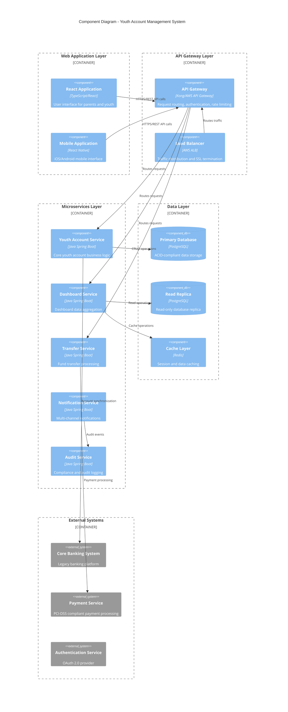
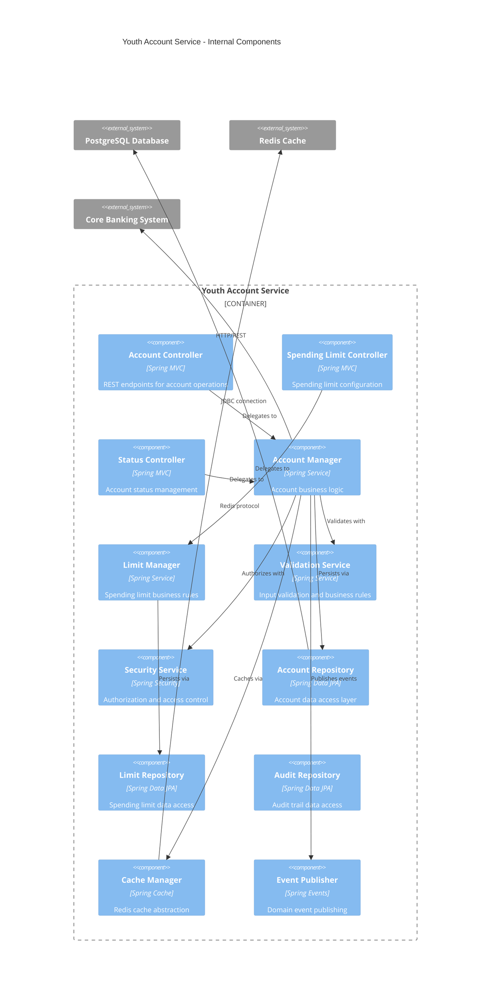
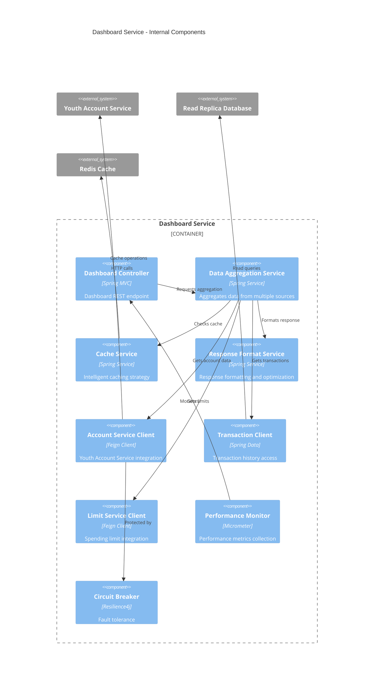
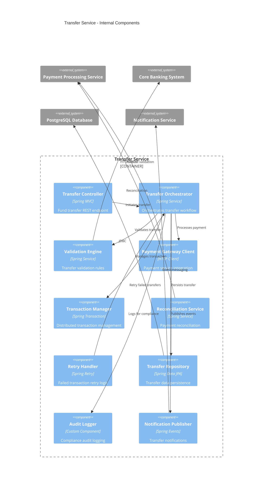
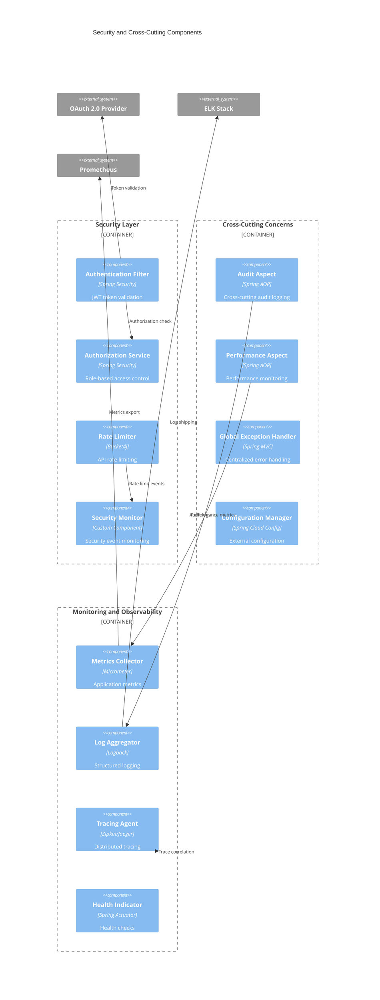
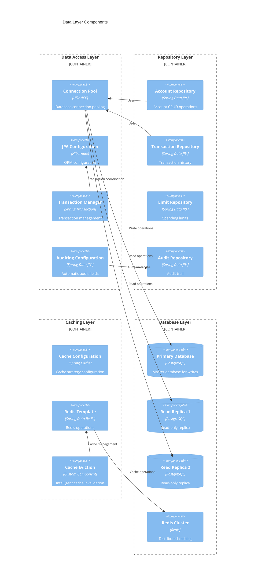
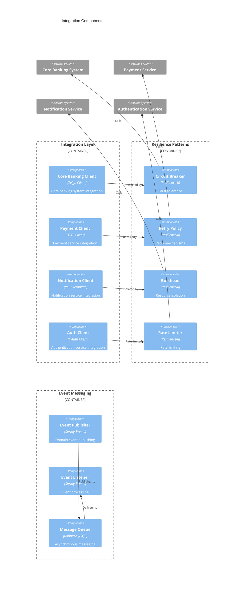
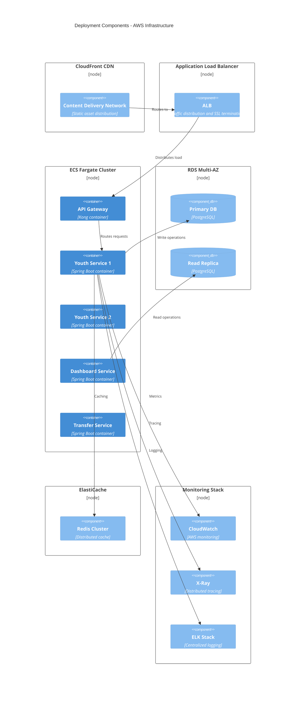

# Component Diagrams
## Youth Account Management System

### Version: 1.0
### Date: 2024
### Generated from: HLD Document and API Contract Outline

---

## 1. System-Level Component Diagram

---

## 2. Youth Account Service Component Breakdown

---

## 3. Dashboard Service Component Breakdown

---

## 4. Transfer Service Component Breakdown

---

## 5. Security and Cross-Cutting Components

---

## 6. Data Layer Component Architecture

---

## 7. Integration Component Architecture

---

## 8. Deployment Component Architecture

---

## Component Relationships and Dependencies

### Service Dependencies
1. **Youth Account Service**: Core service with dependencies on database and cache
2. **Dashboard Service**: Depends on Youth Account Service and read replicas
3. **Transfer Service**: Depends on Payment Service and Core Banking System
4. **Notification Service**: Independent service with message queue integration

### Data Flow Patterns
1. **Command Query Responsibility Segregation (CQRS)**: Separate read/write operations
2. **Event-Driven Architecture**: Asynchronous event processing
3. **Circuit Breaker Pattern**: Fault tolerance for external integrations
4. **Cache-Aside Pattern**: Intelligent caching strategy

### Security Boundaries
1. **API Gateway**: First line of defense with authentication and rate limiting
2. **Service Layer**: Internal authorization and business rule enforcement
3. **Data Layer**: Database-level security and encryption
4. **Network Layer**: VPC and security group isolation

---

## Component Mapping to Requirements

### ADR Mappings
- **SCIB-26**: Dashboard Service components
- **SCIB-27**: Transfer Service components
- **SCIB-28**: Spending Limit components in Youth Service
- **SCIB-29**: Transaction History components
- **SCIB-194-197**: UI component architecture

### Non-Functional Requirements
- **Performance**: Caching layer and read replicas
- **Scalability**: Microservices architecture with auto-scaling
- **Security**: Multi-layered security components
- **Reliability**: Circuit breakers and retry mechanisms
- **Compliance**: Audit service and logging components

---

## Technology Stack Summary

### Backend Services
- **Framework**: Spring Boot 2.7+
- **Language**: Java 11+
- **Database**: PostgreSQL 13+
- **Cache**: Redis 6+
- **Message Queue**: RabbitMQ/AWS SQS

### Infrastructure
- **Container Platform**: AWS ECS Fargate
- **API Gateway**: Kong/AWS API Gateway
- **Load Balancer**: AWS Application Load Balancer
- **CDN**: AWS CloudFront
- **Monitoring**: CloudWatch, X-Ray, ELK Stack

### Security
- **Authentication**: OAuth 2.0 with JWT
- **Authorization**: Spring Security with RBAC
- **Encryption**: TLS 1.3, AES-256
- **Secrets Management**: AWS Secrets Manager

---

*Generated from Youth Account Management System HLD Document v1.0*
*Compliant with C4 Model and enterprise architecture standards*