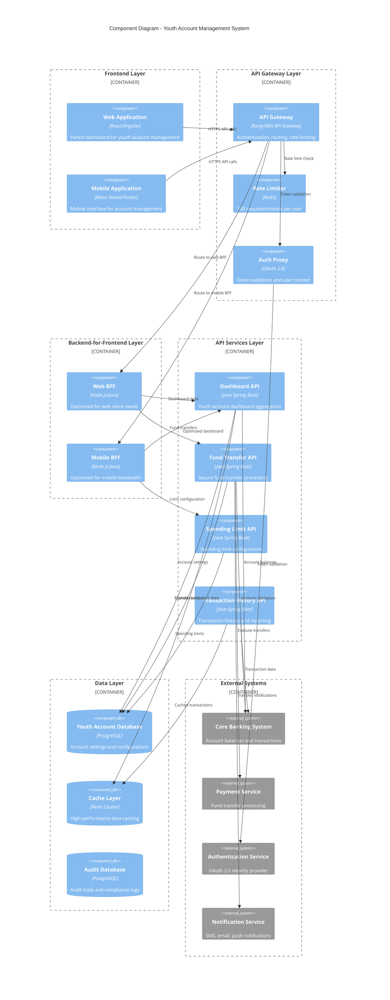
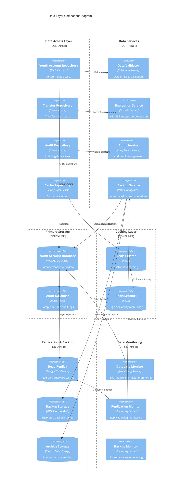

# Component Diagrams
## Youth Account Management System

### Document Information
- **Version**: 1.0
- **Date**: 2024
- **Generated From**: HLD Document and API Contract Outline
- **Related ADRs**: SCIB-25, SCIB-26, SCIB-27, SCIB-28, SCIB-29, SCIB-30

---

## 1. System-Level Component Diagram
**Overall System Architecture**

---

## 2. API Services Component Diagram
**Detailed View of Core API Services**

```mermaid
C4Component
    title API Services Component Diagram
    
    Container_Boundary(dashboardService, "Dashboard Service (SCIB-26)") {
        Component(dashController, "Dashboard Controller", "REST Controller", "HTTP request handling")
        Component(dashAggregator, "Data Aggregator", "Service Layer", "Combines data from multiple sources")
        Component(balanceService, "Balance Service", "Business Logic", "Account balance retrieval")
        Component(transactionSummary, "Transaction Summary", "Business Logic", "Recent transactions aggregation")
        Component(cacheManager, "Cache Manager", "Caching Layer", "Redis cache operations")
    }
    
    Container_Boundary(transferService, "Fund Transfer Service (SCIB-27)") {
        Component(transferController, "Transfer Controller", "REST Controller", "Transfer request handling")
        Component(transferValidator, "Transfer Validator", "Validation Layer", "Request validation and business rules")
        Component(idempotencyManager, "Idempotency Manager", "Business Logic", "Duplicate request prevention")
        Component(transferProcessor, "Transfer Processor", "Business Logic", "Core transfer logic")
        Component(auditLogger, "Audit Logger", "Cross-cutting", "Compliance and audit logging")
    }
    
    Container_Boundary(limitService, "Spending Limit Service (SCIB-28)") {
        Component(limitController, "Limit Controller", "REST Controller", "Limit configuration requests")
        Component(limitValidator, "Limit Validator", "Validation Layer", "Limit range validation")
        Component(limitManager, "Limit Manager", "Business Logic", "Spending limit operations")
        Component(effectiveDateCalc, "Effective Date Calculator", "Business Logic", "Date calculation logic")
    }
    
    Container_Boundary(historyService, "Transaction History Service (SCIB-29)") {
        Component(historyController, "History Controller", "REST Controller", "Transaction history requests")
        Component(queryBuilder, "Query Builder", "Data Access", "Dynamic query construction")
        Component(paginationManager, "Pagination Manager", "Business Logic", "Page-based result handling")
        Component(summaryCalculator, "Summary Calculator", "Business Logic", "Transaction statistics")
    }
    
    Container_Boundary(sharedComponents, "Shared Components") {
        Component(errorHandler, "Global Error Handler", "Exception Handling", "Standardized error responses")
        Component(securityFilter, "Security Filter", "Security", "Authorization and authentication")
        Component(correlationFilter, "Correlation Filter", "Observability", "Request correlation tracking")
        Component(metricsCollector, "Metrics Collector", "Monitoring", "Performance and business metrics")
    }
    
    ComponentDb(youthAccountDB, "Youth Account DB", "PostgreSQL", "Persistent data storage")
    ComponentDb(redisCache, "Redis Cache", "Redis", "High-speed caching")
    
    System_Ext(coreBank, "Core Banking System")
    System_Ext(paymentSvc, "Payment Service")
    System_Ext(notificationSvc, "Notification Service")
    
    Rel(dashController, dashAggregator, "Aggregate request")
    Rel(dashAggregator, balanceService, "Get balance")
    Rel(dashAggregator, transactionSummary, "Get recent transactions")
    Rel(dashAggregator, cacheManager, "Cache operations")
    
    Rel(transferController, transferValidator, "Validate request")
    Rel(transferController, idempotencyManager, "Check duplicates")
    Rel(transferValidator, transferProcessor, "Process transfer")
    Rel(transferProcessor, auditLogger, "Log transaction")
    
    Rel(limitController, limitValidator, "Validate limits")
    Rel(limitValidator, limitManager, "Update limits")
    Rel(limitManager, effectiveDateCalc, "Calculate dates")
    
    Rel(historyController, queryBuilder, "Build query")
    Rel(queryBuilder, paginationManager, "Paginate results")
    Rel(paginationManager, summaryCalculator, "Calculate summary")
    
    Rel(balanceService, coreBank, "Account balance API")
    Rel(transactionSummary, coreBank, "Recent transactions API")
    Rel(transferProcessor, paymentSvc, "Execute payment")
    Rel(transferProcessor, coreBank, "Account validation")
    Rel(auditLogger, notificationSvc, "Send notifications")
    
    Rel(cacheManager, redisCache, "Cache operations")
    Rel(limitManager, youthAccountDB, "Store limits")
    Rel(transferProcessor, youthAccountDB, "Store transfers")
    Rel(queryBuilder, coreBank, "Query transactions")
```

---

## 3. Data Layer Component Diagram
**Data Storage and Management Components**

---

## 4. Security Component Diagram
**Security and Compliance Components**

```mermaid
C4Component
    title Security Component Diagram
    
    Container_Boundary(authentication, "Authentication Layer") {
        Component(oauthProvider, "OAuth 2.0 Provider", "Spring Security OAuth", "Token-based authentication")
        Component(jwtProcessor, "JWT Processor", "JWT Library", "Token generation and validation")
        Component(mfaService, "MFA Service", "Security Service", "Multi-factor authentication")
        Component(sessionManager, "Session Manager", "Security Service", "Session lifecycle management")
    }
    
    Container_Boundary(authorization, "Authorization Layer") {
        Component(rbacEngine, "RBAC Engine", "Security Service", "Role-based access control")
        Component(permissionManager, "Permission Manager", "Security Service", "Fine-grained permissions")
        Component(resourceGuard, "Resource Guard", "Security Service", "Resource-level authorization")
    }
    
    Container_Boundary(dataProtection, "Data Protection") {
        Component(encryptionManager, "Encryption Manager", "Crypto Service", "AES-256 encryption")
        Component(keyManager, "Key Manager", "HSM/Vault", "Encryption key management")
        Component(tokenizationSvc, "Tokenization Service", "Security Service", "PII tokenization")
        Component(dataMasking, "Data Masking", "Security Service", "Non-prod data masking")
    }
    
    Container_Boundary(apiSecurity, "API Security") {
        Component(rateLimiter, "Rate Limiter", "Security Service", "API rate limiting")
        Component(inputValidator, "Input Validator", "Security Service", "Input sanitization")
        Component(corsHandler, "CORS Handler", "Security Service", "Cross-origin request handling")
        Component(csrfProtection, "CSRF Protection", "Security Service", "Cross-site request forgery protection")
    }
    
    Container_Boundary(monitoring, "Security Monitoring") {
        Component(siemConnector, "SIEM Connector", "Security Service", "Security event forwarding")
        Component(anomalyDetector, "Anomaly Detector", "ML Service", "Behavioral anomaly detection")
        Component(threatIntel, "Threat Intelligence", "Security Service", "Threat feed integration")
        Component(incidentResponse, "Incident Response", "Security Service", "Automated incident handling")
    }
    
    Container_Boundary(compliance, "Compliance Components") {
        Component(pciValidator, "PCI Validator", "Compliance Service", "PCI-DSS compliance checks")
        Component(gdprManager, "GDPR Manager", "Compliance Service", "Data privacy compliance")
        Component(auditTrail, "Audit Trail", "Compliance Service", "Immutable audit logging")
        Component(complianceReporter, "Compliance Reporter", "Compliance Service", "Regulatory reporting")
    }
    
    System_Ext(hsmVault, "HSM/Vault", "Hardware security module")
    System_Ext(siemSystem, "SIEM System", "Security information and event management")
    System_Ext(threatFeeds, "Threat Feeds", "External threat intelligence")
    
    Rel(oauthProvider, jwtProcessor, "Generate tokens")
    Rel(oauthProvider, mfaService, "MFA validation")
    Rel(jwtProcessor, sessionManager, "Session tracking")
    
    Rel(rbacEngine, permissionManager, "Check permissions")
    Rel(permissionManager, resourceGuard, "Resource access")
    
    Rel(encryptionManager, keyManager, "Key operations")
    Rel(tokenizationSvc, keyManager, "Tokenization keys")
    Rel(keyManager, hsmVault, "Secure key storage")
    
    Rel(rateLimiter, inputValidator, "Validate after rate check")
    Rel(inputValidator, corsHandler, "CORS validation")
    Rel(corsHandler, csrfProtection, "CSRF validation")
    
    Rel(siemConnector, siemSystem, "Forward security events")
    Rel(anomalyDetector, threatIntel, "Threat correlation")
    Rel(threatIntel, threatFeeds, "Threat data")
    Rel(anomalyDetector, incidentResponse, "Trigger incidents")
    
    Rel(pciValidator, auditTrail, "Log compliance events")
    Rel(gdprManager, auditTrail, "Log privacy events")
    Rel(auditTrail, complianceReporter, "Generate reports")
```

---

## 5. Integration Component Diagram
**External System Integration Components**

```mermaid
C4Component
    title Integration Component Diagram
    
    Container_Boundary(integrationLayer, "Integration Layer") {
        Component(integrationGateway, "Integration Gateway", "Spring Integration", "External system orchestration")
        Component(circuitBreaker, "Circuit Breaker", "Hystrix/Resilience4j", "Fault tolerance")
        Component(retryManager, "Retry Manager", "Spring Retry", "Intelligent retry logic")
        Component(messageRouter, "Message Router", "Apache Camel", "Message routing and transformation")
    }
    
    Container_Boundary(bankingIntegration, "Core Banking Integration") {
        Component(bankingAdapter, "Banking Adapter", "Integration Service", "Core banking system adapter")
        Component(accountService, "Account Service Client", "REST Client", "Account operations client")
        Component(balanceService, "Balance Service Client", "REST Client", "Balance inquiry client")
        Component(transactionClient, "Transaction Client", "REST Client", "Transaction data client")
    }
    
    Container_Boundary(paymentIntegration, "Payment Integration") {
        Component(paymentAdapter, "Payment Adapter", "Integration Service", "Payment service adapter")
        Component(transferClient, "Transfer Client", "REST Client", "Fund transfer client")
        Component(reconciliationSvc, "Reconciliation Service", "Batch Service", "Payment reconciliation")
        Component(fraudDetector, "Fraud Detector Client", "REST Client", "Fraud detection integration")
    }
    
    Container_Boundary(notificationIntegration, "Notification Integration") {
        Component(notificationAdapter, "Notification Adapter", "Integration Service", "Notification service adapter")
        Component(smsClient, "SMS Client", "REST Client", "SMS notification client")
        Component(emailClient, "Email Client", "SMTP Client", "Email notification client")
        Component(pushClient, "Push Client", "REST Client", "Push notification client")
    }
    
    Container_Boundary(dataSync, "Data Synchronization") {
        Component(etlProcessor, "ETL Processor", "Batch Service", "Extract, transform, load operations")
        Component(changeDetector, "Change Detector", "CDC Service", "Change data capture")
        Component(syncScheduler, "Sync Scheduler", "Quartz Scheduler", "Scheduled synchronization")
        Component(conflictResolver, "Conflict Resolver", "Business Service", "Data conflict resolution")
    }
    
    Container_Boundary(monitoring, "Integration Monitoring") {
        Component(healthChecker, "Health Checker", "Monitoring Service", "External system health monitoring")
        Component(performanceMonitor, "Performance Monitor", "Monitoring Service", "Integration performance tracking")
        Component(errorTracker, "Error Tracker", "Monitoring Service", "Integration error tracking")
        Component(slaMonitor, "SLA Monitor", "Monitoring Service", "Service level agreement monitoring")
    }
    
    System_Ext(coreBank, "Core Banking System")
    System_Ext(paymentSvc, "Payment Service")
    System_Ext(notificationSvc, "Notification Service")
    System_Ext(fraudSvc, "Fraud Detection Service")
    
    Rel(integrationGateway, circuitBreaker, "Fault tolerance")
    Rel(circuitBreaker, retryManager, "Retry on failure")
    Rel(integrationGateway, messageRouter, "Route messages")
    
    Rel(bankingAdapter, accountService, "Account operations")
    Rel(bankingAdapter, balanceService, "Balance inquiries")
    Rel(bankingAdapter, transactionClient, "Transaction data")
    
    Rel(paymentAdapter, transferClient, "Fund transfers")
    Rel(paymentAdapter, reconciliationSvc, "Reconciliation")
    Rel(paymentAdapter, fraudDetector, "Fraud checks")
    
    Rel(notificationAdapter, smsClient, "SMS notifications")
    Rel(notificationAdapter, emailClient, "Email notifications")
    Rel(notificationAdapter, pushClient, "Push notifications")
    
    Rel(etlProcessor, changeDetector, "Detect changes")
    Rel(syncScheduler, etlProcessor, "Schedule ETL")
    Rel(changeDetector, conflictResolver, "Resolve conflicts")
    
    Rel(accountService, coreBank, "HTTPS/REST")
    Rel(balanceService, coreBank, "HTTPS/REST")
    Rel(transactionClient, coreBank, "HTTPS/REST")
    
    Rel(transferClient, paymentSvc, "HTTPS/REST")
    Rel(fraudDetector, fraudSvc, "HTTPS/REST")
    
    Rel(smsClient, notificationSvc, "HTTPS/REST")
    Rel(emailClient, notificationSvc, "SMTP")
    Rel(pushClient, notificationSvc, "HTTPS/REST")
    
    Rel(healthChecker, coreBank, "Health checks")
    Rel(healthChecker, paymentSvc, "Health checks")
    Rel(performanceMonitor, integrationGateway, "Monitor performance")
    Rel(errorTracker, circuitBreaker, "Track errors")
```

---

## Component Diagram Standards & Compliance

### 1. Architecture Principles
- **Microservices Architecture**: Loosely coupled, independently deployable services
- **API-First Design**: All components expose well-defined APIs
- **Event-Driven Architecture**: Asynchronous communication where appropriate
- **Domain-Driven Design**: Components organized around business domains

### 2. Technology Stack Alignment
- **Backend Services**: Java Spring Boot for consistency and enterprise support
- **Frontend Applications**: React/Angular for web, React Native/Flutter for mobile
- **Data Storage**: PostgreSQL for ACID compliance, Redis for caching
- **Integration**: Spring Integration and Apache Camel for enterprise integration patterns

### 3. Security Architecture
- **Zero Trust Model**: No implicit trust between components
- **Defense in Depth**: Multiple layers of security controls
- **Encryption Everywhere**: Data encrypted at rest and in transit
- **Principle of Least Privilege**: Minimal required permissions for each component

### 4. Scalability Patterns
- **Horizontal Scaling**: Stateless components for easy scaling
- **Load Balancing**: Even distribution of requests across instances
- **Caching Strategy**: Multi-level caching for performance
- **Database Scaling**: Read replicas and connection pooling

### 5. Reliability Patterns
- **Circuit Breaker**: Prevent cascading failures
- **Bulkhead**: Isolate critical resources
- **Timeout**: Prevent resource exhaustion
- **Retry with Backoff**: Intelligent failure recovery

### 6. Observability
- **Distributed Tracing**: End-to-end request tracking
- **Metrics Collection**: Business and technical metrics
- **Centralized Logging**: Structured logging with correlation
- **Health Monitoring**: Real-time health checks

### 7. Compliance Integration
- **PCI-DSS**: Payment card data protection
- **GDPR**: Data privacy and protection
- **SOX**: Financial reporting controls
- **Banking Regulations**: KYC/AML compliance

### 8. Deployment Architecture
- **Containerization**: Docker containers for consistency
- **Orchestration**: Kubernetes for container management
- **Infrastructure as Code**: Terraform/CloudFormation
- **CI/CD Pipeline**: Automated testing and deployment

---

**Component Diagrams Document End**