# Component Diagrams
## Task Creation API Endpoint Implementation

### Version: 1.0
### Document ID: COMP-DEMO-2350
### Date: 2024
### Generated from: HLD Document and API Contract Outline

---

## 1. System Architecture Component Diagram

### 1.1 High-Level System Components

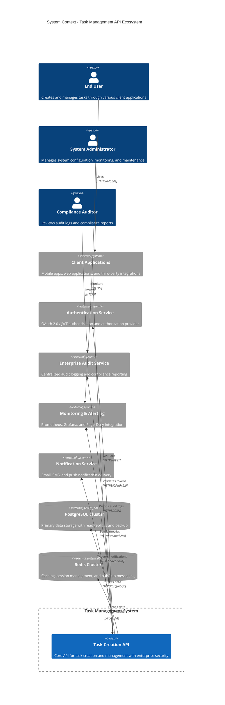

### 1.2 Container-Level Architecture

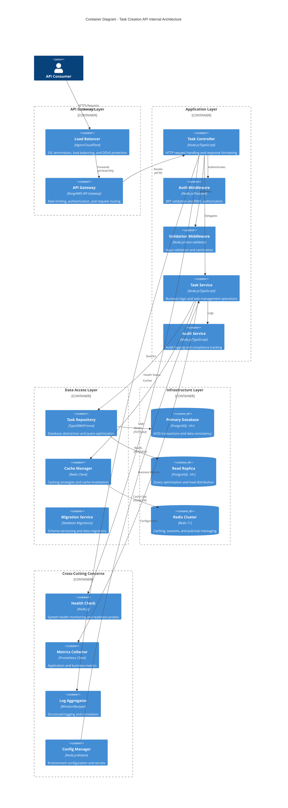

---

## 2. Component Interaction Diagrams

### 2.1 Request Processing Flow Components

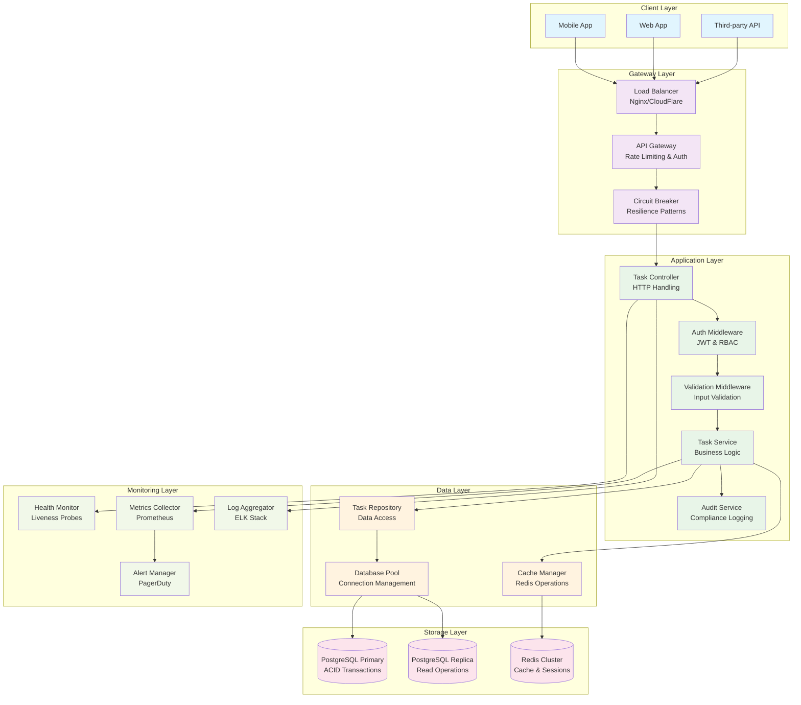

### 2.2 Data Flow Component Architecture

```mermaid
flowchart LR
    subgraph "Input Processing"
        A[HTTP Request] --> B[Request Parser]
        B --> C[Schema Validator]
        C --> D[Sanitizer]
    end
    
    subgraph "Security Layer"
        E[JWT Decoder] --> F[Token Validator]
        F --> G[Permission Checker]
        G --> H[Rate Limiter]
    end
    
    subgraph "Business Logic"
        I[Task Factory] --> J[Business Rules Engine]
        J --> K[Data Transformer]
        K --> L[Audit Logger]
    end
    
    subgraph "Data Persistence"
        M[Transaction Manager] --> N[Query Builder]
        N --> O[Connection Pool]
        O --> P[Database Driver]
    end
    
    subgraph "Caching Layer"
        Q[Cache Strategy] --> R[Cache Key Generator]
        R --> S[Redis Client]
        S --> T[Cache Invalidator]
    end
    
    subgraph "Response Processing"
        U[Response Builder] --> V[Serializer]
        V --> W[Compressor]
        W --> X[HTTP Response]
    end
    
    D --> E
    H --> I
    L --> M
    L --> Q
    P --> U
    T --> U
    
    classDef input fill:#bbdefb
    classDef security fill:#f8bbd9
    classDef business fill:#c8e6c9
    classDef persistence fill:#ffe0b2
    classDef caching fill:#d1c4e9
    classDef response fill:#dcedc8
    
    class A,B,C,D input
    class E,F,G,H security
    class I,J,K,L business
    class M,N,O,P persistence
    class Q,R,S,T caching
    class U,V,W,X response
```

---

## 3. Deployment Architecture Components

### 3.1 Kubernetes Deployment Components

```mermaid
C4Deployment
    title Deployment Diagram - Kubernetes Infrastructure
    
    Deployment_Node(internet, "Internet", "Global CDN") {
        Container(cdn, "CloudFlare CDN", "Global Edge Locations")
    }
    
    Deployment_Node(aws, "AWS Cloud", "Multi-AZ Deployment") {
        Deployment_Node(alb, "Application Load Balancer", "AWS ALB") {
            Container(loadBalancer, "ALB", "SSL Termination & Load Balancing")
        }
        
        Deployment_Node(eks, "EKS Cluster", "Kubernetes v1.28+") {
            Deployment_Node(namespace, "task-api Namespace") {
                Deployment_Node(pods, "Application Pods") {
                    Container(taskApi1, "task-api-1", "Node.js Container")
                    Container(taskApi2, "task-api-2", "Node.js Container")
                    Container(taskApi3, "task-api-3", "Node.js Container")
                }
                
                Deployment_Node(services, "Kubernetes Services") {
                    Container(apiService, "task-api-service", "ClusterIP Service")
                    Container(configMap, "Configuration", "ConfigMap & Secrets")
                    Container(hpa, "Auto Scaler", "Horizontal Pod Autoscaler")
                }
            }
        }
        
        Deployment_Node(rds, "RDS Multi-AZ", "Managed Database") {
            ContainerDb(primaryDb, "PostgreSQL Primary", "db.r5.xlarge")
            ContainerDb(replicaDb, "PostgreSQL Replica", "db.r5.large")
        }
        
        Deployment_Node(elasticache, "ElastiCache", "Managed Redis") {
            ContainerDb(redisCluster, "Redis Cluster", "cache.r6g.large")
        }
        
        Deployment_Node(monitoring, "Monitoring Stack") {
            Container(prometheus, "Prometheus", "Metrics Collection")
            Container(grafana, "Grafana", "Dashboards & Visualization")
            Container(elasticsearch, "Elasticsearch", "Log Storage & Search")
        }
    }
    
    Rel(cdn, loadBalancer, "HTTPS", "Port 443")
    Rel(loadBalancer, apiService, "HTTP", "Port 80")
    Rel(apiService, taskApi1, "Routes")
    Rel(apiService, taskApi2, "Routes")
    Rel(apiService, taskApi3, "Routes")
    
    Rel(taskApi1, primaryDb, "Writes", "Port 5432")
    Rel(taskApi2, replicaDb, "Reads", "Port 5432")
    Rel(taskApi3, redisCluster, "Cache", "Port 6379")
    
    Rel(hpa, pods, "Scales")
    Rel(configMap, pods, "Configures")
    
    Rel(taskApi1, prometheus, "Metrics")
    Rel(prometheus, grafana, "Data")
    Rel(taskApi1, elasticsearch, "Logs")
```

### 3.2 Network Architecture Components

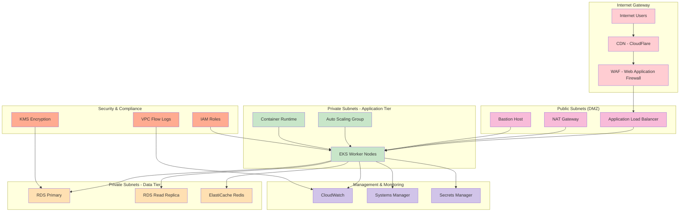

---

## 4. Security Architecture Components

### 4.1 Security Layer Components

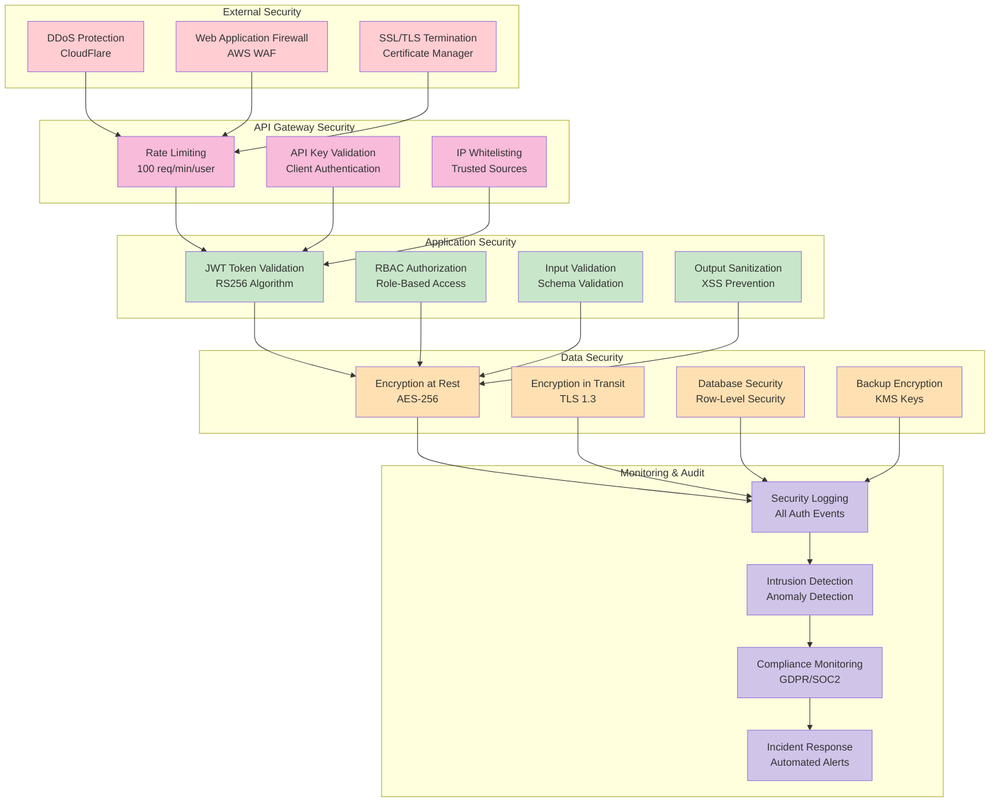

### 4.2 Authentication and Authorization Components

```mermaid
flowchart LR
    subgraph "Identity Provider"
        A[OAuth 2.0 Server]
        B[User Directory<br/>LDAP/AD]
        C[Multi-Factor Auth<br/>TOTP/SMS]
    end
    
    subgraph "Token Management"
        D[JWT Token Generator<br/>RS256 Signing]
        E[Token Validator<br/>Signature Verification]
        F[Refresh Token Store<br/>Redis Cache]
        G[Token Blacklist<br/>Revoked Tokens]
    end
    
    subgraph "Authorization Engine"
        H[Role Manager<br/>User Roles]
        I[Permission Engine<br/>Resource Permissions]
        J[Policy Evaluator<br/>ABAC Rules]
        K[Context Analyzer<br/>Request Context]
    end
    
    subgraph "Access Control"
        L[Resource Guard<br/>Endpoint Protection]
        M[Method Guard<br/>HTTP Method Control]
        N[Field Guard<br/>Data Field Access]
        O[Audit Logger<br/>Access Logging]
    end
    
    A --> D
    B --> A
    C --> A
    
    D --> E
    E --> F
    F --> G
    
    E --> H
    H --> I
    I --> J
    J --> K
    
    K --> L
    L --> M
    M --> N
    N --> O
    
    classDef identity fill:#e3f2fd
    classDef token fill:#f3e5f5
    classDef authorization fill:#e8f5e8
    classDef access fill:#fff3e0
    
    class A,B,C identity
    class D,E,F,G token
    class H,I,J,K authorization
    class L,M,N,O access
```

---

## 5. Data Architecture Components

### 5.1 Database Architecture Components

```mermaid
ER
    TASK {
        uuid id PK "Primary Key"
        varchar title "Task title (1-255 chars)"
        text description "Task description (max 1000 chars)"
        task_status status "Enum: TODO, IN_PROGRESS, DONE, CANCELLED"
        task_priority priority "Enum: LOW, MEDIUM, HIGH, CRITICAL"
        timestamptz due_date "Due date with timezone"
        timestamptz created_at "Creation timestamp"
        timestamptz updated_at "Last update timestamp"
        uuid created_by FK "User who created the task"
        uuid assigned_to FK "User assigned to the task"
        jsonb metadata "Additional task metadata"
        varchar[] tags "Array of task tags"
        boolean is_deleted "Soft delete flag"
        varchar version "Optimistic locking version"
    }
    
    USER {
        uuid id PK "Primary Key"
        varchar email "User email (unique)"
        varchar name "User full name"
        user_role role "Enum: ADMIN, MANAGER, USER, VIEWER"
        boolean is_active "Account status"
        timestamptz created_at "Account creation"
        timestamptz last_login "Last login timestamp"
        jsonb preferences "User preferences"
        varchar timezone "User timezone"
    }
    
    AUDIT_LOG {
        uuid id PK "Primary Key"
        varchar action "Action performed"
        varchar entity_type "Type of entity"
        uuid entity_id "ID of affected entity"
        jsonb old_values "Previous values"
        jsonb new_values "New values"
        uuid user_id FK "User who performed action"
        varchar ip_address "Client IP address"
        varchar user_agent "Client user agent"
        varchar correlation_id "Request correlation ID"
        timestamptz timestamp "Action timestamp"
        varchar hash "Integrity hash"
    }
    
    TASK_HISTORY {
        uuid id PK "Primary Key"
        uuid task_id FK "Reference to task"
        varchar field_name "Changed field name"
        text old_value "Previous value"
        text new_value "New value"
        uuid changed_by FK "User who made change"
        timestamptz changed_at "Change timestamp"
        varchar reason "Reason for change"
    }
    
    PERMISSION {
        uuid id PK "Primary Key"
        varchar name "Permission name"
        varchar resource "Resource type"
        varchar action "Action type"
        text description "Permission description"
    }
    
    ROLE_PERMISSION {
        uuid role_id FK "Role reference"
        uuid permission_id FK "Permission reference"
        timestamptz granted_at "Grant timestamp"
        uuid granted_by FK "User who granted"
    }
    
    TASK ||--o{ USER : "created_by"
    TASK ||--o{ USER : "assigned_to"
    TASK ||--o{ TASK_HISTORY : "task_id"
    USER ||--o{ AUDIT_LOG : "user_id"
    USER ||--o{ TASK_HISTORY : "changed_by"
    USER ||--o{ ROLE_PERMISSION : "role_id"
    PERMISSION ||--o{ ROLE_PERMISSION : "permission_id"
```

### 5.2 Caching Architecture Components

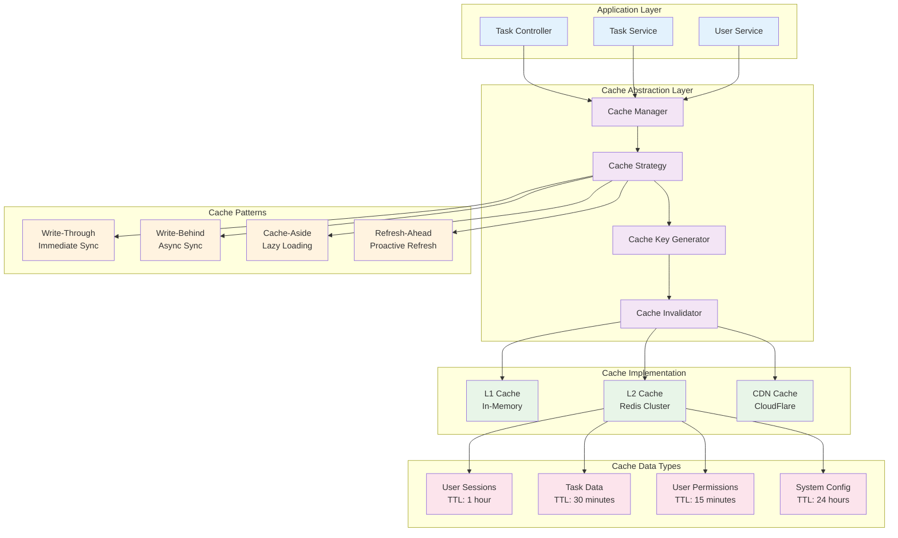

---

## 6. Monitoring and Observability Components

### 6.1 Observability Stack Components

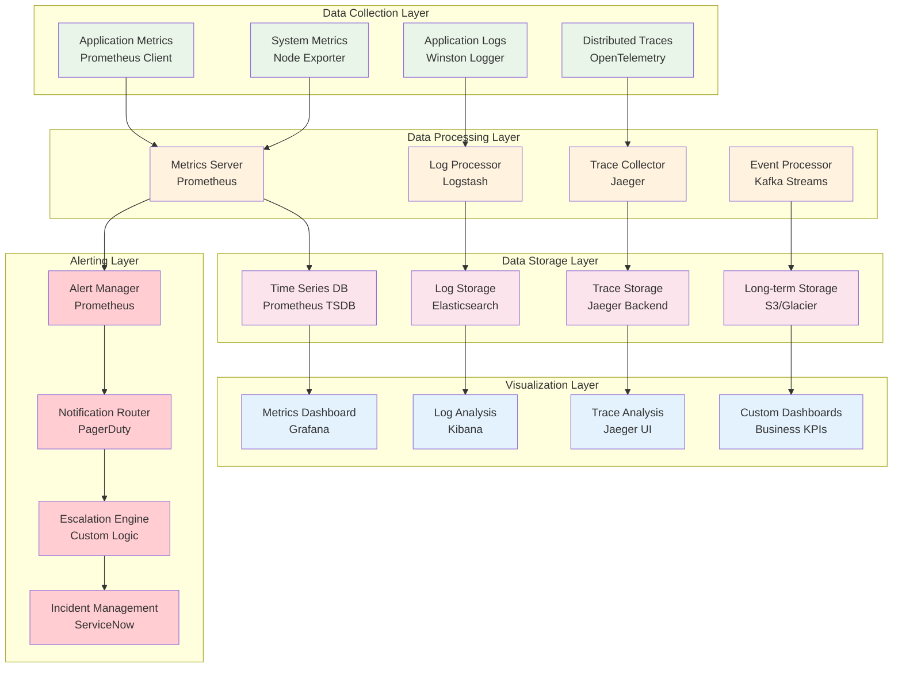

### 6.2 Health Check Components

```mermaid
flowchart LR
    subgraph "Health Check Types"
        A[Liveness Probe<br/>Basic Health]
        B[Readiness Probe<br/>Service Ready]
        C[Startup Probe<br/>Initialization]
    end
    
    subgraph "Health Indicators"
        D[Database Health<br/>Connection Test]
        E[Cache Health<br/>Redis Ping]
        F[External Service<br/>Auth Service]
        G[Memory Health<br/>Usage < 80%]
        H[CPU Health<br/>Usage < 70%]
    end
    
    subgraph "Health Aggregation"
        I[Health Aggregator<br/>Combine Results]
        J[Health Status<br/>UP/DOWN/DEGRADED]
        K[Health Details<br/>Component Status]
    end
    
    subgraph "Health Endpoints"
        L[/health<br/>Overall Health]
        M[/health/live<br/>Liveness Check]
        N[/health/ready<br/>Readiness Check]
        O[/health/detailed<br/>Component Details]
    end
    
    A --> D
    B --> E
    C --> F
    
    D --> I
    E --> I
    F --> I
    G --> I
    H --> I
    
    I --> J
    J --> K
    
    K --> L
    K --> M
    K --> N
    K --> O
    
    classDef probes fill:#e8f5e8
    classDef indicators fill:#fff3e0
    classDef aggregation fill:#fce4ec
    classDef endpoints fill:#e3f2fd
    
    class A,B,C probes
    class D,E,F,G,H indicators
    class I,J,K aggregation
    class L,M,N,O endpoints
```

---

## 7. Error Handling and Resilience Components

### 7.1 Error Handling Architecture

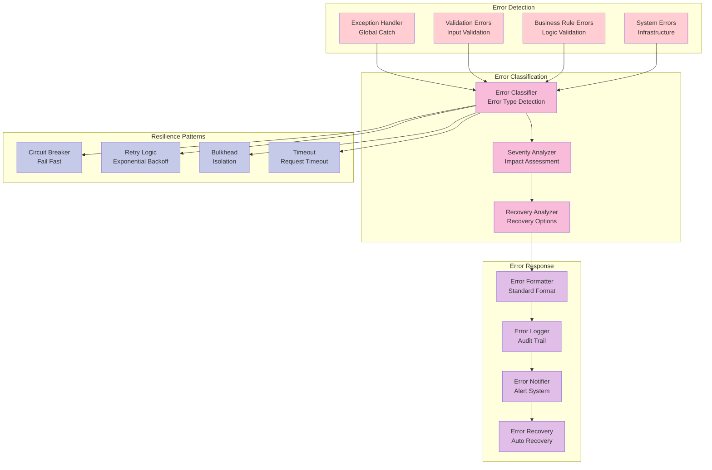

### 7.2 Circuit Breaker Component Detail

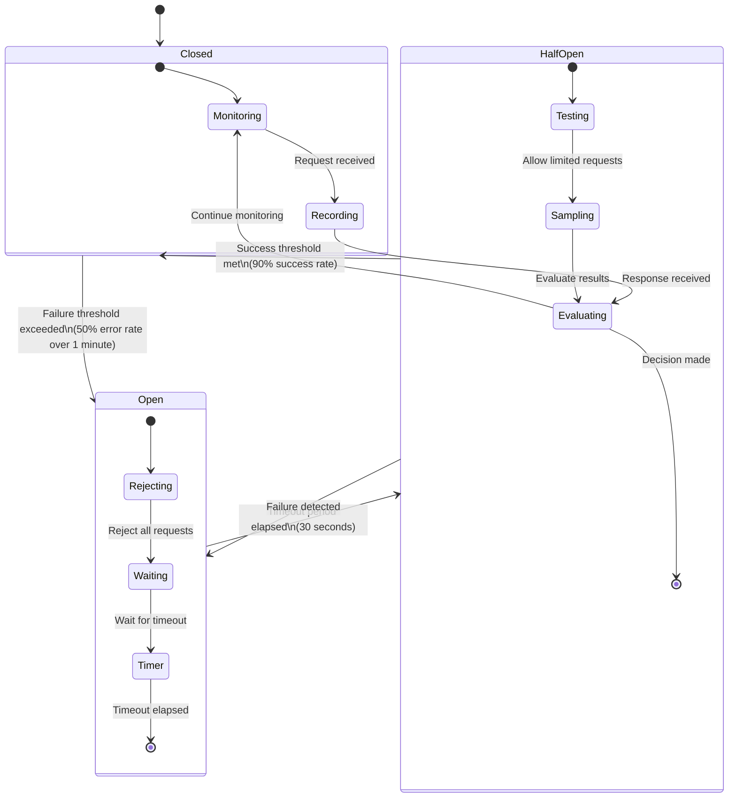

---

## 8. Performance Optimization Components

### 8.1 Performance Architecture

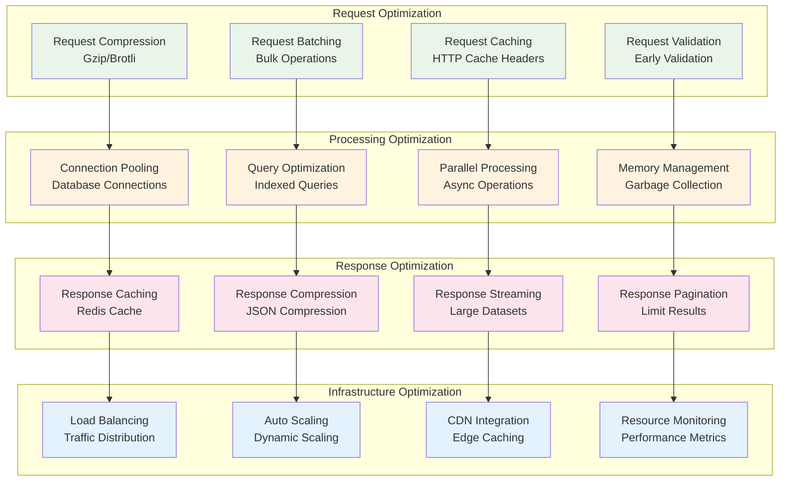

---

## 9. Compliance and Audit Components

### 9.1 GDPR Compliance Architecture

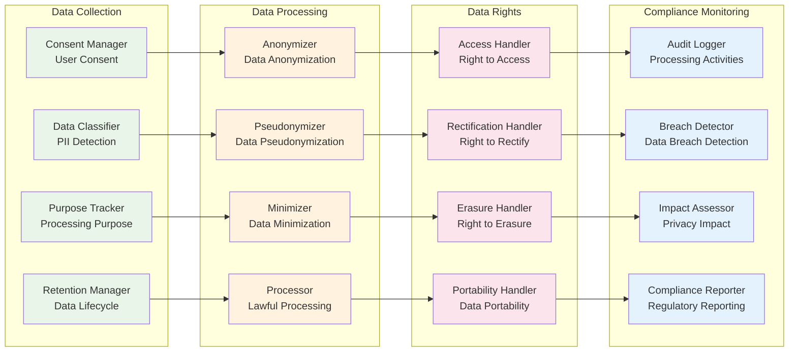

---

## Summary

These component diagrams provide a comprehensive architectural view of the Task Creation API endpoint implementation, covering:

### System Architecture
- **High-level system context** with external dependencies and stakeholders
- **Container-level architecture** showing internal component relationships
- **Deployment architecture** with Kubernetes and cloud infrastructure
- **Network architecture** with security boundaries and traffic flow

### Core Components
- **Request processing flow** from client to database
- **Data flow architecture** with transformation and validation stages
- **Security layer components** with authentication and authorization
- **Data architecture** with database schema and caching strategies

### Operational Components
- **Monitoring and observability** with metrics, logs, and traces
- **Health check system** with probes and status aggregation
- **Error handling and resilience** with circuit breakers and retry logic
- **Performance optimization** with caching and scaling strategies

### Compliance Components
- **GDPR compliance architecture** with data protection and privacy rights
- **Audit trail system** with immutable logging and integrity verification
- **Security monitoring** with threat detection and incident response

### Key Architectural Principles
- **Separation of Concerns**: Clear boundaries between layers and components
- **Scalability**: Horizontal scaling with auto-scaling capabilities
- **Resilience**: Circuit breakers, retries, and graceful degradation
- **Security**: Defense in depth with multiple security layers
- **Observability**: Comprehensive monitoring, logging, and tracing
- **Compliance**: Built-in GDPR, audit, and regulatory compliance

### Technology Stack
- **Runtime**: Node.js with TypeScript
- **Framework**: Express.js with enterprise middleware
- **Database**: PostgreSQL with read replicas
- **Caching**: Redis cluster for performance
- **Orchestration**: Kubernetes with auto-scaling
- **Monitoring**: Prometheus, Grafana, and ELK stack
- **Security**: JWT, RBAC, and comprehensive audit logging

These diagrams serve as the definitive architectural reference for development, deployment, and maintenance of the Task Creation API endpoint with enterprise-grade requirements for security, performance, scalability, and compliance.

---

**Document Status**: Final
**Generated From**: HLD Document (HLD-DEMO-2350) and API Contract Outline
**Architecture Style**: Microservices with Clean Architecture
**Deployment Model**: Cloud-native Kubernetes
**Compliance**: GDPR, ISO 27001, SOC 2 Type II
**Last Updated**: 2024
**Version**: 1.0