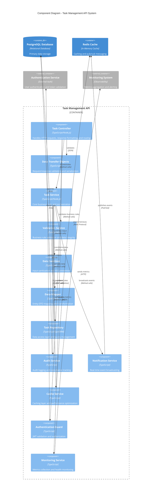
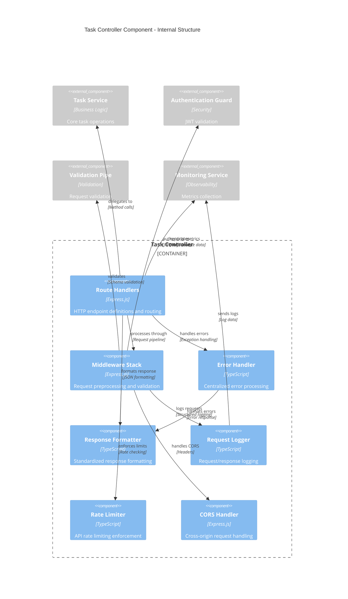
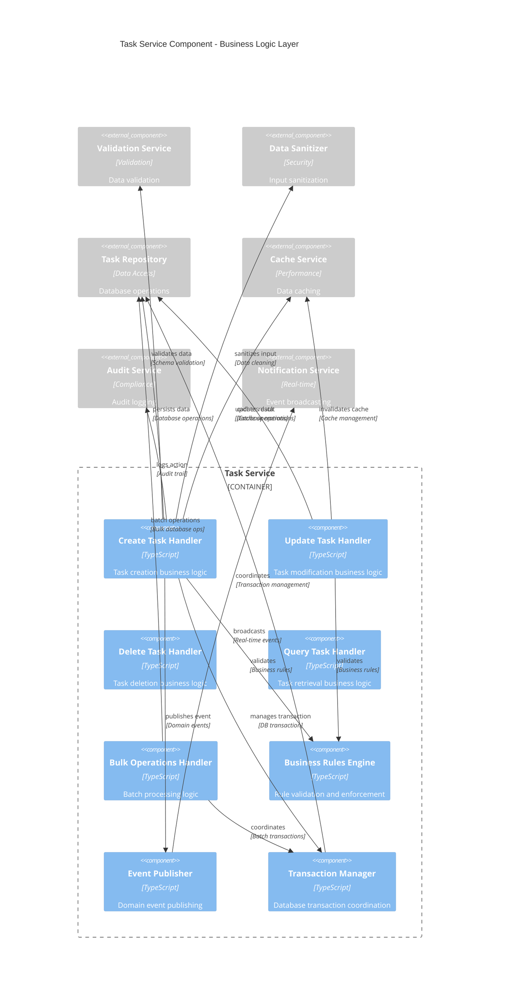
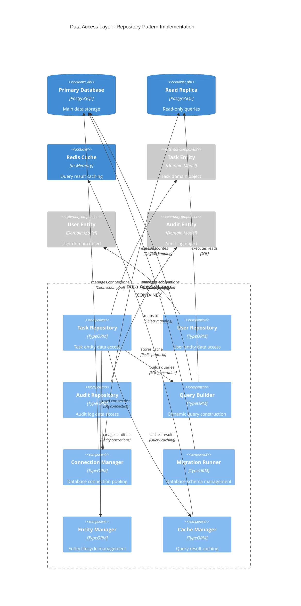
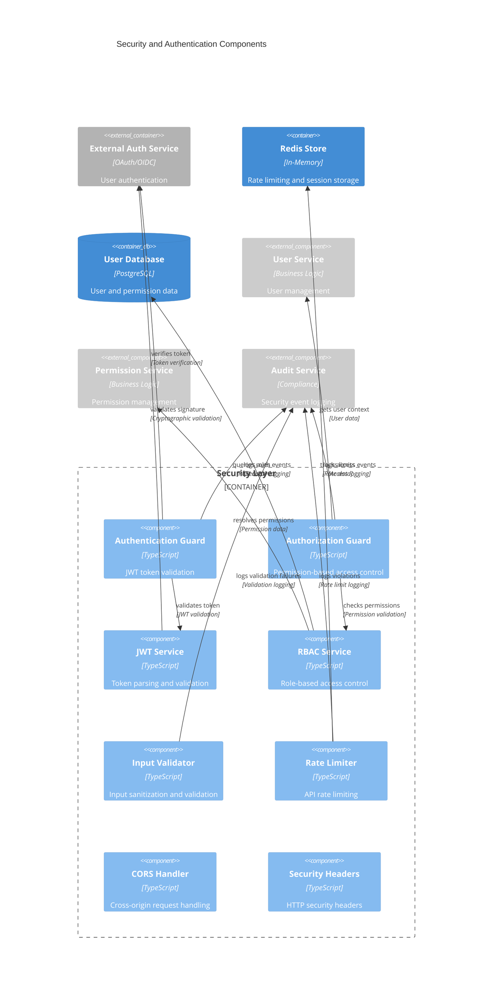
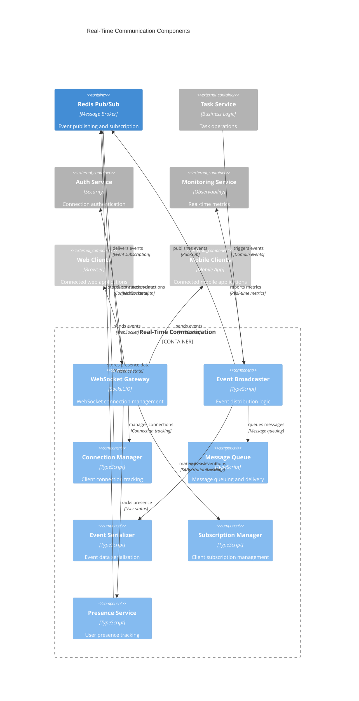
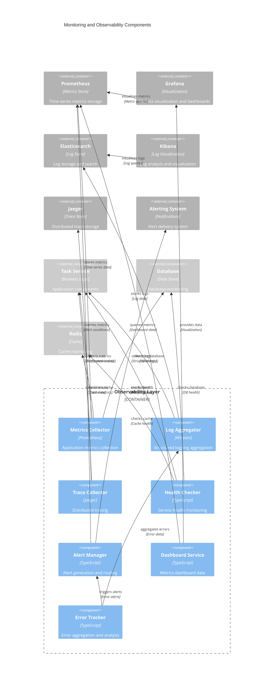

# Component Diagrams - Task Management API System

## Overview
This document contains component diagrams for the Task Management API system, illustrating the structural relationships, dependencies, and interfaces between system components.

---

## 1. High-Level System Component Diagram

### Description
This diagram shows the overall system architecture with major components and their relationships in the Task Management API system.

---

## 2. Task Controller Component Diagram

### Description
Detailed view of the Task Controller component and its internal structure, showing request processing flow and dependencies.

---

## 3. Task Service Component Diagram

### Description
Detailed view of the Task Service component showing business logic organization and data flow.

---

## 4. Data Access Layer Component Diagram

### Description
Detailed view of the data access layer showing repository pattern implementation and database interactions.

---

## 5. Security and Authentication Component Diagram

### Description
Detailed view of security components showing authentication, authorization, and security enforcement mechanisms.

---

## 6. Real-Time Communication Component Diagram

### Description
Detailed view of real-time communication components showing WebSocket implementation and event broadcasting.

---

## 7. Monitoring and Observability Component Diagram

### Description
Detailed view of monitoring and observability components showing metrics collection, logging, and alerting.

---

## Component Diagram Standards and Conventions

### 1. Component Types and Notation
- **Components**: Rectangular boxes with component name, technology, and description
- **Containers**: Grouped components within system boundaries
- **External Systems**: Components outside system boundary
- **Databases**: Cylindrical database symbols
- **Relationships**: Directed arrows with labels and protocols

### 2. Layering and Organization
- **Presentation Layer**: Controllers, middleware, and API endpoints
- **Business Logic Layer**: Services, validators, and business rules
- **Data Access Layer**: Repositories, entities, and database connections
- **Infrastructure Layer**: Caching, messaging, and external integrations
- **Cross-Cutting Concerns**: Security, logging, monitoring, and configuration

### 3. Dependency Management
- **Dependency Inversion**: High-level modules don't depend on low-level modules
- **Interface Segregation**: Components depend on abstractions, not concretions
- **Single Responsibility**: Each component has a single, well-defined purpose
- **Open/Closed Principle**: Components are open for extension, closed for modification

### 4. Technology Stack Alignment
- **Runtime Environment**: Node.js with TypeScript
- **Framework**: Express.js for HTTP handling
- **ORM**: TypeORM for database operations
- **Caching**: Redis for performance optimization
- **Real-time**: Socket.IO for WebSocket communication
- **Monitoring**: Prometheus, Grafana, ELK stack

### 5. Security Integration
- **Authentication**: JWT-based authentication across all components
- **Authorization**: RBAC implementation at service level
- **Input Validation**: Multi-layer validation and sanitization
- **Audit Logging**: Comprehensive audit trail for compliance
- **Rate Limiting**: API protection against abuse

---

## Architectural Patterns and Principles

### 1. Design Patterns Used
- **Repository Pattern**: Data access abstraction
- **Service Layer Pattern**: Business logic encapsulation
- **Dependency Injection**: Loose coupling and testability
- **Observer Pattern**: Event-driven architecture
- **Strategy Pattern**: Configurable business rules
- **Factory Pattern**: Object creation abstraction

### 2. Architectural Principles
- **Separation of Concerns**: Clear component boundaries
- **Single Responsibility**: Each component has one reason to change
- **Dependency Inversion**: Depend on abstractions, not concretions
- **Interface Segregation**: Small, focused interfaces
- **Open/Closed Principle**: Open for extension, closed for modification

### 3. Quality Attributes
- **Maintainability**: Modular design with clear interfaces
- **Testability**: Dependency injection and mocking support
- **Scalability**: Stateless components and horizontal scaling
- **Performance**: Caching layers and optimized data access
- **Security**: Defense in depth with multiple security layers
- **Reliability**: Error handling and fault tolerance

---

## Compliance and Traceability

### ADR Mappings
- **DEMO-2350**: Task Management API requirements
- **HLD-TASK-API-001**: High-level design document alignment
- **API-CONTRACT-001**: API contract specification compliance

### Non-Functional Requirements
- **Performance**: Component-level performance optimization
- **Security**: Security-by-design implementation
- **Scalability**: Horizontally scalable component architecture
- **Maintainability**: Clean architecture principles
- **Reliability**: Fault-tolerant component design

### Enterprise Architecture Standards
- **TOGAF Compliance**: Architecture development method alignment
- **C4 Model**: Consistent diagramming approach
- **Microservices Patterns**: Service decomposition strategies
- **Domain-Driven Design**: Business domain alignment
- **Clean Architecture**: Dependency rule enforcement

---

**Document Information**
- **Version**: 1.0
- **Last Updated**: 2024
- **Prepared By**: Senior Solution Architect
- **Review Status**: Ready for Technical Review
- **Compliance**: Enterprise Architecture Standards
- **Tool**: Mermaid.js for diagram generation
- **Format**: Markdown with embedded diagrams