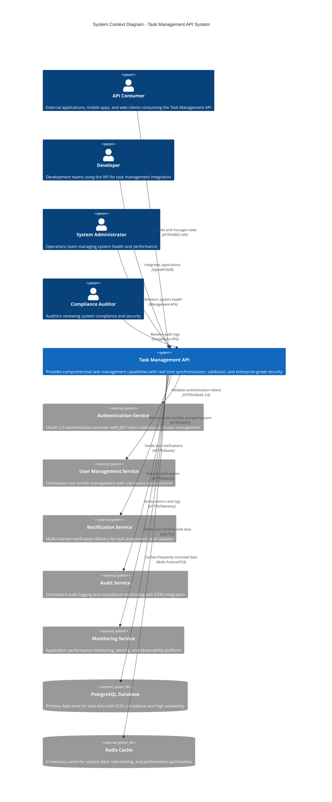
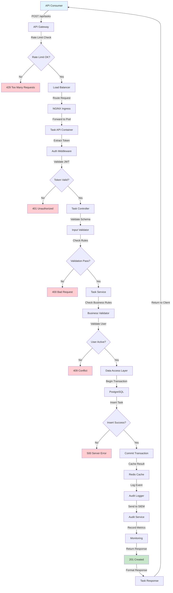
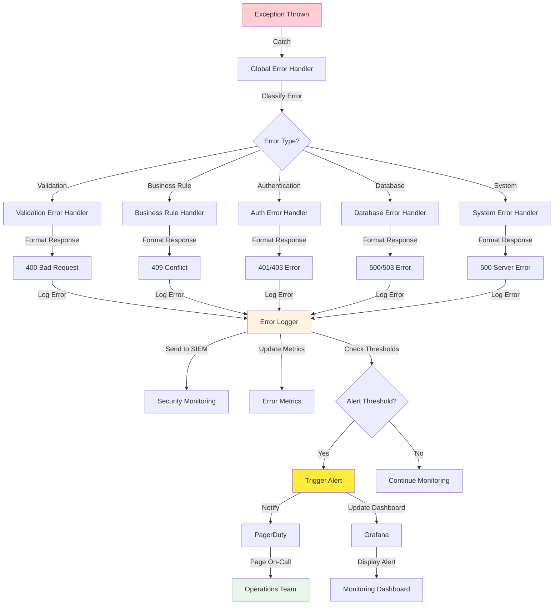
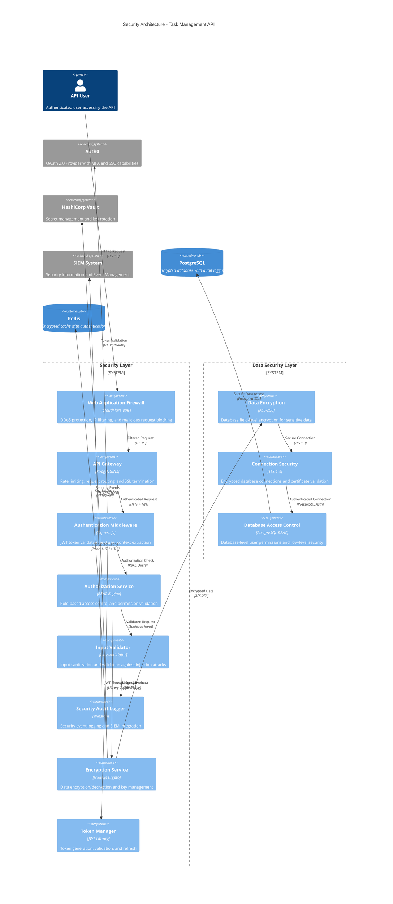
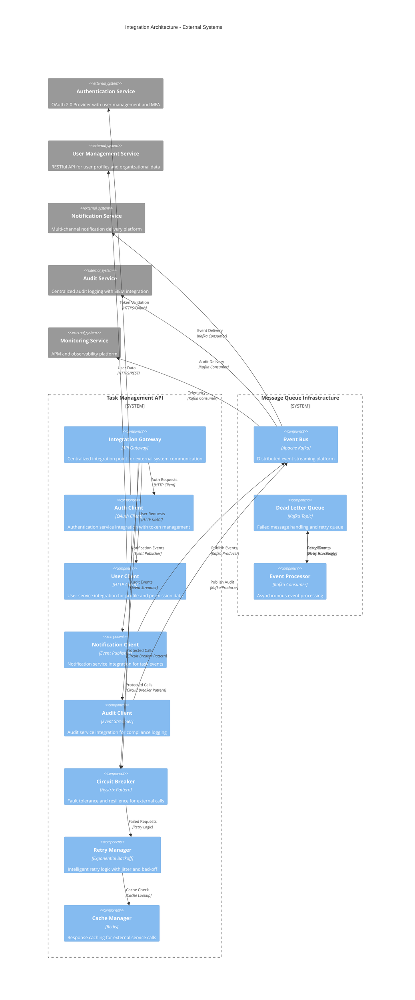

# Component Diagram - Task Management API System

## Overview
This document contains comprehensive component diagrams for the Task Management API System, illustrating the architectural structure, component relationships, and deployment topology as defined in DEMO-2350. The diagrams follow C4 model principles and enterprise architecture standards.

## 1. System Context Diagram

### 1.1 High-Level System Context

## 2. Container Diagram

### 2.1 Task Management API System Containers

```mermaid
C4Container
    title Container Diagram - Task Management API System
    
    Person(apiConsumer, "API Consumer", "External applications and clients")
    
    System_Boundary(taskSystem, "Task Management API System") {
        Container(apiGateway, "API Gateway", "NGINX/Kong", "Entry point for all API requests with rate limiting, authentication, and routing")
        
        Container(webAPI, "Web API Layer", "Node.js/Express", "RESTful API endpoints with OpenAPI documentation and request validation")
        
        Container(taskController, "Task Controller", "TypeScript", "HTTP request handling, input validation, and response formatting for task operations")
        
        Container(taskService, "Task Service", "TypeScript", "Core business logic, validation rules, and orchestration of task operations")
        
        Container(validationService, "Validation Service", "class-validator", "Comprehensive input validation, sanitization, and business rule enforcement")
        
        Container(auditLogger, "Audit Logger", "TypeScript", "Structured audit logging with correlation tracking and compliance formatting")
        
        Container(dataAccessLayer, "Data Access Layer", "TypeORM", "Database abstraction with connection pooling, query optimization, and transaction management")
        
        Container(cacheManager, "Cache Manager", "Redis Client", "Cache operations, session management, and rate limiting with Redis")
        
        Container(securityManager, "Security Manager", "TypeScript", "Authentication, authorization, and security policy enforcement")
        
        Container(monitoringAgent, "Monitoring Agent", "Prometheus/OpenTelemetry", "Metrics collection, distributed tracing, and health monitoring")
    }
    
    ContainerDb(database, "PostgreSQL Database", "PostgreSQL 14", "Primary data store with ACID transactions, indexes, and replication")
    ContainerDb(cache, "Redis Cache", "Redis 7", "In-memory cache with persistence, clustering, and pub/sub capabilities")
    
    Container_Ext(authService, "Authentication Service", "OAuth 2.0 Provider", "JWT token validation and user authentication")
    Container_Ext(auditService, "Audit Service", "Elasticsearch/Kibana", "Centralized audit log storage and analysis")
    Container_Ext(monitoringService, "Monitoring Service", "Grafana/Prometheus", "Metrics visualization and alerting")
    
    Rel(apiConsumer, apiGateway, "HTTPS requests", "REST/JSON")
    
    Rel(apiGateway, webAPI, "Authenticated requests", "HTTP")
    Rel(webAPI, taskController, "Route to controller", "Method calls")
    
    Rel(taskController, validationService, "Validate input", "Function calls")
    Rel(taskController, taskService, "Execute business logic", "Method calls")
    Rel(taskController, securityManager, "Check permissions", "Method calls")
    
    Rel(taskService, dataAccessLayer, "Data operations", "ORM calls")
    Rel(taskService, auditLogger, "Log events", "Method calls")
    Rel(taskService, cacheManager, "Cache operations", "Redis commands")
    
    Rel(dataAccessLayer, database, "SQL queries", "PostgreSQL protocol")
    Rel(cacheManager, cache, "Cache operations", "Redis protocol")
    
    Rel(securityManager, authService, "Token validation", "HTTPS")
    Rel(auditLogger, auditService, "Audit events", "HTTPS/JSON")
    Rel(monitoringAgent, monitoringService, "Metrics and traces", "HTTPS/Prometheus")
    
    UpdateLayoutConfig($c4ShapeInRow="3", $c4BoundaryInRow="1")
```

## 3. Component Diagram - Detailed Architecture

### 3.1 Task Management Core Components

```mermaid
C4Component
    title Component Diagram - Task Management Core Components
    
    Container_Boundary(webAPI, "Web API Layer") {
        Component(routeHandler, "Route Handler", "Express Router", "HTTP route definitions and middleware configuration")
        Component(requestLogger, "Request Logger", "Morgan/Winston", "HTTP request logging with correlation IDs")
        Component(errorHandler, "Global Error Handler", "Express Middleware", "Centralized error processing and response formatting")
        Component(rateLimiter, "Rate Limiter", "Express Rate Limit", "Request throttling and abuse prevention")
    }
    
    Container_Boundary(taskController, "Task Controller Layer") {
        Component(taskController_comp, "TaskController", "TypeScript Class", "Main controller for task operations with HTTP handling")
        Component(createTaskHandler, "CreateTaskHandler", "Method", "Handles POST /api/tasks requests with validation")
        Component(responseFormatter, "Response Formatter", "Utility", "Standardizes API response format and HTTP status codes")
        Component(correlationManager, "Correlation Manager", "Middleware", "Manages request correlation IDs for tracing")
    }
    
    Container_Boundary(taskService, "Task Service Layer") {
        Component(taskService_comp, "TaskService", "TypeScript Class", "Core business logic for task management operations")
        Component(businessRuleEngine, "Business Rule Engine", "Service", "Validates business rules and constraints")
        Component(taskFactory, "Task Factory", "Factory Pattern", "Creates task entities with proper defaults and validation")
        Component(taskTransformer, "Task Transformer", "Mapper", "Transforms between DTOs and domain entities")
    }
    
    Container_Boundary(validation, "Validation Layer") {
        Component(createTaskDto, "CreateTaskDto", "class-validator", "Input validation schema with decorators")
        Component(schemaValidator, "Schema Validator", "Validator", "Validates request structure and data types")
        Component(businessValidator, "Business Validator", "Service", "Validates business-specific rules and constraints")
        Component(sanitizer, "Input Sanitizer", "Utility", "Sanitizes and normalizes input data")
    }
    
    Container_Boundary(dataAccess, "Data Access Layer") {
        Component(taskRepository, "TaskRepository", "TypeORM Repository", "Task entity persistence with CRUD operations")
        Component(taskEntity, "Task Entity", "TypeORM Entity", "Task data model with database mapping")
        Component(connectionManager, "Connection Manager", "TypeORM", "Database connection pooling and transaction management")
        Component(queryBuilder, "Query Builder", "TypeORM QueryBuilder", "Dynamic query construction and optimization")
    }
    
    Container_Boundary(security, "Security Layer") {
        Component(authMiddleware, "Auth Middleware", "Express Middleware", "JWT token validation and user context extraction")
        Component(authzService, "Authorization Service", "Service", "Role-based access control and permission checking")
        Component(tokenValidator, "Token Validator", "JWT Library", "JWT signature verification and claim validation")
        Component(permissionChecker, "Permission Checker", "Service", "Resource-level permission validation")
    }
    
    Container_Boundary(audit, "Audit Layer") {
        Component(auditLogger_comp, "AuditLogger", "Winston", "Structured audit logging with metadata")
        Component(auditEventBuilder, "Audit Event Builder", "Builder Pattern", "Constructs comprehensive audit events")
        Component(complianceFormatter, "Compliance Formatter", "Formatter", "Formats audit logs for regulatory compliance")
        Component(auditQueue, "Audit Queue", "Bull Queue", "Asynchronous audit event processing")
    }
    
    Container_Boundary(monitoring, "Monitoring Layer") {
        Component(metricsCollector, "Metrics Collector", "Prometheus Client", "Application metrics collection and export")
        Component(healthChecker, "Health Checker", "Service", "System health monitoring and dependency checks")
        Component(performanceTracker, "Performance Tracker", "Service", "Response time and throughput tracking")
        Component(alertManager, "Alert Manager", "Service", "Threshold-based alerting and escalation")
    }
    
    Rel(routeHandler, taskController_comp, "Routes requests", "HTTP")
    Rel(createTaskHandler, taskService_comp, "Delegates business logic", "Method call")
    Rel(taskController_comp, responseFormatter, "Formats responses", "Function call")
    
    Rel(taskService_comp, businessRuleEngine, "Validates rules", "Method call")
    Rel(taskService_comp, taskFactory, "Creates entities", "Factory method")
    Rel(taskService_comp, taskRepository, "Persists data", "Repository pattern")
    
    Rel(createTaskHandler, createTaskDto, "Validates input", "Decorator validation")
    Rel(schemaValidator, businessValidator, "Chains validation", "Validation pipeline")
    Rel(businessValidator, sanitizer, "Sanitizes input", "Function call")
    
    Rel(taskRepository, taskEntity, "Maps to entity", "ORM mapping")
    Rel(taskRepository, connectionManager, "Uses connections", "Connection pool")
    Rel(queryBuilder, connectionManager, "Executes queries", "Database connection")
    
    Rel(authMiddleware, tokenValidator, "Validates tokens", "JWT validation")
    Rel(authzService, permissionChecker, "Checks permissions", "Authorization call")
    
    Rel(taskService_comp, auditLogger_comp, "Logs events", "Audit call")
    Rel(auditLogger_comp, auditEventBuilder, "Builds events", "Builder pattern")
    Rel(auditEventBuilder, complianceFormatter, "Formats for compliance", "Formatting call")
    
    Rel(taskController_comp, metricsCollector, "Records metrics", "Metrics call")
    Rel(healthChecker, performanceTracker, "Tracks performance", "Monitoring call")
    Rel(performanceTracker, alertManager, "Triggers alerts", "Alert call")
    
    UpdateLayoutConfig($c4ShapeInRow="4", $c4BoundaryInRow="2")
```

## 4. Deployment Diagram

### 4.1 Kubernetes Deployment Architecture

```mermaid
C4Deployment
    title Deployment Diagram - Task Management API System
    
    Deployment_Node(internet, "Internet", "Public Internet") {
        Deployment_Node(cdn, "CloudFlare CDN", "Global CDN") {
            Container(cdnCache, "CDN Cache", "Static Content Caching and DDoS Protection")
        }
    }
    
    Deployment_Node(awsCloud, "AWS Cloud", "Amazon Web Services") {
        Deployment_Node(alb, "Application Load Balancer", "AWS ALB") {
            Container(loadBalancer, "Load Balancer", "Layer 7 Load Balancing with Health Checks")
        }
        
        Deployment_Node(eksCluster, "EKS Cluster", "Kubernetes v1.28") {
            Deployment_Node(ingressNS, "Ingress Namespace", "ingress-nginx") {
                Container(ingressController, "NGINX Ingress", "Kubernetes Ingress Controller with SSL Termination")
            }
            
            Deployment_Node(apiNS, "API Namespace", "task-management-api") {
                Deployment_Node(apiPods, "API Pods", "3 replicas") {
                    Container(taskAPI_pod, "Task API", "Node.js Application with Health Checks")
                    Container(sidecarProxy, "Istio Sidecar", "Service Mesh Proxy for Security and Observability")
                }
                
                Deployment_Node(configMaps, "Configuration", "Kubernetes ConfigMaps") {
                    Container(appConfig, "App Config", "Application Configuration and Environment Variables")
                    Container(secretsConfig, "Secrets", "Database Credentials and API Keys")
                }
            }
            
            Deployment_Node(monitoringNS, "Monitoring Namespace", "monitoring") {
                Container(prometheus, "Prometheus", "Metrics Collection and Storage")
                Container(grafana, "Grafana", "Metrics Visualization and Dashboards")
                Container(jaeger, "Jaeger", "Distributed Tracing and Request Flow Analysis")
            }
        }
        
        Deployment_Node(rdsCluster, "RDS Cluster", "PostgreSQL 14") {
            ContainerDb(primaryDB, "Primary Database", "PostgreSQL Primary Instance with Auto-failover")
            ContainerDb(readReplica, "Read Replica", "PostgreSQL Read Replica for Load Distribution")
        }
        
        Deployment_Node(elasticacheCluster, "ElastiCache Cluster", "Redis 7") {
            ContainerDb(redisPrimary, "Redis Primary", "Redis Primary Node with Persistence")
            ContainerDb(redisReplica, "Redis Replica", "Redis Replica Node for High Availability")
        }
        
        Deployment_Node(s3Bucket, "S3 Bucket", "Object Storage") {
            Container(auditLogs, "Audit Logs", "Long-term Audit Log Storage with Encryption")
            Container(backups, "Database Backups", "Automated Database Backups with Lifecycle Policies")
        }
    }
    
    Deployment_Node(externalServices, "External Services", "Third-party Services") {
        Container(auth0, "Auth0", "OAuth 2.0 Authentication Provider")
        Container(datadog, "Datadog", "Application Performance Monitoring and Alerting")
        Container(pagerduty, "PagerDuty", "Incident Management and On-call Alerting")
    }
    
    Rel(cdnCache, loadBalancer, "HTTPS Traffic", "443")
    Rel(loadBalancer, ingressController, "Load Balanced Requests", "80/443")
    Rel(ingressController, taskAPI_pod, "Routed Requests", "3000")
    
    Rel(taskAPI_pod, appConfig, "Reads Configuration", "ConfigMap Mount")
    Rel(taskAPI_pod, secretsConfig, "Reads Secrets", "Secret Mount")
    
    Rel(taskAPI_pod, primaryDB, "Write Operations", "5432/TLS")
    Rel(taskAPI_pod, readReplica, "Read Operations", "5432/TLS")
    Rel(taskAPI_pod, redisPrimary, "Cache Operations", "6379/TLS")
    
    Rel(taskAPI_pod, prometheus, "Metrics Export", "9090")
    Rel(prometheus, grafana, "Metrics Query", "PromQL")
    Rel(sidecarProxy, jaeger, "Trace Export", "14268")
    
    Rel(taskAPI_pod, auditLogs, "Audit Log Storage", "HTTPS/S3 API")
    Rel(primaryDB, backups, "Automated Backups", "S3 API")
    
    Rel(taskAPI_pod, auth0, "Token Validation", "HTTPS/OAuth")
    Rel(prometheus, datadog, "Metrics Forward", "HTTPS/API")
    Rel(grafana, pagerduty, "Alert Notifications", "HTTPS/Webhook")
    
    UpdateLayoutConfig($c4ShapeInRow="2", $c4BoundaryInRow="1")
```

## 5. Data Flow Diagram

### 5.1 Task Creation Data Flow

### 5.2 Error Handling Flow

## 6. Security Architecture

### 6.1 Security Components and Data Flow

## 7. Monitoring and Observability Architecture

### 7.1 Monitoring Components

```mermaid
C4Component
    title Monitoring and Observability Architecture
    
    System_Boundary(application, "Task Management API") {
        Component(metricsExporter, "Metrics Exporter", "Prometheus Client", "Application metrics collection and export")
        Component(traceExporter, "Trace Exporter", "OpenTelemetry", "Distributed tracing and span collection")
        Component(logExporter, "Log Exporter", "Winston", "Structured logging with correlation IDs")
        Component(healthEndpoint, "Health Endpoint", "/health", "System health checks and dependency status")
    }
    
    System_Boundary(monitoring, "Monitoring Infrastructure") {
        Component(prometheus, "Prometheus", "Time Series DB", "Metrics storage, querying, and alerting rules")
        Component(jaeger, "Jaeger", "Tracing Backend", "Distributed trace storage and analysis")
        Component(elasticsearch, "Elasticsearch", "Log Storage", "Centralized log storage and full-text search")
        Component(grafana, "Grafana", "Visualization", "Dashboards, charts, and monitoring views")
        Component(alertmanager, "Alert Manager", "Prometheus", "Alert routing, grouping, and notification")
        Component(kibana, "Kibana", "Log Analytics", "Log visualization and analysis interface")
    }
    
    System_Boundary(alerting, "Alerting and Notification") {
        Component(pagerduty, "PagerDuty", "Incident Management", "On-call rotation and incident escalation")
        Component(slack, "Slack", "Team Communication", "Real-time alert notifications to development teams")
        Component(email, "Email Alerts", "SMTP", "Email notifications for non-critical alerts")
    }
    
    System_Boundary(analysis, "Analysis and Intelligence") {
        Component(aiOps, "AIOps Platform", "Machine Learning", "Anomaly detection and predictive analytics")
        Component(slo, "SLO Monitor", "Service Level Objectives", "SLA tracking and error budget management")
        Component(capacity, "Capacity Planner", "Analytics", "Resource usage analysis and capacity planning")
    }
    
    Rel(metricsExporter, prometheus, "Metrics Scraping", "HTTP/Prometheus Format")
    Rel(traceExporter, jaeger, "Trace Export", "gRPC/Thrift")
    Rel(logExporter, elasticsearch, "Log Shipping", "HTTP/JSON")
    Rel(healthEndpoint, prometheus, "Health Metrics", "HTTP Scraping")
    
    Rel(prometheus, grafana, "Metrics Query", "PromQL")
    Rel(jaeger, grafana, "Trace Visualization", "Jaeger API")
    Rel(elasticsearch, kibana, "Log Query", "Elasticsearch API")
    
    Rel(prometheus, alertmanager, "Alert Rules", "Alert Evaluation")
    Rel(alertmanager, pagerduty, "Critical Alerts", "HTTPS/Webhook")
    Rel(alertmanager, slack, "Team Notifications", "HTTPS/Webhook")
    Rel(alertmanager, email, "Email Alerts", "SMTP")
    
    Rel(prometheus, aiOps, "Metrics Analysis", "API Integration")
    Rel(prometheus, slo, "SLO Calculation", "PromQL Queries")
    Rel(prometheus, capacity, "Usage Analytics", "Metrics Export")
    
    UpdateLayoutConfig($c4ShapeInRow="3", $c4BoundaryInRow="1")
```

## 8. Integration Architecture

### 8.1 External System Integration

## Component Standards and Conventions

### Naming Conventions
- **Services**: PascalCase with "Service" suffix (TaskService, ValidationService)
- **Controllers**: PascalCase with "Controller" suffix (TaskController)
- **DTOs**: PascalCase with "Dto" suffix (CreateTaskDto, TaskResponseDto)
- **Entities**: PascalCase singular nouns (Task, User, AuditLog)
- **Repositories**: PascalCase with "Repository" suffix (TaskRepository)

### Component Relationships
- **Dependency Direction**: Higher-level components depend on lower-level abstractions
- **Interface Segregation**: Components depend on specific interfaces, not concrete implementations
- **Single Responsibility**: Each component has a single, well-defined responsibility
- **Loose Coupling**: Components communicate through well-defined interfaces

### Layer Architecture
- **Presentation Layer**: Controllers, middleware, request/response handling
- **Business Layer**: Services, business logic, validation, orchestration
- **Data Layer**: Repositories, entities, database access, caching
- **Infrastructure Layer**: External integrations, monitoring, security

### Security Boundaries
- **Authentication Boundary**: All external requests must pass through authentication
- **Authorization Boundary**: Business operations require permission validation
- **Data Boundary**: Sensitive data is encrypted at rest and in transit
- **Network Boundary**: All external communication uses TLS encryption

### Monitoring Integration
- **Metrics Collection**: All components export Prometheus metrics
- **Distributed Tracing**: All components participate in OpenTelemetry tracing
- **Structured Logging**: All components use structured JSON logging
- **Health Checks**: All critical components provide health check endpoints

### Error Handling
- **Exception Boundaries**: Clear exception handling at each layer boundary
- **Error Propagation**: Errors are properly classified and propagated
- **Recovery Strategies**: Components implement appropriate recovery mechanisms
- **Audit Trail**: All errors are logged with sufficient context for debugging

### Performance Considerations
- **Caching Strategy**: Frequently accessed data is cached at appropriate levels
- **Connection Pooling**: Database connections are pooled and managed efficiently
- **Async Processing**: Non-critical operations are processed asynchronously
- **Resource Management**: Components properly manage memory and CPU resources

---

**Document Version**: 1.0  
**Last Updated**: 2024-12-19  
**Generated From**: HLD Document, API Contract Outline, NFR Requirements  
**ADR Reference**: DEMO-2350 - Task creation API endpoint implementation  
**Architecture Standard**: C4 Model, Enterprise Architecture Principles  
**Compliance**: GDPR, SOX, ISO 27001, PCI-DSS Ready  
**Review Status**: Architecture Review Pending