# Component Diagram - Task Management API
# Task Creation Endpoint Architecture

## Document Information
- **Version**: 1.0
- **Date**: 2024-01-15
- **Generated From**: HLD Document (DEMO-2350)
- **System**: Task Management API
- **Focus**: POST /api/tasks endpoint architecture
- **Purpose**: Illustrates the component structure, dependencies, and data flow for task creation

---

## Overview

This component diagram shows the architectural structure of the Task Management API, specifically focusing on the task creation endpoint. It illustrates the relationships between components, external dependencies, data flow, and security boundaries.

## Architecture Layers

1. **Presentation Layer**: HTTP request handling and response formatting
2. **Security Layer**: Authentication, authorization, and rate limiting
3. **Validation Layer**: Input validation and data transformation
4. **Business Logic Layer**: Domain rules and workflow processing
5. **Data Access Layer**: Repository pattern and database operations
6. **Infrastructure Layer**: External services and cross-cutting concerns

---

## Component Diagram

```mermaid
C4Component
    title Component Diagram - Task Management API (Task Creation)
    
    Container_Boundary(api, "Task Management API") {
        
        %% Presentation Layer
        Component(controller, "TaskController", "Node.js/TypeScript", "HTTP request handler, response formatter, exception handling")
        
        %% Security Layer
        Component(authGuard, "AuthGuard", "Node.js/TypeScript", "JWT token validation, user context extraction")
        Component(rateLimiter, "RateLimiter", "Node.js/TypeScript", "Request throttling, DoS protection, sliding window algorithm")
        Component(rbac, "RBACService", "Node.js/TypeScript", "Role-based access control, permission validation")
        
        %% Validation Layer
        Component(dto, "CreateTaskDto", "TypeScript", "Request validation, data transformation, sanitization")
        Component(validator, "ValidationPipe", "Node.js/TypeScript", "Class-validator integration, error formatting")
        
        %% Business Logic Layer
        Component(service, "TaskService", "Node.js/TypeScript", "Business rules, workflow logic, data orchestration")
        Component(businessRules, "BusinessRuleEngine", "Node.js/TypeScript", "Future date validation, workload limits, duplicate checks")
        
        %% Data Access Layer
        Component(repository, "TaskRepository", "Node.js/TypeScript", "Data access abstraction, query optimization")
        Component(entity, "TaskEntity", "TypeScript", "Data model, ORM mapping, validation constraints")
        
        %% Infrastructure Layer
        Component(logger, "Logger", "Node.js/TypeScript", "Structured logging, correlation IDs, performance metrics")
        Component(cache, "CacheService", "Node.js/TypeScript", "Redis integration, performance optimization")
        Component(config, "ConfigService", "Node.js/TypeScript", "Environment configuration, feature flags")
    }
    
    %% External Systems
    System_Ext(client, "API Consumer", "Mobile App, Web Client, Integration Service")
    System_Ext(loadBalancer, "Load Balancer", "AWS ALB/NGINX - SSL termination, routing, health checks")
    System_Ext(authService, "Authentication Service", "JWT token validation, user management, session handling")
    System_Ext(auditService, "Audit Service", "Compliance logging, immutable audit trail, GDPR compliance")
    System_Ext(notificationService, "Notification Service", "Task assignment notifications, email/SMS delivery")
    System_Ext(userService, "User Service", "User profile management, active user validation")
    
    %% Databases
    SystemDb(database, "PostgreSQL Database", "Primary data store, ACID compliance, task persistence")
    SystemDb(redis, "Redis Cache", "Performance cache, session storage, rate limiting data")
    
    %% Monitoring & Observability
    System_Ext(monitoring, "Monitoring Stack", "Prometheus, Grafana, ELK Stack - Metrics, logs, alerts")
    System_Ext(apm, "APM Service", "New Relic/DataDog - Performance monitoring, error tracking")
    
    %% Request Flow Relationships
    Rel(client, loadBalancer, "HTTPS Request", "POST /api/tasks, JWT token")
    Rel(loadBalancer, controller, "Route Request", "HTTP/1.1, SSL terminated")
    
    %% Security Flow
    Rel(controller, authGuard, "Validate Token", "Extract JWT from Authorization header")
    Rel(authGuard, authService, "Token Validation", "HTTPS, JWT verification")
    Rel(controller, rateLimiter, "Check Limits", "User ID, sliding window")
    Rel(rateLimiter, redis, "Rate Data", "TCP, counter storage")
    Rel(controller, rbac, "Check Permissions", "User context, 'task:create'")
    
    %% Validation Flow
    Rel(controller, validator, "Validate Request", "HTTP body, headers")
    Rel(validator, dto, "Transform Data", "Class-validator decorators")
    
    %% Business Logic Flow
    Rel(controller, service, "Process Request", "CreateTaskDto, user context")
    Rel(service, businessRules, "Validate Rules", "Business constraints")
    Rel(businessRules, userService, "Validate User", "HTTPS, user existence check")
    
    %% Data Persistence Flow
    Rel(service, repository, "Persist Data", "Task entity, transaction")
    Rel(repository, entity, "ORM Mapping", "TypeORM, data transformation")
    Rel(repository, database, "SQL Operations", "TCP/SSL, parameterized queries")
    
    %% Caching Flow
    Rel(service, cache, "Cache Operations", "User task count, performance data")
    Rel(cache, redis, "Cache Storage", "TCP, key-value operations")
    
    %% Audit and Compliance
    Rel(service, auditService, "Audit Logging", "HTTPS, async operation")
    
    %% Notifications (Async)
    Rel(service, notificationService, "Task Assignment", "Message queue, async")
    
    %% Cross-cutting Concerns
    Rel(controller, logger, "Request Logging", "Structured JSON, correlation ID")
    Rel(service, logger, "Business Logging", "Operation logs, performance metrics")
    Rel(repository, logger, "Data Logging", "Query logs, transaction logs")
    
    %% Configuration
    Rel(controller, config, "Get Config", "Environment variables, feature flags")
    Rel(service, config, "Get Config", "Business rules, limits")
    Rel(repository, config, "Get Config", "Database settings, connection pool")
    
    %% Monitoring Integration
    Rel(controller, monitoring, "Metrics", "HTTP metrics, response times")
    Rel(service, monitoring, "Metrics", "Business metrics, operation counts")
    Rel(repository, monitoring, "Metrics", "Database metrics, query performance")
    Rel(controller, apm, "Traces", "Distributed tracing, error tracking")
```

---

## Component Details

### Presentation Layer

#### TaskController
- **Purpose**: HTTP request handling and response formatting
- **Responsibilities**:
  - Route handling for POST /api/tasks
  - HTTP request/response transformation
  - Exception handling and error formatting
  - OpenAPI documentation integration
  - Correlation ID management
- **Dependencies**: AuthGuard, RateLimiter, ValidationPipe, TaskService, Logger
- **Technology**: Node.js/TypeScript, NestJS framework
- **ADR Mapping**: DEMO-2350 - Main API endpoint implementation

### Security Layer

#### AuthGuard
- **Purpose**: Authentication and user context extraction
- **Responsibilities**:
  - JWT token validation
  - User context extraction from token
  - Token expiration verification
  - Security header validation
- **Dependencies**: AuthenticationService (external)
- **Technology**: Node.js/TypeScript, Passport.js
- **Security Features**: Token signature verification, replay attack prevention

#### RateLimiter
- **Purpose**: Request throttling and DoS protection
- **Responsibilities**:
  - Sliding window rate limiting (100 requests/minute per user)
  - Request counting and threshold enforcement
  - Rate limit header management
  - Burst capacity handling
- **Dependencies**: Redis cache for counter storage
- **Technology**: Node.js/TypeScript, Redis
- **Algorithm**: Sliding window with exponential backoff

#### RBACService
- **Purpose**: Role-based access control and permission validation
- **Responsibilities**:
  - Permission validation ('task:create')
  - Role hierarchy enforcement
  - Dynamic permission checking
  - Access decision logging
- **Dependencies**: User context from AuthGuard
- **Technology**: Node.js/TypeScript
- **Compliance**: ISO 27001, SOC 2 access controls

### Validation Layer

#### CreateTaskDto
- **Purpose**: Request validation and data transformation
- **Validation Rules**:
  - Title: IsNotEmpty, MaxLength(200), XSS prevention
  - Description: MaxLength(1000), HTML sanitization
  - Status: IsEnum(TaskStatus)
  - Priority: IsEnum(TaskPriority)
  - DueDate: IsDateString, future date validation
  - AssignedTo: IsOptional, IsUUID, user existence
- **Technology**: TypeScript, class-validator decorators
- **Security**: Input sanitization, XSS prevention

#### ValidationPipe
- **Purpose**: Class-validator integration and error formatting
- **Responsibilities**:
  - DTO validation orchestration
  - Error message formatting
  - Validation result aggregation
  - Custom validation rule support
- **Dependencies**: CreateTaskDto, class-validator
- **Technology**: Node.js/TypeScript, NestJS pipes

### Business Logic Layer

#### TaskService
- **Purpose**: Business logic implementation and workflow orchestration
- **Responsibilities**:
  - Task creation workflow
  - Business rule coordination
  - Data transformation and enrichment
  - External service integration
  - Audit event generation
- **Dependencies**: BusinessRuleEngine, TaskRepository, AuditService
- **Technology**: Node.js/TypeScript
- **Patterns**: Service layer, dependency injection

#### BusinessRuleEngine
- **Purpose**: Business rule validation and enforcement
- **Business Rules**:
  - Future due date validation
  - User workload limits (max 50 active tasks)
  - Duplicate title prevention
  - Assignment validation
  - Priority-based constraints
- **Dependencies**: UserService for user validation
- **Technology**: Node.js/TypeScript
- **Extensibility**: Rule configuration, dynamic rule loading

### Data Access Layer

#### TaskRepository
- **Purpose**: Data access abstraction and query optimization
- **Responsibilities**:
  - CRUD operations for Task entities
  - Transaction management
  - Query optimization
  - Connection pooling
  - Database error handling
- **Dependencies**: TaskEntity, PostgreSQL Database
- **Technology**: Node.js/TypeScript, TypeORM
- **Patterns**: Repository pattern, Unit of Work

#### TaskEntity
- **Purpose**: Data model and ORM mapping
- **Schema**:
  - id: UUID primary key
  - title: String (200 chars max)
  - description: Text (1000 chars max)
  - status: Enum (TODO, IN_PROGRESS, DONE, CANCELLED)
  - priority: Enum (LOW, MEDIUM, HIGH, CRITICAL)
  - dueDate: Timestamp (optional)
  - assignedTo: UUID foreign key (optional)
  - createdAt: Timestamp
  - updatedAt: Timestamp
  - createdBy: UUID foreign key
- **Technology**: TypeScript, TypeORM decorators
- **Constraints**: NOT NULL, foreign key relationships, indexes

### Infrastructure Layer

#### Logger
- **Purpose**: Structured logging and observability
- **Features**:
  - JSON structured logging
  - Correlation ID tracking
  - Performance metrics
  - Error tracking
  - PII masking
- **Technology**: Node.js/TypeScript, Winston
- **Integration**: ELK Stack, Splunk

#### CacheService
- **Purpose**: Performance optimization and data caching
- **Responsibilities**:
  - User task count caching
  - Authentication token caching
  - Rate limiting data storage
  - Session management
- **Dependencies**: Redis cache
- **Technology**: Node.js/TypeScript, Redis client
- **Patterns**: Cache-aside, write-through

#### ConfigService
- **Purpose**: Configuration management and feature flags
- **Features**:
  - Environment-specific configuration
  - Feature flag management
  - Secret management integration
  - Runtime configuration updates
- **Technology**: Node.js/TypeScript
- **Integration**: AWS Secrets Manager, LaunchDarkly

---

## External Dependencies

### Authentication Service
- **Purpose**: JWT token validation and user management
- **Interface**: REST API over HTTPS
- **SLA**: 99.99% availability, < 50ms response time
- **Security**: Mutual TLS, API key authentication
- **Fallback**: Token caching, circuit breaker pattern

### Audit Service
- **Purpose**: Compliance logging and audit trail
- **Interface**: REST API, message queue
- **Features**: Immutable logs, GDPR compliance, retention policies
- **Async Processing**: Non-blocking audit logging
- **Compliance**: SOC 2, ISO 27001, GDPR requirements

### User Service
- **Purpose**: User profile management and validation
- **Interface**: REST API over HTTPS
- **Features**: User existence validation, profile data
- **Caching**: User data cached for performance
- **Integration**: Active Directory, LDAP

### Notification Service
- **Purpose**: Task assignment notifications
- **Interface**: Message queue (async)
- **Channels**: Email, SMS, push notifications
- **Reliability**: Message persistence, retry mechanisms
- **Templates**: Configurable notification templates

---

## Data Flow Architecture

### Request Processing Flow
1. **HTTP Request** → Load Balancer → TaskController
2. **Security Validation** → AuthGuard → RateLimiter → RBACService
3. **Input Validation** → ValidationPipe → CreateTaskDto
4. **Business Processing** → TaskService → BusinessRuleEngine
5. **Data Persistence** → TaskRepository → TaskEntity → Database
6. **Response Generation** → TaskController → Load Balancer → Client

### Asynchronous Operations
1. **Audit Logging** → AuditService (non-blocking)
2. **Cache Updates** → CacheService → Redis
3. **Notifications** → NotificationService (message queue)
4. **Metrics Collection** → Monitoring Stack

### Error Handling Flow
1. **Validation Errors** → ValidationPipe → Error Response
2. **Business Rule Violations** → BusinessRuleEngine → 422 Response
3. **System Errors** → Global Exception Filter → 500 Response
4. **Security Errors** → AuthGuard/RBACService → 401/403 Response

---

## Security Architecture

### Authentication Flow
- JWT token extraction from Authorization header
- Token signature validation against public key
- Token expiration and claims verification
- User context extraction and caching

### Authorization Model
- Role-based access control (RBAC)
- Granular permissions ('task:create')
- Dynamic permission evaluation
- Audit trail for access decisions

### Data Protection
- TLS 1.3 for data in transit
- AES-256 encryption for data at rest
- Input sanitization and XSS prevention
- SQL injection protection via parameterized queries

---

## Performance Architecture

### Caching Strategy
- **L1 Cache**: In-memory application cache
- **L2 Cache**: Redis distributed cache
- **Database Cache**: Query result caching
- **CDN**: Static content delivery

### Scalability Features
- Horizontal scaling with Kubernetes
- Database read replicas
- Connection pooling
- Async processing for non-critical operations

### Performance Targets
- Response Time: < 200ms (95th percentile)
- Throughput: 1000 requests/second
- Database Query: < 50ms average
- Cache Hit Ratio: > 90%

---

## Monitoring and Observability

### Metrics Collection
- **Application Metrics**: Request count, response time, error rate
- **Business Metrics**: Task creation rate, user activity
- **Infrastructure Metrics**: CPU, memory, disk, network
- **Database Metrics**: Connection pool, query performance

### Logging Strategy
- **Structured Logging**: JSON format with correlation IDs
- **Log Levels**: DEBUG, INFO, WARN, ERROR, FATAL
- **Centralized Logging**: ELK Stack integration
- **Log Retention**: 90 days application, 7 years audit

### Alerting Rules
- **Critical Alerts**: System down, database unavailable
- **Warning Alerts**: High error rate, performance degradation
- **Business Alerts**: Unusual activity patterns
- **Security Alerts**: Authentication failures, permission violations

---

## Compliance and Governance

### GDPR Compliance
- Data minimization principle
- Right to erasure support
- Audit trail for data processing
- Privacy by design implementation

### ISO 27001 Controls
- Access control management
- Information security policies
- Risk management procedures
- Security incident response

### SOC 2 Controls
- Security controls implementation
- Availability monitoring
- Processing integrity validation
- Confidentiality protection

---

## Technology Stack

### Runtime Environment
- **Platform**: Node.js 18+ LTS
- **Language**: TypeScript 5.0+
- **Framework**: NestJS 10.0+
- **Container**: Docker with Alpine Linux

### Database Stack
- **Primary Database**: PostgreSQL 15+
- **Cache**: Redis 7.0+
- **ORM**: TypeORM 0.3+
- **Migration**: Database versioning and migration scripts

### Infrastructure
- **Orchestration**: Kubernetes 1.28+
- **Service Mesh**: Istio (optional)
- **Load Balancer**: AWS ALB / NGINX
- **Monitoring**: Prometheus, Grafana, ELK Stack

---

**Component Diagram Status**: Generated from HLD Document
**ADR Reference**: DEMO-2350
**Architecture Review**: Required
**Security Review**: Required
**Last Updated**: 2024-01-15