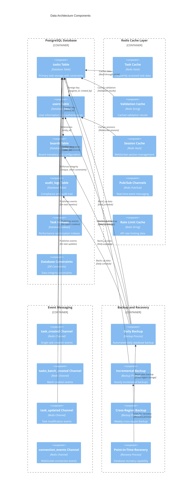
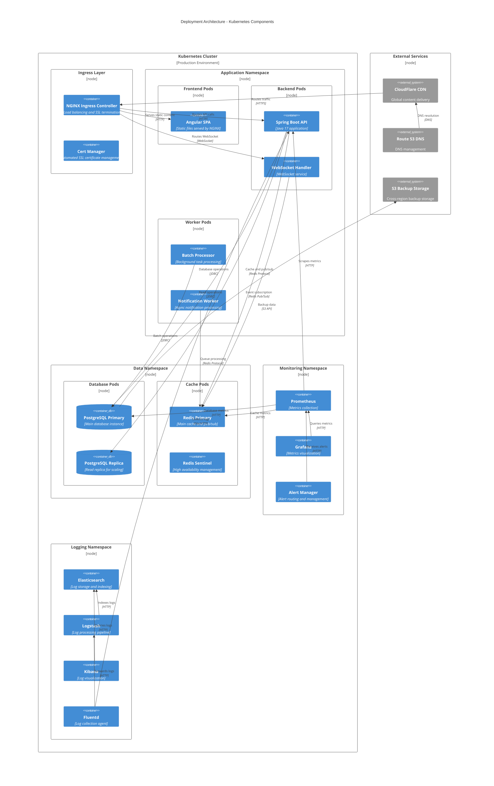

# Component Diagram - Task Creation Synchronization System

## Document Information
- **Version**: 1.0
- **Date**: 2024-12-19
- **System**: SCIB Task Management Platform
- **Story Reference**: DEMO-1841
- **Generated From**: HLD Document v1.0

---

## Overview
This component diagram illustrates the architectural components and their relationships in the SCIB Task Creation Synchronization System. The diagram shows the complete system architecture from frontend components to backend services, data storage, and external integrations.

---

## System Architecture Component Diagram

```mermaid
C4Component
    title Component Diagram - Task Creation Synchronization System
    
    Container_Boundary(frontend, "Frontend Layer - Angular SPA") {
        Component(taskForm, "TaskCreationFormComponent", "Angular Component", "Task creation form with real-time validation and optimistic UI updates")
        Component(taskList, "TaskListComponent", "Angular Component", "Displays tasks with real-time updates and animations")
        Component(wsClient, "WebSocketClientService", "Angular Service", "Manages WebSocket connections and real-time event handling")
        Component(apiClient, "ApiClientService", "Angular Service", "HTTP client for REST API communication")
        Component(taskAnimation, "TaskAnimationService", "Angular Service", "Handles task appearance animations and transitions")
        Component(validation, "ValidationService", "Angular Service", "Client-side validation and error handling")
        Component(stateManager, "TaskStateManager", "Angular Service", "Manages task state and optimistic updates")
    }
    
    Container_Boundary(gateway, "API Gateway Layer") {
        Component(loadBalancer, "Load Balancer", "NGINX/HAProxy", "Routes requests and provides SSL termination")
        Component(apiGateway, "API Gateway", "Spring Cloud Gateway", "Request routing, authentication, and rate limiting")
    }
    
    Container_Boundary(backend, "Backend Services Layer - Spring Boot") {
        Component(taskController, "TaskController", "Spring REST Controller", "Handles task creation REST API endpoints")
        Component(wsController, "WebSocketController", "Spring WebSocket", "Manages WebSocket connections and broadcasting")
        Component(taskValidationSvc, "TaskValidationService", "Spring Service", "Comprehensive task validation with business rules")
        Component(taskCreationSvc, "TaskCreationService", "Spring Service", "Orchestrates task creation workflow")
        Component(batchProcessingSvc, "BatchProcessingService", "Spring Service", "Handles bulk task creation operations")
        Component(broadcastSvc, "WebSocketBroadcastService", "Spring Service", "Manages real-time event broadcasting")
        Component(auditSvc, "AuditService", "Spring Service", "Logs all operations for compliance")
        Component(authSvc, "AuthenticationService", "Spring Security", "JWT token validation and user authentication")
    }
    
    Container_Boundary(data, "Data Layer") {
        ComponentDb(postgres, "PostgreSQL Database", "PostgreSQL 14", "Primary data storage for tasks, users, and boards")
        Component(redis, "Redis Cache/Pub-Sub", "Redis 7", "Caching and real-time event messaging")
        Component(taskRepo, "TaskRepository", "Spring Data JPA", "Data access layer for task operations")
        Component(userRepo, "UserRepository", "Spring Data JPA", "Data access layer for user operations")
        Component(boardRepo, "BoardRepository", "Spring Data JPA", "Data access layer for board operations")
    }
    
    Container_Boundary(external, "External Systems") {
        System_Ext(authProvider, "Authentication Provider", "External OAuth/SAML provider for user authentication")
        System_Ext(monitoring, "Monitoring System", "Prometheus/Grafana for metrics and alerting")
        System_Ext(logging, "Logging System", "ELK Stack for centralized logging")
        System_Ext(notification, "Notification Service", "Email/SMS service for user notifications")
    }
    
    %% Frontend Component Relationships
    Rel(taskForm, apiClient, "Makes API calls", "HTTP/REST")
    Rel(taskForm, wsClient, "Subscribes to events", "WebSocket")
    Rel(taskForm, validation, "Validates input", "Method calls")
    Rel(taskForm, stateManager, "Updates state", "Method calls")
    Rel(taskList, wsClient, "Receives events", "WebSocket")
    Rel(taskList, taskAnimation, "Triggers animations", "Method calls")
    Rel(wsClient, stateManager, "Updates task state", "Method calls")
    Rel(apiClient, validation, "Handles errors", "Method calls")
    
    %% Frontend to Gateway
    Rel(apiClient, loadBalancer, "API requests", "HTTPS")
    Rel(wsClient, loadBalancer, "WebSocket connection", "WSS")
    
    %% Gateway Layer
    Rel(loadBalancer, apiGateway, "Routes requests", "HTTP/WebSocket")
    
    %% Gateway to Backend
    Rel(apiGateway, taskController, "Routes API calls", "HTTP")
    Rel(apiGateway, wsController, "Routes WebSocket", "WebSocket")
    
    %% Backend Service Relationships
    Rel(taskController, authSvc, "Validates tokens", "Method calls")
    Rel(taskController, taskValidationSvc, "Validates tasks", "Method calls")
    Rel(taskController, taskCreationSvc, "Creates tasks", "Method calls")
    Rel(taskController, batchProcessingSvc, "Batch operations", "Method calls")
    Rel(taskController, auditSvc, "Logs operations", "Method calls")
    
    Rel(wsController, authSvc, "Validates connections", "Method calls")
    Rel(wsController, broadcastSvc, "Broadcasts events", "Method calls")
    
    Rel(taskCreationSvc, taskValidationSvc, "Pre-creation validation", "Method calls")
    Rel(taskCreationSvc, taskRepo, "Persists tasks", "JPA")
    Rel(taskCreationSvc, redis, "Publishes events", "Redis Protocol")
    Rel(taskCreationSvc, auditSvc, "Logs creation", "Method calls")
    
    Rel(batchProcessingSvc, taskValidationSvc, "Validates batch", "Method calls")
    Rel(batchProcessingSvc, taskRepo, "Batch operations", "JPA")
    Rel(batchProcessingSvc, redis, "Publishes batch events", "Redis Protocol")
    
    Rel(broadcastSvc, redis, "Subscribes to events", "Redis Pub/Sub")
    Rel(broadcastSvc, wsController, "Sends to clients", "Method calls")
    
    %% Data Layer Relationships
    Rel(taskRepo, postgres, "Database operations", "JDBC")
    Rel(userRepo, postgres, "User queries", "JDBC")
    Rel(boardRepo, postgres, "Board queries", "JDBC")
    
    Rel(taskValidationSvc, taskRepo, "Validation queries", "JPA")
    Rel(taskValidationSvc, userRepo, "User validation", "JPA")
    Rel(taskValidationSvc, boardRepo, "Board validation", "JPA")
    Rel(taskValidationSvc, redis, "Caches validation", "Redis Protocol")
    
    %% External System Relationships
    Rel(authSvc, authProvider, "Token validation", "HTTPS")
    Rel(auditSvc, logging, "Sends audit logs", "HTTP")
    Rel(taskCreationSvc, notification, "Task notifications", "HTTP")
    
    %% Monitoring Relationships
    Rel(monitoring, taskController, "Collects metrics", "HTTP")
    Rel(monitoring, postgres, "Database metrics", "JDBC")
    Rel(monitoring, redis, "Cache metrics", "Redis Protocol")
```

---

## Frontend Component Architecture

```mermaid
C4Component
    title Frontend Component Architecture - Angular SPA
    
    Container_Boundary(components, "Angular Components") {
        Component(taskCreationForm, "TaskCreationFormComponent", "Angular Component", "Main task creation form with validation")
        Component(taskCreationModal, "TaskCreationModalComponent", "Angular Component", "Modal variant of task creation form")
        Component(batchTaskForm, "BatchTaskFormComponent", "Angular Component", "Bulk task creation interface")
        Component(taskItem, "TaskItemComponent", "Angular Component", "Individual task display component")
        Component(taskBoard, "TaskBoardComponent", "Angular Component", "Main board view with columns")
        Component(errorDisplay, "ErrorDisplayComponent", "Angular Component", "Validation error display")
    }
    
    Container_Boundary(services, "Angular Services") {
        Component(taskService, "TaskService", "Angular Service", "Core task operations and state management")
        Component(wsService, "WebSocketService", "Angular Service", "WebSocket connection and event handling")
        Component(apiService, "ApiService", "Angular Service", "HTTP client wrapper with error handling")
        Component(validationService, "ValidationService", "Angular Service", "Client-side validation logic")
        Component(animationService, "AnimationService", "Angular Service", "Task appearance animations")
        Component(cacheService, "CacheService", "Angular Service", "Client-side caching for performance")
        Component(errorService, "ErrorHandlingService", "Angular Service", "Centralized error handling")
    }
    
    Container_Boundary(guards, "Angular Guards & Interceptors") {
        Component(authGuard, "AuthGuard", "Angular Guard", "Route protection and authentication")
        Component(boardGuard, "BoardAccessGuard", "Angular Guard", "Board-level access control")
        Component(authInterceptor, "AuthInterceptor", "HTTP Interceptor", "Adds JWT tokens to requests")
        Component(errorInterceptor, "ErrorInterceptor", "HTTP Interceptor", "Global error handling")
        Component(loadingInterceptor, "LoadingInterceptor", "HTTP Interceptor", "Loading state management")
    }
    
    Container_Boundary(models, "Data Models & Interfaces") {
        Component(taskModel, "Task Model", "TypeScript Interface", "Task data structure")
        Component(validationModel, "ValidationResult Model", "TypeScript Interface", "Validation response structure")
        Component(wsEventModel, "WebSocket Event Models", "TypeScript Interfaces", "WebSocket message structures")
        Component(apiResponseModel, "API Response Models", "TypeScript Interfaces", "API response structures")
    }
    
    %% Component Relationships
    Rel(taskCreationForm, taskService, "Creates tasks", "Method calls")
    Rel(taskCreationForm, validationService, "Validates input", "Method calls")
    Rel(taskCreationForm, errorDisplay, "Shows errors", "Component binding")
    
    Rel(taskBoard, taskItem, "Displays tasks", "Component composition")
    Rel(taskBoard, wsService, "Receives updates", "Observable subscription")
    Rel(taskBoard, animationService, "Triggers animations", "Method calls")
    
    Rel(taskService, apiService, "Makes API calls", "HTTP requests")
    Rel(taskService, cacheService, "Caches data", "Method calls")
    Rel(taskService, wsService, "Subscribes to events", "Observable subscription")
    
    Rel(wsService, taskService, "Notifies updates", "Event emission")
    Rel(apiService, errorService, "Handles errors", "Method calls")
    
    %% Guard and Interceptor relationships
    Rel(authGuard, taskService, "Checks authentication", "Method calls")
    Rel(boardGuard, taskService, "Validates board access", "Method calls")
    Rel(authInterceptor, apiService, "Intercepts requests", "HTTP pipeline")
    Rel(errorInterceptor, errorService, "Handles errors", "Method calls")
    
    %% Model usage
    Rel(taskService, taskModel, "Uses data structure", "Type definition")
    Rel(validationService, validationModel, "Uses validation structure", "Type definition")
    Rel(wsService, wsEventModel, "Uses event structure", "Type definition")
    Rel(apiService, apiResponseModel, "Uses response structure", "Type definition")
```

---

## Backend Service Architecture

```mermaid
C4Component
    title Backend Service Architecture - Spring Boot
    
    Container_Boundary(controllers, "Controller Layer") {
        Component(taskRestController, "TaskRestController", "@RestController", "REST endpoints for task operations")
        Component(batchController, "BatchTaskController", "@RestController", "Bulk task operation endpoints")
        Component(validationController, "ValidationController", "@RestController", "Task validation endpoints")
        Component(wsEventController, "WebSocketController", "@Controller", "WebSocket connection management")
        Component(healthController, "HealthController", "@RestController", "Health check endpoints")
    }
    
    Container_Boundary(services, "Service Layer") {
        Component(taskCreationService, "TaskCreationService", "@Service", "Core task creation business logic")
        Component(taskValidationService, "TaskValidationService", "@Service", "Comprehensive task validation")
        Component(batchProcessingService, "BatchProcessingService", "@Service", "Bulk operation processing")
        Component(broadcastService, "WebSocketBroadcastService", "@Service", "Real-time event broadcasting")
        Component(auditService, "AuditService", "@Service", "Compliance and audit logging")
        Component(cacheService, "CacheService", "@Service", "Redis caching operations")
        Component(notificationService, "NotificationService", "@Service", "User notification handling")
    }
    
    Container_Boundary(security, "Security Layer") {
        Component(jwtAuthService, "JwtAuthenticationService", "@Service", "JWT token validation and processing")
        Component(rbacService, "RoleBasedAccessService", "@Service", "Role-based access control")
        Component(securityConfig, "SecurityConfiguration", "@Configuration", "Spring Security configuration")
        Component(corsConfig, "CorsConfiguration", "@Configuration", "Cross-origin request configuration")
    }
    
    Container_Boundary(repositories, "Repository Layer") {
        Component(taskRepository, "TaskRepository", "JpaRepository<Task>", "Task data access operations")
        Component(userRepository, "UserRepository", "JpaRepository<User>", "User data access operations")
        Component(boardRepository, "BoardRepository", "JpaRepository<Board>", "Board data access operations")
        Component(auditRepository, "AuditLogRepository", "JpaRepository<AuditLog>", "Audit log data access")
    }
    
    Container_Boundary(config, "Configuration Layer") {
        Component(wsConfig, "WebSocketConfiguration", "@Configuration", "WebSocket setup and configuration")
        Component(redisConfig, "RedisConfiguration", "@Configuration", "Redis connection and pub/sub setup")
        Component(dbConfig, "DatabaseConfiguration", "@Configuration", "Database connection and JPA setup")
        Component(asyncConfig, "AsyncConfiguration", "@Configuration", "Async processing configuration")
    }
    
    Container_Boundary(entities, "Entity Layer") {
        Component(taskEntity, "Task Entity", "@Entity", "Task database mapping")
        Component(userEntity, "User Entity", "@Entity", "User database mapping")
        Component(boardEntity, "Board Entity", "@Entity", "Board database mapping")
        Component(auditEntity, "AuditLog Entity", "@Entity", "Audit log database mapping")
    }
    
    %% Controller to Service relationships
    Rel(taskRestController, taskCreationService, "Creates tasks", "Method calls")
    Rel(taskRestController, taskValidationService, "Validates tasks", "Method calls")
    Rel(taskRestController, auditService, "Logs operations", "Method calls")
    
    Rel(batchController, batchProcessingService, "Processes batches", "Method calls")
    Rel(validationController, taskValidationService, "Validates data", "Method calls")
    Rel(wsEventController, broadcastService, "Manages connections", "Method calls")
    
    %% Service layer relationships
    Rel(taskCreationService, taskValidationService, "Pre-creation validation", "Method calls")
    Rel(taskCreationService, taskRepository, "Persists tasks", "JPA operations")
    Rel(taskCreationService, broadcastService, "Triggers broadcasts", "Method calls")
    Rel(taskCreationService, auditService, "Logs creation", "Method calls")
    Rel(taskCreationService, notificationService, "Sends notifications", "Method calls")
    
    Rel(batchProcessingService, taskValidationService, "Validates batches", "Method calls")
    Rel(batchProcessingService, taskRepository, "Batch operations", "JPA batch")
    Rel(batchProcessingService, broadcastService, "Batch broadcasts", "Method calls")
    
    Rel(taskValidationService, taskRepository, "Validation queries", "JPA queries")
    Rel(taskValidationService, userRepository, "User validation", "JPA queries")
    Rel(taskValidationService, boardRepository, "Board validation", "JPA queries")
    Rel(taskValidationService, cacheService, "Caches results", "Method calls")
    
    Rel(broadcastService, cacheService, "Uses Redis pub/sub", "Redis operations")
    
    %% Security relationships
    Rel(taskRestController, jwtAuthService, "Validates tokens", "Method calls")
    Rel(taskRestController, rbacService, "Checks permissions", "Method calls")
    
    %% Repository to Entity relationships
    Rel(taskRepository, taskEntity, "Maps data", "JPA mapping")
    Rel(userRepository, userEntity, "Maps data", "JPA mapping")
    Rel(boardRepository, boardEntity, "Maps data", "JPA mapping")
    Rel(auditRepository, auditEntity, "Maps data", "JPA mapping")
```

---

## Data Architecture Components

---

## Integration and External Systems

```mermaid
C4Component
    title Integration and External Systems Architecture
    
    Container_Boundary(scib, "SCIB Task Management System") {
        Component(apiGateway, "API Gateway", "Spring Cloud Gateway", "External API access point")
        Component(webhookService, "Webhook Service", "Spring Service", "Outbound webhook management")
        Component(integrationService, "Integration Service", "Spring Service", "External system integration")
        Component(syncService, "Synchronization Service", "Spring Service", "Data synchronization with external systems")
    }
    
    Container_Boundary(auth, "Authentication Systems") {
        System_Ext(ssoProvider, "SSO Provider", "SAML/OAuth provider for enterprise authentication")
        System_Ext(ldapServer, "LDAP Server", "Corporate directory for user information")
        Component(authAdapter, "Authentication Adapter", "Spring Service", "Adapts external auth to internal format")
    }
    
    Container_Boundary(monitoring, "Monitoring and Observability") {
        System_Ext(prometheus, "Prometheus", "Metrics collection and storage")
        System_Ext(grafana, "Grafana", "Metrics visualization and dashboards")
        System_Ext(elkStack, "ELK Stack", "Centralized logging and analysis")
        System_Ext(jaeger, "Jaeger", "Distributed tracing system")
        Component(metricsCollector, "Metrics Collector", "Micrometer", "Application metrics collection")
    }
    
    Container_Boundary(notification, "Notification Systems") {
        System_Ext(emailService, "Email Service", "SMTP/SendGrid for email notifications")
        System_Ext(smsService, "SMS Service", "Twilio/AWS SNS for SMS notifications")
        System_Ext(slackIntegration, "Slack Integration", "Slack API for team notifications")
        Component(notificationRouter, "Notification Router", "Spring Service", "Routes notifications to appropriate channels")
    }
    
    Container_Boundary(analytics, "Analytics and Reporting") {
        System_Ext(analyticsEngine, "Analytics Engine", "Business intelligence and reporting system")
        System_Ext(dataWarehouse, "Data Warehouse", "Historical data storage for reporting")
        Component(dataExporter, "Data Exporter", "Spring Service", "Exports data for analytics")
        Component(reportingService, "Reporting Service", "Spring Service", "Generates business reports")
    }
    
    Container_Boundary(security, "Security Systems") {
        System_Ext(vaultService, "HashiCorp Vault", "Secrets management and encryption")
        System_Ext(securityScanner, "Security Scanner", "Vulnerability scanning and assessment")
        System_Ext(siemSystem, "SIEM System", "Security information and event management")
        Component(securityAdapter, "Security Adapter", "Spring Service", "Security system integration")
    }
    
    %% Authentication integration
    Rel(apiGateway, authAdapter, "Validates tokens", "HTTP")
    Rel(authAdapter, ssoProvider, "Token validation", "HTTPS/SAML")
    Rel(authAdapter, ldapServer, "User lookup", "LDAP")
    
    %% Monitoring integration
    Rel(metricsCollector, prometheus, "Sends metrics", "HTTP")
    Rel(apiGateway, metricsCollector, "Collects metrics", "Method calls")
    Rel(grafana, prometheus, "Queries metrics", "PromQL")
    Rel(integrationService, elkStack, "Sends logs", "HTTP")
    Rel(apiGateway, jaeger, "Traces requests", "HTTP")
    
    %% Notification integration
    Rel(webhookService, notificationRouter, "Triggers notifications", "Method calls")
    Rel(notificationRouter, emailService, "Sends emails", "SMTP/HTTP")
    Rel(notificationRouter, smsService, "Sends SMS", "HTTP")
    Rel(notificationRouter, slackIntegration, "Posts messages", "HTTP")
    
    %% Analytics integration
    Rel(dataExporter, analyticsEngine, "Exports data", "HTTP/JDBC")
    Rel(dataExporter, dataWarehouse, "Stores data", "JDBC")
    Rel(reportingService, dataWarehouse, "Queries data", "SQL")
    
    %% Security integration
    Rel(securityAdapter, vaultService, "Retrieves secrets", "HTTPS")
    Rel(securityAdapter, securityScanner, "Security scans", "HTTP")
    Rel(securityAdapter, siemSystem, "Security events", "Syslog/HTTP")
    
    %% Cross-system integration
    Rel(integrationService, webhookService, "Manages webhooks", "Method calls")
    Rel(syncService, dataExporter, "Syncs data", "Method calls")
```

---

## Deployment Architecture Components

---

## Component Diagram Summary

### Architecture Layers
1. **Frontend Layer**: Angular SPA with reactive components and services
2. **API Gateway Layer**: Load balancing, routing, and security
3. **Backend Services Layer**: Spring Boot microservices architecture
4. **Data Layer**: PostgreSQL database with Redis caching and pub/sub
5. **External Systems**: Authentication, monitoring, notifications, and analytics
6. **Deployment Layer**: Kubernetes-based containerized deployment

### Key Components by Layer

#### Frontend Components
- **TaskCreationFormComponent**: Main task creation interface with validation
- **WebSocketService**: Real-time event handling and connection management
- **TaskAnimationService**: Smooth task appearance animations
- **ValidationService**: Client-side validation and error handling

#### Backend Components
- **TaskCreationService**: Core task creation business logic
- **TaskValidationService**: Comprehensive server-side validation
- **WebSocketBroadcastService**: Real-time event broadcasting
- **BatchProcessingService**: Bulk task operation handling

#### Data Components
- **PostgreSQL Database**: Primary data storage with constraints and indexes
- **Redis Cache/Pub-Sub**: Performance caching and real-time messaging
- **Repository Layer**: JPA-based data access abstraction

#### Integration Components
- **Authentication Adapter**: External SSO and LDAP integration
- **Notification Router**: Multi-channel notification delivery
- **Metrics Collector**: Application performance monitoring
- **Security Adapter**: Enterprise security system integration

### Architecture Decision Records (ADRs) Implementation

| ADR | Components Affected | Implementation Details |
|-----|-------------------|----------------------|
| DEMO-1886 | TaskAnimationService, TaskListComponent | UI/UX animations and transitions |
| DEMO-1887 | TaskCreationFormComponent, TaskService | Optimistic UI with validation |
| DEMO-1888 | TaskValidationService, ValidationController | Comprehensive validation service |
| DEMO-1889 | TaskCreationService, WebSocketBroadcastService | Real-time synchronization architecture |
| DEMO-1890 | Database constraints, TaskRepository | Data integrity and performance |
| DEMO-1891 | BatchProcessingService, BatchController | Bulk operation capabilities |
| DEMO-1892 | Testing components (not shown in production) | E2E testing infrastructure |
| DEMO-1893 | API documentation components | Complete API documentation |

### Performance and Scalability Features

- **Horizontal Scaling**: Stateless services support multiple instances
- **Caching Strategy**: Multi-level caching with Redis
- **Database Optimization**: Indexes and constraints for performance
- **Async Processing**: Background workers for non-critical operations
- **Load Balancing**: NGINX ingress with health checks
- **Auto-scaling**: Kubernetes HPA based on resource utilization

### Security and Compliance Components

- **JWT Authentication**: Token-based security throughout the system
- **RBAC Authorization**: Role-based access control at multiple layers
- **Audit Logging**: Comprehensive audit trail for compliance
- **Input Validation**: Multi-layer validation (client and server)
- **Secure Communication**: TLS/SSL encryption for all communications
- **Secrets Management**: HashiCorp Vault integration

### Monitoring and Observability

- **Metrics Collection**: Prometheus-based application and infrastructure metrics
- **Distributed Tracing**: Jaeger for request tracing across services
- **Centralized Logging**: ELK stack for log aggregation and analysis
- **Real-time Dashboards**: Grafana dashboards for operations monitoring
- **Alerting**: Automated alerts for performance and security issues

---

**Document Status**: Final v1.0  
**Generated From**: HLD Document v1.0  
**Architecture Standards**: C4 Model, TOGAF Compliance  
**Last Updated**: 2024-12-19