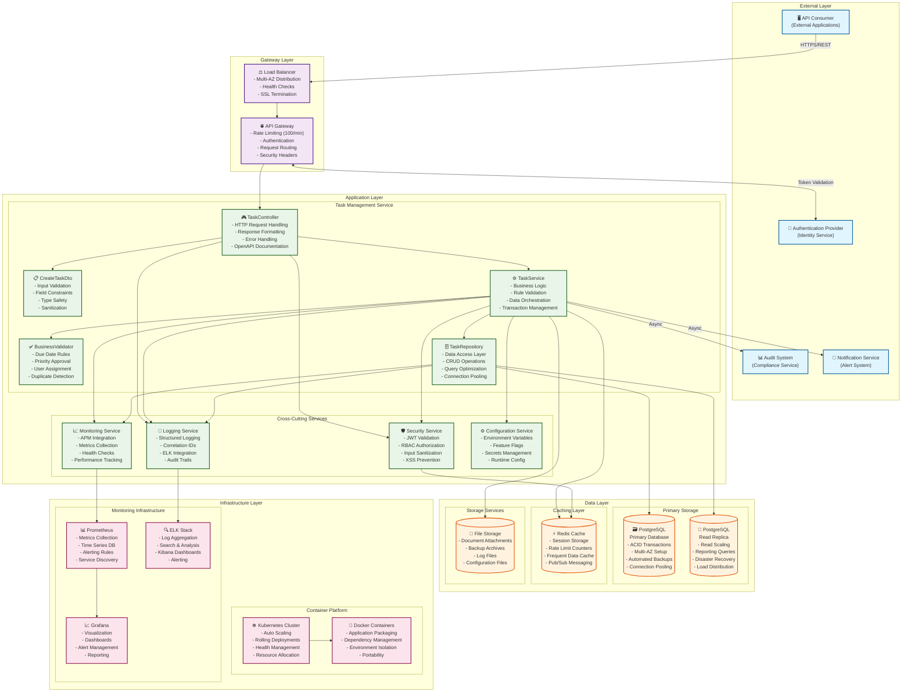

# Component Diagram - Task Creation API
## Task Management API - Task Creation Endpoint

### Document Information
- **Diagram Type**: Component Diagram
- **API Endpoint**: POST /api/tasks
- **Date**: 2024
- **JIRA Reference**: DEMO-2350
- **Version**: 1.0

---

## Overview

This component diagram illustrates the architectural structure and relationships between components in the Task Management API system. The diagram follows the C4 model notation and shows how components interact to handle task creation requests with proper validation, security, and compliance measures.

## System Architecture

---

## Component Descriptions

### External Layer

#### API Consumer
- **Purpose**: External applications and services consuming the Task API
- **Responsibilities**: 
  - Send HTTP requests with proper authentication
  - Handle API responses and error conditions
  - Implement retry logic for transient failures
- **Technology**: Various (Mobile apps, Web applications, Integration services)
- **ADR Mapping**: DEMO-2350 - External API consumption requirement

#### Authentication Provider
- **Purpose**: Centralized identity and access management
- **Responsibilities**:
  - JWT token validation and refresh
  - User authentication and session management
  - Multi-factor authentication support
- **Technology**: OAuth 2.0, JWT, SAML
- **Integration**: Synchronous API calls for token validation

#### Audit System
- **Purpose**: Compliance and audit trail management
- **Responsibilities**:
  - Receive and store audit events
  - Generate compliance reports
  - Maintain data lineage and change history
- **Technology**: Enterprise audit platform
- **Integration**: Asynchronous event publishing

#### Notification Service
- **Purpose**: User and system notifications
- **Responsibilities**:
  - Send task assignment notifications
  - Alert on system events and errors
  - Manage notification preferences
- **Technology**: Email, SMS, Push notifications
- **Integration**: Asynchronous messaging

### Gateway Layer

#### Load Balancer
- **Purpose**: Traffic distribution and SSL termination
- **Responsibilities**:
  - Distribute incoming requests across multiple instances
  - Perform health checks on backend services
  - Handle SSL/TLS termination
  - Provide high availability and fault tolerance
- **Technology**: AWS Application Load Balancer or equivalent
- **Features**: Multi-AZ deployment, auto-scaling integration

#### API Gateway
- **Purpose**: Centralized API management and security
- **Responsibilities**:
  - Rate limiting (100 requests/minute per user)
  - Authentication and authorization
  - Request routing and transformation
  - Security header injection
  - CORS handling
- **Technology**: Kong, AWS API Gateway, or custom implementation
- **ADR Mapping**: DEMO-2350 - API gateway requirement

### Application Layer

#### TaskController
- **Purpose**: HTTP request handling and response formatting
- **Responsibilities**:
  - Accept and validate HTTP requests
  - Coordinate with service layer
  - Format responses with proper status codes
  - Handle exceptions and error responses
  - Generate OpenAPI documentation
- **Technology**: Spring Boot, Node.js, or equivalent
- **Location**: `src/controllers/task.controller.ts`
- **ADR Mapping**: DEMO-2350 - REST endpoint implementation

#### CreateTaskDto
- **Purpose**: Input validation and data transfer
- **Responsibilities**:
  - Field-level validation (length, format, type)
  - Data sanitization and normalization
  - Type safety enforcement
  - Validation error collection
- **Validation Rules**:
  - Title: Required, 1-200 characters, XSS protection
  - Priority: Enum validation (LOW, MEDIUM, HIGH, CRITICAL)
  - Due Date: ISO 8601 format, future date validation
  - Tags: Maximum 10 items, 50 characters each
- **Technology**: Class-validator decorators, Joi, or equivalent
- **ADR Mapping**: DEMO-2350 - Input validation requirement

#### TaskService
- **Purpose**: Business logic orchestration and rule enforcement
- **Responsibilities**:
  - Apply business rules and constraints
  - Coordinate data operations
  - Manage transactions and consistency
  - Handle business exceptions
- **Business Rules**:
  - Due date must be at least 1 hour in the future
  - HIGH/CRITICAL priority tasks require manager approval
  - Assigned user must be active with appropriate permissions
  - Title similarity detection (>90% match warning)
- **Technology**: Service layer pattern implementation
- **ADR Mapping**: DEMO-2350 - Business logic requirement

#### BusinessValidator
- **Purpose**: Complex business rule validation
- **Responsibilities**:
  - Cross-field validation logic
  - External system validation (user existence)
  - Business constraint enforcement
  - Duplicate detection algorithms
- **Validation Types**:
  - Temporal validations (due dates, business hours)
  - Authorization validations (user permissions)
  - Data integrity validations (referential integrity)
- **Technology**: Custom validation framework

#### TaskRepository
- **Purpose**: Data access layer and persistence management
- **Responsibilities**:
  - CRUD operations for task entities
  - Query optimization and performance
  - Connection pool management
  - Database transaction coordination
- **Features**:
  - Repository pattern implementation
  - Query builder integration
  - Connection pooling (100 connections per instance)
  - Read/write splitting for performance
- **Technology**: JPA, TypeORM, or equivalent ORM
- **ADR Mapping**: DEMO-2350 - Data persistence requirement

### Cross-Cutting Services

#### Security Service
- **Purpose**: Application security and access control
- **Responsibilities**:
  - JWT token validation and parsing
  - Role-based access control (RBAC)
  - Input sanitization and XSS prevention
  - Security policy enforcement
- **Security Features**:
  - Token expiry validation (24-hour maximum)
  - Permission-based resource access
  - SQL injection prevention
  - Rate limiting enforcement
- **Technology**: Spring Security, Passport.js, or equivalent

#### Logging Service
- **Purpose**: Centralized logging and audit trail
- **Responsibilities**:
  - Structured JSON logging
  - Correlation ID management
  - Log level management (ERROR, WARN, INFO, DEBUG)
  - Sensitive data masking
- **Features**:
  - ELK stack integration
  - Real-time log streaming
  - Log retention policies (90 days operational, 7 years audit)
  - Performance impact minimization
- **Technology**: Winston, Logback, or equivalent

#### Monitoring Service
- **Purpose**: Application performance monitoring and metrics
- **Responsibilities**:
  - Metrics collection and aggregation
  - Health check implementation
  - Performance tracking
  - Alert threshold management
- **Metrics Tracked**:
  - Response times (95th/99th percentile)
  - Error rates by status code
  - Throughput (requests per second)
  - Resource utilization
- **Technology**: Micrometer, Prometheus client libraries

#### Configuration Service
- **Purpose**: Runtime configuration and feature management
- **Responsibilities**:
  - Environment-specific configuration
  - Feature flag management
  - Secrets management integration
  - Configuration hot-reloading
- **Configuration Types**:
  - Database connection strings
  - External service endpoints
  - Business rule parameters
  - Feature toggles
- **Technology**: Spring Cloud Config, Consul, or equivalent

### Data Layer

#### PostgreSQL Primary Database
- **Purpose**: Primary data storage with ACID compliance
- **Responsibilities**:
  - Task data persistence
  - Transactional integrity
  - Referential integrity enforcement
  - Backup and recovery
- **Features**:
  - Multi-AZ deployment for high availability
  - Automated daily backups with 30-day retention
  - Connection pooling and query optimization
  - Audit trail table maintenance
- **Schema**: Tasks, Users, Audit_Logs tables
- **Performance**: <50ms query response time target

#### PostgreSQL Read Replica
- **Purpose**: Read scaling and reporting queries
- **Responsibilities**:
  - Handle read-only queries
  - Support reporting and analytics
  - Provide disaster recovery capability
  - Reduce load on primary database
- **Configuration**: Minimum 2 replicas, maximum 5
- **Replication**: Asynchronous streaming replication

#### Redis Cache
- **Purpose**: High-performance caching and session storage
- **Responsibilities**:
  - Cache frequently accessed data
  - Store rate limiting counters
  - Manage user sessions
  - Pub/sub messaging for real-time features
- **Cache Strategies**:
  - Write-through for critical data
  - Write-behind for performance optimization
  - TTL-based expiration policies
- **Technology**: Redis Cluster for high availability

#### File Storage
- **Purpose**: Document and file storage
- **Responsibilities**:
  - Store task attachments
  - Backup file storage
  - Configuration file management
  - Log file archival
- **Technology**: AWS S3, Azure Blob Storage, or equivalent
- **Features**: Versioning, encryption at rest, lifecycle policies

### Infrastructure Layer

#### Kubernetes Cluster
- **Purpose**: Container orchestration and management
- **Responsibilities**:
  - Auto-scaling based on metrics
  - Rolling deployments with zero downtime
  - Health management and self-healing
  - Resource allocation and limits
- **Features**:
  - Horizontal Pod Autoscaler (HPA)
  - Vertical Pod Autoscaler (VPA)
  - Network policies for security
  - Ingress controllers for traffic management
- **Configuration**: Multi-node cluster with master redundancy

#### Docker Containers
- **Purpose**: Application packaging and deployment
- **Responsibilities**:
  - Application and dependency packaging
  - Environment consistency
  - Resource isolation
  - Portability across environments
- **Features**:
  - Multi-stage builds for optimization
  - Security scanning integration
  - Base image management
  - Registry integration

#### Prometheus
- **Purpose**: Metrics collection and time-series storage
- **Responsibilities**:
  - Scrape metrics from applications
  - Store time-series data
  - Evaluate alerting rules
  - Provide query interface (PromQL)
- **Metrics Collected**:
  - Application metrics (response times, error rates)
  - Infrastructure metrics (CPU, memory, disk)
  - Business metrics (task creation rates)

#### Grafana
- **Purpose**: Visualization and dashboarding
- **Responsibilities**:
  - Create operational dashboards
  - Visualize metrics and trends
  - Manage alert notifications
  - Generate reports
- **Dashboards**:
  - Application performance dashboard
  - Infrastructure monitoring dashboard
  - Business metrics dashboard
  - SLA compliance dashboard

#### ELK Stack
- **Purpose**: Log aggregation and analysis
- **Responsibilities**:
  - Collect logs from all components
  - Parse and index log data
  - Provide search and analysis capabilities
  - Generate log-based alerts
- **Components**:
  - Elasticsearch: Search and analytics engine
  - Logstash: Log processing pipeline
  - Kibana: Visualization and exploration

---

## Component Interactions

### Request Flow
1. **Client Request**: API consumer sends HTTPS request to Load Balancer
2. **Load Distribution**: Load Balancer routes to available API Gateway instance
3. **Gateway Processing**: API Gateway performs authentication, rate limiting, and routing
4. **Controller Handling**: TaskController receives request and initiates processing
5. **Validation**: CreateTaskDto validates input fields and formats
6. **Business Logic**: TaskService applies business rules via BusinessValidator
7. **Data Persistence**: TaskRepository saves data to PostgreSQL with transaction management
8. **Response**: Success response with task data returned through the chain

### Cross-Cutting Concerns
- **Security**: Applied at gateway, controller, and service levels
- **Logging**: Integrated throughout all application components
- **Monitoring**: Metrics collected from all layers
- **Configuration**: Runtime configuration accessed by all services

### Data Flow
- **Write Operations**: Primary database with audit logging
- **Read Operations**: Read replicas for performance optimization
- **Caching**: Redis for frequently accessed data and rate limiting
- **File Storage**: Separate storage for attachments and documents

### Error Handling
- **Validation Errors**: Handled at DTO level with detailed field information
- **Business Errors**: Managed by service layer with appropriate HTTP status codes
- **System Errors**: Caught by global exception handlers with correlation IDs
- **External Errors**: Circuit breaker pattern for external service failures

---

## Non-Functional Characteristics

### Performance
- **Response Time**: 95th percentile ≤ 200ms
- **Throughput**: 1000+ requests per second
- **Concurrent Users**: 10,000 simultaneous users
- **Database Performance**: <50ms query response time

### Scalability
- **Horizontal Scaling**: Auto-scaling based on CPU (>70%) and memory (>80%)
- **Database Scaling**: Read replicas and connection pooling
- **Cache Scaling**: Redis cluster with sharding
- **Storage Scaling**: Auto-scaling storage at 80% threshold

### Availability
- **Uptime Target**: 99.99% (52.56 minutes downtime/year)
- **Failover Time**: ≤30 seconds automatic failover
- **Multi-AZ Deployment**: All critical components
- **Health Checks**: 5-second intervals with 30-second removal

### Security
- **Authentication**: JWT with 24-hour expiry
- **Authorization**: RBAC with resource-level permissions
- **Encryption**: TLS 1.3 in transit, AES-256 at rest
- **Input Validation**: Comprehensive validation at all layers

### Compliance
- **GDPR**: Data protection and privacy controls
- **SOX**: Financial data handling compliance
- **ISO 27001**: Information security management
- **Audit Trail**: Complete audit logging with 7-year retention

---

## Deployment Architecture

### Environment Strategy
- **Development**: Single instance deployment for development and testing
- **Staging**: Production-like environment for integration testing
- **Production**: Multi-AZ deployment with redundancy and auto-scaling

### Container Strategy
- **Base Images**: Security-hardened base images with regular updates
- **Multi-stage Builds**: Optimized container sizes with security scanning
- **Registry Management**: Private container registry with vulnerability scanning

### Network Architecture
- **VPC**: Private subnets for application and database tiers
- **Security Groups**: Least-privilege network access controls
- **Load Balancing**: Application Load Balancer with health checks

---

## Monitoring and Observability

### Key Metrics
- **Golden Signals**: Latency, traffic, errors, saturation
- **Business Metrics**: Task creation rate, user activity, feature usage
- **Infrastructure Metrics**: Resource utilization, network performance
- **Security Metrics**: Authentication failures, authorization violations

### Alerting Strategy
- **Critical Alerts**: Immediate notification (SMS/Call)
- **High Priority**: 5-minute notification (Email/Slack)
- **Medium Priority**: 15-minute notification (Email)
- **Escalation**: 30 minutes without acknowledgment

### Dashboards
- **Operational Dashboard**: Real-time system health and performance
- **Business Dashboard**: Task creation metrics and user activity
- **Security Dashboard**: Authentication and authorization metrics
- **Compliance Dashboard**: Audit and compliance status

---

## Related Documentation

- [Sequence Diagram](./sequence_diagram.md) - Detailed interaction flow for task creation
- [API Contract Outline](../Requirement%20Documents/APIContractOutline.txt) - Complete API specification
- [High-Level Design Document](../Requirement%20Documents/HLDDocument.txt) - Comprehensive system architecture
- [Non-Functional Requirements](../Requirement%20Documents/NFR.txt) - Performance and compliance requirements
- [OpenAPI Specification](../OpenAPI%20Specifications/openapi.yaml) - Machine-readable API definition

---

**Document Status**: Final  
**Last Updated**: 2024  
**Reviewed By**: Enterprise Solution Architect  
**Approved By**: Technical Architecture Board

*This document is confidential and proprietary. Distribution is restricted to authorized personnel only.*