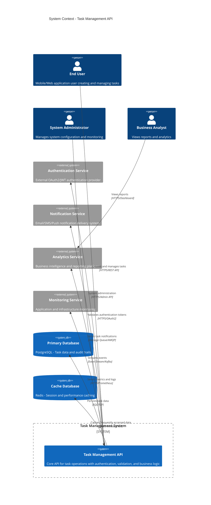
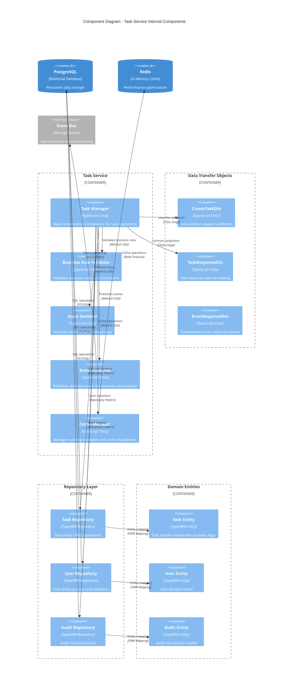
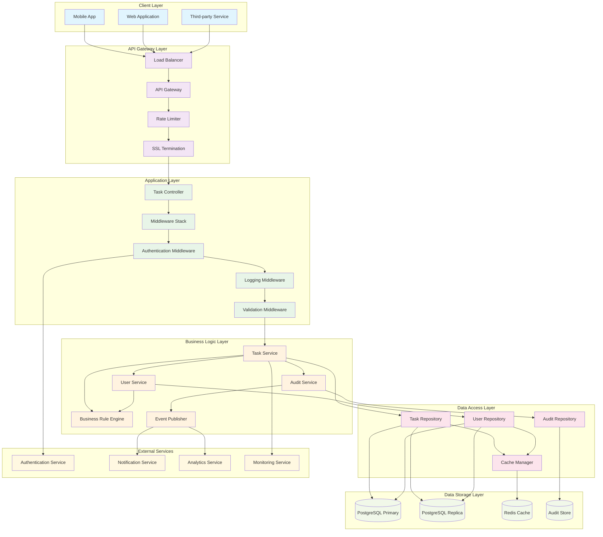
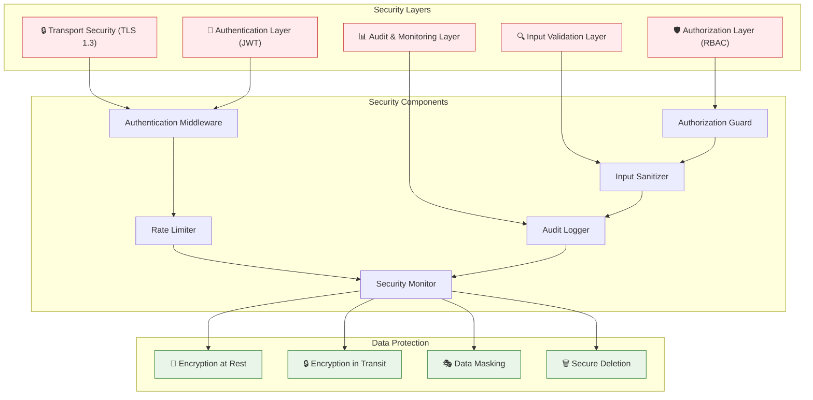

# Component Diagram - Task Management API
## System Architecture and Component Relationships

### Version: 1.0
### Generated from: HLD-DEMO-2350 and API Contract
### Date: 2024

---

## Overview
This component diagram illustrates the architectural structure of the Task Management API system, showing the relationships between components, their dependencies, and the flow of data and control throughout the system.

---

## System Context Component Diagram



---

## Container Component Diagram

```mermaid
C4Container
    title Container Diagram - Task Management API Internal Architecture
    
    Person(user, "API Consumer", "Mobile/Web/Service client")
    
    System_Boundary(apiSystem, "Task Management API System") {
        Container(gateway, "API Gateway", "NGINX/Kong", "Request routing, rate limiting, SSL termination, CORS handling")
        
        Container_Boundary(application, "Application Layer") {
            Container(controller, "Task Controller", "NestJS/TypeScript", "HTTP request handling, response formatting, OpenAPI documentation")
            Container(middleware, "Middleware Layer", "NestJS/Express", "Authentication, logging, error handling, request validation")
            Container(dto, "Data Transfer Objects", "TypeScript/class-validator", "Request/response validation, data transformation")
        }
        
        Container_Boundary(business, "Business Logic Layer") {
            Container(taskService, "Task Service", "TypeScript/NestJS", "Core business logic, validation rules, orchestration")
            Container(userService, "User Service", "TypeScript/NestJS", "User validation and management")
            Container(auditService, "Audit Service", "TypeScript/NestJS", "Audit trail and compliance logging")
        }
        
        Container_Boundary(dataAccess, "Data Access Layer") {
            Container(taskRepo, "Task Repository", "TypeORM/TypeScript", "Task CRUD operations and queries")
            Container(userRepo, "User Repository", "TypeORM/TypeScript", "User data access and validation")
            Container(auditRepo, "Audit Repository", "TypeORM/TypeScript", "Audit log persistence")
        }
        
        Container(healthController, "Health Controller", "NestJS/TypeScript", "System health checks and monitoring endpoints")
        Container(errorHandler, "Global Error Handler", "NestJS/TypeScript", "Centralized error processing and formatting")
    }
    
    ContainerDb(database, "PostgreSQL Database", "Relational Database", "Primary data store with ACID compliance")
    ContainerDb(cache, "Redis Cache", "In-Memory Database", "Session storage and performance caching")
    
    Container_Ext(authProvider, "Authentication Provider", "OAuth2/JWT Service", "Token validation and user context")
    Container_Ext(messageQueue, "Message Queue", "RabbitMQ/Apache Kafka", "Asynchronous event processing")
    
    Rel(user, gateway, "API Requests", "HTTPS/REST")
    Rel(gateway, controller, "Routed Requests", "HTTP")
    Rel(controller, middleware, "Request Processing", "Function Calls")
    Rel(middleware, dto, "Validation", "Class Methods")
    Rel(controller, taskService, "Business Operations", "Service Calls")
    Rel(controller, errorHandler, "Error Handling", "Exception Handling")
    
    Rel(taskService, userService, "User Validation", "Service Calls")
    Rel(taskService, auditService, "Audit Logging", "Service Calls")
    
    Rel(taskService, taskRepo, "Data Operations", "Repository Pattern")
    Rel(userService, userRepo, "User Queries", "Repository Pattern")
    Rel(auditService, auditRepo, "Audit Persistence", "Repository Pattern")
    
    Rel(taskRepo, database, "SQL Queries", "TCP/SQL")
    Rel(userRepo, database, "SQL Queries", "TCP/SQL")
    Rel(auditRepo, database, "SQL Queries", "TCP/SQL")
    
    Rel(taskService, cache, "Caching Operations", "Redis Protocol")
    Rel(userService, cache, "User Session Cache", "Redis Protocol")
    
    Rel(middleware, authProvider, "Token Validation", "HTTPS/OAuth2")
    Rel(taskService, messageQueue, "Event Publishing", "AMQP/Kafka Protocol")
    
    Rel(gateway, healthController, "Health Checks", "HTTP")
    
    UpdateLayoutConfig($c4ShapeInRow="2", $c4BoundaryInRow="1")
```



---

## Detailed Component Architecture



---

## Deployment Component Diagram

```mermaid
C4Deployment
    title Deployment Diagram - Task Management API Infrastructure
    
    Deployment_Node(cdn, "Content Delivery Network", "CloudFlare/AWS CloudFront") {
        Container(staticAssets, "Static Assets", "Documentation, OpenAPI Specs", "API documentation and schemas")
    }
    
    Deployment_Node(loadBalancer, "Load Balancer", "AWS Application Load Balancer") {
        Container(albGateway, "API Gateway", "NGINX/Kong", "Request routing and SSL termination")
    }
    
    Deployment_Node(kubernetesCluster, "Kubernetes Cluster", "AWS EKS/Azure AKS") {
        Deployment_Node(namespace, "Task API Namespace", "Kubernetes Namespace") {
            Deployment_Node(pod1, "API Pod 1", "Kubernetes Pod") {
                Container(app1, "Task API Instance", "Node.js/NestJS", "Primary application instance")
                Container(sidecar1, "Logging Sidecar", "Fluent Bit", "Log collection and forwarding")
            }
            
            Deployment_Node(pod2, "API Pod 2", "Kubernetes Pod") {
                Container(app2, "Task API Instance", "Node.js/NestJS", "Secondary application instance")
                Container(sidecar2, "Logging Sidecar", "Fluent Bit", "Log collection and forwarding")
            }
            
            Deployment_Node(configMap, "Configuration", "Kubernetes ConfigMap") {
                Container(appConfig, "Application Config", "YAML/JSON", "Environment-specific configuration")
            }
            
            Deployment_Node(secrets, "Secrets Management", "Kubernetes Secrets") {
                Container(dbSecrets, "Database Credentials", "Encrypted Secrets", "Database connection strings")
                Container(jwtSecrets, "JWT Keys", "Encrypted Secrets", "Authentication signing keys")
            }
        }
    }
    
    Deployment_Node(dataLayer, "Data Layer", "AWS RDS/Azure Database") {
        Deployment_Node(primaryDb, "Primary Database", "PostgreSQL Cluster") {
            ContainerDb(masterDb, "Master Database", "PostgreSQL 14", "Primary read-write database")
            ContainerDb(replicaDb, "Read Replica", "PostgreSQL 14", "Read-only replica for queries")
        }
    }
    
    Deployment_Node(cacheLayer, "Cache Layer", "AWS ElastiCache/Azure Redis") {
        Deployment_Node(redisCluster, "Redis Cluster", "Redis Cluster Mode") {
            Container(redisMaster, "Redis Master", "Redis 7.0", "Primary cache instance")
            Container(redisReplica, "Redis Replica", "Redis 7.0", "Cache replication for HA")
        }
    }
    
    Deployment_Node(monitoring, "Monitoring Stack", "Prometheus/Grafana") {
        Container(prometheus, "Prometheus", "Metrics Collection", "Application and infrastructure metrics")
        Container(grafana, "Grafana", "Visualization", "Dashboards and alerting")
        Container(alertManager, "Alert Manager", "Alert Routing", "Alert processing and notification")
    }
    
    Deployment_Node(logging, "Logging Stack", "ELK Stack") {
        Container(elasticsearch, "Elasticsearch", "Search Engine", "Log storage and indexing")
        Container(logstash, "Logstash", "Log Processing", "Log parsing and transformation")
        Container(kibana, "Kibana", "Log Visualization", "Log analysis and dashboards")
    }
    
    Rel(cdn, loadBalancer, "Routes traffic", "HTTPS")
    Rel(loadBalancer, kubernetesCluster, "Distributes load", "HTTP/HTTPS")
    
    Rel(app1, dataLayer, "Database operations", "TCP/SQL")
    Rel(app2, dataLayer, "Database operations", "TCP/SQL")
    
    Rel(app1, cacheLayer, "Cache operations", "Redis Protocol")
    Rel(app2, cacheLayer, "Cache operations", "Redis Protocol")
    
    Rel(app1, appConfig, "Reads configuration", "File System")
    Rel(app2, appConfig, "Reads configuration", "File System")
    
    Rel(app1, dbSecrets, "Database credentials", "Kubernetes API")
    Rel(app2, jwtSecrets, "JWT keys", "Kubernetes API")
    
    Rel(sidecar1, logging, "Log forwarding", "HTTP/JSON")
    Rel(sidecar2, logging, "Log forwarding", "HTTP/JSON")
    
    Rel(app1, monitoring, "Metrics export", "HTTP/Prometheus")
    Rel(app2, monitoring, "Metrics export", "HTTP/Prometheus")
    
    UpdateLayoutConfig($c4ShapeInRow="2", $c4BoundaryInRow="1")
```

---

## Data Flow Component Diagram



---

## Component Interaction Matrix

| Component | Dependencies | Dependents | Interface Type | Communication Pattern |
|-----------|--------------|------------|----------------|----------------------|
| **Task Controller** | Middleware, Task Service, Error Handler | API Gateway | HTTP/REST | Synchronous Request-Response |
| **Task Service** | User Service, Audit Service, Task Repository | Task Controller | Service Interface | Synchronous Method Calls |
| **CreateTaskDto** | class-validator | Task Controller, Task Service | Data Contract | Validation Decorators |
| **Task Repository** | PostgreSQL, Redis Cache | Task Service | Repository Pattern | Synchronous Database Calls |
| **Authentication Middleware** | External Auth Service | Task Controller | HTTP/OAuth2 | Synchronous Token Validation |
| **Audit Service** | Audit Repository | Task Service | Service Interface | Asynchronous Logging |
| **Event Publisher** | Message Queue | Task Service | Event Interface | Asynchronous Event Publishing |
| **Cache Manager** | Redis Cluster | Task Service, User Service | Cache Interface | Synchronous Cache Operations |
| **Error Handler** | Logging Service | All Controllers | Exception Interface | Synchronous Error Processing |
| **Health Controller** | All Services, Database, Cache | Monitoring System | HTTP/REST | Synchronous Health Checks |

---

## Component Specifications

### Core Components

#### 1. Task Controller
- **Technology**: NestJS/TypeScript
- **Responsibilities**: HTTP request handling, response formatting, OpenAPI documentation
- **Key Methods**: `createTask()`, `validateRequest()`, `formatResponse()`
- **Dependencies**: Task Service, Middleware Layer, DTOs
- **Performance**: < 10ms processing time

#### 2. Task Service
- **Technology**: TypeScript/NestJS
- **Responsibilities**: Business logic orchestration, rule validation, event publishing
- **Key Methods**: `createTask()`, `validateBusinessRules()`, `publishEvents()`
- **Dependencies**: Repositories, User Service, Audit Service
- **Performance**: < 100ms business logic processing

#### 3. CreateTaskDto
- **Technology**: TypeScript with class-validator
- **Responsibilities**: Request validation, data transformation
- **Validation Rules**: Title (required, max 200), Priority (enum), DueDate (future)
- **Dependencies**: class-validator decorators
- **Performance**: < 5ms validation time

#### 4. Task Repository
- **Technology**: TypeORM/PostgreSQL
- **Responsibilities**: Data persistence, query optimization
- **Key Methods**: `create()`, `findByUser()`, `checkUniqueness()`
- **Dependencies**: PostgreSQL Database, Redis Cache
- **Performance**: < 50ms database operations

### Infrastructure Components

#### 5. API Gateway
- **Technology**: NGINX/Kong
- **Responsibilities**: Request routing, rate limiting, SSL termination
- **Features**: CORS handling, request/response transformation
- **Performance**: < 5ms routing overhead

#### 6. Redis Cache
- **Technology**: Redis Cluster
- **Responsibilities**: Session storage, data caching, performance optimization
- **Configuration**: 3-node cluster with replication
- **Performance**: < 1ms cache operations

#### 7. PostgreSQL Database
- **Technology**: PostgreSQL 14 with read replicas
- **Responsibilities**: ACID-compliant data storage
- **Configuration**: Master-replica setup with automatic failover
- **Performance**: < 20ms query response time

### Cross-Cutting Components

#### 8. Global Error Handler
- **Technology**: NestJS Exception Filters
- **Responsibilities**: Centralized error processing, response formatting
- **Features**: Error logging, security sanitization, correlation IDs
- **Performance**: < 2ms error processing

#### 9. Audit Service
- **Technology**: TypeScript/NestJS
- **Responsibilities**: Compliance logging, data lineage tracking
- **Features**: Immutable audit records, regulatory compliance
- **Performance**: Asynchronous processing

#### 10. Monitoring Components
- **Technology**: Prometheus/Grafana
- **Responsibilities**: Metrics collection, alerting, dashboards
- **Features**: Custom business metrics, SLA monitoring
- **Performance**: Real-time metric collection

---

## Component Security Architecture



---

## Component Performance Characteristics

| Component | Response Time Target | Throughput Target | Scalability Pattern | Caching Strategy |
|-----------|---------------------|-------------------|--------------------|-----------------|
| **Task Controller** | < 10ms | 1000 RPS | Horizontal (Stateless) | None |
| **Task Service** | < 100ms | 800 RPS | Horizontal (Stateless) | Business Logic Cache |
| **Task Repository** | < 50ms | 500 RPS | Connection Pooling | Query Result Cache |
| **Authentication Middleware** | < 20ms | 2000 RPS | Token Caching | JWT Token Cache |
| **Redis Cache** | < 1ms | 10000 RPS | Cluster Mode | N/A (Is Cache) |
| **PostgreSQL Database** | < 20ms | 1000 RPS | Read Replicas | Query Plan Cache |
| **API Gateway** | < 5ms | 5000 RPS | Load Balancing | Configuration Cache |
| **Audit Service** | Asynchronous | 2000 RPS | Queue-based | None |

---

## Component Compliance Mapping

| Component | GDPR | SOX | ISO 27001 | Audit Requirements |
|-----------|------|-----|-----------|--------------------|
| **Task Controller** | Data Minimization | Request Logging | Access Control | HTTP Request Logs |
| **Task Service** | Business Logic | Transaction Logs | Data Processing | Business Event Logs |
| **Audit Service** | Data Lineage | Complete Audit Trail | Security Events | Immutable Audit Records |
| **Authentication Middleware** | Consent Management | Access Logs | Identity Management | Authentication Events |
| **Task Repository** | Right to Deletion | Data Integrity | Secure Storage | Data Modification Logs |
| **Cache Manager** | Data Retention | Performance Logs | Secure Caching | Cache Access Logs |
| **Error Handler** | Privacy Protection | Error Tracking | Incident Management | Error Event Logs |

---

**Document Control**
- **Version**: 1.0
- **Generated From**: HLD-DEMO-2350, API Contract Outline
- **Last Updated**: 2024
- **Diagram Format**: Mermaid C4 Component Diagrams
- **Architecture Standard**: C4 Model, Enterprise Architecture Principles
- **Compliance**: TOGAF, ISO 27001, GDPR, SOX