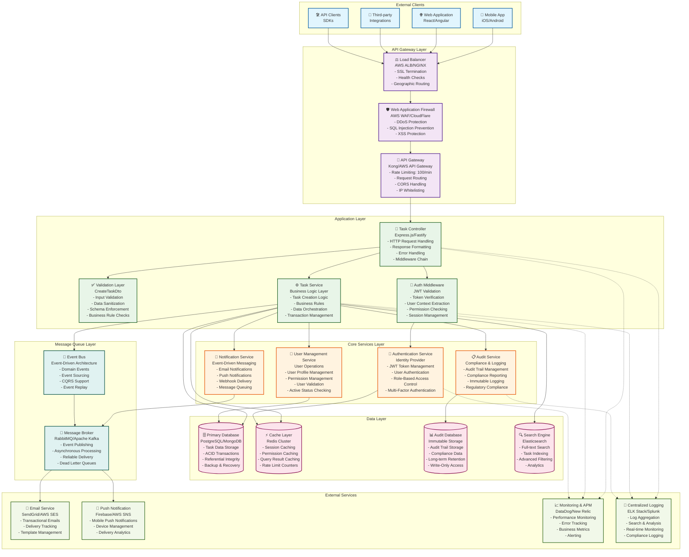
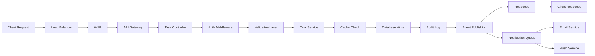

# Component Diagram - Task Management API Architecture

## Overview
This component diagram illustrates the comprehensive architecture of the Task Management API system, showing all components, their relationships, dependencies, and data flow patterns for the task creation endpoint.

## High-Level Component Architecture



## Detailed Component Specifications

### API Gateway Layer Components

#### Load Balancer
- **Technology**: AWS Application Load Balancer (ALB) / NGINX
- **Responsibilities**:
  - SSL/TLS termination with certificate management
  - Health check monitoring and automatic failover
  - Geographic traffic routing and latency optimization
  - Connection pooling and request distribution
- **Performance**: 99.99% availability, <10ms routing latency
- **Security**: DDoS protection, SSL/TLS 1.3 encryption

#### API Gateway
- **Technology**: Kong / AWS API Gateway / Express Gateway
- **Responsibilities**:
  - Rate limiting: 100 requests/minute per authenticated user
  - Request routing based on URL patterns and headers
  - CORS policy enforcement for web clients
  - API versioning and backward compatibility
- **Performance**: <5ms processing overhead
- **Monitoring**: Request/response metrics, error rates

#### Web Application Firewall (WAF)
- **Technology**: AWS WAF / Cloudflare WAF
- **Responsibilities**:
  - SQL injection and XSS attack prevention
  - DDoS protection and traffic filtering
  - Geolocation-based access control
  - Bot detection and mitigation
- **Security**: OWASP Top 10 protection, custom rule sets

### Application Layer Components

#### Task Controller
- **Technology**: Express.js / Fastify / NestJS
- **File Location**: `src/controllers/task.controller.ts`
- **Responsibilities**:
  - HTTP request/response handling for POST /api/tasks
  - Request correlation ID management
  - Error handling and HTTP status code mapping
  - Response formatting and header management
- **Performance**: <50ms processing time
- **Error Handling**: Comprehensive error mapping and logging

#### Validation Layer (CreateTaskDto)
- **Technology**: class-validator / Joi / Yup
- **File Location**: `src/dto/create-task.dto.ts`
- **Validation Rules**:
  ```typescript
  class CreateTaskDto {
    @IsNotEmpty()
    @MaxLength(255)
    title: string;
    
    @IsOptional()
    @MaxLength(1000)
    description?: string;
    
    @IsEnum(TaskStatus)
    @IsOptional()
    status?: TaskStatus = TaskStatus.TODO;
    
    @IsEnum(TaskPriority)
    @IsOptional()
    priority?: TaskPriority = TaskPriority.MEDIUM;
    
    @IsDateString()
    @IsOptional()
    @IsFutureDate()
    dueDate?: string;
    
    @IsUUID()
    @IsOptional()
    assigneeId?: string;
  }
  ```

#### Task Service
- **Technology**: TypeScript / Node.js
- **File Location**: `src/services/task.service.ts`
- **Responsibilities**:
  - Business logic orchestration
  - Transaction management and data consistency
  - Business rule validation and enforcement
  - Integration with external services
- **Performance**: <100ms business logic processing
- **Patterns**: Repository pattern, Dependency Injection

#### Authentication Middleware
- **Technology**: Passport.js / JWT libraries
- **File Location**: `src/middleware/auth.middleware.ts`
- **Responsibilities**:
  - JWT token validation and parsing
  - User context extraction and enrichment
  - Permission checking and RBAC enforcement
  - Session management and token refresh
- **Security**: Token signature validation, expiration checking

### Core Services Layer

#### Authentication Service
- **Technology**: Auth0 / AWS Cognito / Custom JWT Service
- **Responsibilities**:
  - User authentication and token issuance
  - Multi-factor authentication support
  - Role-based access control (RBAC) management
  - Token refresh and revocation
- **Performance**: <100ms token validation
- **Security**: OAuth 2.0, OpenID Connect compliance

#### User Management Service
- **Technology**: Microservice (Node.js/Python/Java)
- **Responsibilities**:
  - User profile management and validation
  - User status checking (active/inactive)
  - Permission and role management
  - User relationship management
- **Performance**: <50ms user validation with caching
- **Data**: User profiles, permissions, organizational structure

#### Notification Service
- **Technology**: Event-driven microservice
- **Responsibilities**:
  - Multi-channel notification delivery
  - Notification template management
  - Delivery status tracking and retry logic
  - User preference management
- **Channels**: Email, SMS, Push notifications, Webhooks
- **Performance**: Asynchronous processing, <5s delivery

#### Audit Service
- **Technology**: Event-sourcing based service
- **Responsibilities**:
  - Immutable audit trail creation
  - Compliance reporting and data export
  - Regulatory compliance (GDPR, SOX, ISO 27001)
  - Audit data retention and archival
- **Storage**: Write-only audit database
- **Compliance**: 7-year retention, tamper-proof logging

### Data Layer Components

#### Primary Database
- **Technology**: PostgreSQL 14+ / MongoDB 5.0+
- **Configuration**:
  - Master-slave replication for high availability
  - Connection pooling (50 connections max)
  - Automated backup with point-in-time recovery
  - Encryption at rest (AES-256)
- **Performance**: <50ms query response time
- **Capacity**: Auto-scaling storage, read replicas

#### Cache Layer
- **Technology**: Redis Cluster 6.0+
- **Use Cases**:
  - User session caching (TTL: 24 hours)
  - Permission caching (TTL: 5 minutes)
  - Rate limiting counters (TTL: 1 minute)
  - Query result caching (TTL: configurable)
- **Performance**: <5ms cache access time
- **High Availability**: Redis Sentinel for failover

#### Audit Database
- **Technology**: PostgreSQL with append-only tables
- **Configuration**:
  - Immutable audit log storage
  - Separate from primary database
  - Long-term retention (7+ years)
  - Compliance-grade security
- **Performance**: Write-optimized, batch processing
- **Compliance**: WORM (Write Once, Read Many) storage

#### Search Engine
- **Technology**: Elasticsearch 8.0+ / Amazon OpenSearch
- **Use Cases**:
  - Full-text task search
  - Advanced filtering and faceted search
  - Analytics and reporting
  - Real-time indexing
- **Performance**: <100ms search response time
- **Indexing**: Real-time task indexing via events

### Message Queue Layer

#### Message Broker
- **Technology**: RabbitMQ / Apache Kafka / AWS SQS
- **Responsibilities**:
  - Asynchronous event processing
  - Reliable message delivery
  - Dead letter queue handling
  - Message routing and filtering
- **Performance**: <10ms message publishing
- **Reliability**: At-least-once delivery guarantee

#### Event Bus
- **Technology**: Custom event system / Apache Kafka
- **Responsibilities**:
  - Domain event publishing and subscription
  - Event sourcing support
  - CQRS (Command Query Responsibility Segregation)
  - Event replay and recovery
- **Patterns**: Publisher-Subscriber, Event Sourcing

## Data Flow Architecture

### Task Creation Data Flow



## Security Architecture

### Security Layers

1. **Network Security**
   - WAF protection against common attacks
   - DDoS protection and rate limiting
   - SSL/TLS 1.3 encryption in transit

2. **Application Security**
   - JWT token-based authentication
   - Role-based access control (RBAC)
   - Input validation and sanitization
   - SQL injection prevention

3. **Data Security**
   - Encryption at rest (AES-256)
   - Database access controls
   - Audit trail for all data access
   - GDPR compliance for personal data

4. **Infrastructure Security**
   - Network segmentation and VPC isolation
   - Security groups and firewall rules
   - Regular security scanning and updates
   - Compliance monitoring

## Performance Architecture

### Performance Optimization Strategies

1. **Caching Strategy**
   - Multi-level caching (Application, Database, CDN)
   - Cache-aside pattern for frequently accessed data
   - Cache invalidation strategies

2. **Database Optimization**
   - Query optimization and indexing
   - Connection pooling and prepared statements
   - Read replicas for read-heavy operations

3. **Asynchronous Processing**
   - Event-driven architecture for non-critical operations
   - Message queues for background processing
   - Bulk operations for efficiency

4. **Auto-scaling**
   - Horizontal auto-scaling based on metrics
   - Load balancing across multiple instances
   - Database scaling strategies

## Monitoring and Observability

### Monitoring Stack

- **Application Performance Monitoring (APM)**: DataDog, New Relic
- **Infrastructure Monitoring**: CloudWatch, Prometheus
- **Log Aggregation**: ELK Stack, Splunk
- **Distributed Tracing**: Jaeger, Zipkin
- **Business Metrics**: Custom dashboards and KPIs

### Key Metrics

- **Performance Metrics**: Response time, throughput, error rates
- **Business Metrics**: Task creation rate, user engagement
- **Infrastructure Metrics**: CPU, memory, disk, network usage
- **Security Metrics**: Failed authentication attempts, suspicious activities

## Deployment Architecture

### Environment Strategy

- **Development**: Local Docker containers, feature branches
- **Staging**: AWS ECS/EKS, production-like environment
- **Production**: Multi-AZ deployment, auto-scaling groups

### CI/CD Pipeline

- **Source Control**: Git with GitFlow branching strategy
- **Build**: Automated builds with GitHub Actions/Jenkins
- **Testing**: Unit, integration, contract, and end-to-end tests
- **Deployment**: Blue-green deployment with automated rollback

---

**Component Diagram Version**: 1.0  
**Architecture Pattern**: Microservices with API Gateway  
**Last Updated**: 2024  
**Compliance**: Enterprise Security Standards  
**Performance Target**: 99.99% Availability, <200ms Response Time  
**Scalability**: Horizontal scaling, Multi-region support