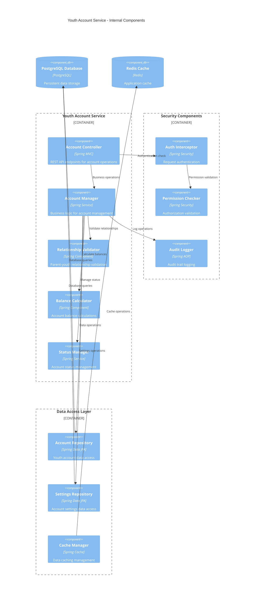
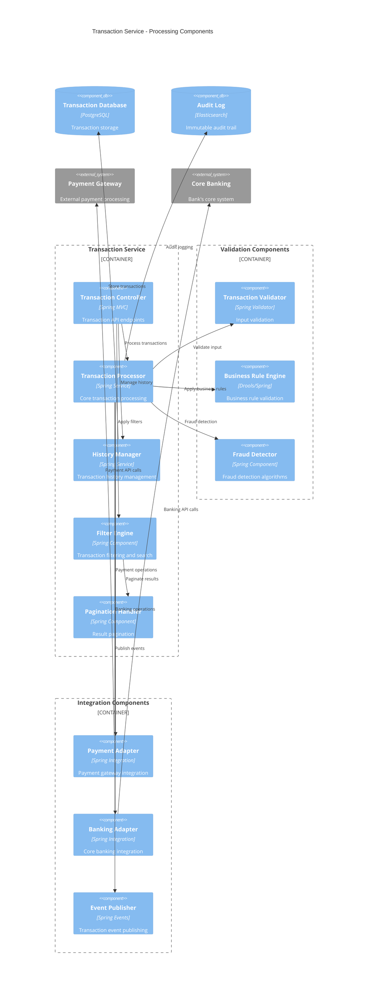
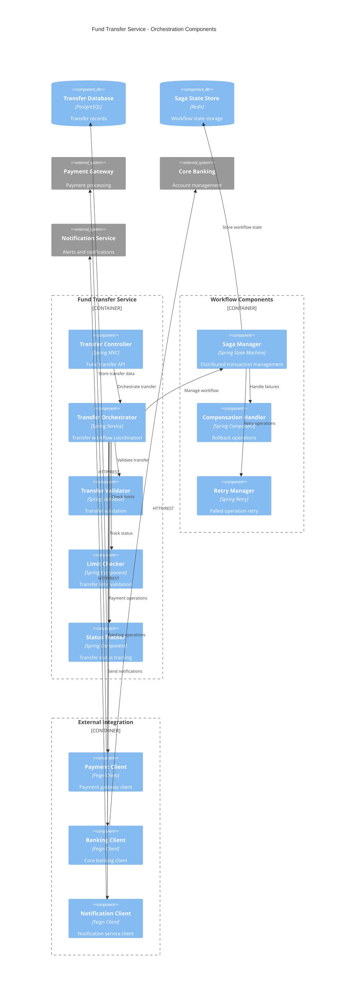
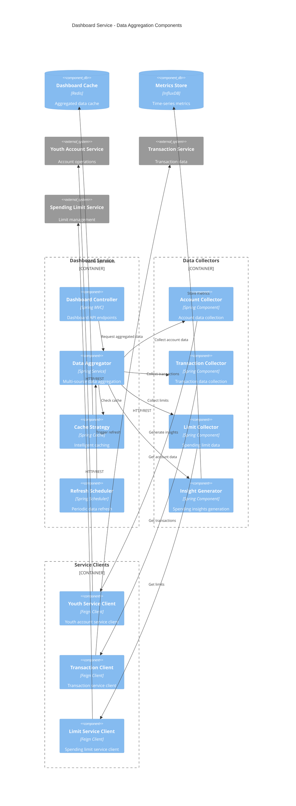
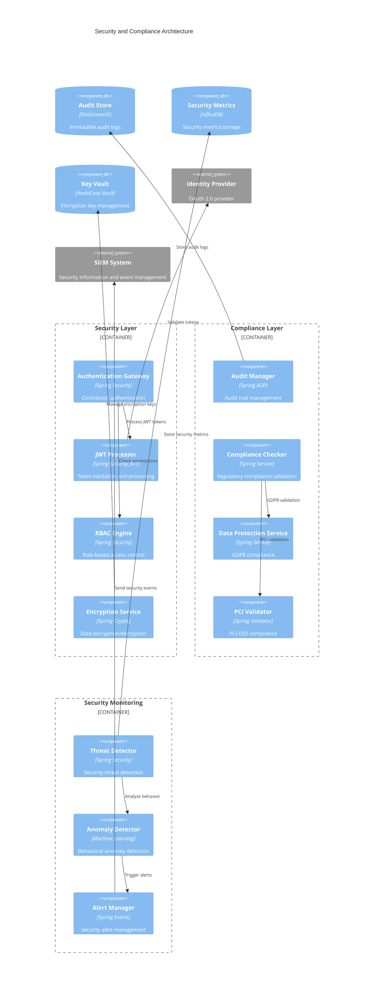
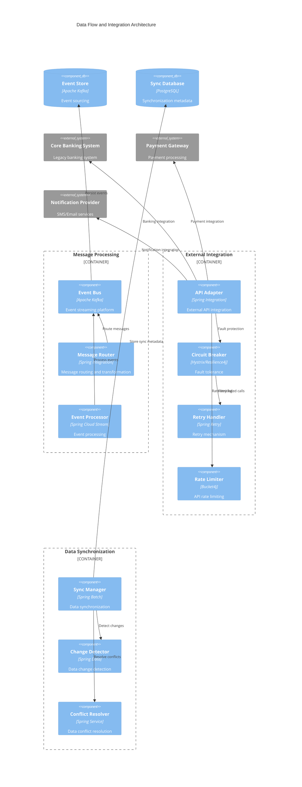

# Component Diagrams
# Youth Account Management System

## Overview
This document contains component diagrams for the Youth Account Management System, illustrating the system architecture, component relationships, and data flow patterns.

## 1. High-Level System Architecture

```mermaid
C4Component
    title Component Diagram - Youth Account Management System Architecture
    
    Container_Boundary(web, "Web Tier") {
        Component(webApp, "Web Application", "React/TypeScript", "User interface for parents and youth")
        Component(mobileApp, "Mobile Application", "React Native", "Mobile interface for account management")
    }
    
    Container_Boundary(api, "API Gateway Tier") {
        Component(apiGateway, "API Gateway", "Kong/AWS API Gateway", "Request routing, rate limiting, authentication")
        Component(loadBalancer, "Load Balancer", "AWS ALB/NGINX", "Traffic distribution and SSL termination")
    }
    
    Container_Boundary(auth, "Authentication Tier") {
        Component(authService, "Authentication Service", "OAuth 2.0/JWT", "User authentication and authorization")
        Component(rbacService, "RBAC Service", "Spring Security", "Role-based access control")
    }
    
    Container_Boundary(business, "Business Logic Tier") {
        Component(youthService, "Youth Account Service", "Java/Spring Boot", "Core youth account operations")
        Component(dashboardService, "Dashboard Service", "Java/Spring Boot", "Dashboard data aggregation")
        Component(transactionService, "Transaction Service", "Java/Spring Boot", "Transaction processing and history")
        Component(limitService, "Spending Limit Service", "Java/Spring Boot", "Spending limit management")
        Component(transferService, "Fund Transfer Service", "Java/Spring Boot", "Fund transfer orchestration")
        Component(notificationService, "Notification Service", "Java/Spring Boot", "Alert and notification management")
    }
    
    Container_Boundary(integration, "Integration Tier") {
        Component(paymentGateway, "Payment Gateway", "External API", "Payment processing integration")
        Component(coreBanking, "Core Banking Adapter", "Java/Spring Boot", "Core banking system integration")
        Component(complianceService, "Compliance Service", "Java/Spring Boot", "Regulatory compliance checks")
    }
    
    Container_Boundary(data, "Data Tier") {
        ComponentDb(youthDb, "Youth Account Database", "PostgreSQL", "Youth account data and settings")
        ComponentDb(transactionDb, "Transaction Database", "PostgreSQL", "Transaction history and audit logs")
        ComponentDb(cache, "Redis Cache", "Redis Cluster", "Session and application data caching")
        ComponentDb(auditStore, "Audit Log Store", "Elasticsearch", "Immutable audit trail storage")
    }
    
    Container_Boundary(monitoring, "Monitoring Tier") {
        Component(apmService, "APM Service", "New Relic/Datadog", "Application performance monitoring")
        Component(logAggregator, "Log Aggregator", "ELK Stack", "Centralized logging and analysis")
        Component(metricsCollector, "Metrics Collector", "Prometheus", "System and business metrics")
    }
    
    Rel(webApp, apiGateway, "HTTPS/REST API calls")
    Rel(mobileApp, apiGateway, "HTTPS/REST API calls")
    Rel(loadBalancer, apiGateway, "Load balances requests")
    Rel(apiGateway, authService, "Authentication validation")
    Rel(authService, rbacService, "Permission checks")
    Rel(apiGateway, youthService, "Routes youth account requests")
    Rel(apiGateway, dashboardService, "Routes dashboard requests")
    Rel(apiGateway, transactionService, "Routes transaction requests")
    Rel(apiGateway, limitService, "Routes limit management requests")
    
    Rel(youthService, transferService, "Fund transfer operations")
    Rel(transferService, paymentGateway, "Payment processing")
    Rel(youthService, coreBanking, "Account balance updates")
    Rel(transactionService, complianceService, "Compliance validation")
    
    Rel(youthService, youthDb, "CRUD operations")
    Rel(transactionService, transactionDb, "Transaction logging")
    Rel(dashboardService, cache, "Cache operations")
    Rel(complianceService, auditStore, "Audit logging")
    
    Rel(youthService, notificationService, "Send notifications")
    Rel(limitService, notificationService, "Spending alerts")
    
    Rel_Back(apmService, business, "Performance monitoring")
    Rel_Back(logAggregator, business, "Log collection")
    Rel_Back(metricsCollector, business, "Metrics collection")
```

## 2. Youth Account Service Components



## 3. Transaction Processing Components



## 4. Fund Transfer Orchestration Components



## 5. Dashboard Service Components



## 6. Security and Compliance Components



## 7. Data Flow and Integration Components



## Component Design Principles

### 1. Separation of Concerns
- **Presentation Layer**: Web and mobile applications
- **API Layer**: Gateway and routing
- **Business Logic**: Domain services
- **Data Layer**: Repositories and databases
- **Integration Layer**: External system adapters

### 2. Microservices Architecture
- **Service Independence**: Each service can be deployed independently
- **Technology Diversity**: Services can use different technology stacks
- **Scalability**: Individual services can be scaled based on demand
- **Fault Isolation**: Failure in one service doesn't affect others

### 3. Security by Design
- **Defense in Depth**: Multiple security layers
- **Principle of Least Privilege**: Minimal required permissions
- **Secure by Default**: Secure configurations out of the box
- **Audit Everything**: Comprehensive audit logging

### 4. Resilience Patterns
- **Circuit Breaker**: Prevent cascade failures
- **Retry with Backoff**: Handle transient failures
- **Bulkhead**: Isolate critical resources
- **Timeout**: Prevent resource exhaustion

### 5. Performance Optimization
- **Caching Strategy**: Multi-level caching
- **Connection Pooling**: Efficient database connections
- **Asynchronous Processing**: Non-blocking operations
- **Load Balancing**: Distribute traffic evenly

### 6. Compliance and Auditability
- **Immutable Audit Logs**: Tamper-proof audit trails
- **Data Encryption**: End-to-end encryption
- **Access Controls**: Strict access management
- **Regulatory Compliance**: Built-in compliance checks

## Technology Stack Summary

| Layer | Technology | Purpose |
|-------|------------|----------|
| Frontend | React/TypeScript, React Native | User interfaces |
| API Gateway | Kong, AWS API Gateway | Request routing, authentication |
| Business Logic | Java/Spring Boot | Core business services |
| Database | PostgreSQL | Relational data storage |
| Cache | Redis Cluster | High-performance caching |
| Message Queue | Apache Kafka | Event streaming |
| Monitoring | ELK Stack, Prometheus | Logging and metrics |
| Security | OAuth 2.0, JWT, HashiCorp Vault | Authentication and encryption |
| Container | Docker, Kubernetes | Containerization and orchestration |
| Infrastructure | Terraform, AWS/Azure | Infrastructure as Code |

---

**Document Version**: 1.0  
**Last Updated**: 2024-01-15  
**Author**: Senior Solution Architect  
**Review Status**: Approved  
**Compliance**: PCI-DSS, GDPR, SOX, Basel III