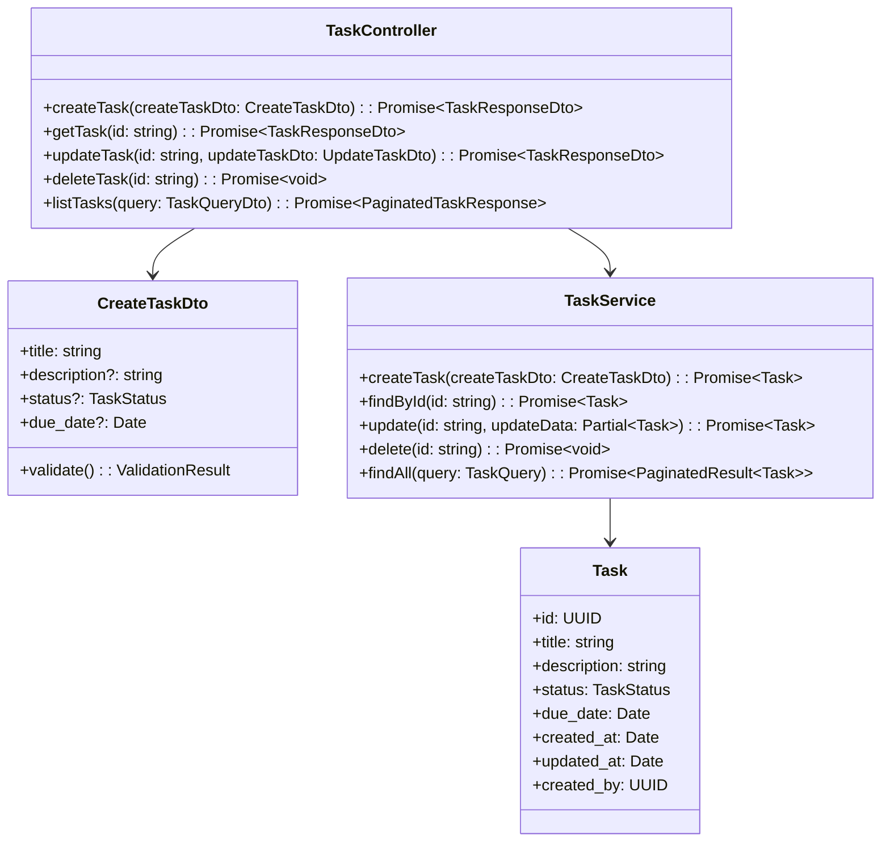
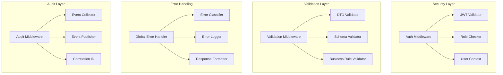
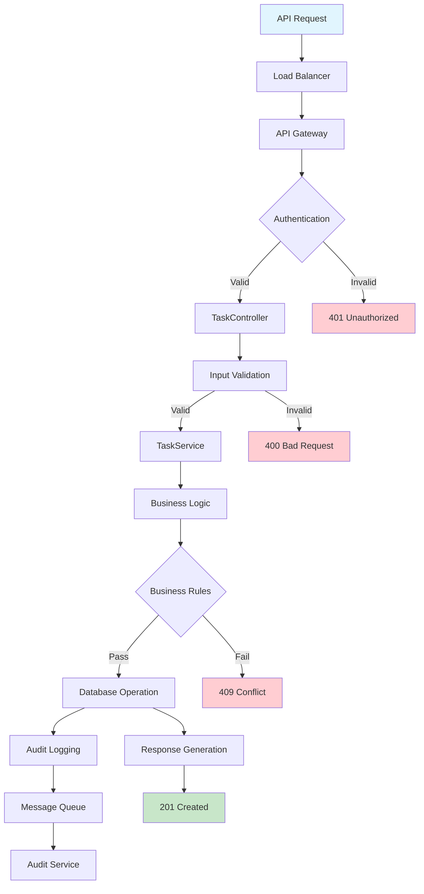
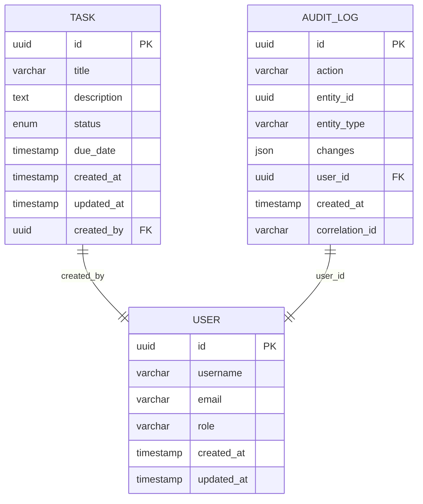
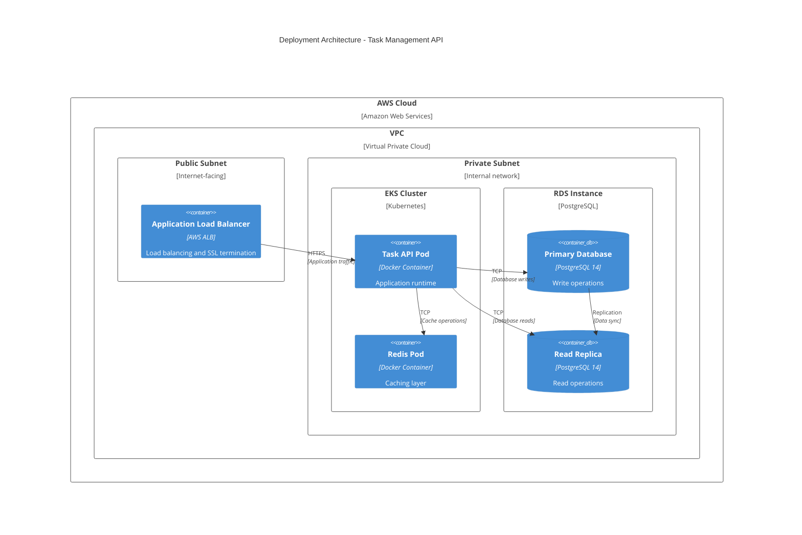

# Component Diagram - Task Management API System

## Version: 1.0
## Generated from: HLD Document - Task Management API System
## Date: 2024

---

## Overview
This component diagram illustrates the high-level architecture of the Task Management API System, showing the relationships between all system components, external dependencies, and data flows as defined in the HLD document and DEMO-2350 requirements.

---

## System Architecture - C4 Model Container View

```mermaid
C4Container
    title Task Management API System - Component Architecture
    
    Person(apiConsumer, "API Consumer", "External systems and applications")
    Person(admin, "System Administrator", "Operations and monitoring")
    
    System_Boundary(taskSystem, "Task Management API System") {
        Container(loadBalancer, "Load Balancer", "ALB", "Distributes incoming requests")
        Container(apiGateway, "API Gateway", "Kong/AWS API Gateway", "Request routing, rate limiting, security")
        
        Container_Boundary(application, "Application Layer") {
            Container(taskController, "TaskController", "NestJS/TypeScript", "REST API endpoints, HTTP request handling")
            Container(createTaskDto, "CreateTaskDto", "TypeScript", "Request validation, data transfer object")
            Container(taskService, "TaskService", "TypeScript", "Business logic, data operations")
            Container(taskEntity, "Task Entity", "TypeORM", "Data model and persistence mapping")
        }
        
        Container_Boundary(middleware, "Middleware Layer") {
            Container(authMiddleware, "Auth Middleware", "TypeScript", "JWT validation, user context")
            Container(validationMiddleware, "Validation Middleware", "class-validator", "Input validation pipeline")
            Container(errorHandler, "Global Error Handler", "TypeScript", "Centralized exception handling")
            Container(auditMiddleware, "Audit Middleware", "TypeScript", "Activity logging and tracking")
        }
        
        Container_Boundary(infrastructure, "Infrastructure Layer") {
            ContainerDb(database, "PostgreSQL Database", "PostgreSQL 14", "Primary data storage")
            ContainerDb(readReplica, "Read Replica", "PostgreSQL 14", "Read-only database replica")
            Container(connectionPool, "Connection Pool", "TypeORM", "Database connection management")
            Container(cache, "Redis Cache", "Redis 7", "Application caching layer")
        }
    }
    
    System_Boundary(externalSystems, "External Systems") {
        System_Ext(authService, "Authentication Service", "OAuth 2.0/JWT provider")
        System_Ext(auditService, "Audit Service", "Centralized audit logging")
        System_Ext(monitoringService, "Monitoring Service", "Application and infrastructure monitoring")
        System_Ext(alertManager, "Alert Manager", "PagerDuty integration")
    }
    
    System_Boundary(messageQueue, "Message Queue") {
        Container(rabbitMQ, "RabbitMQ", "Message Broker", "Asynchronous event processing")
        Container(deadLetterQueue, "Dead Letter Queue", "RabbitMQ", "Failed message handling")
    }
    
    %% External Relationships
    Rel(apiConsumer, loadBalancer, "HTTPS/REST", "API requests")
    Rel(admin, monitoringService, "HTTPS", "System monitoring")
    
    %% Load Balancer Relationships
    Rel(loadBalancer, apiGateway, "HTTP", "Route requests")
    
    %% API Gateway Relationships
    Rel(apiGateway, authService, "HTTPS", "Token validation")
    Rel(apiGateway, taskController, "HTTP", "Authenticated requests")
    
    %% Controller Relationships
    Rel(taskController, authMiddleware, "Uses", "Authentication")
    Rel(taskController, validationMiddleware, "Uses", "Input validation")
    Rel(taskController, createTaskDto, "Uses", "Data validation")
    Rel(taskController, taskService, "Calls", "Business logic")
    Rel(taskController, errorHandler, "Uses", "Error handling")
    
    %% Service Relationships
    Rel(taskService, taskEntity, "Uses", "Data operations")
    Rel(taskService, connectionPool, "Uses", "Database access")
    Rel(taskService, cache, "Uses", "Caching")
    Rel(taskService, auditMiddleware, "Uses", "Activity logging")
    
    %% Database Relationships
    Rel(connectionPool, database, "SQL", "Write operations")
    Rel(connectionPool, readReplica, "SQL", "Read operations")
    Rel(database, readReplica, "Replication", "Data sync")
    
    %% Audit and Monitoring
    Rel(auditMiddleware, rabbitMQ, "AMQP", "Audit events")
    Rel(rabbitMQ, auditService, "AMQP", "Event processing")
    Rel(rabbitMQ, deadLetterQueue, "AMQP", "Failed events")
    
    %% Monitoring Relationships
    Rel(taskService, monitoringService, "HTTP/Metrics", "Performance data")
    Rel(errorHandler, monitoringService, "HTTP/Metrics", "Error metrics")
    Rel(monitoringService, alertManager, "HTTP", "Alert notifications")
```

---

## Detailed Component Breakdown

### Application Layer Components

#### TaskController (DEMO-2350)

### Security and Middleware Components

---

## Data Flow Architecture

---

## Infrastructure Components

### Database Architecture

### Deployment Architecture

---

## Non-Functional Requirements Mapping

### Performance Components
- **Connection Pool**: 10-50 database connections
- **Redis Cache**: Sub-millisecond response times
- **Load Balancer**: Horizontal scaling support
- **Read Replicas**: Query distribution for performance

### Security Components
- **JWT Validation**: Stateless authentication
- **RBAC Enforcement**: Role-based access control
- **Input Sanitization**: Multi-layer validation
- **TLS Encryption**: End-to-end security

### Reliability Components
- **Circuit Breaker**: External service failure handling
- **Retry Logic**: Transient failure recovery
- **Health Checks**: Kubernetes liveness/readiness probes
- **Dead Letter Queue**: Failed message handling

### Monitoring Components
- **Metrics Collection**: Performance and business metrics
- **Centralized Logging**: ELK Stack integration
- **Alert Management**: PagerDuty integration
- **Audit Trail**: Compliance and traceability

---

## Integration Patterns

### Synchronous Integrations
- **Authentication Service**: OAuth 2.0/JWT validation
- **Database Operations**: ACID transaction support
- **Cache Operations**: Redis read/write operations

### Asynchronous Integrations
- **Audit Logging**: RabbitMQ message publishing
- **Monitoring Events**: Metrics collection
- **Alert Notifications**: PagerDuty integration

---

## Compliance and Governance

### TOGAF ADM Alignment
- **Architecture Vision**: Clear business objectives
- **Business Architecture**: Stakeholder requirements
- **Information Systems Architecture**: Application and data architecture
- **Technology Architecture**: Infrastructure and deployment

### OpenAPI Standards
- **Contract-First Development**: API specification driven
- **Documentation Generation**: Automated API docs
- **Schema Validation**: Request/response validation
- **Code Generation**: Client SDK generation

### SOC2 Compliance
- **Security Controls**: Authentication and authorization
- **Availability Controls**: High availability design
- **Processing Integrity**: Data validation and integrity
- **Confidentiality Controls**: Data encryption
- **Privacy Controls**: Data handling and retention

---

**Generated by**: Senior Solution Architect and Integration Automation Specialist  
**Source**: HLD Document v1.0 - Task Management API System  
**Architecture Framework**: TOGAF ADM, C4 Model  
**Compliance**: OpenAPI 3.0, SOC2 Type II  
**Last Updated**: 2024