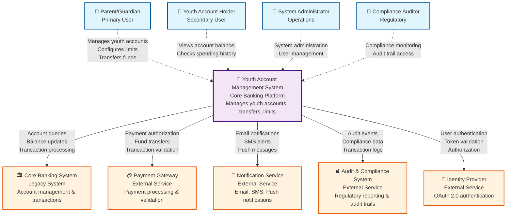
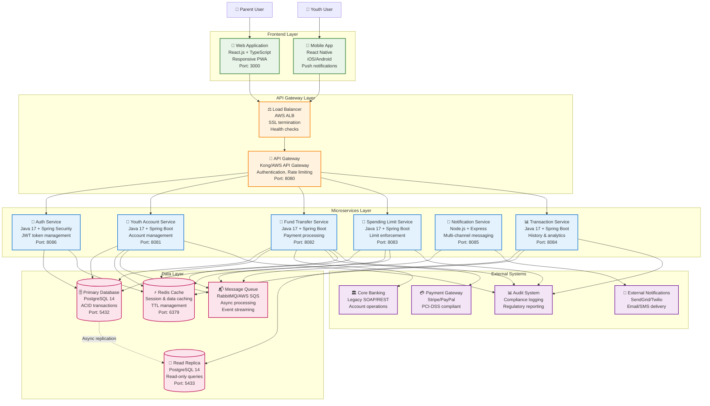
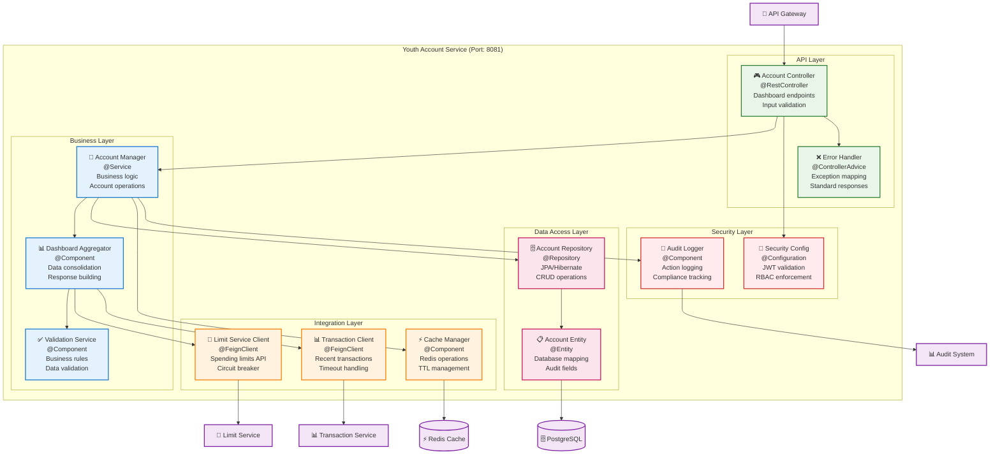
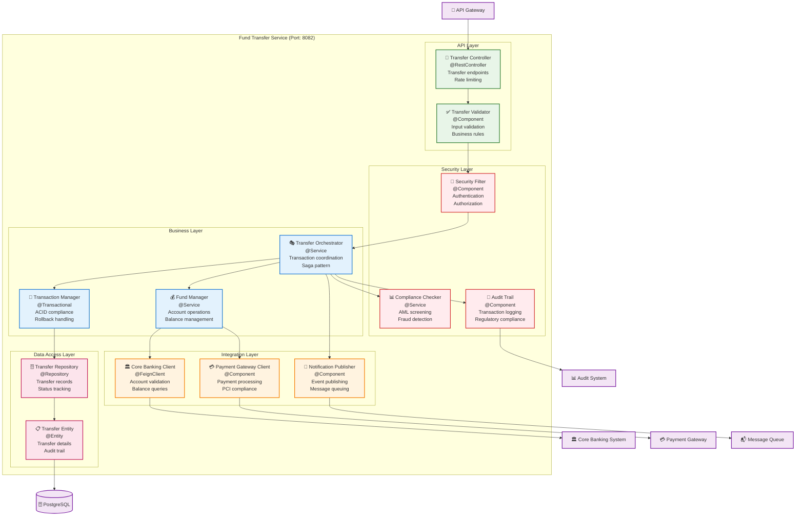
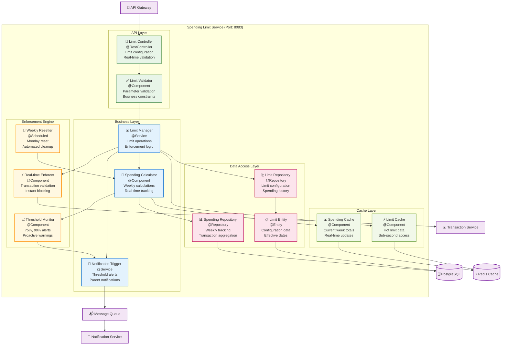
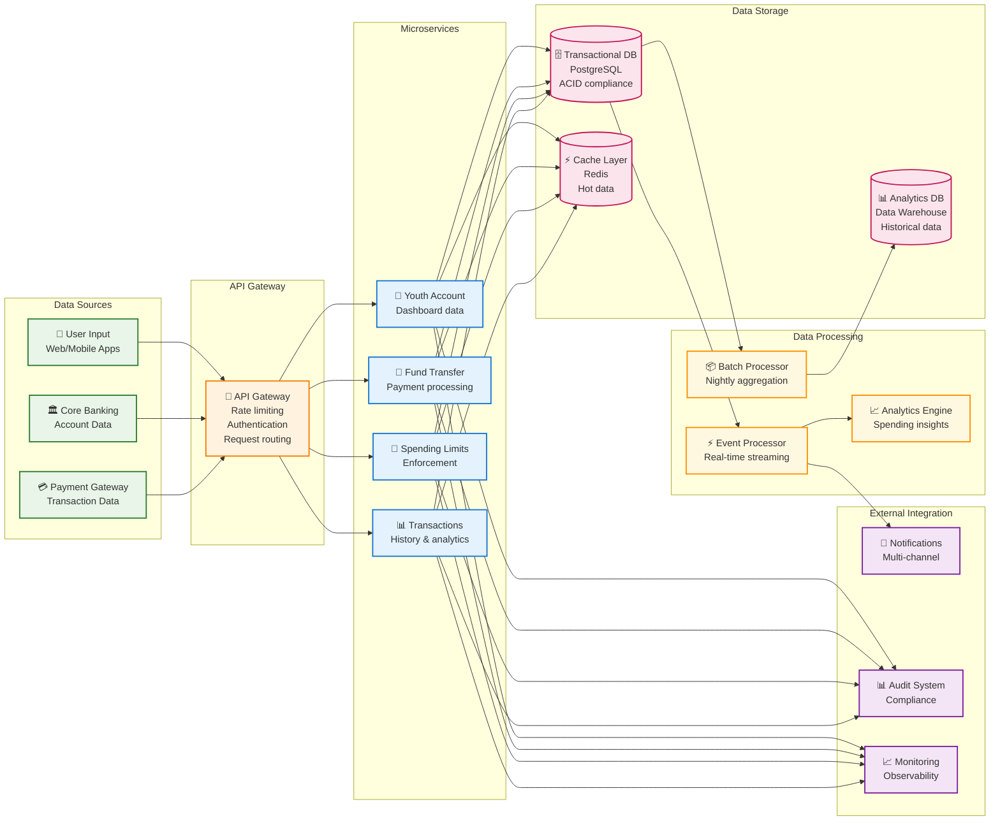
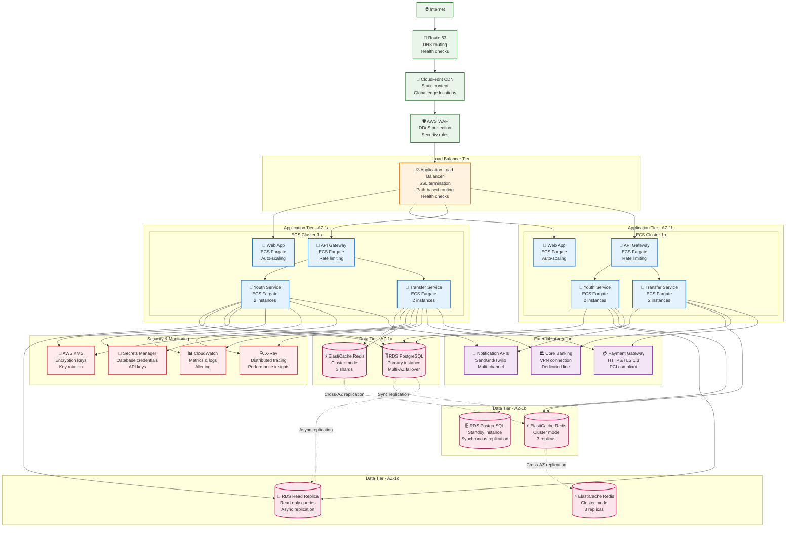

# Component Diagrams
# Youth Account Management System

## Document Information
- **Document Version**: 1.0
- **Date**: 2024
- **System**: Youth Account Management System
- **Traceability**: SCIB-25, SCIB-26, SCIB-27, SCIB-28, SCIB-29, SCIB-30
- **Architecture Pattern**: Microservices with API Gateway

---

## 1. System Context Diagram (C4 Level 1)

### Description
High-level view of the Youth Account Management System and its external dependencies.

**Key Relationships:**
- **Primary Users**: Parents manage youth accounts with full control
- **Secondary Users**: Youth have limited read-only access
- **External Dependencies**: Core banking, payments, notifications, audit, identity
- **Compliance**: All interactions logged for regulatory requirements

---

## 2. Container Diagram (C4 Level 2)

### Description
Detailed view of the system's containers, showing the microservices architecture and data flow.

**Architecture Patterns:**
- **Microservices**: Independently deployable services
- **API Gateway**: Centralized entry point with cross-cutting concerns
- **CQRS**: Read replicas for query optimization
- **Event-Driven**: Asynchronous processing with message queues
- **Caching**: Redis for performance optimization

---

## 3. Component Diagram - Youth Account Service (SCIB-26)

### Description
Detailed internal structure of the Youth Account Service responsible for dashboard and account management.

**Key Responsibilities:**
- **Dashboard API**: GET /youth-accounts/{id}/dashboard (SCIB-26)
- **Data Aggregation**: Combines account, limit, and transaction data
- **Caching**: Redis caching with 5-minute TTL
- **Security**: JWT validation and RBAC enforcement
- **Audit**: Complete action logging for compliance

---

## 4. Component Diagram - Fund Transfer Service (SCIB-27)

### Description
Detailed structure of the Fund Transfer Service handling secure money transfers between accounts.

**Key Features:**
- **Transfer API**: POST /youth-accounts/{id}/fund-transfer (SCIB-27)
- **ACID Transactions**: Guaranteed consistency with rollback
- **Saga Pattern**: Distributed transaction coordination
- **PCI Compliance**: Secure payment processing
- **Rate Limiting**: 10 transfers per hour per user

---

## 5. Component Diagram - Spending Limit Service (SCIB-28)

### Description
Internal structure of the Spending Limit Service for configuring and enforcing spending controls.

**Key Capabilities:**
- **Configuration API**: PUT /youth-accounts/{id}/spending-limit (SCIB-28)
- **Real-time Enforcement**: Transaction validation against limits
- **Threshold Alerts**: 75%, 90%, and exceed notifications
- **Weekly Reset**: Automated Monday reset of spending totals
- **Performance**: Sub-second limit validation with caching

---

## 6. Data Flow Architecture

### Description
Overall data flow and integration patterns across all services.

**Data Flow Patterns:**
- **Real-time Processing**: Event-driven architecture for immediate responses
- **Batch Processing**: Nightly aggregation for analytics and reporting
- **Caching Strategy**: Multi-level caching for performance optimization
- **Audit Trail**: Complete data lineage for compliance
- **Monitoring**: Real-time observability across all components

---

## 7. Deployment Architecture

### Description
Production deployment architecture showing infrastructure components and scaling strategies.

**Deployment Features:**
- **High Availability**: Multi-AZ deployment with automatic failover
- **Auto Scaling**: ECS Fargate with CPU/memory-based scaling
- **Security**: WAF, KMS encryption, Secrets Manager
- **Monitoring**: CloudWatch metrics, X-Ray tracing
- **Performance**: CDN, load balancing, read replicas

---

## Architecture Decisions & Traceability

### ADR Mapping to Components

| ADR | Component | Responsibility | Implementation |
|-----|-----------|----------------|----------------|
| SCIB-25 | System Architecture | Parent fund allocation and management | Overall microservices design |
| SCIB-26 | Youth Account Service | Dashboard API implementation | Account dashboard endpoint |
| SCIB-27 | Fund Transfer Service | Fund transfer API development | Secure payment processing |
| SCIB-28 | Spending Limit Service | Spending limit configuration API | Limit enforcement engine |
| SCIB-29 | Transaction Service | Transaction history API | History retrieval with analytics |
| SCIB-30 | API Gateway | OpenAPI/Swagger specification | Standardized API documentation |

### Technology Stack

**Frontend:**
- React.js 18 + TypeScript
- Material-UI for design system
- Progressive Web App (PWA)
- React Native for mobile

**Backend:**
- Java 17 + Spring Boot 3.x
- Spring Security for authentication
- Spring Data JPA for data access
- Spring Cloud Gateway for API gateway

**Data:**
- PostgreSQL 14 for transactional data
- Redis 6 for caching and sessions
- RabbitMQ for message queuing

**Infrastructure:**
- AWS ECS Fargate for containerization
- AWS RDS for managed databases
- AWS ElastiCache for managed Redis
- AWS CloudWatch for monitoring

### Non-Functional Requirements

**Performance:**
- API response time < 200ms (95th percentile)
- Dashboard loading < 2 seconds
- 10,000 concurrent users support
- Auto-scaling based on CPU/memory

**Security:**
- OAuth 2.0 + JWT authentication
- PCI-DSS Level 1 compliance
- End-to-end encryption (TLS 1.3)
- Role-based access control (RBAC)

**Availability:**
- 99.99% uptime SLA
- Multi-AZ deployment
- Automated failover < 30 seconds
- Circuit breaker pattern

**Compliance:**
- GDPR data protection
- SOX financial controls
- BSA regulatory compliance
- Complete audit trail

---

**Document Control:**
- Version: 1.0
- Last Updated: 2024
- Next Review: Monthly
- Approval: Enterprise Architecture Review Board
- Implementation Status: Design Phase Complete
- GitHub Repository: ThapaswiASC/SCIB-INCEPTION-PHASE-DEMO