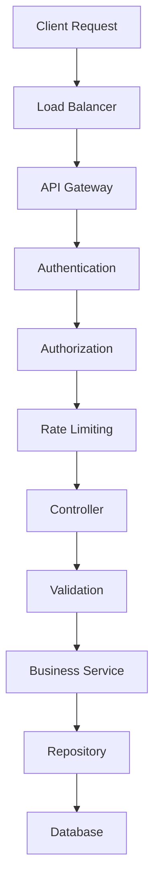
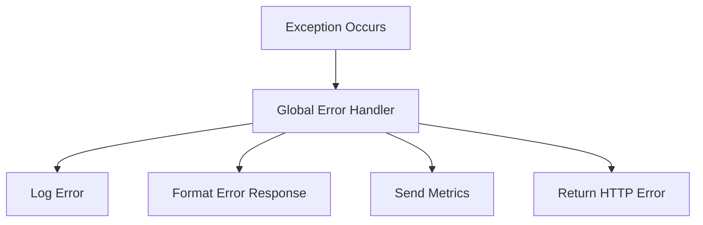
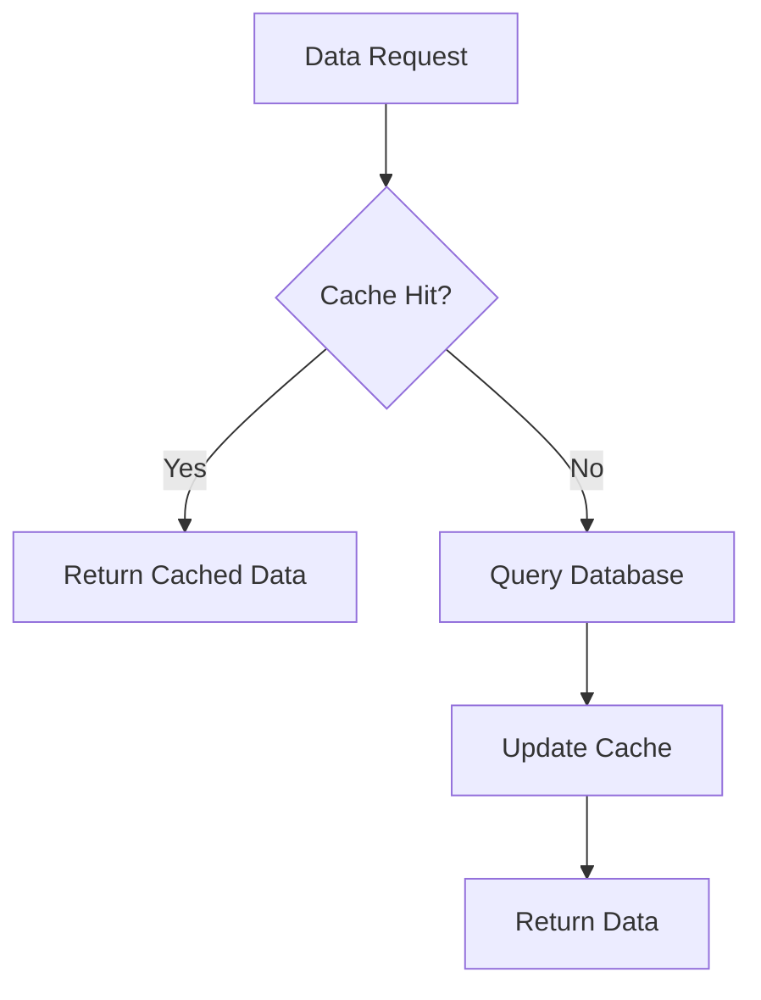
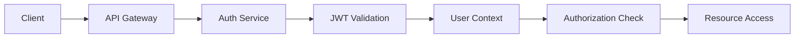

# Component Diagram - Task Management API System

## Overview
This component diagram illustrates the high-level architecture and component relationships for the Task Management API System as specified in DEMO-2350 and the HLD document. The diagram shows the modular, scalable, and secure architecture designed for enterprise deployment.

## System Architecture Components


```mermaid
C4Component
    title Component Diagram - Task Management API System
    
    Container_Boundary(clientLayer, "Client Layer") {
        Component(webApp, "Web Application", "React/Angular", "User interface for task management")
        Component(mobileApp, "Mobile Application", "React Native/Flutter", "Mobile task management interface")
        Component(thirdParty, "Third-Party Applications", "External Systems", "External integrations via API")
    }
    
    Container_Boundary(gatewayLayer, "API Gateway Layer") {
        Component(apiGateway, "API Gateway", "Kong/AWS API Gateway", "Request routing, rate limiting, authentication")
        Component(loadBalancer, "Load Balancer", "AWS ALB/NGINX", "Traffic distribution and SSL termination")
        Component(rateLimiter, "Rate Limiter", "Redis-based", "API throttling and DDoS protection")
    }
    
    Container_Boundary(securityLayer, "Security Layer") {
        Component(authService, "Authentication Service", "OAuth2/OIDC", "User authentication and token management")
        Component(authzService, "Authorization Service", "RBAC Engine", "Role-based access control")
        Component(securityValidator, "Security Validator", "Input Sanitizer", "XSS, SQL injection prevention")
    }
    
    Container_Boundary(applicationLayer, "Application Layer") {
        Component(taskController, "Task Controller", "NestJS Controller", "HTTP request/response handling")
        Component(userController, "User Controller", "NestJS Controller", "User management endpoints")
        Component(healthController, "Health Controller", "NestJS Controller", "System health monitoring")
        Component(metricsController, "Metrics Controller", "NestJS Controller", "Performance metrics exposure")
    }
    
    Container_Boundary(businessLayer, "Business Logic Layer") {
        Component(taskService, "Task Service", "TypeScript Service", "Core task business logic")
        Component(userService, "User Service", "TypeScript Service", "User management logic")
        Component(validationService, "Validation Service", "Class-Validator", "Input validation and sanitization")
        Component(businessRuleEngine, "Business Rule Engine", "TypeScript Engine", "Business rule validation")
        Component(workflowEngine, "Workflow Engine", "State Machine", "Task workflow management")
    }
    
    Container_Boundary(integrationLayer, "Integration Layer") {
        Component(notificationService, "Notification Service", "Email/SMS Gateway", "Task notifications")
        Component(auditService, "Audit Service", "Audit Logger", "Compliance and audit logging")
        Component(eventPublisher, "Event Publisher", "Message Queue", "Domain event publishing")
        Component(externalApiClient, "External API Client", "HTTP Client", "Third-party service integration")
    }
    
    Container_Boundary(dataLayer, "Data Access Layer") {
        Component(taskRepository, "Task Repository", "TypeORM Repository", "Task data operations")
        Component(userRepository, "User Repository", "TypeORM Repository", "User data operations")
        Component(auditRepository, "Audit Repository", "TypeORM Repository", "Audit log operations")
        Component(cacheManager, "Cache Manager", "Redis Client", "Caching operations")
        Component(searchEngine, "Search Engine", "Elasticsearch Client", "Full-text search")
    }
    
    Container_Boundary(persistenceLayer, "Persistence Layer") {
        ComponentDb(primaryDb, "Primary Database", "PostgreSQL", "ACID-compliant data storage")
        ComponentDb(readReplica, "Read Replica", "PostgreSQL", "Read-only database replica")
        ComponentDb(cacheStore, "Cache Store", "Redis Cluster", "High-performance caching")
        ComponentDb(searchIndex, "Search Index", "Elasticsearch", "Full-text search index")
        ComponentDb(auditStore, "Audit Store", "PostgreSQL", "Immutable audit logs")
    }
    
    Container_Boundary(crossCuttingLayer, "Cross-Cutting Concerns") {
        Component(logger, "Centralized Logger", "Winston/ELK", "Structured logging")
        Component(monitor, "Monitoring Agent", "Prometheus/CloudWatch", "Metrics collection")
        Component(tracer, "Distributed Tracer", "Jaeger/X-Ray", "Request tracing")
        Component(configManager, "Configuration Manager", "ConfigMap/Secrets", "Environment configuration")
        Component(errorHandler, "Global Error Handler", "Exception Filter", "Centralized error handling")
    }
    
    Container_Boundary(infrastructureLayer, "Infrastructure Layer") {
        Component(k8sOrchestrator, "Kubernetes Orchestrator", "K8s Cluster", "Container orchestration")
        Component(serviceDiscovery, "Service Discovery", "K8s Service", "Service registration and discovery")
        Component(secretManager, "Secret Manager", "K8s Secrets/Vault", "Secure secret management")
        Component(networkPolicy, "Network Policy", "K8s NetworkPolicy", "Network security")
    }
    
    %% Client Layer Relationships
    Rel(webApp, apiGateway, "HTTPS REST API calls")
    Rel(mobileApp, apiGateway, "HTTPS REST API calls")
    Rel(thirdParty, apiGateway, "HTTPS REST API calls")
    
    %% Gateway Layer Relationships
    Rel(loadBalancer, apiGateway, "Load balancing")
    Rel(apiGateway, rateLimiter, "Rate limit checks")
    Rel(apiGateway, authService, "Token validation")
    
    %% Security Layer Relationships
    Rel(authService, authzService, "Permission checks")
    Rel(apiGateway, securityValidator, "Input validation")
    
    %% Application Layer Relationships
    Rel(apiGateway, taskController, "Routed requests")
    Rel(apiGateway, userController, "Routed requests")
    Rel(apiGateway, healthController, "Health checks")
    Rel(apiGateway, metricsController, "Metrics requests")
    
    %% Business Layer Relationships
    Rel(taskController, taskService, "Business logic calls")
    Rel(userController, userService, "User operations")
    Rel(taskService, validationService, "Input validation")
    Rel(taskService, businessRuleEngine, "Rule validation")
    Rel(taskService, workflowEngine, "State transitions")
    
    %% Integration Layer Relationships
    Rel(taskService, notificationService, "Send notifications")
    Rel(taskService, auditService, "Audit logging")
    Rel(taskService, eventPublisher, "Publish events")
    Rel(taskService, externalApiClient, "External calls")
    
    %% Data Layer Relationships
    Rel(taskService, taskRepository, "Data operations")
    Rel(userService, userRepository, "User data")
    Rel(auditService, auditRepository, "Audit data")
    Rel(taskService, cacheManager, "Cache operations")
    Rel(taskService, searchEngine, "Search operations")
    
    %% Persistence Layer Relationships
    Rel(taskRepository, primaryDb, "Write operations")
    Rel(taskRepository, readReplica, "Read operations")
    Rel(cacheManager, cacheStore, "Cache storage")
    Rel(searchEngine, searchIndex, "Index operations")
    Rel(auditRepository, auditStore, "Audit storage")
    
    %% Cross-Cutting Relationships
    Rel(taskService, logger, "Structured logging")
    Rel(taskService, monitor, "Metrics reporting")
    Rel(taskService, tracer, "Request tracing")
    Rel(taskService, configManager, "Configuration")
    Rel(taskController, errorHandler, "Error handling")
```

## Detailed Component Specifications

### 1. Client Layer Components

#### Web Application
- **Technology**: React/Angular with TypeScript
- **Responsibility**: User interface for task management
- **Key Features**: 
  - Responsive design
  - Real-time updates
  - Offline capabilities
  - Accessibility compliance (WCAG 2.1)

#### Mobile Application
- **Technology**: React Native/Flutter
- **Responsibility**: Mobile task management interface
- **Key Features**:
  - Cross-platform compatibility
  - Push notifications
  - Biometric authentication
  - Offline synchronization

#### Third-Party Applications
- **Technology**: External systems via REST API
- **Responsibility**: External integrations
- **Key Features**:
  - API key authentication
  - Rate limiting compliance
  - Webhook support
  - SDK availability

### 2. API Gateway Layer Components

#### API Gateway
- **Technology**: Kong/AWS API Gateway
- **Responsibility**: Request routing, rate limiting, authentication
- **Key Features**:
  - Request/response transformation
  - Protocol translation
  - API versioning
  - Analytics and monitoring
- **Configuration**:
  ```yaml
  rate_limiting:
    requests_per_minute: 100
    burst_size: 20
  authentication:
    type: jwt
    algorithm: RS256
  ```

#### Load Balancer
- **Technology**: AWS ALB/NGINX
- **Responsibility**: Traffic distribution and SSL termination
- **Key Features**:
  - Health check integration
  - SSL/TLS termination
  - Geographic routing
  - DDoS protection

#### Rate Limiter
- **Technology**: Redis-based sliding window
- **Responsibility**: API throttling and DDoS protection
- **Key Features**:
  - Per-user rate limiting
  - Burst capacity handling
  - Graceful degradation
  - Real-time monitoring

### 3. Security Layer Components

#### Authentication Service
- **Technology**: OAuth2/OIDC with JWT
- **Responsibility**: User authentication and token management
- **Key Features**:
  - Multi-factor authentication
  - Single sign-on (SSO)
  - Token refresh mechanism
  - Audit logging
- **Implementation**:
  ```typescript
  @Injectable()
  export class AuthenticationService {
    async validateToken(token: string): Promise<UserContext> {
      // JWT validation logic
    }
    
    async refreshToken(refreshToken: string): Promise<TokenPair> {
      // Token refresh logic
    }
  }
  ```

#### Authorization Service
- **Technology**: RBAC Engine with policy-based access control
- **Responsibility**: Role-based access control
- **Key Features**:
  - Fine-grained permissions
  - Role inheritance
  - Dynamic policy evaluation
  - Audit trail

#### Security Validator
- **Technology**: Input sanitization and validation
- **Responsibility**: XSS, SQL injection prevention
- **Key Features**:
  - Input sanitization
  - Content Security Policy
  - OWASP compliance
  - Real-time threat detection

### 4. Application Layer Components

#### Task Controller
- **Technology**: NestJS Controller with OpenAPI decorators
- **Responsibility**: HTTP request/response handling for tasks
- **Key Features**:
  - RESTful endpoint implementation
  - Request validation
  - Response formatting
  - Error handling
- **Implementation**:
  ```typescript
  @Controller('api/tasks')
  @ApiTags('Tasks')
  export class TaskController {
    @Post()
    @ApiOperation({ summary: 'Create a new task' })
    @ApiResponse({ status: 201, type: TaskResponseDto })
    async createTask(@Body() dto: CreateTaskDto): Promise<TaskResponseDto> {
      return this.taskService.createTask(dto);
    }
  }
  ```

#### Health Controller
- **Technology**: NestJS Health Check module
- **Responsibility**: System health monitoring
- **Key Features**:
  - Database connectivity checks
  - External service health
  - Performance metrics
  - Kubernetes readiness/liveness probes

### 5. Business Logic Layer Components

#### Task Service
- **Technology**: TypeScript Service with dependency injection
- **Responsibility**: Core task business logic
- **Key Features**:
  - Business rule validation
  - Workflow orchestration
  - Data transformation
  - Event publishing
- **Implementation**:
  ```typescript
  @Injectable()
  export class TaskService {
    async createTask(dto: CreateTaskDto, userContext: UserContext): Promise<TaskResponseDto> {
      // Validate business rules
      await this.businessRuleEngine.validate(dto, userContext);
      
      // Create task entity
      const task = await this.taskRepository.create(dto);
      
      // Publish domain event
      await this.eventPublisher.publish(new TaskCreatedEvent(task));
      
      return this.mapToResponseDto(task);
    }
  }
  ```

#### Validation Service
- **Technology**: Class-Validator with custom decorators
- **Responsibility**: Input validation and sanitization
- **Key Features**:
  - DTO validation
  - Custom validation rules
  - Sanitization
  - Error message localization
- **Implementation**:
  ```typescript
  export class CreateTaskDto {
    @IsNotEmpty()
    @MaxLength(255)
    @ApiProperty({ description: 'Task title', maxLength: 255 })
    title: string;
    
    @IsEnum(TaskStatus)
    @ApiProperty({ enum: TaskStatus })
    status: TaskStatus;
    
    @IsDateString()
    @IsNotEmpty()
    @ApiProperty({ format: 'date-time' })
    dueDate: string;
  }
  ```

#### Business Rule Engine
- **Technology**: TypeScript with rule-based validation
- **Responsibility**: Business rule validation
- **Key Features**:
  - Configurable rules
  - Rule composition
  - Performance optimization
  - Audit logging

### 6. Data Access Layer Components

#### Task Repository
- **Technology**: TypeORM Repository pattern
- **Responsibility**: Task data operations
- **Key Features**:
  - CRUD operations
  - Query optimization
  - Transaction management
  - Caching integration
- **Implementation**:
  ```typescript
  @Injectable()
  export class TaskRepository {
    constructor(
      @InjectRepository(Task)
      private readonly repository: Repository<Task>,
      private readonly cacheManager: CacheManager
    ) {}
    
    async create(taskData: CreateTaskDto): Promise<Task> {
      const task = this.repository.create(taskData);
      const savedTask = await this.repository.save(task);
      
      // Update cache
      await this.cacheManager.set(`task:${savedTask.id}`, savedTask, 3600);
      
      return savedTask;
    }
  }
  ```

#### Cache Manager
- **Technology**: Redis client with connection pooling
- **Responsibility**: Caching operations
- **Key Features**:
  - Multi-level caching
  - Cache invalidation
  - Performance monitoring
  - Distributed caching

### 7. Cross-Cutting Concerns

#### Centralized Logger
- **Technology**: Winston with ELK Stack integration
- **Responsibility**: Structured logging
- **Key Features**:
  - Correlation ID tracking
  - Log level management
  - Performance logging
  - Security event logging
- **Configuration**:
  ```typescript
  const logger = winston.createLogger({
    level: 'info',
    format: winston.format.combine(
      winston.format.timestamp(),
      winston.format.errors({ stack: true }),
      winston.format.json()
    ),
    transports: [
      new winston.transports.Console(),
      new winston.transports.File({ filename: 'app.log' })
    ]
  });
  ```

#### Monitoring Agent
- **Technology**: Prometheus/CloudWatch
- **Responsibility**: Metrics collection
- **Key Features**:
  - Performance metrics
  - Business metrics
  - Custom metrics
  - Real-time alerting

## Component Interaction Patterns

### 1. Request Processing Pattern

```mermaid
flowchart TD
    A[Client Request] --> B[Load Balancer]
    B --> C[API Gateway]
    C --> D[Authentication]
    D --> E[Authorization]
    E --> F[Rate Limiting]
    F --> G[Controller]
    G --> H[Validation]
    H --> I[Business Service]
    I --> J[Repository]
    J --> K[Database]
```

### 2. Error Handling Pattern

```mermaid
flowchart TD
    A[Exception Occurs] --> B[Global Error Handler]
    B --> C[Log Error]
    B --> D[Format Error Response]
    B --> E[Send Metrics]
    B --> F[Return HTTP Error]
```

### 3. Caching Pattern

```mermaid
flowchart TD
    A[Data Request] --> B{Cache Hit?}
    B -->|Yes| C[Return Cached Data]
    B -->|No| D[Query Database]
    D --> E[Update Cache]
    E --> F[Return Data]
```

## Security Architecture

### Authentication Flow

```mermaid
flowchart LR
    A[Client] --> B[API Gateway]
    B --> C[Auth Service]
    C --> D[JWT Validation]
    D --> E[User Context]
    E --> F[Authorization Check]
    F --> G[Resource Access]
```

### Data Protection Layers
1. **Transport Layer**: TLS 1.3 encryption
2. **Application Layer**: Input validation and sanitization
3. **Data Layer**: Field-level encryption
4. **Storage Layer**: AES-256 encryption at rest

## Scalability Architecture

### Horizontal Scaling
- **Stateless Services**: All application components are stateless
- **Load Distribution**: Even distribution across multiple instances
- **Auto-scaling**: Kubernetes HPA based on CPU/memory metrics
- **Database Scaling**: Read replicas and connection pooling

### Vertical Scaling
- **Resource Allocation**: Dynamic CPU and memory allocation
- **Storage Expansion**: Automatic storage scaling
- **Performance Tuning**: JIT compilation and optimization

## Deployment Architecture

### Container Strategy
```yaml
apiVersion: apps/v1
kind: Deployment
metadata:
  name: task-api
spec:
  replicas: 3
  selector:
    matchLabels:
      app: task-api
  template:
    metadata:
      labels:
        app: task-api
    spec:
      containers:
      - name: task-api
        image: task-api:latest
        ports:
        - containerPort: 3000
        env:
        - name: DATABASE_URL
          valueFrom:
            secretKeyRef:
              name: db-secret
              key: url
        resources:
          requests:
            memory: "256Mi"
            cpu: "250m"
          limits:
            memory: "512Mi"
            cpu: "500m"
```

### Service Mesh Integration
- **Istio/Linkerd**: Service-to-service communication
- **mTLS**: Mutual TLS for internal communication
- **Traffic Management**: Canary deployments and A/B testing
- **Observability**: Distributed tracing and metrics

## Performance Characteristics

### Response Time Targets
- **API Gateway**: < 10ms
- **Authentication**: < 50ms
- **Business Logic**: < 100ms
- **Database Query**: < 100ms
- **Total Response**: < 200ms (95th percentile)

### Throughput Targets
- **Peak Load**: 10,000 requests/second
- **Sustained Load**: 5,000 requests/second
- **Database TPS**: 25,000 transactions/second
- **Cache Operations**: 100,000 operations/second

## Compliance and Governance

### Data Governance
- **Data Classification**: Sensitive data identification
- **Access Controls**: Role-based data access
- **Data Lineage**: Complete data flow tracking
- **Retention Policies**: Automated data lifecycle management

### Regulatory Compliance
- **GDPR**: Data privacy and protection
- **SOC2**: Security and availability controls
- **ISO 27001**: Information security management
- **PCI-DSS**: Payment data security (if applicable)

## Monitoring and Observability

### Metrics Collection
- **Application Metrics**: Response times, error rates, throughput
- **Infrastructure Metrics**: CPU, memory, disk, network
- **Business Metrics**: Task creation rates, user activity
- **Security Metrics**: Authentication failures, suspicious activity

### Alerting Strategy
- **Threshold-based Alerts**: Performance and error thresholds
- **Anomaly Detection**: Machine learning-based anomaly detection
- **Escalation Policies**: Automated escalation procedures
- **Incident Management**: Integration with PagerDuty/OpsGenie

## Technology Stack Summary

### Runtime Environment
- **Language**: TypeScript/Node.js 18+
- **Framework**: NestJS with Express
- **Container**: Docker with multi-stage builds
- **Orchestration**: Kubernetes (AWS EKS)

### Data Storage
- **Primary Database**: PostgreSQL 14+ with ACID compliance
- **Caching**: Redis 7+ cluster with persistence
- **Search**: Elasticsearch 8+ for full-text search
- **Message Queue**: RabbitMQ/AWS SQS for async processing

### Monitoring Stack
- **Metrics**: Prometheus with Grafana dashboards
- **Logging**: ELK Stack (Elasticsearch, Logstash, Kibana)
- **Tracing**: Jaeger/AWS X-Ray for distributed tracing
- **APM**: New Relic/Datadog for application performance

### Security Tools
- **Authentication**: Auth0/AWS Cognito
- **Secrets Management**: HashiCorp Vault/AWS Secrets Manager
- **Security Scanning**: Snyk/OWASP ZAP
- **WAF**: AWS WAF/Cloudflare

---

**Document Information**
- **Version**: 1.0
- **Created**: 2024
- **Last Updated**: 2024
- **Owner**: Enterprise Architecture Team
- **Reviewers**: Security Team, Development Team, Operations Team

**Compliance**: This component diagram complies with enterprise architecture standards, C4 modeling principles, and regulatory requirements including GDPR, SOC2, and ISO 27001.

**Traceability**: All components are traceable to DEMO-2350 requirements and HLD document specifications, ensuring complete coverage of functional and non-functional requirements.

**Quality Attributes**: The architecture addresses all quality attributes including performance, scalability, availability, security, maintainability, and compliance as specified in the NFR document.