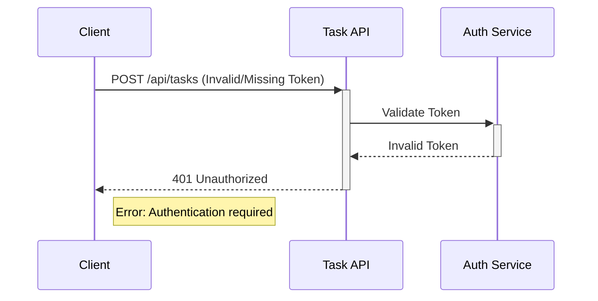
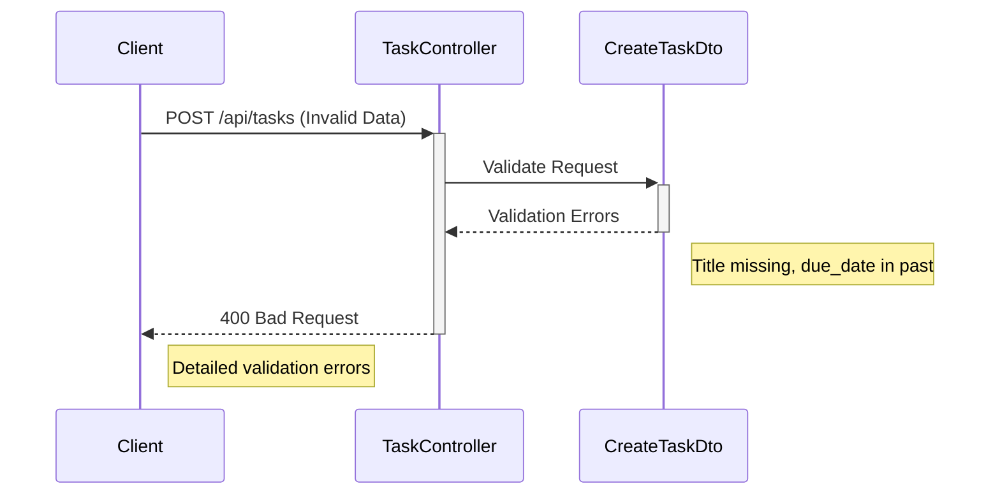
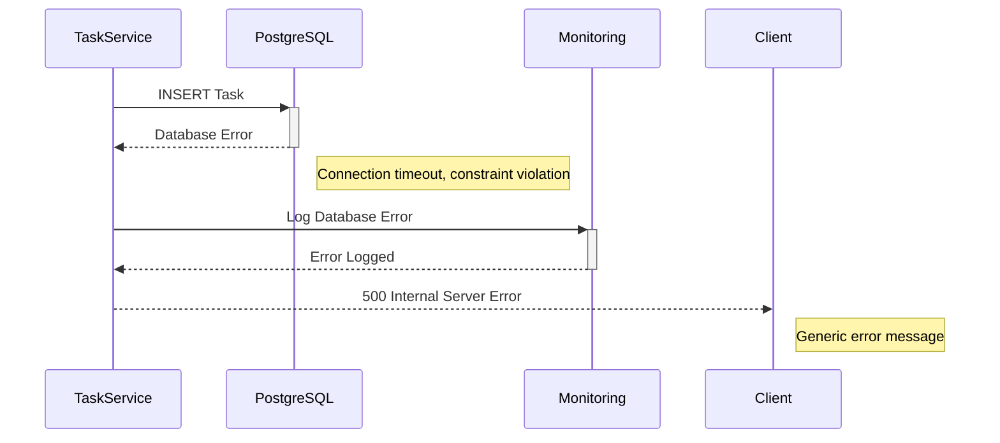
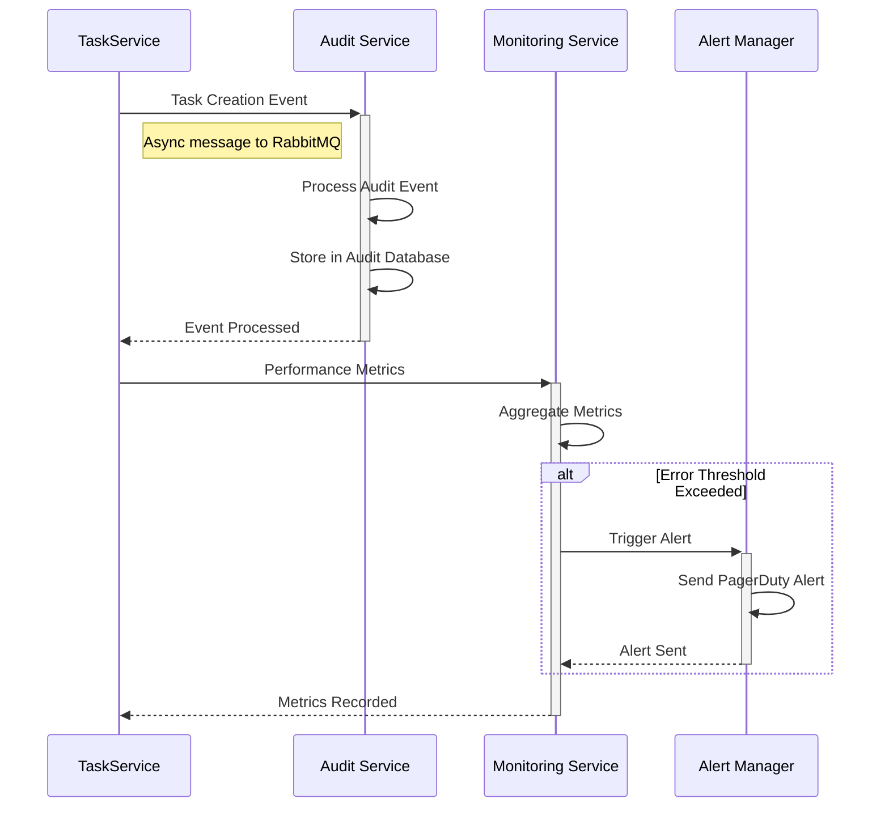

# Sequence Diagram - Task Management API System

## Version: 1.0
## Generated from: HLD Document - Task Management API System
## Date: 2024

---

## Overview
This sequence diagram illustrates the complete flow for the task creation endpoint (POST /api/tasks) as defined in DEMO-2350, showing interactions between all system components from request initiation to response delivery.

---

## Main Flow: Task Creation (POST /api/tasks)

```mermaid
sequenceDiagram
    participant Client as API Consumer
    participant LB as Load Balancer
    participant API as Task API Gateway
    participant Auth as Authentication Service
    participant Controller as TaskController
    participant DTO as CreateTaskDto
    participant Service as TaskService
    participant DB as PostgreSQL Database
    participant Audit as Audit Service
    participant Monitor as Monitoring Service

    Note over Client, Monitor: Task Creation Flow - DEMO-2350
    
    Client->>+LB: POST /api/tasks
    Note right of Client: Bearer Token in Header
    Note right of Client: JSON Payload with task data
    
    LB->>+API: Route Request
    API->>+Auth: Validate JWT Token
    
    alt Token Valid
        Auth-->>-API: User Context + Roles
        API->>+Controller: POST /api/tasks
        Note right of API: Request with User Context
        
        Controller->>+DTO: Validate Request Data
        Note right of Controller: CreateTaskDto validation
        
        alt Validation Success
            DTO-->>-Controller: Validated Data
            Controller->>+Service: createTask(createTaskDto)
            
            Service->>Service: Apply Business Rules
            Note right of Service: Due date validation
            Note right of Service: Data sanitization
            Note right of Service: User context validation
            
            alt Business Rules Pass
                Service->>+DB: INSERT Task Record
                DB-->>-Service: Task Created (with ID)
                
                Service->>+Audit: Log Task Creation Event
                Note right of Service: Async audit logging
                Audit-->>-Service: Event Logged
                
                Service-->>-Controller: Created Task Object
                Controller->>+Monitor: Log Success Metrics
                Monitor-->>-Controller: Metrics Recorded
                
                Controller-->>-API: 201 Created + Task Data
                API-->>-LB: Success Response
                LB-->>-Client: 201 Created Response
                Note left of Client: Task object with UUID, timestamps
                
            else Business Rules Fail
                Service-->>-Controller: Business Rule Violation
                Controller-->>API: 409 Conflict
                API-->>LB: Error Response
                LB-->>Client: 409 Conflict
                Note left of Client: Business rule error details
            end
            
        else Validation Failure
            DTO-->>-Controller: Validation Errors
            Controller->>+Monitor: Log Validation Error
            Monitor-->>-Controller: Error Logged
            
            Controller-->>-API: 400 Bad Request
            API-->>-LB: Validation Error Response
            LB-->>-Client: 400 Bad Request
            Note left of Client: Detailed validation errors
        end
        
    else Token Invalid
        Auth-->>-API: Authentication Failed
        API-->>-LB: 401 Unauthorized
        LB-->>-Client: 401 Unauthorized
        Note left of Client: Authentication required
    end
```

---

## Error Handling Flows

### Authentication Failure Flow


### Validation Error Flow


### Database Error Flow


---

## Rate Limiting Flow
```mermaid
sequenceDiagram
    participant Client
    participant API as Task API Gateway
    participant RateLimit as Rate Limiter
    
    Client->>+API: POST /api/tasks
    API->>+RateLimit: Check Rate Limit
    
    alt Within Limits
        RateLimit-->>-API: Request Allowed
        API-->>Client: Process Request
        Note right of Client: Normal flow continues
    else Rate Limit Exceeded
        RateLimit-->>-API: Rate Limit Exceeded
        API-->>-Client: 429 Too Many Requests
        Note right of Client: Retry-After header included
    end
```

---

## Monitoring and Audit Flow


---

## Integration Points

### Key Integration Flows:
1. **Authentication Service**: JWT token validation with 5-second timeout
2. **Database**: PostgreSQL with connection pooling (10-50 connections)
3. **Audit Service**: Asynchronous RabbitMQ messaging with at-least-once delivery
4. **Monitoring**: Real-time metrics collection and alerting

### Error Recovery Patterns:
- **Circuit Breaker**: Authentication service failures
- **Retry Logic**: Database connection issues (3 attempts, exponential backoff)
- **Dead Letter Queue**: Failed audit events
- **Graceful Degradation**: Continue operation with reduced functionality

---

## Performance Characteristics

- **Target Response Time**: < 200ms (95th percentile)
- **Throughput**: 1000 requests/second
- **Authentication Timeout**: 5 seconds
- **Database Timeout**: 30 seconds
- **Audit Processing**: Asynchronous (no impact on response time)

---

## Compliance and Security

- **Audit Trail**: All operations logged for 7-year retention
- **Data Encryption**: TLS 1.3 in transit, AES-256 at rest
- **Input Validation**: Multi-layer validation (DTO + Service + Database)
- **Role-Based Access**: Admin, User, ReadOnly roles enforced

---

**Generated by**: Senior Solution Architect and Integration Automation Specialist  
**Source**: HLD Document v1.0 - Task Management API System  
**Compliance**: TOGAF ADM, OpenAPI Standards, SOC2 Requirements  
**Last Updated**: 2024