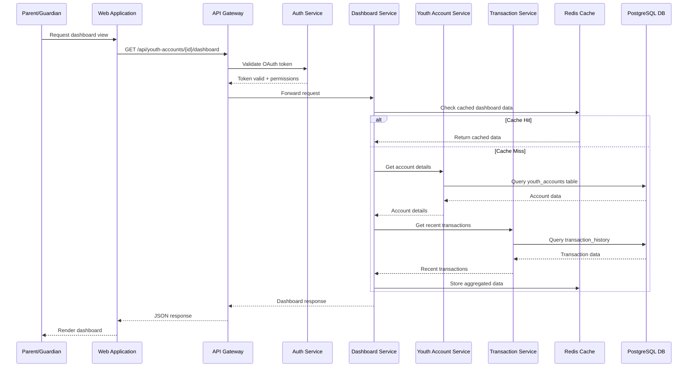
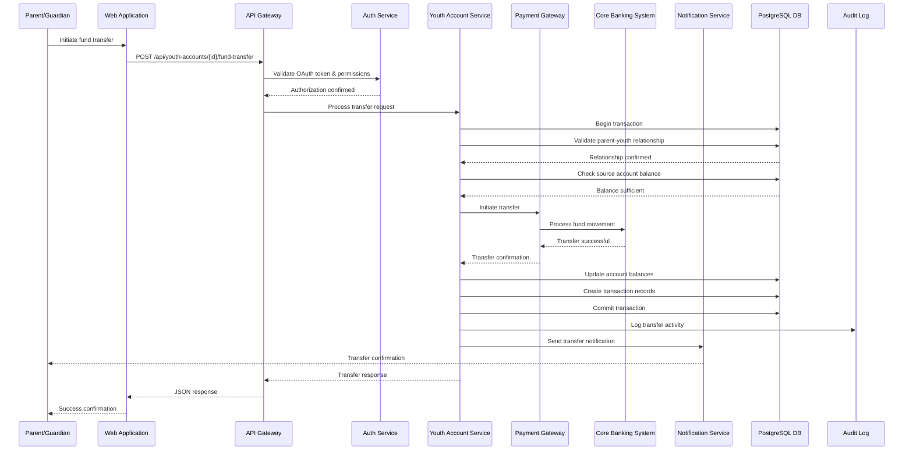
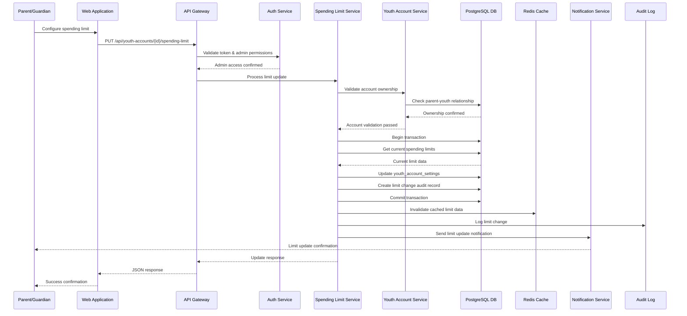
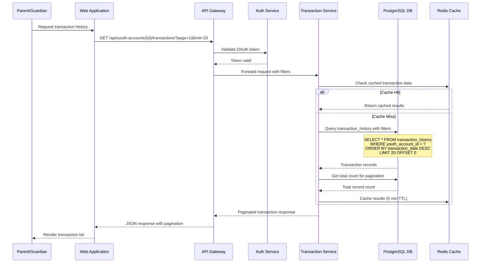
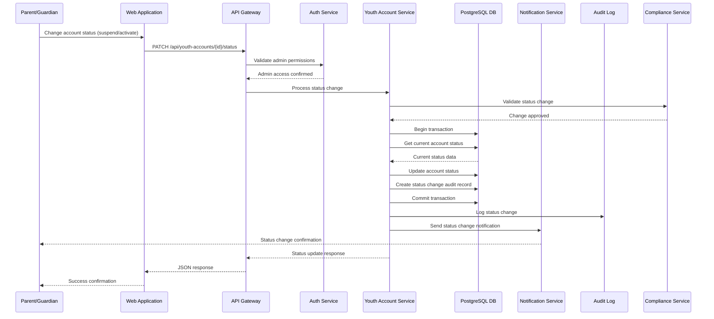
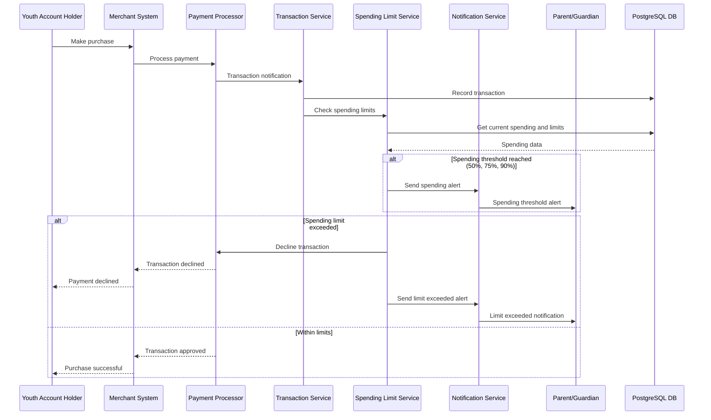
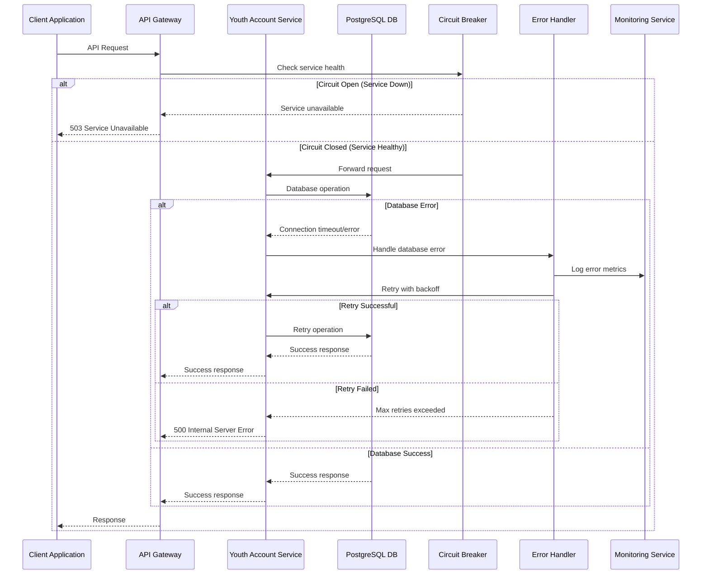
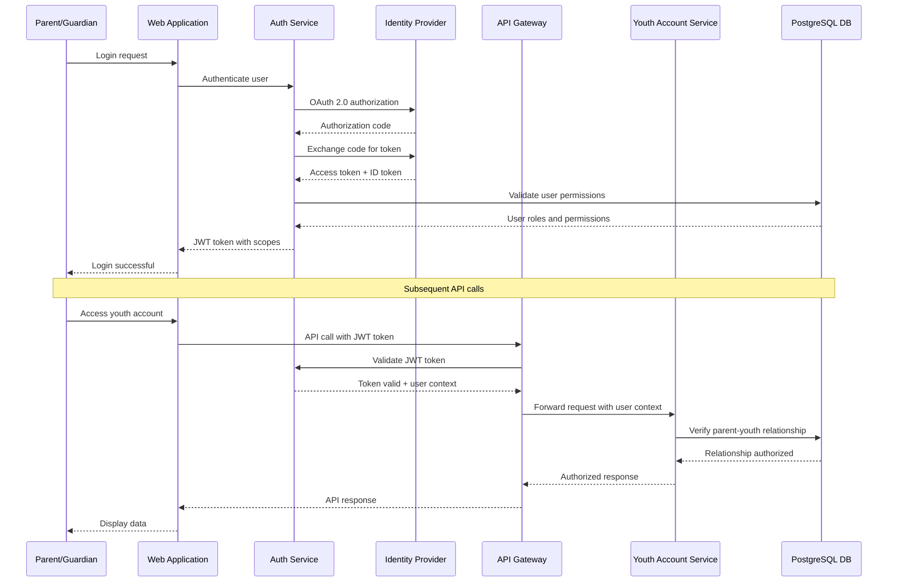

# Sequence Diagrams
# Youth Account Management System

## Overview
This document contains sequence diagrams for the Youth Account Management System, illustrating the flow of interactions between different system components for key use cases.

## 1. Youth Account Dashboard Retrieval

## 2. Fund Transfer Process

## 3. Spending Limit Configuration

## 4. Transaction History Retrieval

## 5. Account Status Management

## 6. Real-time Spending Alert Flow

## 7. Error Handling and Recovery Flow

## 8. Authentication and Authorization Flow

## Sequence Diagram Standards and Conventions

### Naming Conventions
- **Participants**: Use clear, descriptive names
- **Messages**: Use verb-noun format (e.g., "Get account details")
- **Return Messages**: Use dashed arrows for responses

### Error Handling
- All diagrams include error scenarios using `alt/else` blocks
- Timeout and retry mechanisms are explicitly shown
- Circuit breaker patterns are documented

### Security Considerations
- Authentication flows are detailed in every user-initiated sequence
- Authorization checks are explicitly shown
- Audit logging is included in all financial operations

### Performance Optimizations
- Caching strategies are illustrated
- Database transaction boundaries are marked
- Asynchronous operations are clearly indicated

### Compliance Requirements
- All financial transactions include audit trails
- Data validation steps are shown
- Regulatory compliance checks are included where applicable

---

**Document Version**: 1.0  
**Last Updated**: 2024-01-15  
**Author**: Senior Solution Architect  
**Review Status**: Approved  
**Compliance**: PCI-DSS, GDPR, SOX, Basel III