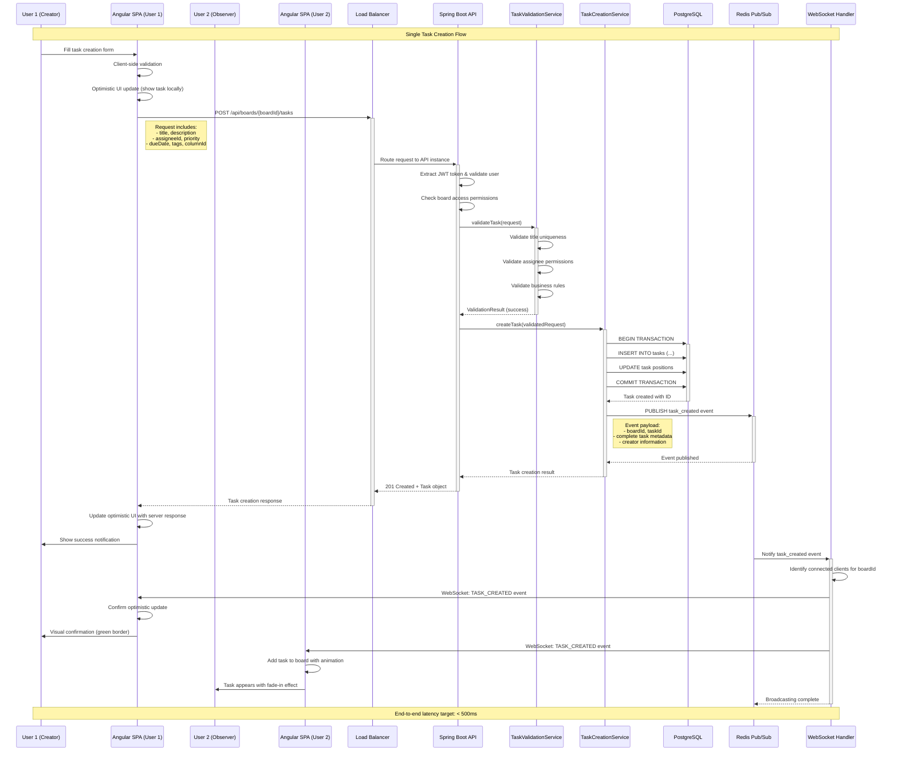
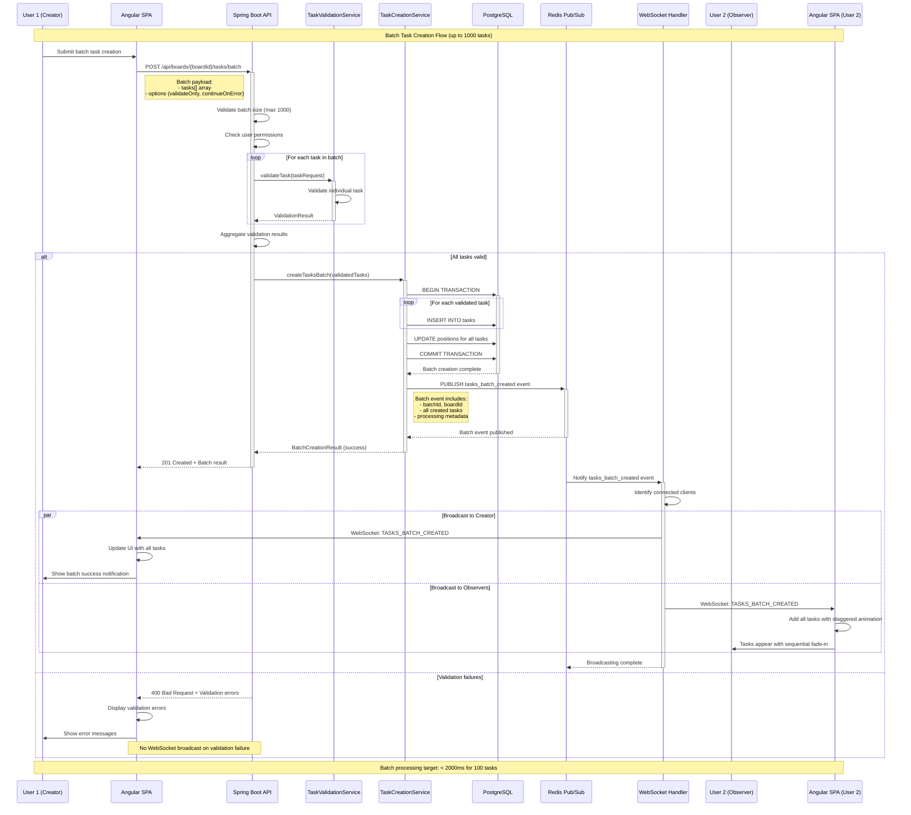
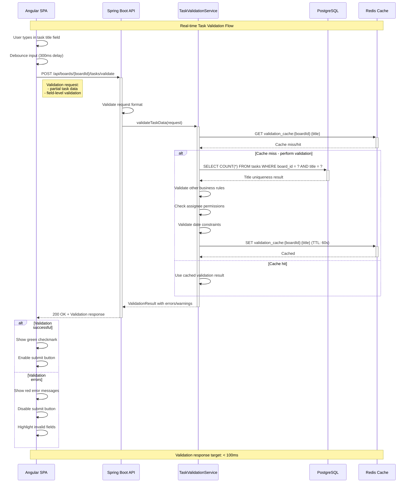
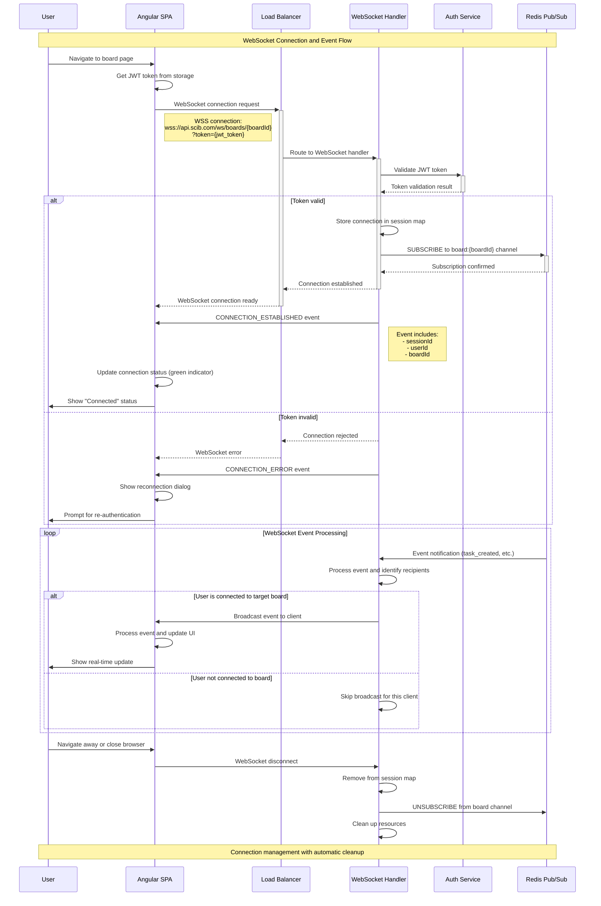
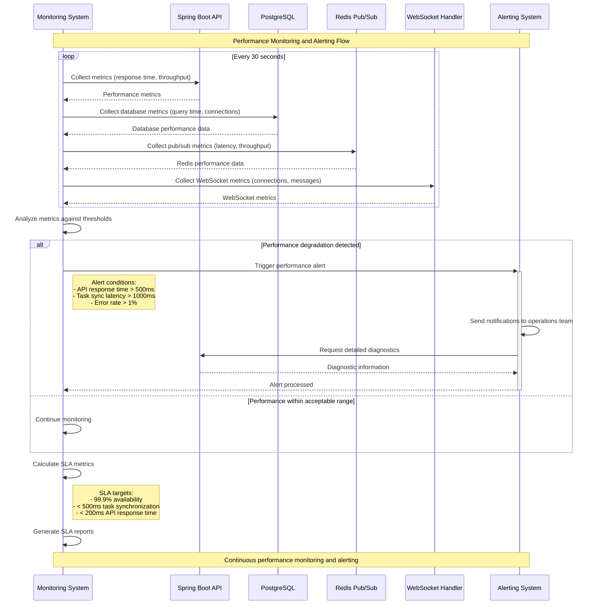

# Sequence Diagram - Task Creation Synchronization System

## Document Information
- **Version**: 1.0
- **Date**: 2024-12-19
- **System**: SCIB Task Management Platform
- **Story Reference**: DEMO-1841
- **Generated From**: HLD Document v1.0

---

## Overview
This sequence diagram illustrates the real-time task creation synchronization flow across all connected users in the SCIB Task Management System. The diagram shows the complete end-to-end process from task creation to real-time appearance on all user boards within 500ms.

---

## Single Task Creation Sequence



---

## Batch Task Creation Sequence



---

## Task Validation Sequence



---

## WebSocket Connection and Event Handling



---

## Error Handling and Recovery Sequence

```mermaid
sequenceDiagram
    participant UI as Angular SPA
    participant API as Spring Boot API
    participant VS as TaskValidationService
    participant TCS as TaskCreationService
    participant DB as PostgreSQL
    participant WS as WebSocket Handler
    
    Note over UI, WS: Error Handling and Recovery Flow
    
    %% Task Creation with Validation Error
    UI->>+API: POST /api/boards/{boardId}/tasks (invalid data)
    API->>+VS: validateTask(request)
    VS->>VS: Detect validation errors
    VS-->>-API: ValidationResult (errors)
    
    API-->>-UI: 400 Bad Request + Detailed errors
    Note right of API: Error response includes:<br/>- error code<br/>- field-specific messages<br/>- timestamp, requestId
    
    UI->>UI: Revert optimistic UI update
    UI->>UI: Display field-specific errors
    UI->>UI: Highlight invalid fields
    
    %% Task Creation with Database Error
    UI->>+API: POST /api/boards/{boardId}/tasks (valid data)
    API->>+VS: validateTask(request)
    VS-->>-API: ValidationResult (success)
    
    API->>+TCS: createTask(request)
    TCS->>+DB: BEGIN TRANSACTION
    TCS->>DB: INSERT INTO tasks
    DB-->>-TCS: Database constraint violation
    
    TCS->>DB: ROLLBACK TRANSACTION
    TCS-->>-API: TaskCreationException
    
    API-->>-UI: 409 Conflict + Error details
    UI->>UI: Revert optimistic update
    UI->>UI: Show error notification
    
    %% WebSocket Connection Failure
    WS->>UI: Connection lost (network issue)
    UI->>UI: Detect connection loss
    UI->>UI: Show "Reconnecting..." status
    
    loop Reconnection attempts (exponential backoff)
        UI->>WS: Attempt reconnection
        alt Reconnection successful
            WS->>UI: CONNECTION_ESTABLISHED
            UI->>UI: Update status to "Connected"
            UI->>API: Sync missed updates
            leave loop
        else Reconnection failed
            UI->>UI: Wait (backoff delay)
        end
    end
    
    %% Service Unavailable Error
    UI->>+API: POST /api/boards/{boardId}/tasks
    API-->>-UI: 503 Service Unavailable
    
    UI->>UI: Show "Service temporarily unavailable"
    UI->>UI: Enable retry button
    UI->>UI: Queue request for retry
    
    Note over UI, WS: Graceful error handling with user feedback
```

---

## Performance and Monitoring Sequence



---

## Sequence Diagram Summary

### Key Flows Covered
1. **Single Task Creation**: Complete end-to-end flow with real-time synchronization
2. **Batch Task Creation**: Bulk processing with transaction management
3. **Task Validation**: Real-time validation with caching optimization
4. **WebSocket Management**: Connection establishment and event broadcasting
5. **Error Handling**: Comprehensive error scenarios and recovery mechanisms
6. **Performance Monitoring**: Continuous monitoring and alerting

### Performance Targets
- **Task Creation**: < 200ms API response time
- **Real-time Sync**: < 500ms end-to-end latency
- **Batch Processing**: < 2000ms for 100 tasks
- **Validation**: < 100ms response time
- **WebSocket Events**: < 50ms broadcast latency

### Architecture Decision Records (ADRs) Implemented
- **DEMO-1887**: Optimistic UI updates with server confirmation
- **DEMO-1888**: Comprehensive validation service
- **DEMO-1889**: Real-time synchronization architecture
- **DEMO-1890**: Database constraints and transaction management
- **DEMO-1891**: Batch processing capabilities
- **DEMO-1892**: Error handling and recovery mechanisms

### Compliance and Security
- JWT-based authentication for all operations
- Role-based access control enforcement
- Comprehensive audit logging
- Input validation and sanitization
- Secure WebSocket connections (WSS)

---

**Document Status**: Final v1.0  
**Generated From**: HLD Document v1.0  
**Compliance**: TOGAF, C4 Model, Enterprise Standards  
**Last Updated**: 2024-12-19