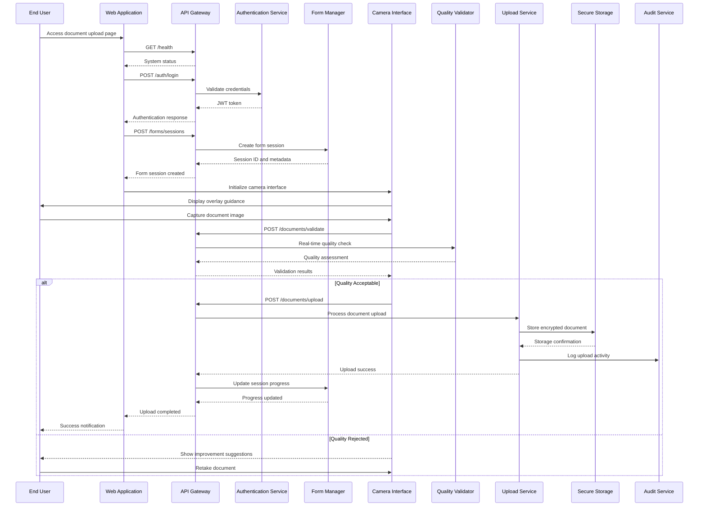
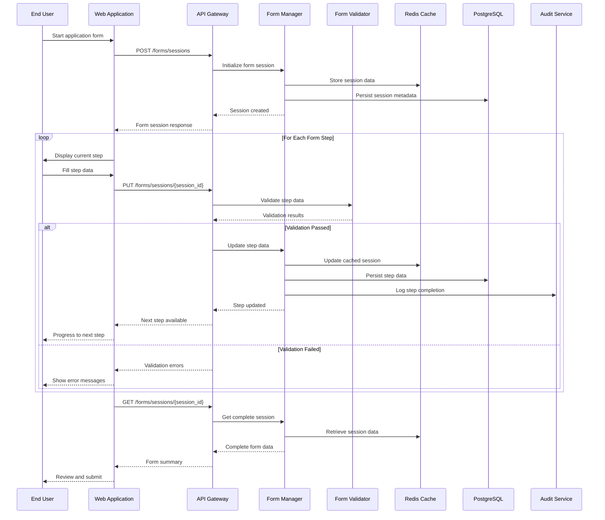
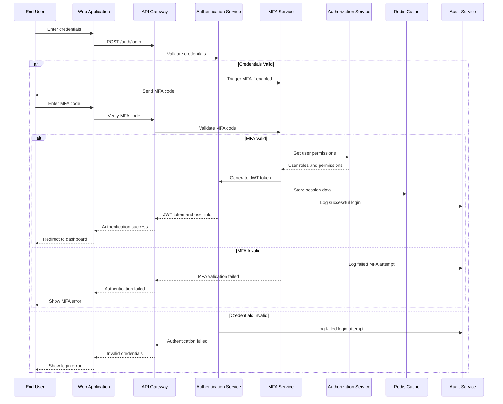
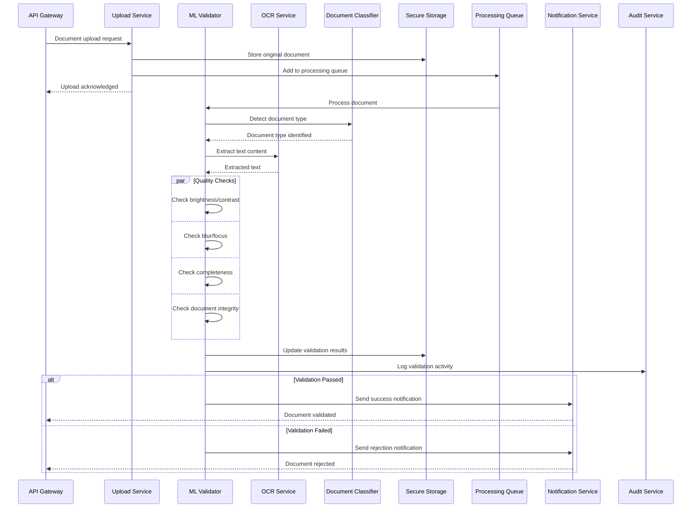
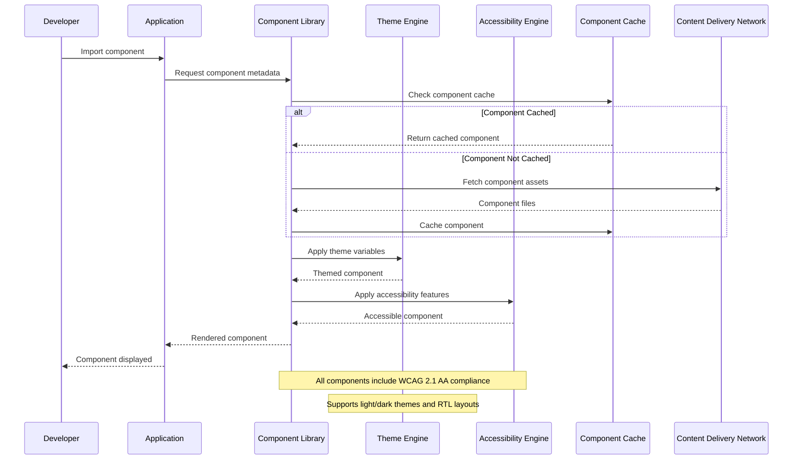
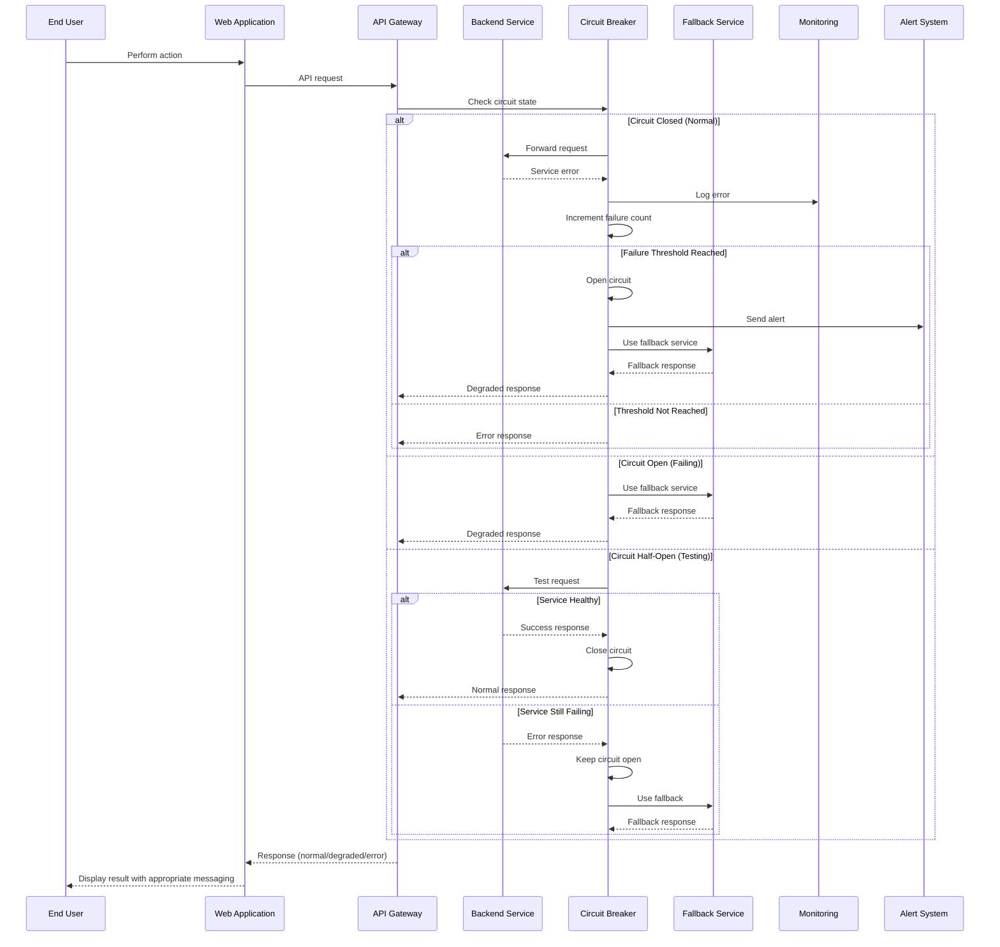
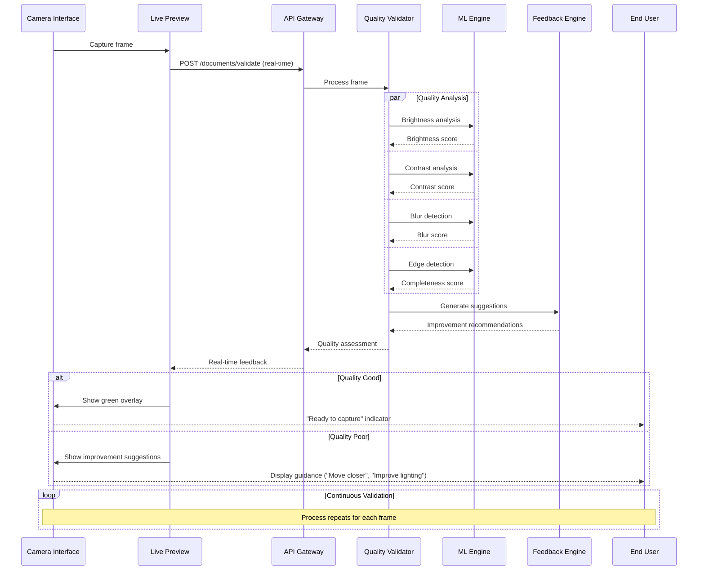

# Sequence Diagrams
## Document Upload Interface with Quality Validation System

### Version: 1.0
### Date: 2024
### Generated from: HLD Document and API Contract Outline

---

## 1. Document Upload Flow Sequence Diagram

## 2. Multi-Step Form Navigation Sequence Diagram

## 3. User Authentication and Authorization Sequence Diagram

## 4. Document Processing and Validation Sequence Diagram

## 5. Component Library Integration Sequence Diagram

## 6. Error Handling and Recovery Sequence Diagram

## 7. Real-time Quality Validation Sequence Diagram

---

## Sequence Diagram Conventions

### Participants
- **End User**: The person using the application
- **Web Application**: Frontend React application
- **API Gateway**: Central API management layer
- **Services**: Backend microservices (Authentication, Form Manager, etc.)
- **Storage**: Data persistence layers (PostgreSQL, Redis, S3)
- **External Services**: Third-party integrations

### Message Types
- **Solid Arrow (→)**: Synchronous request
- **Dashed Arrow (-->>)**: Response
- **Note**: Additional context or business rules
- **Alt/Else**: Conditional logic flows
- **Par/And**: Parallel processing
- **Loop**: Iterative processes

### Error Handling Patterns
- Circuit breaker pattern for service failures
- Graceful degradation with fallback services
- Comprehensive audit logging for all operations
- User-friendly error messaging

### Security Considerations
- All API calls include JWT authentication
- Sensitive data is encrypted in transit and at rest
- Audit logging for all user actions
- Rate limiting and input validation

### Performance Optimizations
- Caching strategies for frequently accessed data
- Parallel processing where possible
- Real-time feedback for better user experience
- Asynchronous processing for heavy operations

---

*These sequence diagrams provide comprehensive coverage of the Document Upload Interface with Quality Validation System, showing detailed interaction flows between all system components while maintaining enterprise architecture standards for security, performance, and reliability.*