# Sequence Diagram - Task Management API
# Task Creation Endpoint (POST /api/tasks)

## Document Information
- **Version**: 1.0
- **Date**: 2024-01-15
- **Generated From**: HLD Document (DEMO-2350)
- **API Endpoint**: POST /api/tasks
- **Purpose**: Illustrates the complete flow for task creation with authentication, validation, and business logic

---

## Overview

This sequence diagram shows the complete interaction flow for creating a task through the Task Management API, including authentication, validation, business logic processing, and data persistence.

## Key Components Involved

- **API Consumer**: Client application (Mobile App, Web Client, Integration Service)
- **Load Balancer**: AWS ALB/NGINX for request distribution
- **TaskController**: HTTP request handler and response formatter
- **Authentication Service**: JWT token validation and user context extraction
- **CreateTaskDto**: Request validation and data transformation
- **TaskService**: Business logic implementation and rule enforcement
- **TaskRepository**: Data access layer and database operations
- **Database**: PostgreSQL database for task persistence
- **Audit Service**: Compliance logging for all operations
- **Rate Limiter**: DoS protection and request throttling

---

## Sequence Diagram

```mermaid
sequenceDiagram
    participant Client as API Consumer
    participant LB as Load Balancer
    participant Controller as TaskController
    participant Auth as Authentication Service
    participant RateLimit as Rate Limiter
    participant DTO as CreateTaskDto
    participant Service as TaskService
    participant Repo as TaskRepository
    participant DB as PostgreSQL Database
    participant Audit as Audit Service
    
    Note over Client, Audit: Task Creation Flow - POST /api/tasks
    
    %% 1. Initial Request
    Client->>+LB: POST /api/tasks
    Note right of Client: Headers: Authorization: Bearer {jwt_token}<br/>Content-Type: application/json<br/>X-Request-ID: uuid
    
    LB->>+Controller: Route request to available instance
    Note right of LB: SSL termination<br/>Health check routing
    
    %% 2. Authentication Phase
    Controller->>+Auth: Validate JWT token
    Note right of Controller: Extract Bearer token from Authorization header
    
    alt Valid Token
        Auth-->>-Controller: User context (ID, roles, permissions)
        Note left of Auth: Token validation successful<br/>User has 'task:create' permission
    else Invalid/Expired Token
        Auth-->>Controller: 401 Unauthorized
        Controller-->>Client: 401 Unauthorized Response
        Note right of Controller: {"error": "Unauthorized",<br/>"message": "Invalid or missing token"}
    end
    
    %% 3. Rate Limiting Check
    Controller->>+RateLimit: Check rate limit for user
    Note right of Controller: Sliding window algorithm<br/>100 requests/minute per user
    
    alt Within Rate Limit
        RateLimit-->>-Controller: Request allowed
        Note left of RateLimit: Remaining: 99/100<br/>Reset time: 60 seconds
    else Rate Limit Exceeded
        RateLimit-->>Controller: 429 Too Many Requests
        Controller-->>Client: 429 Rate Limit Exceeded
        Note right of Controller: {"error": "Rate Limit Exceeded",<br/>"retryAfter": 60}
    end
    
    %% 4. Request Validation Phase
    Controller->>+DTO: Validate request payload
    Note right of Controller: Transform HTTP request to CreateTaskDto
    
    DTO->>DTO: Field-level validation
    Note right of DTO: - Title: IsNotEmpty, MaxLength(200)<br/>- Description: MaxLength(1000)<br/>- Status: IsEnum(TaskStatus)<br/>- Priority: IsEnum(TaskPriority)<br/>- DueDate: IsDateString, future date<br/>- AssignedTo: IsOptional, IsUUID
    
    alt Validation Successful
        DTO-->>-Controller: Validated CreateTaskDto
        Note left of DTO: All validation rules passed<br/>Data sanitized (XSS prevention)
    else Validation Failed
        DTO-->>Controller: Validation errors
        Controller-->>Client: 400 Bad Request
        Note right of Controller: {"error": "Validation Error",<br/>"details": [{"field": "title",<br/>"message": "Title is required"}]}
    end
    
    %% 5. Business Logic Phase
    Controller->>+Service: createTask(createTaskDto, userContext)
    Note right of Controller: Pass validated DTO and user context
    
    %% Business Rule Validations
    Service->>Service: Validate business rules
    Note right of Service: - Future due date validation<br/>- User existence check<br/>- Permission verification<br/>- Duplicate title check<br/>- Workload limits (max 50 active tasks)
    
    alt Business Rules Valid
        Note right of Service: All business validations passed
    else Business Rule Violation
        Service-->>Controller: 422 Unprocessable Entity
        Controller-->>Client: 422 Business Rule Violation
        Note right of Controller: {"error": "Business Rule Violation",<br/>"message": "Due date cannot be in the past",<br/>"code": "INVALID_DUE_DATE"}
    end
    
    %% Data Sanitization
    Service->>Service: Sanitize input data
    Note right of Service: - HTML encoding<br/>- Script tag removal<br/>- SQL injection prevention
    
    %% 6. Data Persistence Phase
    Service->>+Repo: save(taskEntity)
    Note right of Service: Transform DTO to Task entity<br/>Set metadata (createdAt, createdBy)
    
    Repo->>+DB: BEGIN TRANSACTION
    Note right of Repo: Start database transaction for ACID compliance
    
    Repo->>DB: INSERT INTO tasks (...)
    Note right of Repo: Parameterized query to prevent SQL injection
    
    alt Database Operation Successful
        DB-->>Repo: Task created successfully
        Note left of DB: New task ID generated<br/>Timestamps set automatically
        
        Repo->>DB: COMMIT TRANSACTION
        DB-->>Repo: Transaction committed
        
        Repo-->>-Service: Created task entity
        Note left of Repo: Return complete task with ID and timestamps
    else Database Error
        DB-->>Repo: Database error
        Repo->>DB: ROLLBACK TRANSACTION
        DB-->>Repo: Transaction rolled back
        
        Repo-->>Service: Database error
        Service-->>Controller: 500 Internal Server Error
        Controller-->>Client: 500 Internal Server Error
        Note right of Controller: {"error": "Internal Server Error",<br/>"message": "An unexpected error occurred"}
    end
    
    %% 7. Audit Logging Phase
    Service->>+Audit: Log task creation event
    Note right of Service: Async audit logging<br/>No impact on response time
    
    Audit->>Audit: Create audit log entry
    Note right of Audit: - Entity: Task<br/>- Action: CREATE<br/>- User: {userId}<br/>- Timestamp: ISO 8601<br/>- New values: {task data}
    
    Audit-->>-Service: Audit logged successfully
    Note left of Audit: Immutable audit trail created<br/>Compliance requirements met
    
    %% 8. Response Formation
    Service-->>-Controller: Created task response
    Note left of Service: Transform entity to response DTO<br/>Include all required fields
    
    Controller->>Controller: Format HTTP response
    Note right of Controller: - Status: 201 Created<br/>- Headers: X-Request-ID, X-RateLimit-*<br/>- Body: Task response JSON
    
    Controller-->>-LB: 201 Created Response
    Note left of Controller: {"id": "uuid",<br/>"title": "...",<br/>"status": "TODO",<br/>"createdAt": "2024-01-15T14:30:00Z"}
    
    LB-->>-Client: 201 Created Response
    Note left of LB: Response headers added<br/>Connection closed gracefully
    
    %% 9. Background Processes (Async)
    Note over Service, Audit: Asynchronous Operations
    
    Service-->>Service: Update user task count cache
    Note right of Service: Redis cache update for performance
    
    Service-->>Service: Trigger notification (if assigned)
    Note right of Service: Send task assignment notification<br/>via message queue
```

---

## Flow Description

### Phase 1: Request Initiation
1. **Client Request**: API consumer sends POST request to /api/tasks with JWT token and task data
2. **Load Balancing**: Request is routed through load balancer to available API instance
3. **SSL Termination**: HTTPS connection terminated at load balancer level

### Phase 2: Security Validation
4. **Authentication**: JWT token extracted and validated against Authentication Service
5. **Authorization**: User permissions checked for 'task:create' capability
6. **Rate Limiting**: Request count validated against user-specific rate limits (100/minute)

### Phase 3: Input Validation
7. **DTO Validation**: Request payload validated using CreateTaskDto with class-validator decorators
8. **Field Validation**: Each field validated for type, length, format, and business rules
9. **Data Sanitization**: Input sanitized to prevent XSS and injection attacks

### Phase 4: Business Logic Processing
10. **Business Rules**: Advanced validation including future date checks, user existence, workload limits
11. **Data Transformation**: DTO transformed to internal Task entity with metadata
12. **Permission Context**: User context applied for audit trail and ownership

### Phase 5: Data Persistence
13. **Transaction Management**: Database transaction initiated for ACID compliance
14. **Data Storage**: Task entity persisted using parameterized queries
15. **Transaction Commit**: Changes committed or rolled back based on success/failure

### Phase 6: Audit and Compliance
16. **Audit Logging**: Comprehensive audit trail created for compliance (GDPR, SOC 2, ISO 27001)
17. **Immutable Records**: Audit logs stored as immutable records with full context
18. **Async Processing**: Audit logging performed asynchronously to maintain performance

### Phase 7: Response Generation
19. **Response Formation**: Created task entity transformed to response DTO
20. **HTTP Response**: Proper HTTP 201 status with complete task data
21. **Header Management**: Rate limiting and correlation headers included

### Phase 8: Background Operations
22. **Cache Updates**: Performance caches updated asynchronously
23. **Notifications**: Task assignment notifications queued for delivery
24. **Metrics Collection**: Performance and business metrics recorded

---

## Error Handling Flows

### Authentication Errors (401)
- Invalid or expired JWT token
- Missing Authorization header
- Token signature validation failure

### Authorization Errors (403)
- User lacks 'task:create' permission
- Account suspended or deactivated
- Role-based access control violation

### Validation Errors (400)
- Missing required fields (title, status, priority)
- Invalid field formats or lengths
- Enum value violations

### Business Rule Violations (422)
- Due date in the past
- Assigned user does not exist
- User workload limits exceeded
- Duplicate task titles

### Rate Limiting Errors (429)
- Request rate exceeds 100/minute per user
- Sliding window algorithm enforcement
- Retry-After header provided

### System Errors (500)
- Database connection failures
- External service unavailability
- Unexpected application errors

---

## Performance Characteristics

- **Target Response Time**: < 200ms (95th percentile)
- **Authentication Overhead**: ~10ms for token validation
- **Validation Processing**: ~5ms for DTO validation
- **Business Logic**: ~15ms for rule validation
- **Database Operation**: ~50ms for transaction completion
- **Audit Logging**: Asynchronous (no response time impact)

---

## Security Measures

- **TLS 1.3**: All communication encrypted in transit
- **JWT Validation**: Token signature and expiration verification
- **Input Sanitization**: XSS and injection attack prevention
- **Parameterized Queries**: SQL injection protection
- **Rate Limiting**: DoS attack mitigation
- **Audit Trail**: Complete operation logging for compliance

---

## Compliance Features

- **GDPR**: Data minimization and audit trail
- **ISO 27001**: Security controls and access management
- **SOC 2**: Security and availability controls
- **Audit Logging**: Immutable compliance records
- **Data Retention**: Policy-based log retention

---

**Diagram Status**: Generated from HLD Document
**ADR Reference**: DEMO-2350
**Last Updated**: 2024-01-15
**Review Required**: Solution Architect, Security Team