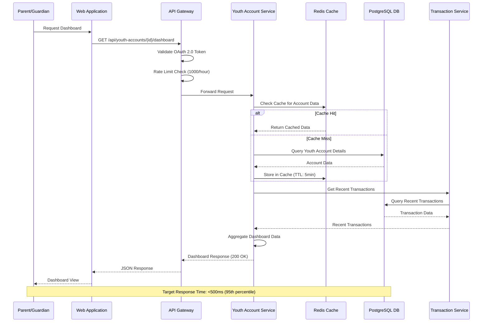
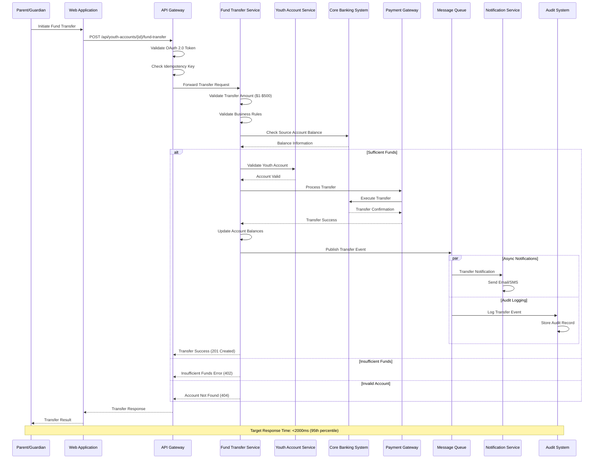
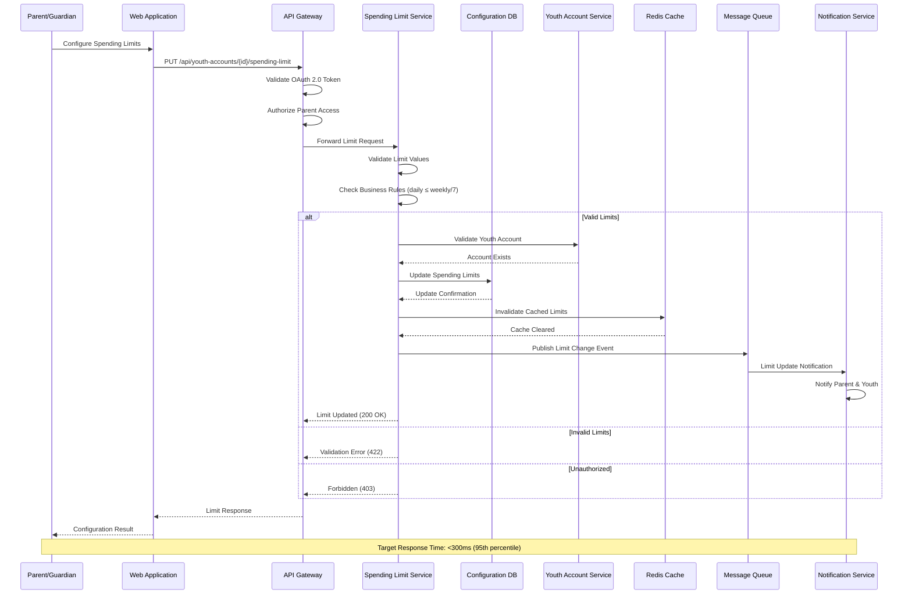
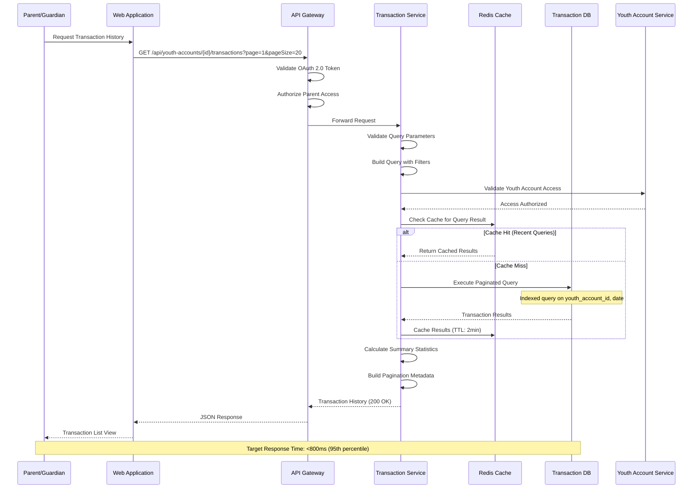
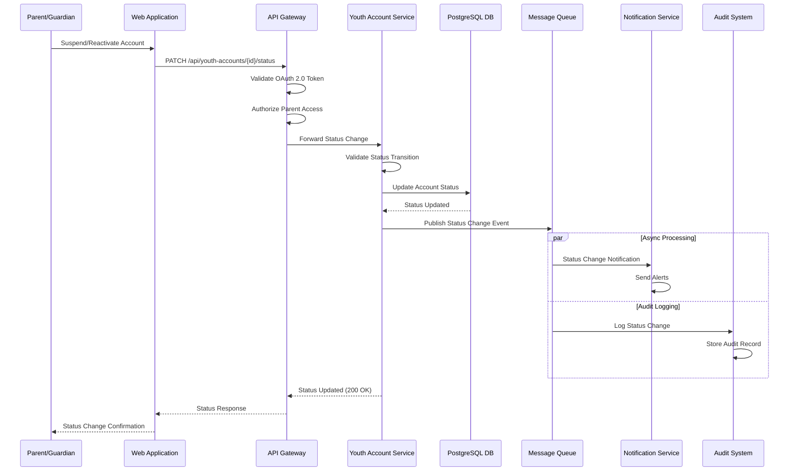
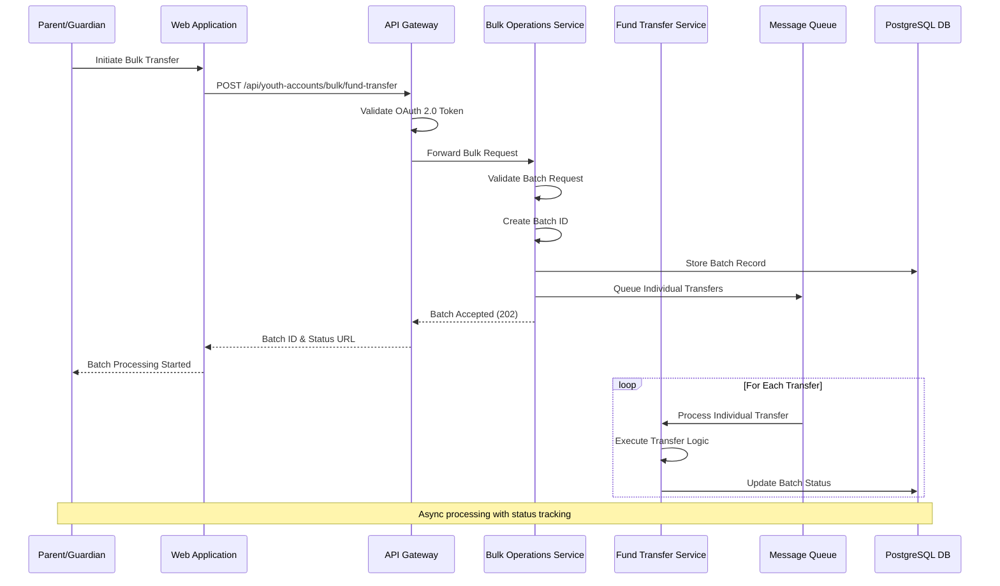
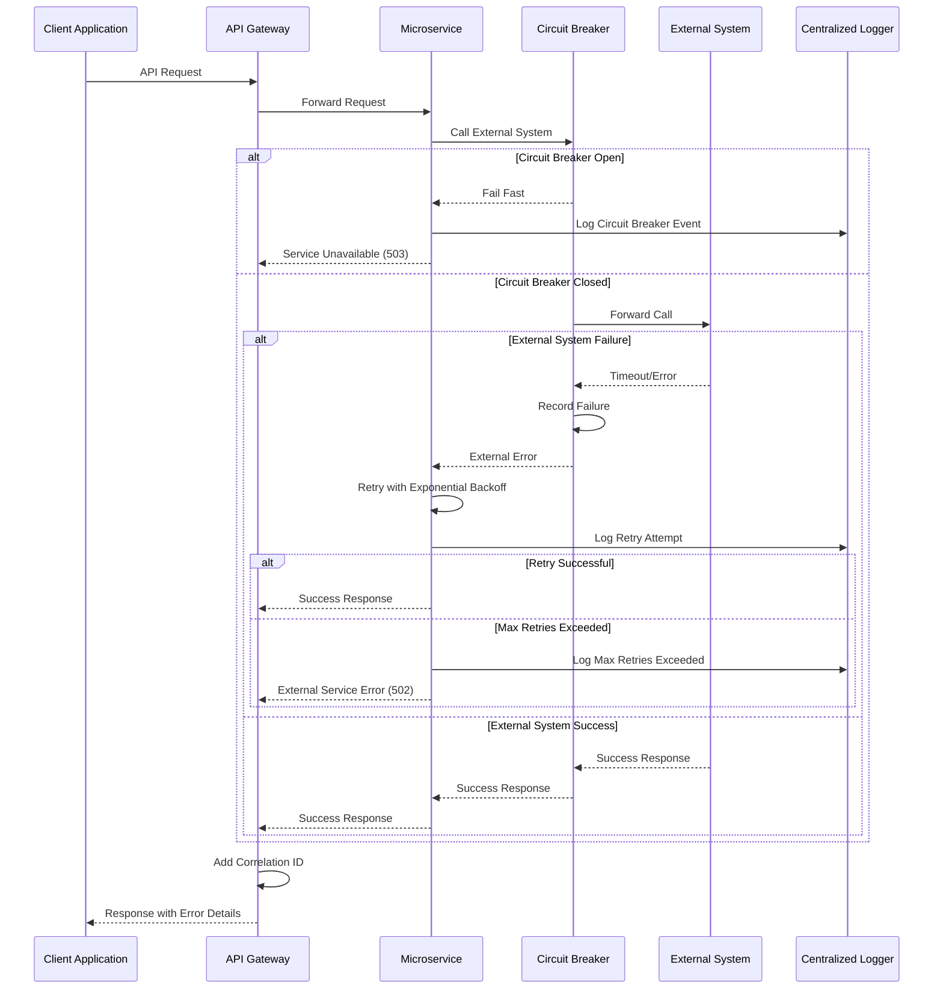
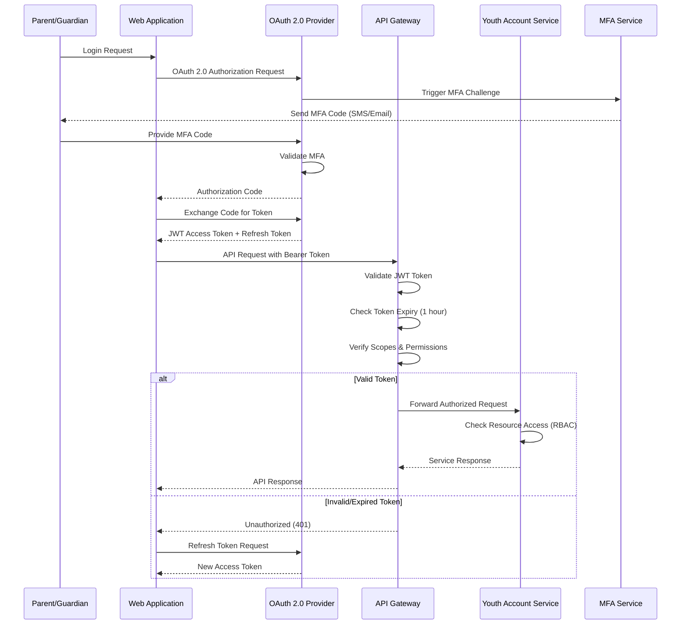

# Sequence Diagrams
## Youth Account Management System

### Document Information
- **Version**: 1.0
- **Date**: 2024
- **Project**: Youth Account Management System (SCIB-25)
- **Generated From**: HLD Document and API Contract Outline

---

## 1. Youth Account Dashboard Sequence
**Mapped to**: SCIB-26 - Dashboard API

---

## 2. Fund Transfer Sequence
**Mapped to**: SCIB-27 - Fund Transfer API

---

## 3. Spending Limit Configuration Sequence
**Mapped to**: SCIB-28 - Spending Limit API

---

## 4. Transaction History Retrieval Sequence
**Mapped to**: SCIB-29 - Transaction History API

---

## 5. Account Status Management Sequence

---

## 6. Bulk Fund Transfer Sequence

---

## 7. Error Handling Sequence

---

## 8. Authentication & Authorization Sequence

---

## Sequence Diagram Standards & Compliance

### Design Principles
- **Security First**: All sequences include OAuth 2.0 authentication validation
- **Performance Optimization**: Caching strategies clearly depicted
- **Error Handling**: Comprehensive error scenarios included
- **Audit Compliance**: Audit logging shown in all financial transactions
- **Async Processing**: Message queue patterns for non-blocking operations

### Performance Targets
- **Dashboard API**: <500ms (95th percentile) - SCIB-26
- **Fund Transfer API**: <2000ms (95th percentile) - SCIB-27
- **Spending Limit API**: <300ms (95th percentile) - SCIB-28
- **Transaction History API**: <800ms (95th percentile) - SCIB-29

### Security Features
- **OAuth 2.0 + JWT**: Industry standard authentication
- **Multi-Factor Authentication**: Required for parent accounts
- **Rate Limiting**: 1000 requests/hour per user
- **RBAC**: Role-based access control for resource protection
- **Audit Logging**: Complete audit trail for compliance

### Reliability Patterns
- **Circuit Breaker**: Prevents cascade failures
- **Retry Logic**: Exponential backoff for transient failures
- **Graceful Degradation**: Non-critical features fail gracefully
- **Correlation IDs**: Request tracing across distributed services

---

**Document Approval**
- **Solution Architect**: [Generated from HLD Document]
- **API Architect**: [Based on API Contract Outline]
- **Security Architect**: [Security patterns included]
- **Performance Engineer**: [Performance targets specified]

**Traceability**
- **Source**: HLD Document (API Development/Requirement Documents/HLDDocument.txt)
- **API Contract**: API Contract Outline (API Development/Requirement Documents/APIContractOutline.txt)
- **JIRA Mappings**: SCIB-25 through SCIB-30
- **Generated**: 2024 via Enterprise Architecture Automation