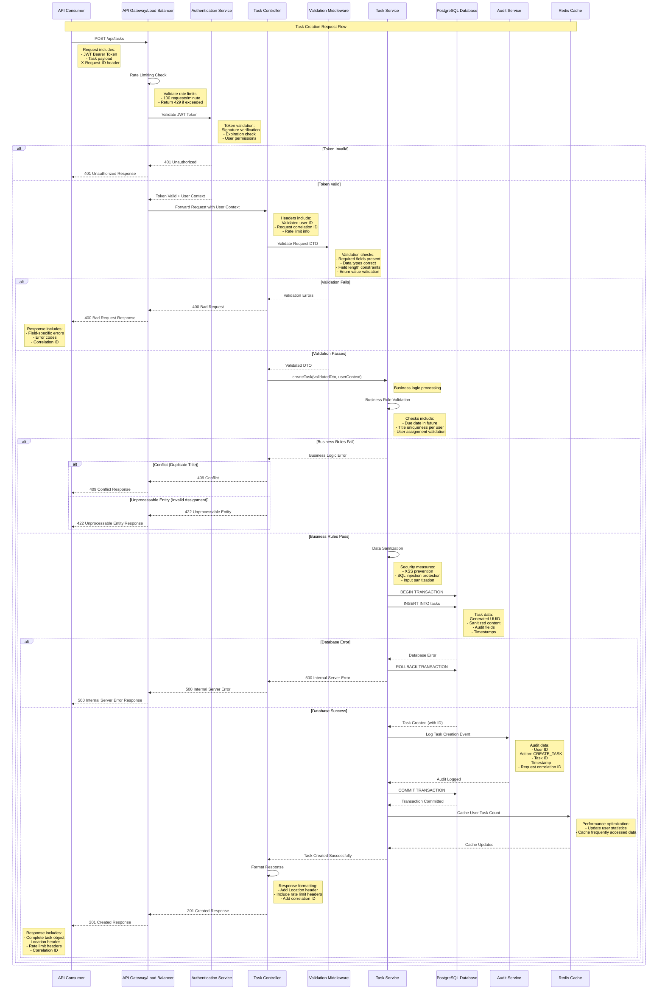
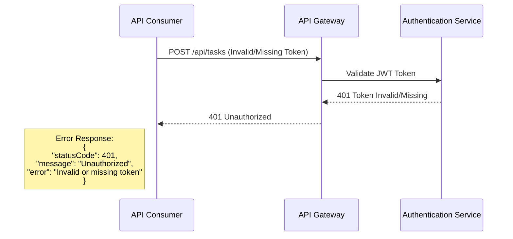
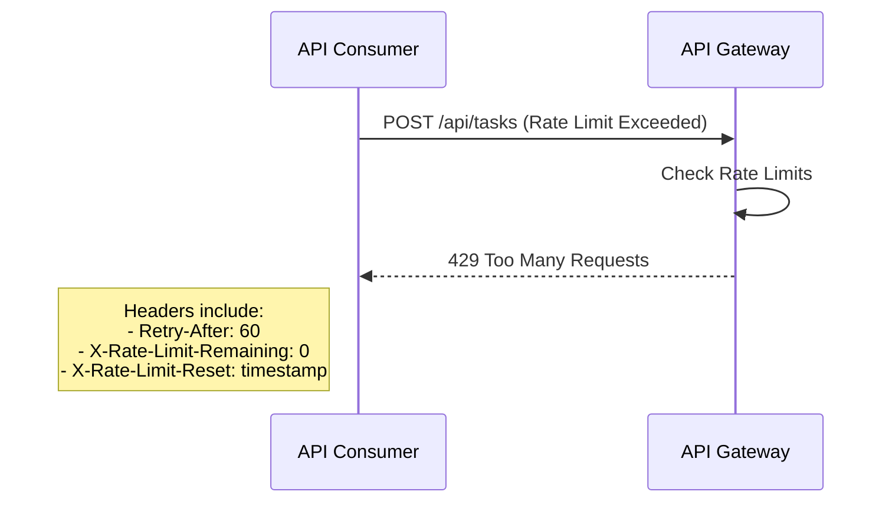
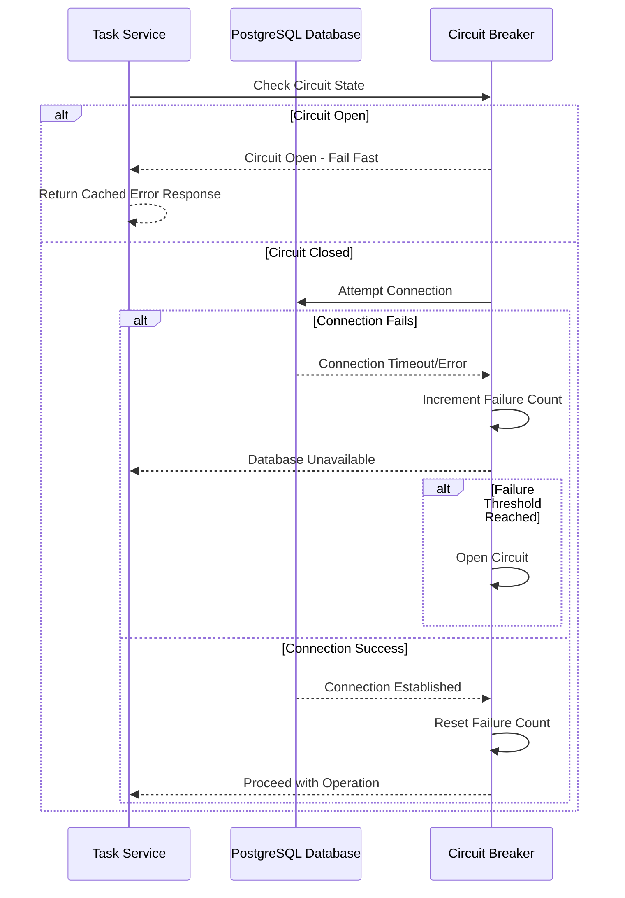
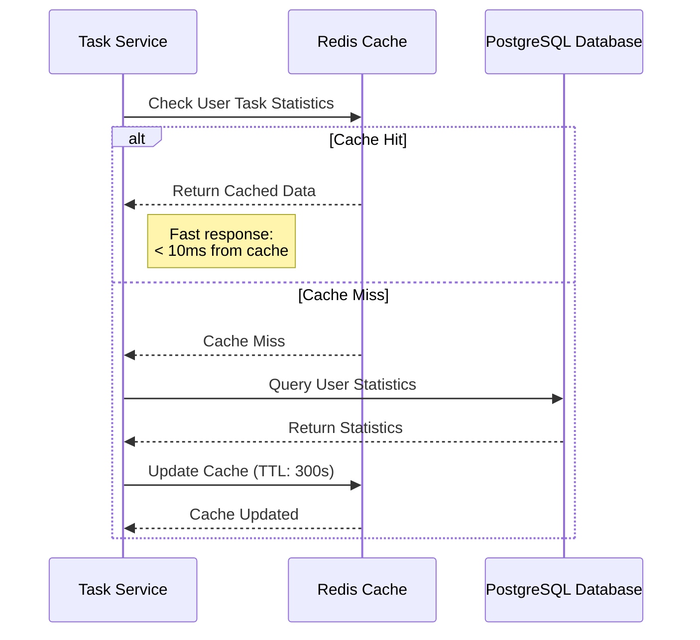
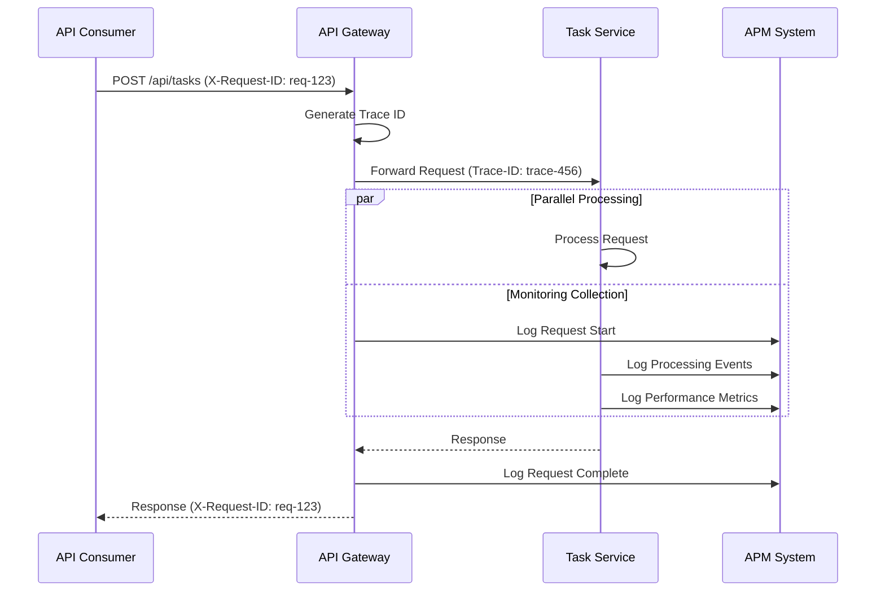
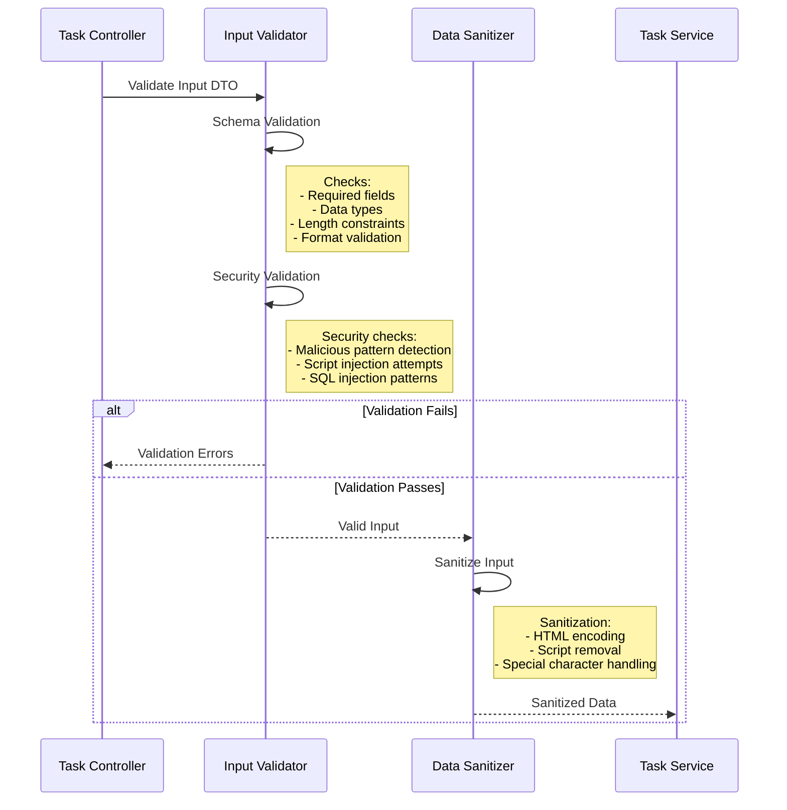

# Sequence Diagram - Task Management API
## Task Creation Flow

### Version: 1.0
### Date: 2024
### Generated from: HLD Document and API Contract Outline

---

## Overview

This sequence diagram illustrates the complete flow for creating a task through the Task Management API, including authentication, validation, business logic processing, data persistence, and audit logging.

## Primary Flow: Task Creation

## Error Handling Flows

### Authentication Error Flow

### Rate Limiting Flow

### Database Connection Error Flow

## Performance Optimization Flows

### Caching Strategy Flow

## Monitoring and Observability

### Request Tracing Flow

## Security Flow

### Input Sanitization and Validation Flow

---

## Flow Characteristics

### Performance Targets
- **Total Response Time**: < 200ms (P95)
- **Authentication**: < 50ms
- **Validation**: < 20ms
- **Business Logic**: < 50ms
- **Database Operation**: < 80ms
- **Audit Logging**: Asynchronous (non-blocking)

### Error Recovery
- **Retry Strategy**: Exponential backoff for transient failures
- **Circuit Breaker**: Fail-fast for downstream service failures
- **Graceful Degradation**: Partial functionality during service outages

### Security Measures
- **Authentication**: JWT token validation on every request
- **Authorization**: Role-based access control (RBAC)
- **Input Validation**: Multi-layer validation (DTO + Business + Database)
- **Audit Trail**: Complete audit logging for compliance

### Scalability Considerations
- **Stateless Design**: No server-side session state
- **Horizontal Scaling**: Load balancing across multiple instances
- **Database Scaling**: Read replicas for query optimization
- **Caching**: Redis for performance optimization

---

## Compliance and Audit

### Audit Trail Requirements
- **User Actions**: All user actions logged with correlation IDs
- **Data Changes**: Before/after values for data modifications
- **Security Events**: Authentication, authorization, and access attempts
- **System Events**: Errors, performance issues, and system state changes

### GDPR Compliance
- **Data Minimization**: Only necessary data collected and processed
- **Consent Tracking**: User consent logged and tracked
- **Right to be Forgotten**: Support for data deletion requests
- **Data Portability**: Export capabilities for user data

---

**Document Metadata**
- **Generated From**: HLD Document v1.0, API Contract Outline v1.0
- **Architecture Pattern**: Layered Architecture with Microservices
- **Technology Stack**: Node.js/NestJS, PostgreSQL, Redis, JWT
- **Compliance**: GDPR, ISO27001, SOC2, PCI-DSS
- **Performance Target**: < 200ms response time, 99.9% availability
- **Security**: JWT authentication, input validation, audit logging