# Sequence Diagrams
## Task Creation API Endpoint Implementation

### Version: 1.0
### Document ID: SEQ-DEMO-2350
### Date: 2024
### Generated from: HLD Document and API Contract Outline

---

## 1. Task Creation Sequence Diagram

### 1.1 Successful Task Creation Flow

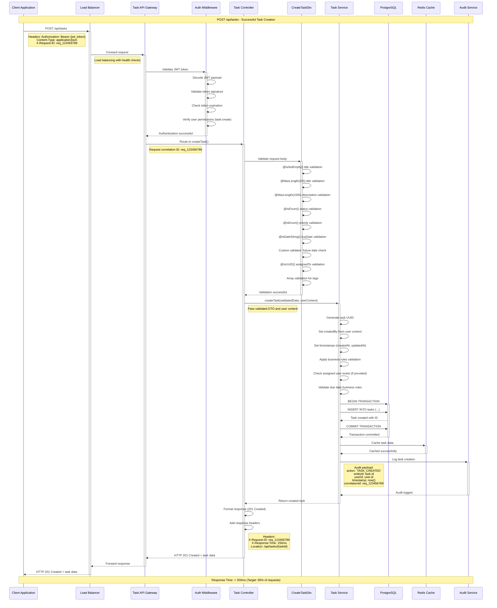

### 1.2 Authentication Failure Sequence

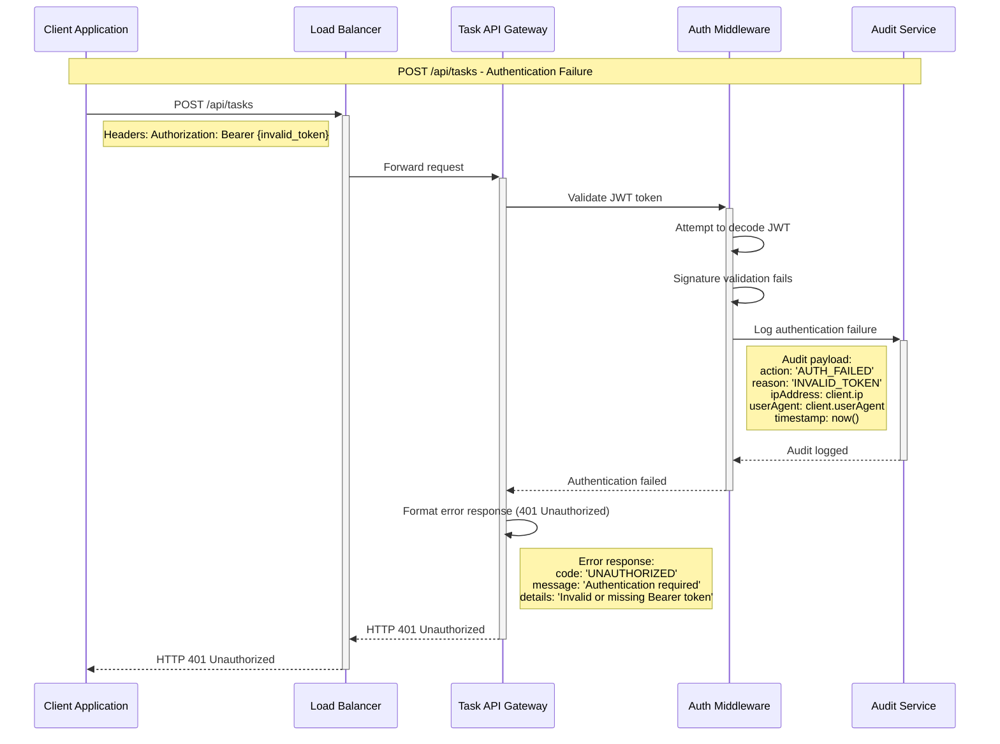

### 1.3 Validation Error Sequence

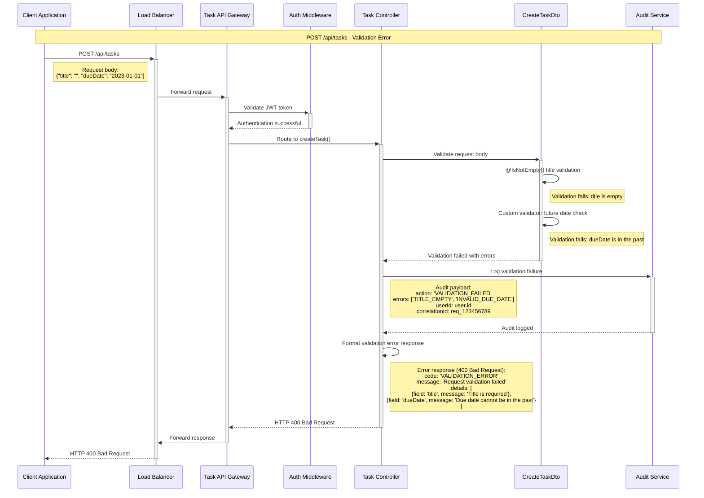

### 1.4 Business Rule Violation Sequence

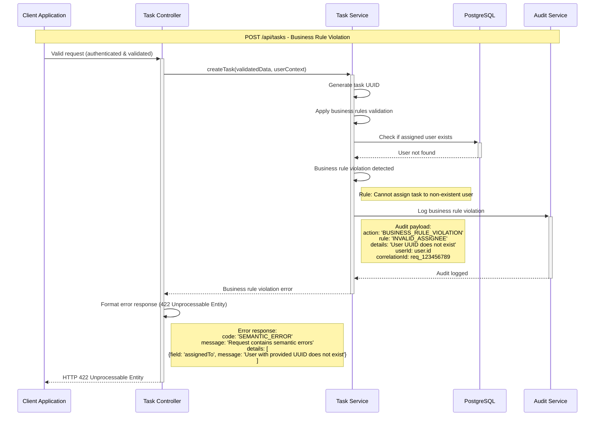

### 1.5 Rate Limiting Sequence

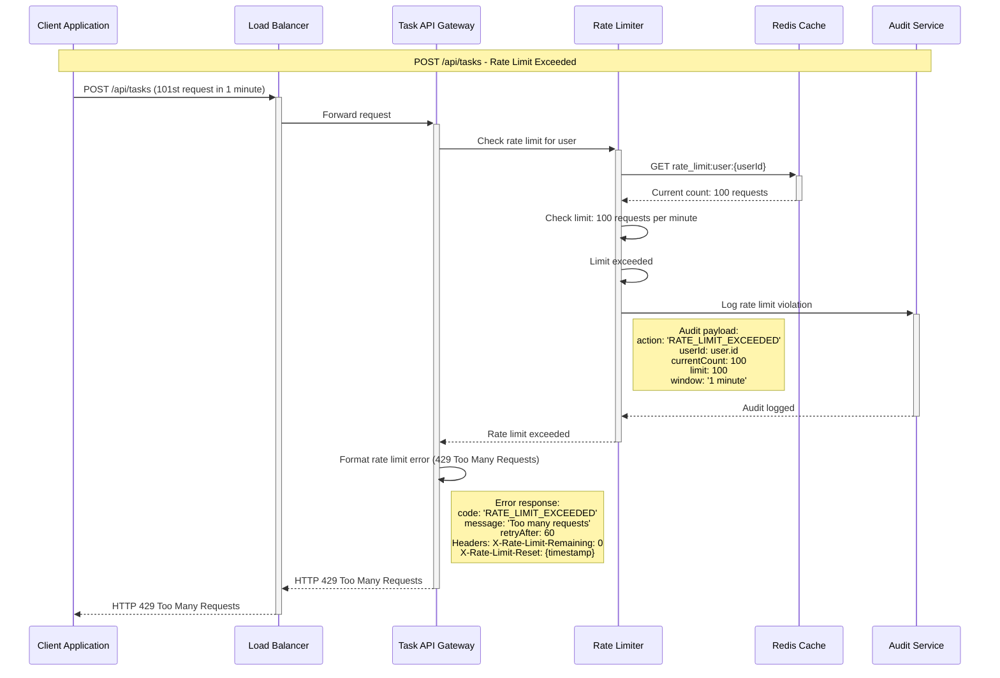

### 1.6 Database Failure and Circuit Breaker Sequence

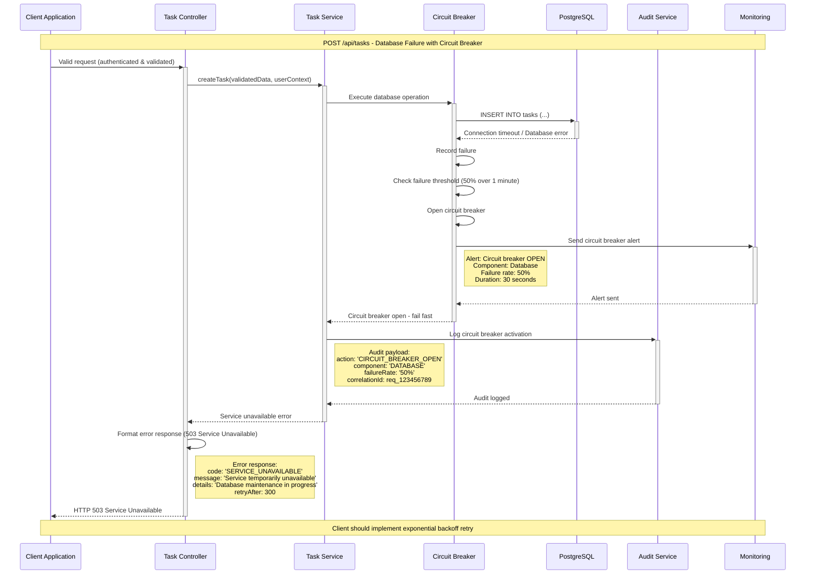

### 1.7 Health Check Sequence

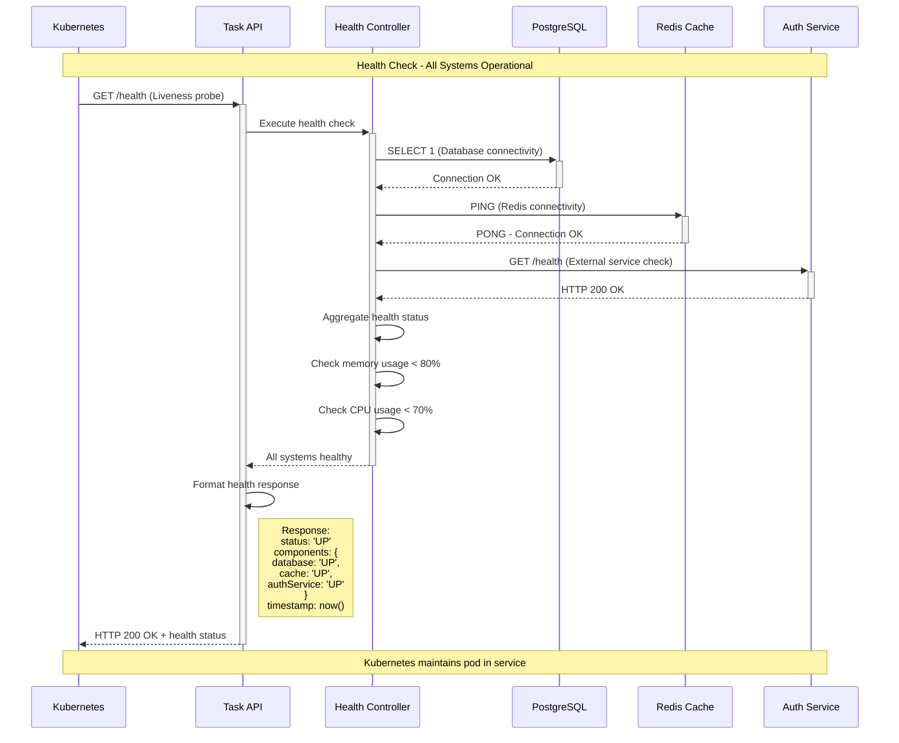

---

## 2. Bulk Task Creation Sequence

### 2.1 Bulk Task Creation with Batch Processing

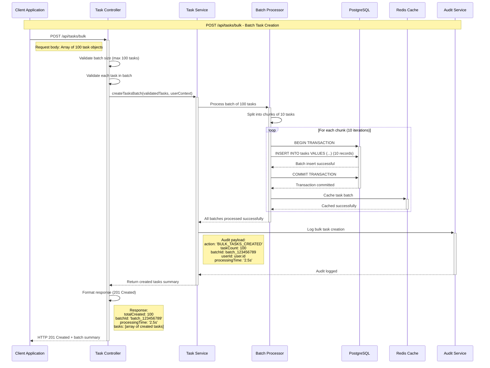

---

## 3. Error Recovery and Retry Sequences

### 3.1 Exponential Backoff Retry Pattern

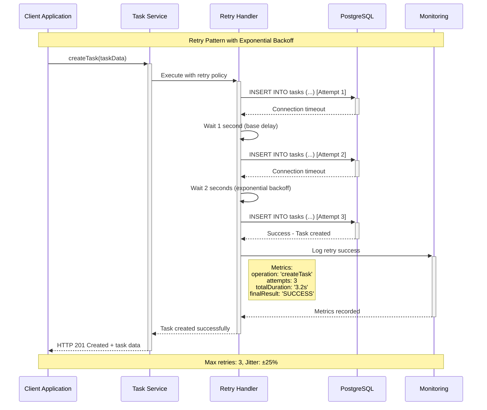

---

## 4. Monitoring and Observability Sequences

### 4.1 Distributed Tracing Sequence

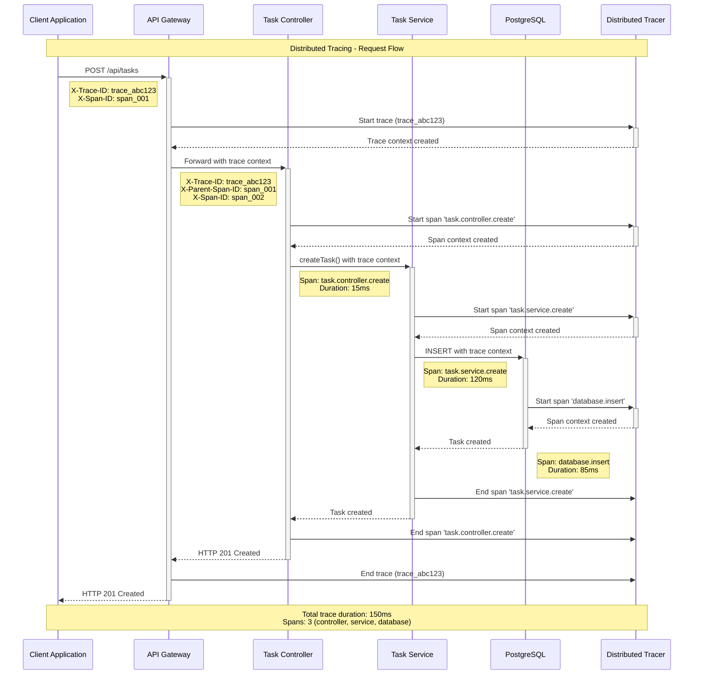

---

## 5. Security and Compliance Sequences

### 5.1 GDPR Data Processing Sequence

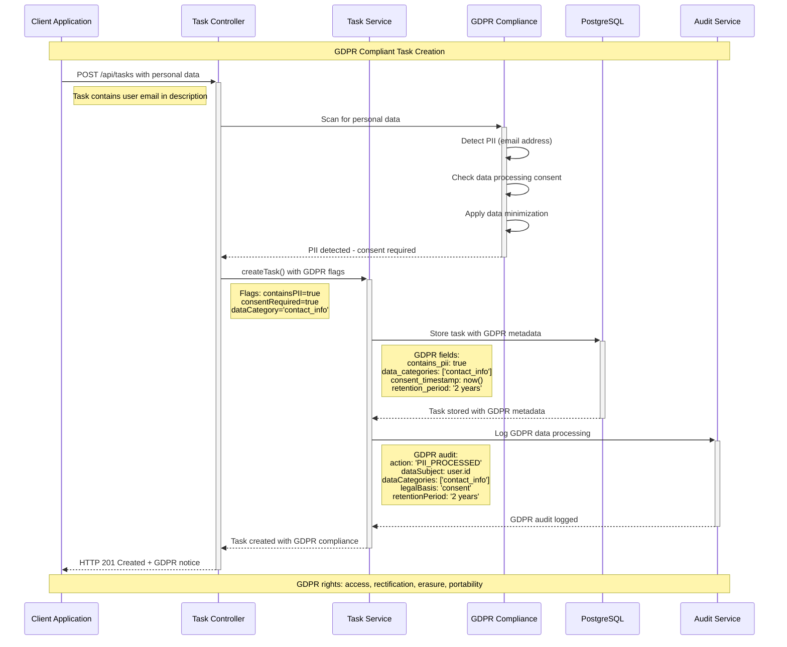

---

## 6. Performance Optimization Sequences

### 6.1 Caching Strategy Sequence

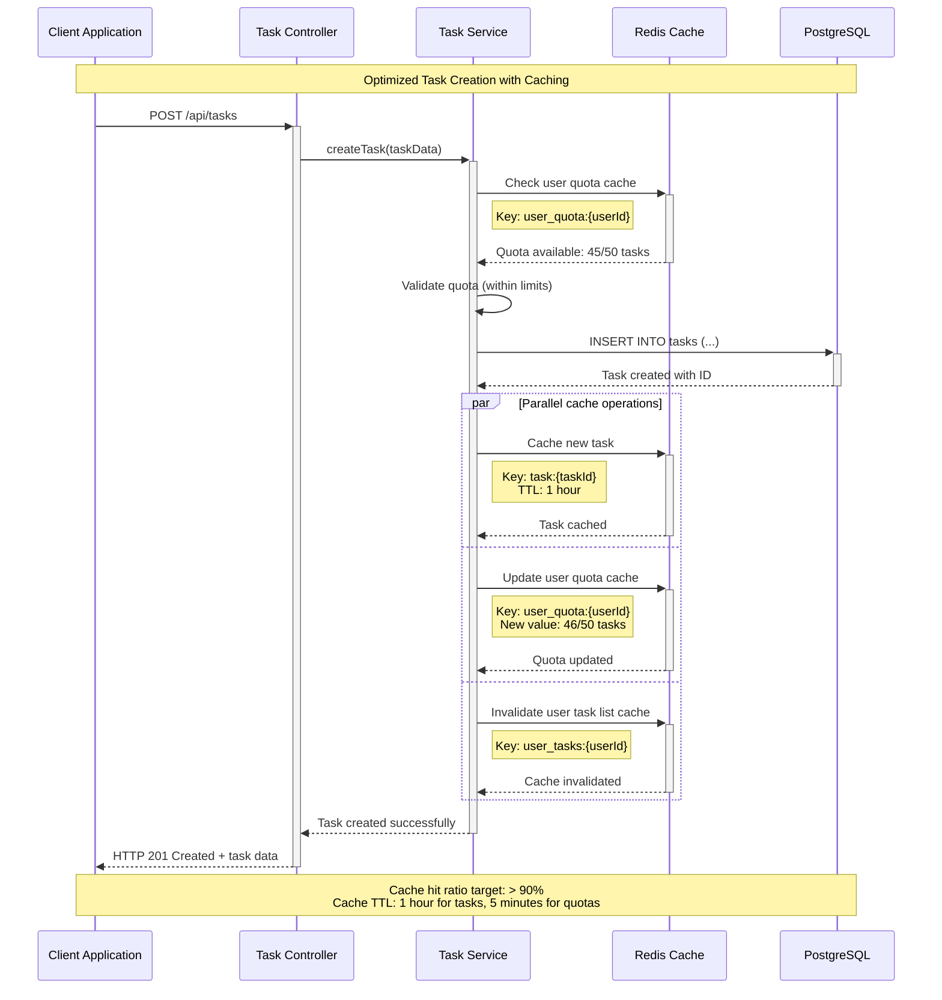

---

## 7. Audit Trail and Compliance Tracking

### 7.1 Complete Audit Trail Sequence

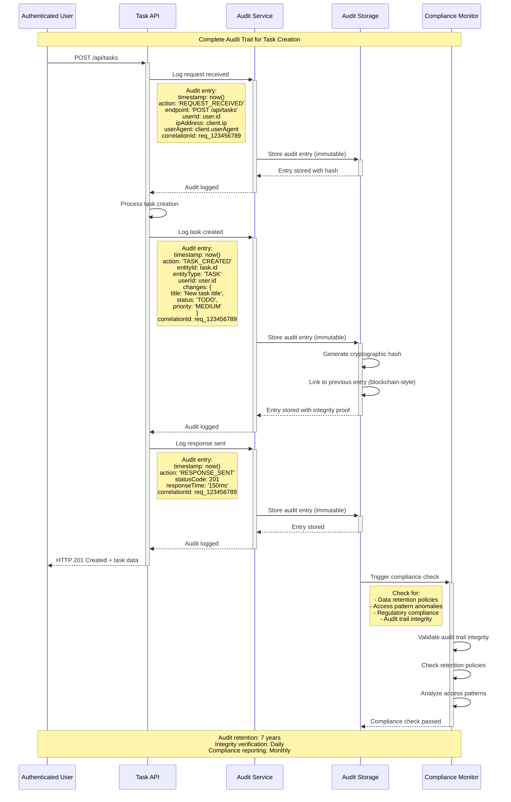

---

## Summary

These sequence diagrams provide comprehensive coverage of the Task Creation API endpoint implementation, including:

### Core Functionality
- **Successful task creation** with complete validation and persistence flow
- **Bulk task creation** with batch processing optimization
- **Health check** monitoring for system reliability

### Error Handling
- **Authentication failures** with proper security logging
- **Validation errors** with detailed error responses
- **Business rule violations** with semantic error handling
- **Rate limiting** protection against API abuse
- **Database failures** with circuit breaker patterns

### Advanced Features
- **Retry mechanisms** with exponential backoff
- **Distributed tracing** for observability
- **Caching strategies** for performance optimization
- **GDPR compliance** for data protection
- **Complete audit trails** for regulatory compliance

### Key Performance Indicators
- **Response Time**: < 200ms for 95% of requests
- **Throughput**: 1000+ requests per second
- **Availability**: 99.99% uptime target
- **Error Rate**: < 0.1% of total requests
- **Cache Hit Ratio**: > 90% for frequently accessed data

### Compliance and Security
- **JWT authentication** with role-based access control
- **Input validation** preventing security vulnerabilities
- **Audit logging** for all operations with 7-year retention
- **GDPR compliance** with data protection and privacy rights
- **Rate limiting** and abuse prevention mechanisms

These diagrams serve as the definitive reference for implementing, testing, and maintaining the Task Creation API endpoint with enterprise-grade security, performance, and compliance requirements.

---

**Document Status**: Final
**Generated From**: HLD Document (HLD-DEMO-2350) and API Contract Outline
**Compliance**: GDPR, ISO 27001, SOC 2 Type II
**Last Updated**: 2024
**Version**: 1.0