# Sequence Diagram - Real-Time Task Creation Synchronization System

## Overview
This sequence diagram illustrates the complete flow of real-time task creation and synchronization across multiple connected clients in the SCIB collaboration platform.

## Primary Actors
- **User A**: Task creator
- **User B**: Connected team member receiving real-time updates
- **Angular Frontend**: Client-side application
- **Spring Boot API**: Backend REST services
- **WebSocket Handler**: Real-time message broadcasting service
- **Redis Pub/Sub**: Message broker for real-time events
- **PostgreSQL Database**: Data persistence layer

## Sequence Flow

```mermaid
sequenceDiagram
    participant UA as User A (Creator)
    participant FE_A as Angular Frontend A
    participant API as Spring Boot API
    participant WS as WebSocket Handler
    participant Redis as Redis Pub/Sub
    participant DB as PostgreSQL DB
    participant FE_B as Angular Frontend B
    participant UB as User B (Viewer)

    Note over UA, UB: Real-Time Task Creation Synchronization Flow
    
    %% WebSocket Connection Establishment
    rect rgb(240, 248, 255)
        Note over FE_A, FE_B: WebSocket Connection Setup
        FE_A->>+WS: Connect WebSocket /ws/boards/{boardId}
        WS->>FE_A: CONNECTION_ESTABLISHED {sessionId, permissions}
        FE_B->>+WS: Connect WebSocket /ws/boards/{boardId}
        WS->>FE_B: CONNECTION_ESTABLISHED {sessionId, permissions}
        WS->>Redis: Subscribe to board:{boardId}:tasks channel
    end

    %% Task Creation Process
    rect rgb(255, 248, 240)
        Note over UA, DB: Task Creation and Validation
        UA->>FE_A: Fill task creation form
        FE_A->>FE_A: Client-side validation
        
        %% Real-time validation
        FE_A->>+API: POST /api/boards/{boardId}/tasks/validate
        API->>+DB: Check title uniqueness
        DB-->>-API: Validation result
        API-->>-FE_A: Validation response {valid: true/false, errors: []}
        FE_A->>FE_A: Update form validation state
        
        %% Task submission
        UA->>FE_A: Submit task (Ctrl+Enter)
        FE_A->>FE_A: Optimistic UI update
        FE_A->>+API: POST /api/boards/{boardId}/tasks
        
        Note over API: Task Creation Service Processing
        API->>API: Validate JWT token & permissions
        API->>API: Server-side validation
        API->>+DB: BEGIN TRANSACTION
        DB->>DB: Check unique constraint (board_id, title)
        DB->>DB: INSERT task with generated UUID
        DB->>DB: Update position sequence
        DB-->>-API: Task created {id, position, timestamps}
        API->>API: Generate task response with user details
    end

    %% Real-time Broadcasting
    rect rgb(240, 255, 240)
        Note over API, UB: Real-time Event Broadcasting
        API->>+Redis: PUBLISH board:{boardId}:tasks TASK_CREATED event
        Redis->>+WS: Notify subscribers of TASK_CREATED event
        
        %% Response to creator
        API-->>-FE_A: 201 Created - Task response with metadata
        FE_A->>FE_A: Replace optimistic update with server data
        FE_A->>UA: Show success notification
        
        %% Broadcast to all connected clients
        WS->>WS: Process TASK_CREATED event
        WS->>WS: Filter by board permissions
        WS->>FE_A: WebSocket: TASK_CREATED {task, createdBy, metadata}
        WS->>FE_B: WebSocket: TASK_CREATED {task, createdBy, metadata}
        
        %% Client-side real-time updates
        FE_A->>FE_A: Confirm server sync (no duplicate)
        FE_B->>FE_B: Add new task to board
        FE_B->>FE_B: Animate task appearance
        FE_B->>UB: Show real-time notification
        
        Note over FE_A, FE_B: Task synchronized across all clients within 500ms
    end

    %% Error Handling Scenario
    rect rgb(255, 240, 240)
        Note over UA, FE_A: Error Handling Flow
        alt Validation Error
            API->>DB: Constraint violation (duplicate title)
            DB-->>API: UNIQUE_VIOLATION error
            API-->>FE_A: 409 Conflict - Duplicate title error
            FE_A->>FE_A: Revert optimistic update
            FE_A->>FE_A: Show specific error message
            FE_A->>UA: Display validation error
            Note over API, Redis: No event published for failed creation
        else System Error
            API->>API: Internal server error
            API-->>FE_A: 500 Internal Server Error
            FE_A->>FE_A: Revert optimistic update
            FE_A->>FE_A: Show generic error message
            FE_A->>UA: Display retry option
        end
    end

    %% Bulk Task Creation Flow
    rect rgb(248, 240, 255)
        Note over UA, UB: Bulk Task Creation (Optional)
        UA->>FE_A: Initiate bulk task creation
        FE_A->>+API: POST /api/boards/{boardId}/tasks/batch
        
        alt Small Batch (≤100 tasks)
            API->>API: Synchronous processing
            loop For each task
                API->>DB: Create task
                API->>Redis: Publish TASK_CREATED event
            end
            API-->>FE_A: 201 Created - Batch response with all tasks
        else Large Batch (>100 tasks)
            API->>API: Asynchronous processing
            API-->>FE_A: 202 Accepted - Batch processing started
            API->>API: Background batch processing
            loop For each completed task
                API->>Redis: Publish TASK_CREATED event
                WS->>FE_A: WebSocket: TASK_CREATED
                WS->>FE_B: WebSocket: TASK_CREATED
            end
        end
    end

    %% Connection Recovery
    rect rgb(245, 245, 245)
        Note over FE_B, WS: Connection Recovery Scenario
        FE_B->>FE_B: Detect WebSocket disconnection
        FE_B->>+WS: Reconnect WebSocket
        WS->>FE_B: CONNECTION_ESTABLISHED
        WS->>FE_B: Replay missed messages (if any)
        FE_B->>FE_B: Sync board state
    end
```

## Timing Requirements

### Performance Targets
- **API Response Time**: < 200ms for task creation
- **Real-time Sync**: < 500ms from creation to appearance on all clients
- **WebSocket Message Delivery**: < 50ms latency
- **Database Transaction**: < 100ms for task insertion

### Sequence Timing Analysis
1. **Form Validation**: 50-100ms
2. **API Processing**: 100-150ms
3. **Database Transaction**: 50-100ms
4. **Redis Pub/Sub**: 10-20ms
5. **WebSocket Broadcast**: 20-50ms
6. **Client UI Update**: 50-100ms

**Total End-to-End Time**: 280-520ms (within 500ms requirement)

## Error Scenarios Covered

### 1. Validation Errors
- **Client-side validation**: Immediate feedback
- **Server-side validation**: Detailed error responses
- **Duplicate title detection**: 409 Conflict with existing task ID
- **Permission errors**: 403 Forbidden responses

### 2. System Errors
- **Database connection failures**: Circuit breaker pattern
- **Redis connectivity issues**: Graceful degradation
- **WebSocket disconnections**: Automatic reconnection with message replay
- **Network timeouts**: Retry mechanisms with exponential backoff

### 3. Concurrency Handling
- **Optimistic locking**: Version-based conflict resolution
- **Database constraints**: Unique constraint enforcement
- **Race conditions**: Transaction isolation levels
- **Message ordering**: Redis pub/sub ordering guarantees

## Security Considerations

### Authentication & Authorization
- **JWT Token Validation**: Every API request validated
- **WebSocket Authentication**: Token-based connection authentication
- **Board-level Permissions**: User access validation per board
- **Resource Authorization**: Task creation permissions checked

### Data Protection
- **Input Sanitization**: XSS and injection prevention
- **Audit Logging**: All actions logged with user attribution
- **Encrypted Communication**: TLS 1.3 for all connections
- **Session Management**: Secure session handling

## Integration Points

### External Systems
- **Authentication Service**: User verification and permissions
- **Notification Service**: Email/push notifications for task creation
- **Audit Service**: Compliance and activity logging
- **Monitoring Service**: Performance metrics and alerting

### Internal Components
- **User Service**: User profile and preference data
- **Board Service**: Board configuration and access control
- **File Service**: Task attachment handling
- **Search Service**: Task indexing for search functionality

## Scalability Considerations

### Horizontal Scaling
- **Stateless API Design**: Multiple API instances supported
- **WebSocket Session Affinity**: Sticky sessions for WebSocket connections
- **Redis Clustering**: Distributed pub/sub for high availability
- **Database Read Replicas**: Query load distribution

### Performance Optimization
- **Connection Pooling**: Database connection management
- **Message Batching**: Efficient WebSocket message delivery
- **Caching Strategy**: Validation result caching
- **Async Processing**: Non-blocking operations where possible

## Monitoring & Observability

### Key Metrics
- **Task Creation Rate**: Tasks created per second
- **Synchronization Latency**: End-to-end sync time
- **WebSocket Connection Count**: Active real-time connections
- **Error Rates**: Validation and system error percentages
- **Database Performance**: Query execution times

### Distributed Tracing
- **Correlation IDs**: Request tracing across services
- **Span Tracking**: Component-level performance analysis
- **Error Attribution**: Error source identification
- **Performance Bottlenecks**: Slow operation identification

---

**Diagram Version**: 1.0  
**Last Updated**: 2024  
**Prepared By**: Senior Solution Architect  
**Compliance**: TOGAF, C4 Model, Enterprise Architecture Standards