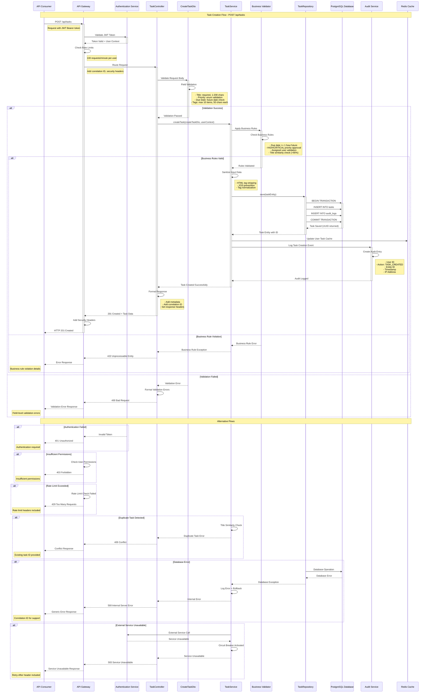

# Sequence Diagram - Task Creation API
## Task Management API - Task Creation Endpoint

### Document Information
- **Diagram Type**: Sequence Diagram
- **API Endpoint**: POST /api/tasks
- **Date**: 2024
- **JIRA Reference**: DEMO-2350
- **Version**: 1.0

---

## Overview

This sequence diagram illustrates the complete flow for creating a new task through the Task Management API endpoint. The diagram shows the interaction between the API consumer, authentication service, task creation components, database, and audit service.

## Sequence Flow

---

## Flow Description

### 1. Authentication Phase
- API Gateway receives the request with JWT Bearer token
- Authentication service validates the token and returns user context
- Rate limiting is applied (100 requests/minute per user)

### 2. Input Validation Phase
- TaskController receives the routed request
- CreateTaskDto performs comprehensive field validation:
  - Title: Required, 1-200 characters, XSS protection
  - Priority: Enum validation (LOW, MEDIUM, HIGH, CRITICAL)
  - Due Date: Future date validation, ISO 8601 format
  - Assigned To: Valid UUID format, user existence check
  - Tags: Maximum 10 items, 50 characters each, alphanumeric validation

### 3. Business Logic Phase
- TaskService applies business rules:
  - Due date must be at least 1 hour in the future
  - HIGH/CRITICAL priority tasks require manager approval
  - Assigned user must be active with appropriate permissions
  - Title similarity check (>90% match triggers warning)
- Data sanitization and normalization

### 4. Data Persistence Phase
- Database transaction ensures data consistency
- Task entity saved to PostgreSQL with audit trail
- Cache updated for performance optimization
- Audit logging for compliance and traceability

### 5. Response Phase
- Success response (201 Created) with complete task data
- Metadata includes correlation ID, timestamp, and API version
- Security headers added for protection

## Error Handling Scenarios

### Validation Errors (400 Bad Request)
- Field-level validation failures
- Detailed error messages with field names and invalid values
- No data persistence occurs

### Authentication Errors (401 Unauthorized)
- Invalid or expired JWT tokens
- Missing authentication headers
- Token signature validation failures

### Authorization Errors (403 Forbidden)
- Insufficient user permissions
- Role-based access control violations
- Resource-level access restrictions

### Business Rule Violations (422 Unprocessable Entity)
- Due date validation failures
- Priority approval requirements not met
- Assigned user validation failures

### Conflict Errors (409 Conflict)
- Duplicate task detection (>90% title similarity)
- Concurrent modification conflicts
- Business constraint violations

### Rate Limiting (429 Too Many Requests)
- Per-user rate limit exceeded (100/minute)
- Per-IP rate limit exceeded (1000/minute)
- Includes Retry-After header

### Server Errors (500 Internal Server Error)
- Database connection failures
- Unexpected system errors
- Configuration issues

### Service Unavailable (503 Service Unavailable)
- External service dependencies unavailable
- Circuit breaker activation
- System maintenance mode

## Performance Considerations

### Response Time Targets
- 95th percentile: ≤ 200ms
- 99th percentile: ≤ 500ms
- Average response time: ≤ 100ms

### Optimization Strategies
- Connection pooling for database access
- Redis caching for frequently accessed data
- Asynchronous audit logging
- Bulk validation for multiple fields

## Security Measures

### Input Security
- Comprehensive input validation and sanitization
- XSS prevention through HTML tag stripping
- SQL injection prevention via parameterized queries
- Request size limits (1MB maximum)

### Authentication & Authorization
- JWT token validation with 24-hour expiry
- Role-based access control (RBAC)
- Resource-level permissions
- Multi-factor authentication for admin operations

### Audit & Compliance
- Complete audit trail for all operations
- GDPR compliance with data protection controls
- SOX compliance for financial data handling
- ISO 27001 information security management

## Monitoring & Observability

### Key Metrics
- Request/response times per endpoint
- Error rates by status code
- Authentication success/failure rates
- Business rule violation frequencies
- Database performance metrics

### Correlation & Tracing
- Unique correlation ID for each request
- Distributed tracing across all components
- Structured logging with JSON format
- Centralized log aggregation (ELK stack)

### Alerting Thresholds
- Response time > 500ms
- Error rate > 0.5%
- Authentication failures > 5% of requests
- Database connection pool > 80% utilization

---

## Related Documentation

- [Component Diagram](./component_diagram.md) - System architecture and component relationships
- [API Contract Outline](../Requirement%20Documents/APIContractOutline.txt) - Detailed API specification
- [High-Level Design Document](../Requirement%20Documents/HLDDocument.txt) - Complete system architecture
- [Non-Functional Requirements](../Requirement%20Documents/NFR.txt) - Performance and compliance requirements

---

**Document Status**: Final  
**Last Updated**: 2024  
**Reviewed By**: Enterprise Solution Architect  
**Approved By**: Technical Architecture Board

*This document is confidential and proprietary. Distribution is restricted to authorized personnel only.*