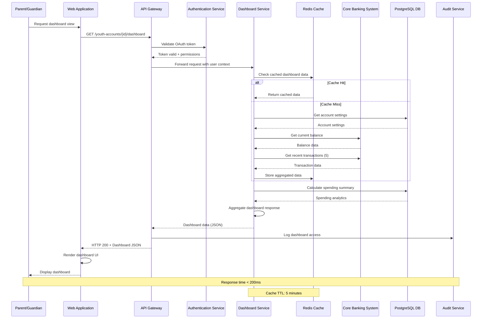
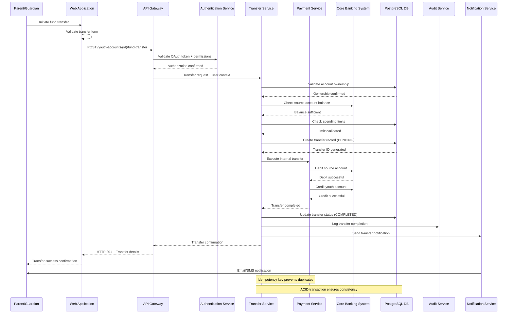
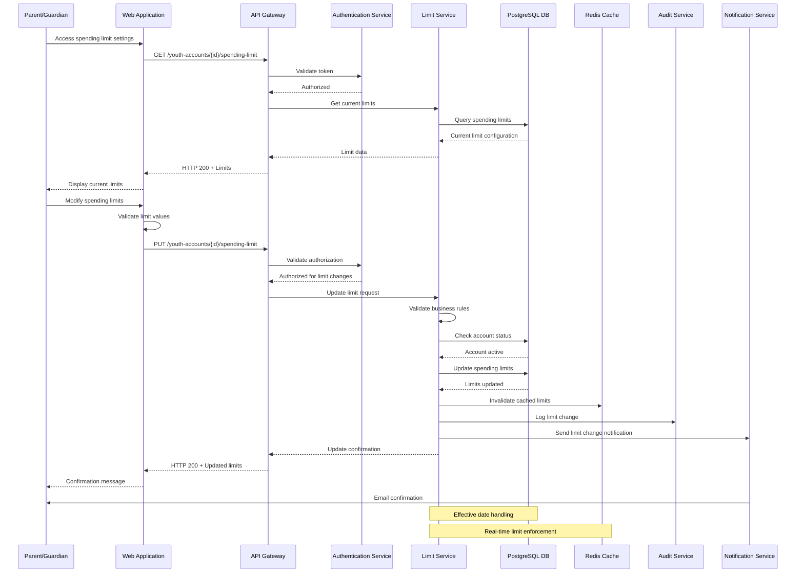
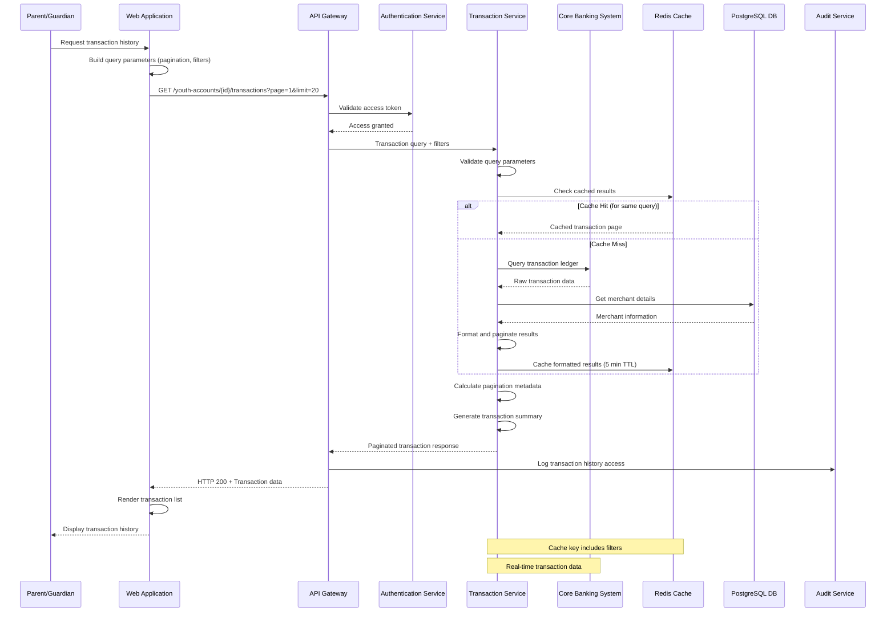
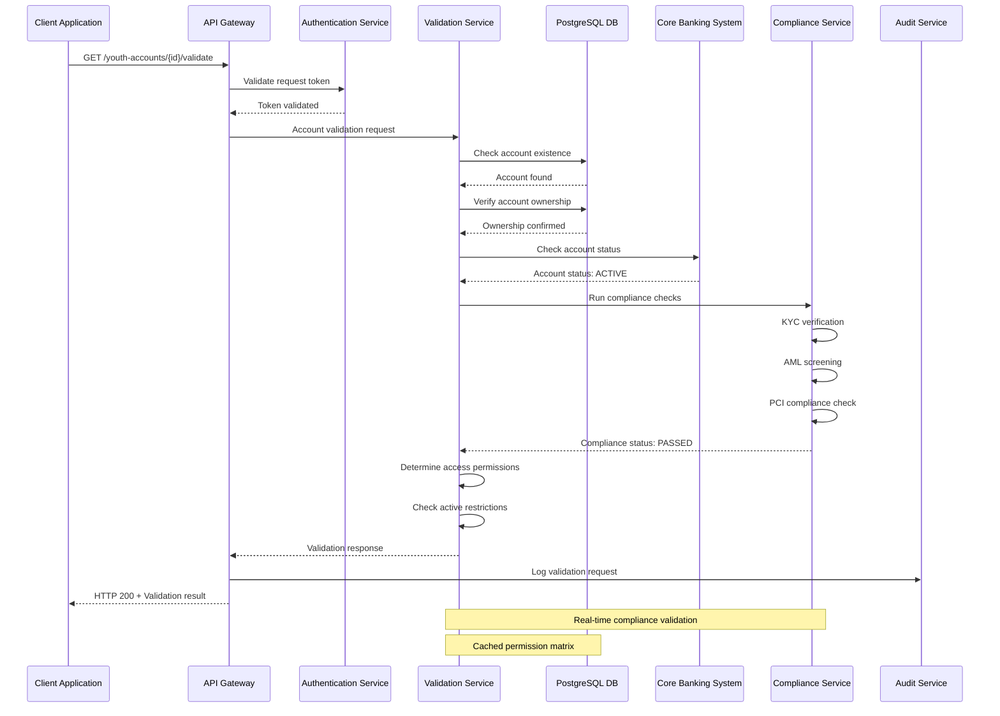
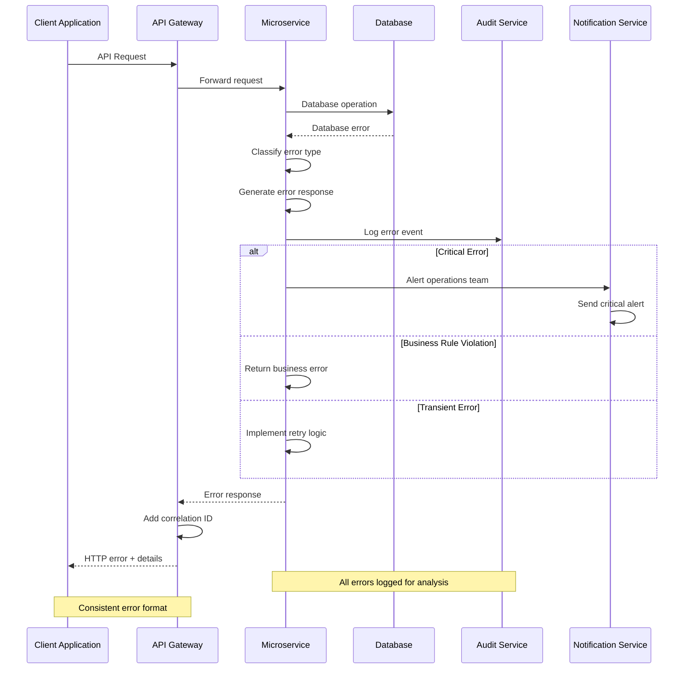
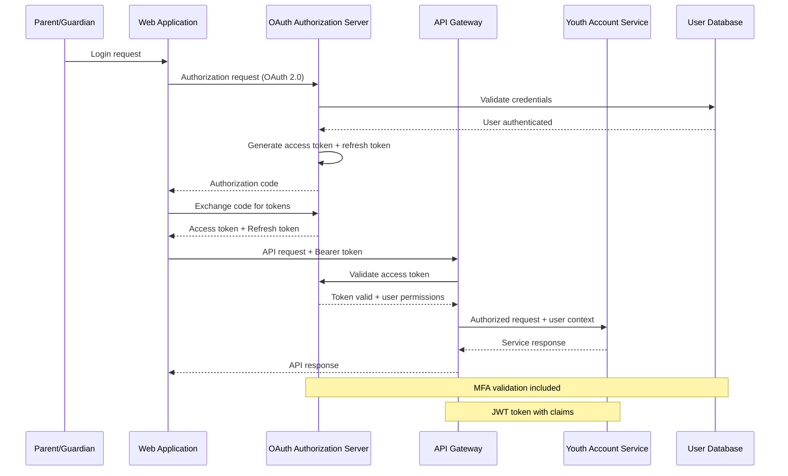

# Sequence Diagrams
## Youth Account Management System

### Version: 1.0
### Date: 2024
### Classification: Internal

---

## 1. Youth Account Dashboard Retrieval Sequence

**Mapped to ADR**: SCIB-26 - Create API to retrieve youth account dashboard details

---

## 2. Fund Transfer Sequence

**Mapped to ADR**: SCIB-27 - Create API for parent to transfer funds to youth account

---

## 3. Spending Limit Configuration Sequence

**Mapped to ADR**: SCIB-28 - Create API for configuring youth spending limit

---

## 4. Transaction History Retrieval Sequence

**Mapped to ADR**: SCIB-29 - Create API to retrieve youth account transaction history

---

## 5. Account Validation Sequence

**Mapped to**: Account validation and security checks

---

## 6. Error Handling Sequence

**Generic error handling across all APIs**

---

## 7. Authentication and Authorization Sequence

**OAuth 2.0 flow for API access**

---

## Sequence Diagram Summary

### Key Architectural Patterns Demonstrated:

1. **API Gateway Pattern**: Centralized entry point for all API requests
2. **Authentication/Authorization**: OAuth 2.0 with JWT tokens
3. **Caching Strategy**: Redis for performance optimization
4. **Audit Logging**: Comprehensive audit trail for all operations
5. **Error Handling**: Consistent error handling across all services
6. **Microservices**: Loosely coupled service architecture
7. **Database Transactions**: ACID compliance for financial operations
8. **Real-time Notifications**: Event-driven notification system

### Performance Considerations:

- **Caching**: Strategic caching to achieve <200ms response times
- **Pagination**: Efficient pagination for large data sets
- **Connection Pooling**: Database connection optimization
- **Async Processing**: Non-blocking operations where possible

### Security Features:

- **Token Validation**: Every request validates OAuth tokens
- **Permission Checks**: Granular permission validation
- **Audit Logging**: Complete audit trail for compliance
- **Input Validation**: Comprehensive input validation
- **Encryption**: End-to-end encryption for sensitive data

### Compliance and Auditability:

- **Transaction Logging**: All financial transactions logged
- **Access Logging**: User access patterns tracked
- **Error Logging**: System errors captured for analysis
- **Compliance Checks**: Real-time compliance validation

---

**Document Version**: 1.0
**Last Updated**: 2024
**Review Cycle**: Monthly
**Approval**: Pending Architecture Review Board
**Classification**: Internal