# Sequence Diagram - Task Creation API System

## Document Information
- **System**: Task Creation API
- **Version**: 1.0
- **Date**: 2024
- **Related ADR**: DEMO-2350
- **Generated From**: HLD Document and API Contract Outline

---

## Overview

This sequence diagram illustrates the complete flow for task creation through the Task Creation API system, showing interactions between all components from initial request to final response, including validation, business logic, and audit logging.

---

## Sequence Diagram: Task Creation Flow

```mermaid
sequenceDiagram
    participant Client as API Consumer
    participant Gateway as API Gateway
    participant Auth as Authentication Service
    participant Controller as TaskController
    participant DTO as CreateTaskDto
    participant Service as TaskService
    participant DB as PostgreSQL Database
    participant Audit as Audit Service
    participant Monitor as Monitoring Service

    Note over Client, Monitor: Task Creation API Flow - POST /api/tasks
    
    %% Request Initiation
    Client->>Gateway: POST /api/tasks
    Note right of Client: Request with task data:<br/>title, description, status,<br/>dueDate, assignedTo, priority
    
    %% API Gateway Processing
    Gateway->>Gateway: Rate Limiting Check
    Note right of Gateway: 100 requests/minute per user
    
    Gateway->>Gateway: TLS 1.3 Termination
    Gateway->>Gateway: Request Correlation ID
    
    %% Authentication Flow
    Gateway->>Auth: Validate JWT Token
    Note right of Auth: Bearer token validation<br/>1-hour expiration check
    
    Auth-->>Gateway: Token Valid + User Context
    
    %% Route to Application
    Gateway->>Controller: Forward Request
    Note right of Gateway: Include user context<br/>and correlation ID
    
    %% Input Validation Phase
    Controller->>DTO: Validate Input Data
    Note right of DTO: Validation Decorators:<br/>@IsNotEmpty() - title<br/>@MaxLength(255) - title<br/>@MaxLength(1000) - description<br/>@IsEnum(TaskStatus) - status<br/>@IsDateString() - dueDate<br/>@IsUUID() - assignedTo
    
    alt Validation Success
        DTO-->>Controller: Validation Passed
        
        %% Business Logic Processing
        Controller->>Service: createTask(createTaskDto)
        Note right of Controller: Pass validated DTO
        
        %% Business Rule Validation
        Service->>Service: Data Sanitization
        Note right of Service: XSS prevention<br/>Input sanitization
        
        Service->>Service: Due Date Validation
        Note right of Service: Ensure due date is in future<br/>Business rule enforcement
        
        Service->>Service: User Existence Check
        Note right of Service: Validate assignedTo user exists<br/>and is active
        
        %% Database Operations
        Service->>DB: Begin Transaction
        Service->>DB: INSERT INTO tasks
        Note right of DB: Store task with:<br/>- Generated UUID<br/>- Timestamps<br/>- User context<br/>- Version for optimistic locking
        
        DB-->>Service: Task Created (with ID)
        Service->>DB: Commit Transaction
        
        %% Audit Logging
        Service->>Audit: Log Task Creation
        Note right of Audit: Audit entry:<br/>- Operation: CREATE_TASK<br/>- User ID: from JWT<br/>- Task ID: generated<br/>- IP Address: from request<br/>- Timestamp<br/>- Before/After state
        
        Audit-->>Service: Audit Logged
        
        %% Response Construction
        Service-->>Controller: Task Entity
        Controller->>Controller: Format Response
        Note right of Controller: HTTP 201 Created<br/>Include created task data
        
        %% Success Response
        Controller-->>Gateway: 201 Created + Task Data
        Gateway->>Monitor: Log Success Metrics
        Note right of Monitor: Response time<br/>Success rate<br/>Business metrics
        
        Gateway-->>Client: 201 Created Response
        Note left of Client: Response includes:<br/>- Task ID<br/>- All task fields<br/>- Timestamps<br/>- Version number
        
    else Validation Failure
        DTO-->>Controller: Validation Errors
        Note right of DTO: Field-level errors:<br/>- Required field missing<br/>- Length constraints<br/>- Format violations<br/>- Enum value invalid
        
        Controller->>Controller: Format Error Response
        Note right of Controller: HTTP 400 Bad Request<br/>Detailed validation errors
        
        Controller-->>Gateway: 400 Bad Request
        Gateway->>Monitor: Log Validation Error
        Gateway-->>Client: 400 Bad Request
        Note left of Client: Error response with:<br/>- Field-specific errors<br/>- Error codes<br/>- Correlation ID
    end
    
    %% Error Scenarios
    
    Note over Client, Monitor: Alternative Flows - Error Scenarios
    
    %% Authentication Failure
    alt Authentication Failure
        Auth-->>Gateway: Invalid Token
        Gateway->>Monitor: Log Auth Failure
        Gateway-->>Client: 401 Unauthorized
        Note left of Client: Authentication required
    end
    
    %% Authorization Failure
    alt Authorization Failure
        Auth-->>Gateway: Insufficient Permissions
        Gateway->>Monitor: Log Auth Failure
        Gateway-->>Client: 403 Forbidden
        Note left of Client: Insufficient permissions
    end
    
    %% Rate Limiting
    alt Rate Limit Exceeded
        Gateway->>Gateway: Rate Limit Check Failed
        Gateway->>Monitor: Log Rate Limit Hit
        Gateway-->>Client: 429 Too Many Requests
        Note left of Client: Retry after 60 seconds
    end
    
    %% Business Rule Violation
    alt Business Rule Violation
        Service->>Service: Due Date in Past
        Service-->>Controller: Business Rule Error
        Controller-->>Gateway: 422 Unprocessable Entity
        Gateway->>Monitor: Log Business Rule Error
        Gateway-->>Client: 422 Unprocessable Entity
        Note left of Client: Due date cannot be in past
    end
    
    %% Duplicate Task Detection
    alt Duplicate Task
        Service->>DB: Check Existing Task
        DB-->>Service: Duplicate Found
        Service-->>Controller: Conflict Error
        Controller-->>Gateway: 409 Conflict
        Gateway->>Monitor: Log Conflict Error
        Gateway-->>Client: 409 Conflict
        Note left of Client: Similar task already exists
    end
    
    %% Database Failure
    alt Database Failure
        Service->>DB: Database Operation
        DB-->>Service: Connection/Query Error
        Service->>DB: Rollback Transaction
        Service-->>Controller: Database Error
        Controller-->>Gateway: 500 Internal Server Error
        Gateway->>Monitor: Log Database Error
        Gateway-->>Client: 500 Internal Server Error
        Note left of Client: Generic error message<br/>No internal details exposed
    end
    
    %% External Service Failure
    alt Audit Service Failure
        Service->>Audit: Log Task Creation
        Audit-->>Service: Service Unavailable
        Note right of Service: Continue processing<br/>Log locally as fallback
        Service->>Service: Local Audit Log
        Service-->>Controller: Task Created (with warning)
        Controller-->>Gateway: 201 Created
        Gateway-->>Client: 201 Created
        Note left of Client: Task created successfully<br/>Audit logged locally
    end
```

---

## Sequence Flow Description

### 1. **Request Initiation**
- API Consumer sends POST request to `/api/tasks` with task data
- Request includes authentication token and task creation payload

### 2. **API Gateway Processing**
- **Rate Limiting**: Enforces 100 requests/minute per user limit
- **TLS Termination**: Handles TLS 1.3 encryption/decryption
- **Correlation ID**: Generates unique request identifier for tracing

### 3. **Authentication & Authorization**
- **JWT Validation**: Verifies token signature and expiration (1-hour limit)
- **User Context**: Extracts user information and permissions
- **RBAC Check**: Ensures user has task creation permissions

### 4. **Input Validation (CreateTaskDto)**
- **@IsNotEmpty()**: Validates required fields (title, dueDate)
- **@MaxLength()**: Enforces character limits (title: 255, description: 1000)
- **@IsEnum()**: Validates status and priority enum values
- **@IsDateString()**: Ensures proper date format
- **@IsUUID()**: Validates assignedTo user ID format

### 5. **Business Logic Processing (TaskService)**
- **Data Sanitization**: Prevents XSS and injection attacks
- **Due Date Validation**: Ensures due date is in the future
- **User Validation**: Verifies assigned user exists and is active
- **Business Rule Enforcement**: Applies domain-specific constraints

### 6. **Database Operations**
- **Transaction Management**: Ensures ACID compliance
- **UUID Generation**: Creates unique task identifier
- **Optimistic Locking**: Implements version field for concurrency control
- **Timestamp Management**: Sets createdAt and updatedAt fields

### 7. **Audit Logging**
- **Operation Logging**: Records task creation event
- **User Tracking**: Captures user ID from JWT token
- **IP Address Logging**: Records client IP for security
- **State Capture**: Logs before/after state for compliance

### 8. **Response Formation**
- **Success Response**: HTTP 201 with complete task data
- **Error Responses**: Appropriate HTTP status codes with detailed messages
- **Correlation ID**: Included in all responses for traceability

---

## Error Handling Flows

### Validation Errors (400 Bad Request)
- Field-level validation failures
- Detailed error messages with field names
- Input format violations

### Authentication Errors (401 Unauthorized)
- Invalid or expired JWT tokens
- Missing authentication headers
- Token signature validation failures

### Authorization Errors (403 Forbidden)
- Insufficient user permissions
- Role-based access control violations
- Resource access restrictions

### Business Rule Violations (422 Unprocessable Entity)
- Due date in the past
- Invalid user assignments
- Domain-specific constraint violations

### Conflict Errors (409 Conflict)
- Duplicate task detection
- Optimistic locking failures
- Resource state conflicts

### Rate Limiting (429 Too Many Requests)
- Request rate exceeded
- Per-user or per-IP limits
- Retry-after headers included

### System Errors (500 Internal Server Error)
- Database connectivity issues
- External service failures
- Unexpected system exceptions

---

## Performance Characteristics

### Response Time Targets
- **Normal Flow**: < 200ms for 95% of requests
- **Validation**: < 50ms for input validation
- **Database Operations**: < 100ms for task creation
- **Audit Logging**: Asynchronous, no impact on response time

### Throughput Capabilities
- **Concurrent Requests**: 500 task creations per second
- **Database TPS**: 2,000 transactions per second
- **Rate Limiting**: 100 requests/minute per authenticated user

### Scalability Features
- **Horizontal Scaling**: Auto-scaling based on CPU utilization
- **Database Scaling**: Read replicas for query optimization
- **Caching**: Redis for frequently accessed data

---

## Security Measures

### Input Security
- **XSS Prevention**: Input sanitization and output encoding
- **SQL Injection**: Parameterized queries and ORM usage
- **Data Validation**: Multi-layer validation (DTO, Service, Database)

### Authentication Security
- **JWT Security**: RS256 algorithm, 1-hour expiration
- **Token Validation**: Signature verification and claims validation
- **Session Management**: Stateless authentication approach

### Data Protection
- **Encryption in Transit**: TLS 1.3 for all communications
- **Encryption at Rest**: AES-256 for sensitive database fields
- **PII Masking**: Sensitive data excluded from logs

---

## Compliance Features

### GDPR Compliance
- **Data Minimization**: Only necessary fields collected
- **Audit Trail**: Complete operation logging for accountability
- **Right to Erasure**: Audit logs support data deletion requests

### ISO 27001 Controls
- **Access Control**: RBAC implementation
- **Information Security**: Comprehensive logging and monitoring
- **Incident Management**: Error tracking and alerting

### SOC 2 Type II
- **Security**: Multi-layer security controls
- **Availability**: High availability architecture
- **Processing Integrity**: Data validation and error handling
- **Confidentiality**: Encryption and access controls

---

## Monitoring and Observability

### Metrics Collection
- **Request Metrics**: Response time, throughput, error rates
- **Business Metrics**: Task creation rate, user activity
- **System Metrics**: CPU, memory, database performance

### Logging Strategy
- **Structured Logging**: JSON format with correlation IDs
- **Centralized Aggregation**: ELK Stack for log management
- **Log Levels**: ERROR, WARN, INFO, DEBUG with appropriate filtering

### Alerting
- **Performance Alerts**: Response time degradation
- **Error Rate Alerts**: Spike in error responses
- **Security Alerts**: Authentication failures, suspicious activity

---

*This sequence diagram represents the complete task creation flow as specified in ADR DEMO-2350 and implements all validation, security, and compliance requirements outlined in the HLD document.*