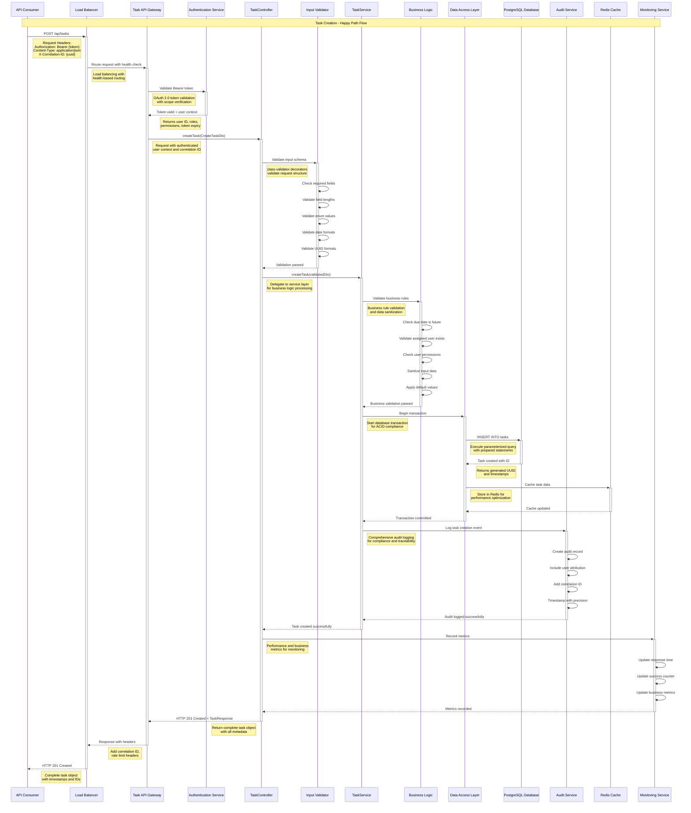
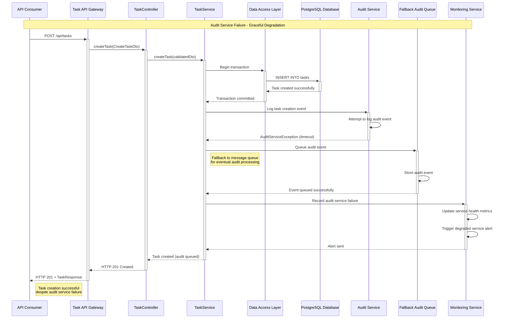
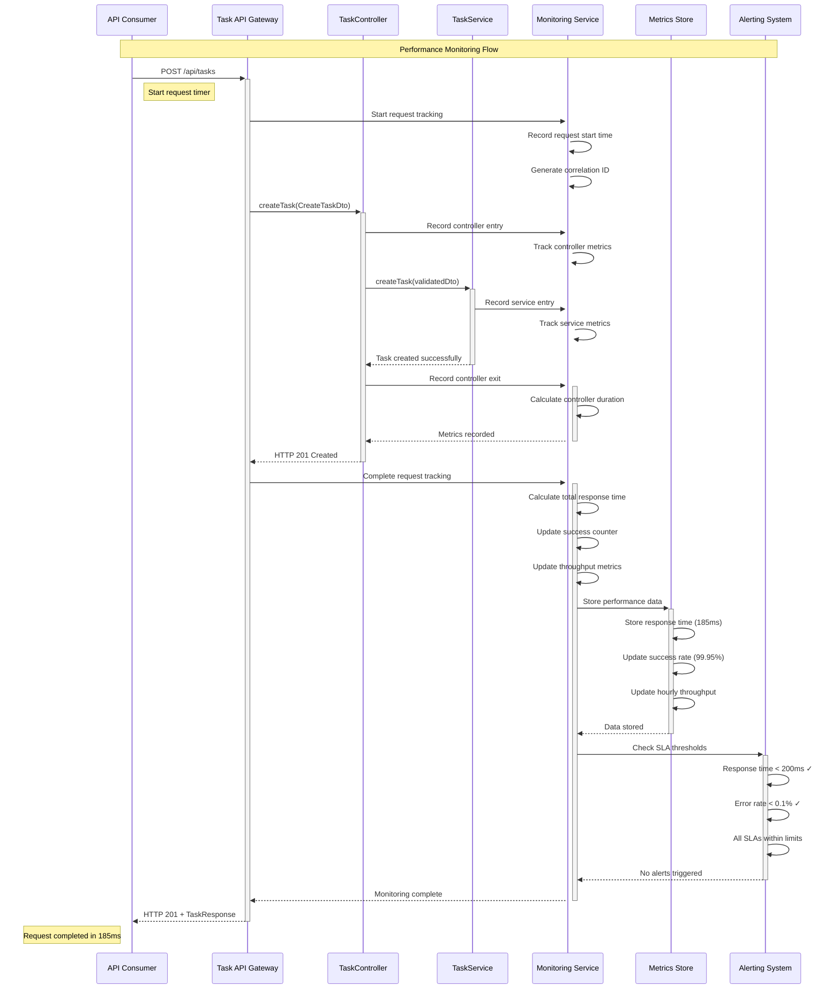
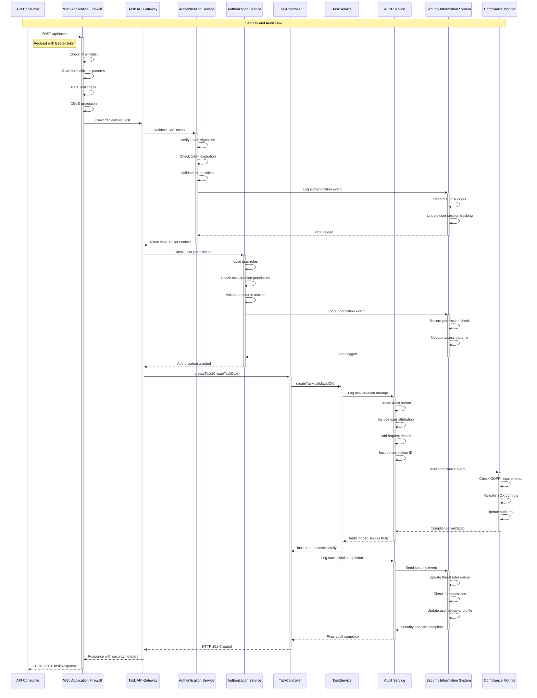

# Sequence Diagram - Task Management API System

## Overview
This document contains comprehensive sequence diagrams for the Task Management API System, specifically focusing on the task creation endpoint implementation as defined in DEMO-2350. The diagrams illustrate the complete flow from API request to response, including authentication, validation, business logic, data persistence, and audit logging.

## 1. Task Creation - Complete Flow

### 1.1 Successful Task Creation Sequence



### 1.2 Task Creation with Validation Error

```mermaid
sequenceDiagram
    participant Client as API Consumer
    participant API as Task API Gateway
    participant Auth as Authentication Service
    participant Controller as TaskController
    participant Validator as Input Validator
    participant Monitor as Monitoring Service

    Note over Client, Monitor: Task Creation - Validation Error Flow
    
    Client->>+API: POST /api/tasks
    Note right of Client: Invalid request data:<br/>{"title": "", "dueDate": "2023-01-01"}
    
    API->>+Auth: Validate Bearer token
    Auth-->>-API: Token valid + user context
    
    API->>+Controller: createTask(CreateTaskDto)
    
    Controller->>+Validator: Validate input schema
    
    Validator->>Validator: Check title (FAIL - empty)
    Validator->>Validator: Check dueDate (FAIL - past date)
    Validator->>Validator: Collect all validation errors
    
    Validator-->>-Controller: ValidationException
    Note left of Validator: Multiple validation errors:<br/>- Title required<br/>- Due date cannot be past
    
    Controller->>+Monitor: Record validation error
    Monitor->>Monitor: Update error counter
    Monitor->>Monitor: Update validation metrics
    Monitor-->>-Controller: Metrics recorded
    
    Controller-->>-API: HTTP 400 Bad Request
    Note left of Controller: Detailed validation error<br/>response with field-specific messages
    
    API-->>-Client: HTTP 400 + ValidationError
    Note left of API: {
      "error": {
        "code": "VALIDATION_ERROR",
        "message": "Request validation failed",
        "details": [
          {
            "field": "title",
            "message": "Title is required",
            "code": "REQUIRED_FIELD"
          },
          {
            "field": "dueDate",
            "message": "Due date cannot be past",
            "code": "INVALID_DATE"
          }
        ]
      }
    }
```

### 1.3 Task Creation with Business Rule Violation

```mermaid
sequenceDiagram
    participant Client as API Consumer
    participant API as Task API Gateway
    participant Auth as Authentication Service
    participant Controller as TaskController
    participant Validator as Input Validator
    participant Service as TaskService
    participant BL as Business Logic
    participant UserService as User Service
    participant Monitor as Monitoring Service

    Note over Client, Monitor: Task Creation - Business Rule Violation
    
    Client->>+API: POST /api/tasks
    Note right of Client: Request with inactive user:<br/>{"assignedTo": "inactive-user-uuid"}
    
    API->>+Auth: Validate Bearer token
    Auth-->>-API: Token valid + user context
    
    API->>+Controller: createTask(CreateTaskDto)
    
    Controller->>+Validator: Validate input schema
    Validator-->>-Controller: Validation passed
    
    Controller->>+Service: createTask(validatedDto)
    
    Service->>+BL: Validate business rules
    
    BL->>+UserService: Check user status
    Note right of BL: Verify assigned user<br/>is active and valid
    
    UserService-->>-BL: User is inactive
    
    BL-->>-Service: BusinessRuleException
    Note left of BL: Cannot assign task<br/>to inactive user
    
    Service-->>-Controller: BusinessRuleException
    
    Controller->>+Monitor: Record business rule violation
    Monitor->>Monitor: Update error counter
    Monitor->>Monitor: Update business metrics
    Monitor-->>-Controller: Metrics recorded
    
    Controller-->>-API: HTTP 409 Conflict
    Note left of Controller: Business rule violation<br/>with specific rule information
    
    API-->>-Client: HTTP 409 + BusinessRuleError
    Note left of API: {
      "error": {
        "code": "BUSINESS_RULE_VIOLATION",
        "message": "Cannot assign task to inactive user",
        "details": {
          "rule": "ACTIVE_USER_ASSIGNMENT",
          "violatedValue": "inactive-user-uuid"
        }
      }
    }
```

### 1.4 Task Creation with Authentication Failure

```mermaid
sequenceDiagram
    participant Client as API Consumer
    participant API as Task API Gateway
    participant Auth as Authentication Service
    participant Monitor as Monitoring Service

    Note over Client, Monitor: Task Creation - Authentication Failure
    
    Client->>+API: POST /api/tasks
    Note right of Client: Invalid or expired token:<br/>Authorization: Bearer invalid_token
    
    API->>+Auth: Validate Bearer token
    
    Auth->>Auth: Decode JWT token
    Auth->>Auth: Verify token signature (FAIL)
    Auth->>Auth: Check token expiration (FAIL)
    
    Auth-->>-API: AuthenticationException
    Note left of Auth: Token invalid or expired
    
    API->>+Monitor: Record authentication failure
    Monitor->>Monitor: Update security metrics
    Monitor->>Monitor: Update error counter
    Monitor-->>-API: Metrics recorded
    
    API-->>-Client: HTTP 401 Unauthorized
    Note left of API: {
      "error": {
        "code": "UNAUTHORIZED",
        "message": "Invalid or missing authentication token",
        "timestamp": "2024-12-19T10:30:00.000Z",
        "correlationId": "abc123-def456-ghi789"
      }
    }
```

### 1.5 Task Creation with Rate Limiting

```mermaid
sequenceDiagram
    participant Client as API Consumer
    participant API as Task API Gateway
    participant RateLimit as Rate Limiter
    participant Monitor as Monitoring Service

    Note over Client, Monitor: Task Creation - Rate Limit Exceeded
    
    Client->>+API: POST /api/tasks (101st request in hour)
    Note right of Client: Exceeds 100 requests/hour limit
    
    API->>+RateLimit: Check rate limit
    
    RateLimit->>RateLimit: Check user request count
    RateLimit->>RateLimit: Verify time window
    RateLimit->>RateLimit: Count exceeds limit (100/hour)
    
    RateLimit-->>-API: RateLimitExceededException
    Note left of RateLimit: User has exceeded<br/>hourly rate limit
    
    API->>+Monitor: Record rate limit violation
    Monitor->>Monitor: Update rate limit metrics
    Monitor->>Monitor: Update security metrics
    Monitor-->>-API: Metrics recorded
    
    API-->>-Client: HTTP 429 Too Many Requests
    Note left of API: {
      "error": {
        "code": "RATE_LIMIT_EXCEEDED",
        "message": "Rate limit exceeded",
        "details": {
          "limit": 100,
          "window": "1 hour",
          "retryAfter": 3600
        }
      }
    }
```

## 2. System Health Check Sequences

### 2.1 Basic Health Check

```mermaid
sequenceDiagram
    participant Client as Health Check Client
    participant API as Task API Gateway
    participant Health as Health Service

    Note over Client, Health: Basic Health Check Flow
    
    Client->>+API: GET /health
    Note right of Client: No authentication required<br/>for basic health check
    
    API->>+Health: Check basic system status
    
    Health->>Health: Check application status
    Health->>Health: Verify service availability
    
    Health-->>-API: System status: UP
    
    API-->>-Client: HTTP 200 OK
    Note left of API: {
      "status": "UP",
      "timestamp": "2024-12-19T10:30:00.000Z"
    }
```

### 2.2 Detailed Health Check

```mermaid
sequenceDiagram
    participant Client as Monitoring System
    participant API as Task API Gateway
    participant Health as Health Service
    participant DB as Database
    participant Auth as Auth Service
    participant Audit as Audit Service
    participant Cache as Redis Cache

    Note over Client, Cache: Detailed Health Check Flow
    
    Client->>+API: GET /health/detailed
    
    API->>+Health: Check comprehensive system status
    
    Health->>+DB: Check database connectivity
    DB-->>-Health: Connection OK, latency: 15ms
    
    Health->>+Auth: Check auth service
    Auth-->>-Health: Service OK, response: 45ms
    
    Health->>+Audit: Check audit service
    Audit-->>-Health: Service OK, response: 32ms
    
    Health->>+Cache: Check Redis cache
    Cache-->>-Health: Cache OK, response: 8ms
    
    Health->>Health: Aggregate component status
    Health->>Health: Calculate overall health
    
    Health-->>-API: Detailed health report
    
    API-->>-Client: HTTP 200 OK + Detailed Status
    Note left of API: {
      "status": "UP",
      "timestamp": "2024-12-19T10:30:00.000Z",
      "components": {
        "database": {"status": "UP", "responseTime": 15},
        "authService": {"status": "UP", "responseTime": 45},
        "auditService": {"status": "UP", "responseTime": 32},
        "cache": {"status": "UP", "responseTime": 8}
      }
    }
```

## 3. Error Handling and Recovery Sequences

### 3.1 Database Connection Failure with Circuit Breaker

```mermaid
sequenceDiagram
    participant Client as API Consumer
    participant API as Task API Gateway
    participant Controller as TaskController
    participant Service as TaskService
    participant CB as Circuit Breaker
    participant DAL as Data Access Layer
    participant DB as PostgreSQL Database
    participant Monitor as Monitoring Service

    Note over Client, Monitor: Database Failure with Circuit Breaker
    
    Client->>+API: POST /api/tasks
    API->>+Controller: createTask(CreateTaskDto)
    Controller->>+Service: createTask(validatedDto)
    
    Service->>+CB: Execute with circuit breaker
    CB->>+DAL: Attempt database operation
    
    DAL->>+DB: INSERT INTO tasks
    DB-->>-DAL: Connection timeout/failure
    
    DAL-->>-CB: DatabaseException
    
    CB->>CB: Record failure
    CB->>CB: Check failure threshold (5 failures)
    CB->>CB: Open circuit breaker
    
    CB-->>-Service: CircuitBreakerOpenException
    
    Service->>+Monitor: Record circuit breaker event
    Monitor->>Monitor: Update error metrics
    Monitor->>Monitor: Trigger alert
    Monitor-->>-Service: Alert sent
    
    Service-->>-Controller: ServiceUnavailableException
    Controller-->>-API: HTTP 503 Service Unavailable
    
    API-->>-Client: HTTP 503 + Error Response
    Note left of API: {
      "error": {
        "code": "SERVICE_UNAVAILABLE",
        "message": "Service temporarily unavailable",
        "retryAfter": 60
      }
    }
```

### 3.2 Audit Service Failure with Graceful Degradation



## 4. Performance and Monitoring Sequences

### 4.1 Performance Monitoring and Metrics Collection



## 5. Security and Audit Sequences

### 5.1 Comprehensive Security and Audit Flow



## Diagram Standards and Conventions

### Participant Naming
- **External Systems**: Clear, descriptive names (API Consumer, Load Balancer)
- **Internal Components**: Service-oriented names (TaskController, TaskService)
- **Infrastructure**: Technology-specific names (PostgreSQL Database, Redis Cache)

### Message Formatting
- **Synchronous Calls**: Solid arrows (->>) with return values (-->)
- **Asynchronous Calls**: Dotted arrows where applicable
- **Error Flows**: Red highlighting with exception details
- **Success Flows**: Green highlighting for happy paths

### Note Placement
- **Right Notes**: Request details, parameters, headers
- **Left Notes**: Response details, error messages, data structures
- **Over Notes**: Flow descriptions, business context

### Error Handling
- All error scenarios include specific HTTP status codes
- Error responses include structured error objects
- Monitoring and alerting included in error flows
- Recovery mechanisms and fallback strategies documented

### Compliance and Security
- Authentication and authorization flows clearly depicted
- Audit logging integrated into all business flows
- Security monitoring and SIEM integration shown
- Compliance checkpoints and validation included

---

**Document Version**: 1.0  
**Last Updated**: 2024-12-19  
**Generated From**: HLD Document, API Contract Outline, NFR Requirements  
**ADR Reference**: DEMO-2350 - Task creation API endpoint implementation  
**Compliance**: GDPR, SOX, ISO 27001, PCI-DSS Ready  
**Review Status**: Architecture Review Pending