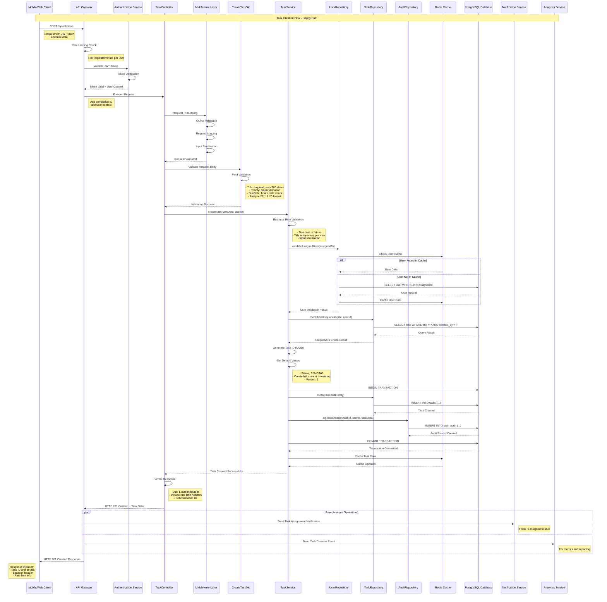
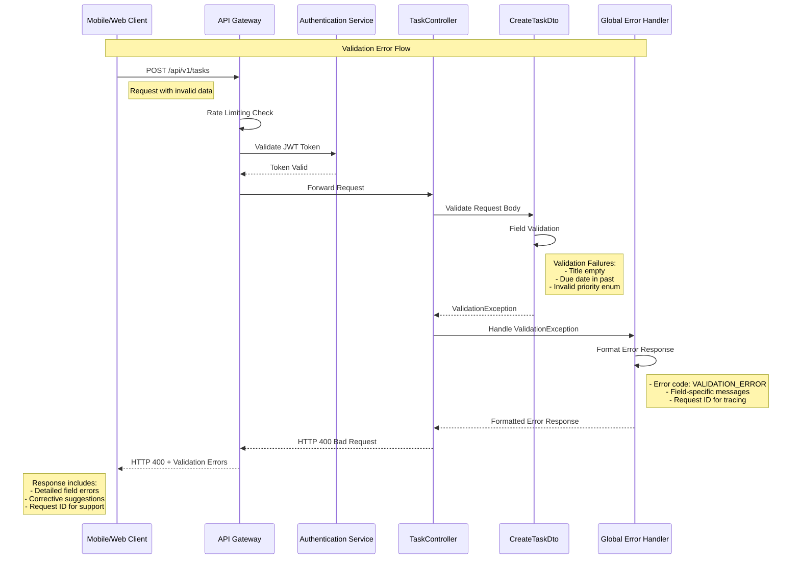
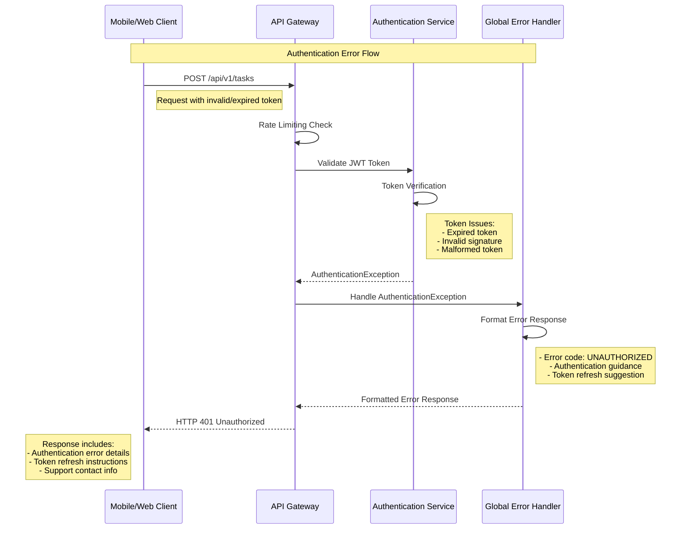
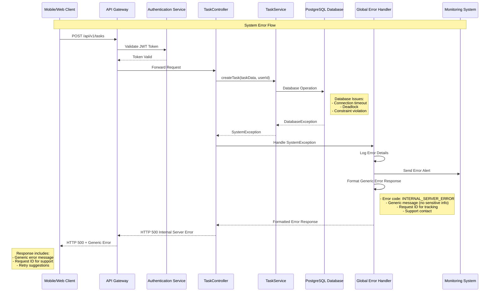
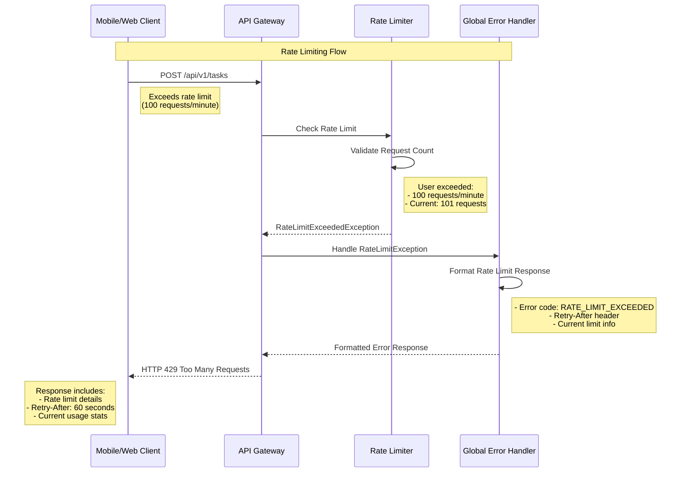
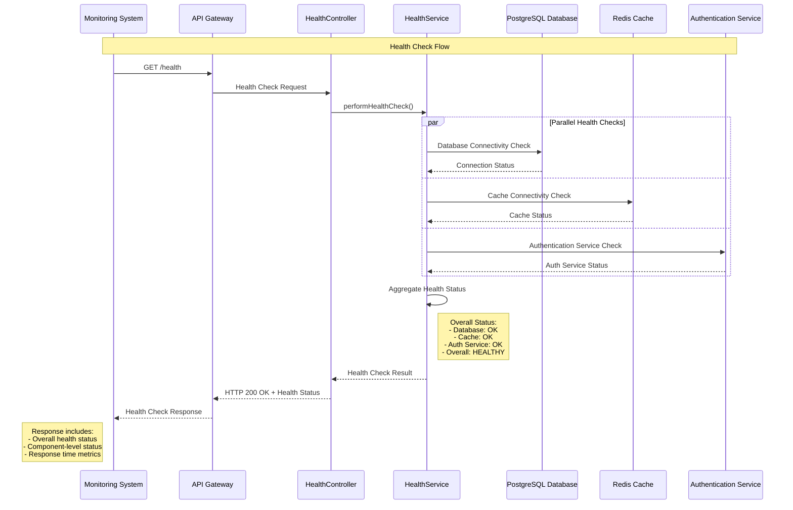

# Sequence Diagram - Task Management API
## Task Creation Endpoint Flow

### Version: 1.0
### Generated from: HLD-DEMO-2350 and API Contract
### Date: 2024

---

## Overview
This sequence diagram illustrates the complete flow for the Task Creation API endpoint (POST /api/v1/tasks), showing interactions between all system components from request initiation to response delivery.

---

## Primary Flow: Task Creation

---

## Error Flow: Validation Failure

---

## Error Flow: Authentication Failure

---

## Error Flow: System Error

---

## Rate Limiting Flow

---

## Health Check Flow

---

## Sequence Diagram Specifications

### Key Components
1. **Mobile/Web Client**: End-user application initiating requests
2. **API Gateway**: Entry point handling rate limiting, routing, and cross-cutting concerns
3. **Authentication Service**: External service for JWT token validation
4. **TaskController**: NestJS controller handling HTTP requests and responses
5. **Middleware Layer**: Request processing, validation, and logging
6. **CreateTaskDto**: Data transfer object with validation decorators
7. **TaskService**: Business logic layer with rule validation
8. **Repository Layer**: Data access abstraction (UserRepository, TaskRepository, AuditRepository)
9. **PostgreSQL Database**: Primary data store with ACID compliance
10. **Redis Cache**: In-memory cache for performance optimization
11. **Notification Service**: Asynchronous notification handling
12. **Analytics Service**: Event streaming for metrics and reporting

### Flow Patterns
1. **Synchronous Operations**: Request-response patterns for core functionality
2. **Asynchronous Operations**: Fire-and-forget for notifications and analytics
3. **Error Handling**: Comprehensive error flows with proper HTTP status codes
4. **Caching Strategy**: Cache-aside pattern for performance optimization
5. **Transaction Management**: Database transactions for data consistency
6. **Audit Logging**: Complete audit trail for compliance requirements

### Performance Considerations
- **Response Time Target**: < 200ms for 95% of requests
- **Caching Strategy**: Redis for frequently accessed data
- **Connection Pooling**: Database connection optimization
- **Parallel Processing**: Asynchronous operations for non-critical paths

### Security Measures
- **JWT Authentication**: Bearer token validation
- **Input Validation**: Multi-layer validation approach
- **Rate Limiting**: DoS protection with configurable limits
- **Audit Logging**: Complete operation tracking
- **Error Sanitization**: No sensitive data in error responses

### Compliance Features
- **GDPR**: Data minimization and audit trails
- **SOX**: Complete audit logging for financial compliance
- **ISO 27001**: Security management system integration

---

**Document Control**
- **Version**: 1.0
- **Generated From**: HLD-DEMO-2350, API Contract Outline
- **Last Updated**: 2024
- **Diagram Format**: Mermaid Sequence Diagrams
- **Compliance**: Enterprise Architecture Standards