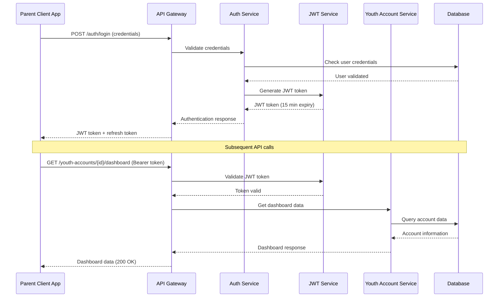
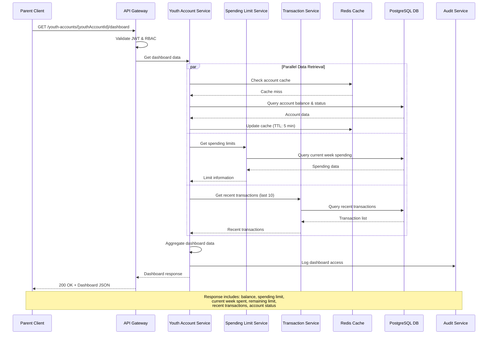
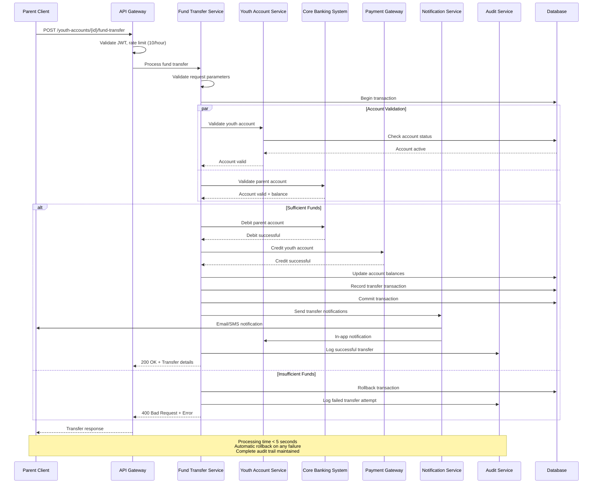
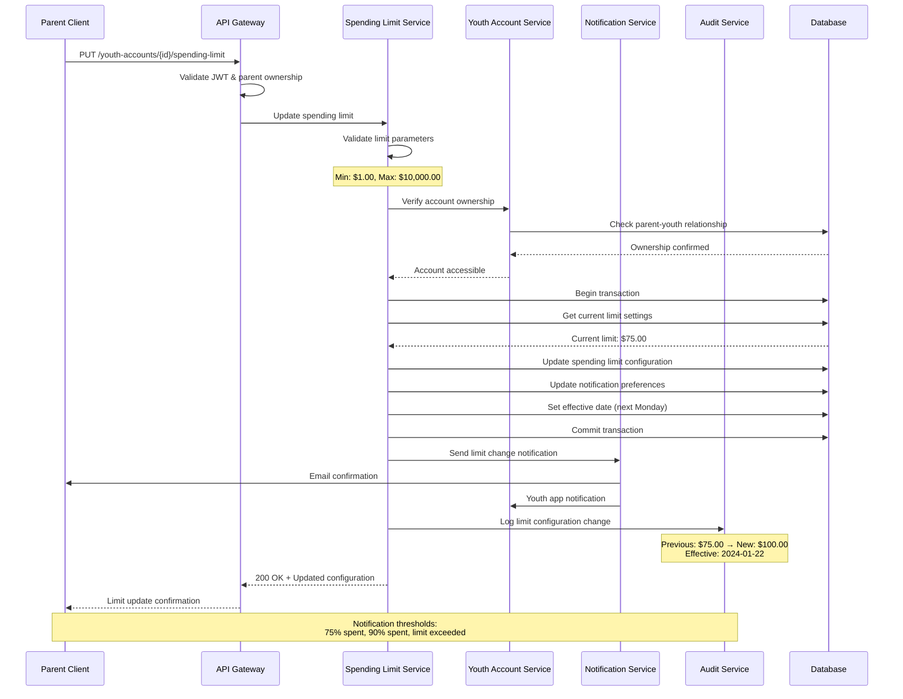
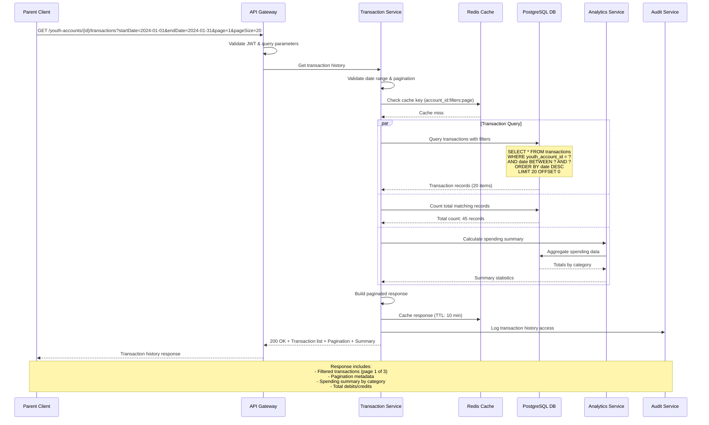
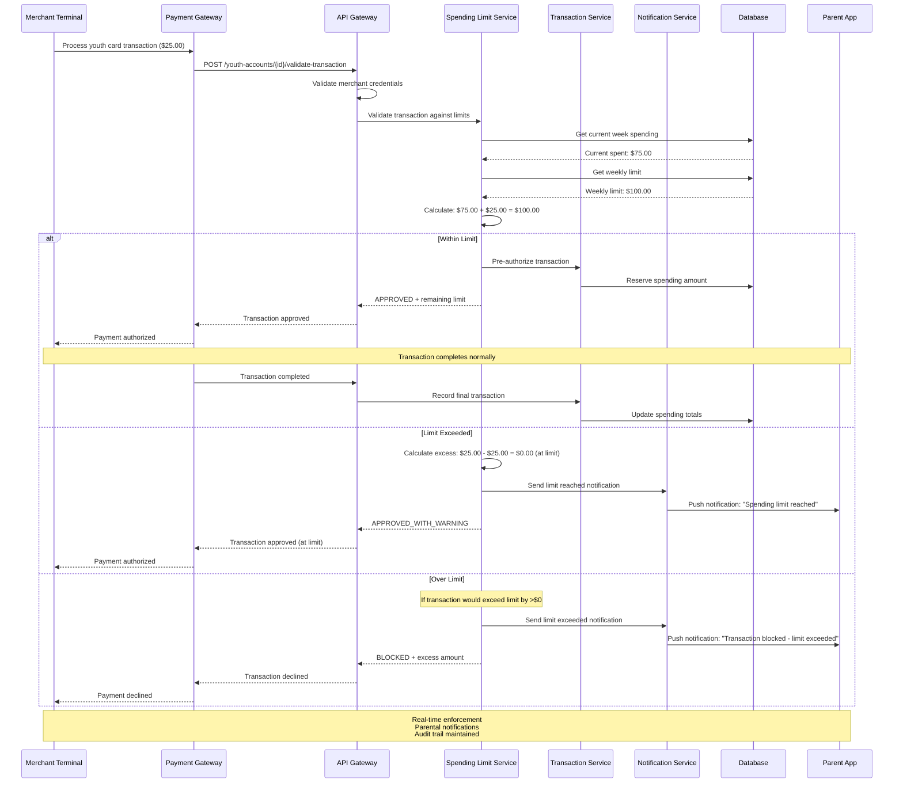
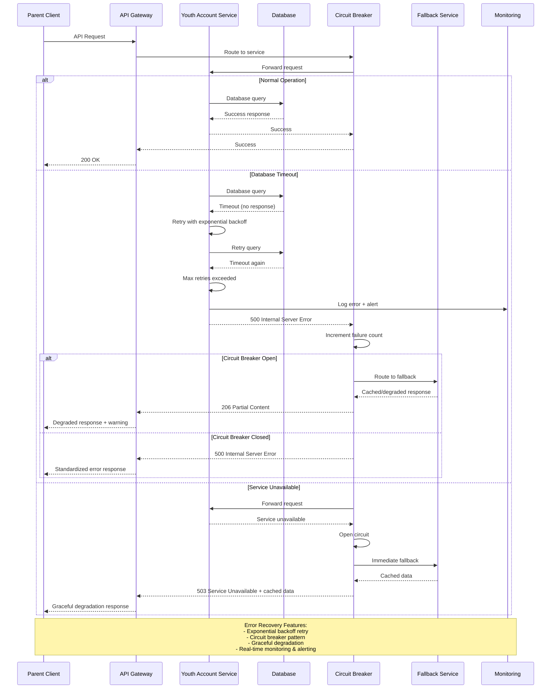

# Sequence Diagrams
# Youth Account Management System

## Document Information
- **Document Version**: 1.0
- **Date**: 2024
- **System**: Youth Account Management System
- **Traceability**: SCIB-25, SCIB-26, SCIB-27, SCIB-28, SCIB-29, SCIB-30
- **Compliance**: PCI-DSS Level 1, GDPR, SOX, BSA

---

## 1. Authentication & Authorization Flow

### Description
This sequence diagram shows the OAuth 2.0 + JWT authentication flow for parent users accessing youth account management features.

**Key Security Controls:**
- JWT tokens expire in 15 minutes
- Rate limiting: 1000 requests/hour per user
- MFA required for parent authentication
- RBAC enforcement at gateway level

---

## 2. Youth Account Dashboard Retrieval (SCIB-26)

### Description
Sequence diagram for retrieving consolidated youth account dashboard information including balance, spending limits, and recent transactions.

**Performance Requirements:**
- API response time < 200ms (95th percentile)
- Dashboard loading < 2 seconds
- Parallel data retrieval for optimization
- Redis caching with 5-minute TTL

---

## 3. Fund Transfer Process (SCIB-27)

### Description
Sequence diagram for transferring funds from parent account to youth account with real-time processing and validation.

**Business Rules:**
- Minimum transfer: $1.00
- Maximum transfer: $1,000.00
- Rate limit: 10 transfers per hour
- ACID transaction properties enforced
- Automatic rollback on failure

---

## 4. Spending Limit Configuration (SCIB-28)

### Description
Sequence diagram for configuring weekly spending limits for youth accounts with notification preferences.

**Configuration Options:**
- Weekly limit: $1.00 - $10,000.00
- Effective date: Next Monday (default)
- Notification preferences: 75%, 90%, exceed
- Automatic reset every Monday

---

## 5. Transaction History Retrieval (SCIB-29)

### Description
Sequence diagram for retrieving transaction history with filtering, pagination, and analytics.

**Query Capabilities:**
- Date range filtering
- Transaction type filtering (debit/credit)
- Status filtering (completed/pending/failed)
- Pagination (max 100 items per page)
- Sorting by date, amount, merchant
- Spending analytics and summaries

---

## 6. Real-time Spending Limit Enforcement

### Description
Sequence diagram for real-time transaction validation against spending limits during purchase attempts.

**Enforcement Rules:**
- Real-time spending calculation
- Immediate parent notification
- Transaction blocking when over limit
- Weekly limit reset every Monday
- Grace period considerations

---

## 7. Error Handling & Recovery Flow

### Description
Sequence diagram showing error handling and recovery mechanisms for system failures.

**Error Handling Strategy:**
- Circuit breaker pattern for external services
- Exponential backoff retry (max 3 attempts)
- Graceful degradation with cached data
- Standardized error response format
- Real-time monitoring and alerting

---

## Compliance & Audit Considerations

### Security Controls
- **Authentication**: OAuth 2.0 + JWT with 15-minute expiry
- **Authorization**: RBAC with minimum privilege principle
- **Rate Limiting**: Configurable per endpoint (1000/hour general, 10/hour transfers)
- **Input Validation**: All parameters validated at gateway level
- **Audit Logging**: Complete audit trail for all operations

### Performance Requirements
- **API Response**: < 200ms (95th percentile)
- **Dashboard Load**: < 2 seconds
- **Fund Transfer**: < 5 seconds processing
- **Concurrent Users**: 10,000 during peak hours
- **Throughput**: 50,000 API requests per minute

### Compliance Standards
- **PCI-DSS Level 1**: Payment processing compliance
- **GDPR**: Data privacy and protection
- **SOX**: Financial reporting controls
- **BSA**: Bank Secrecy Act compliance
- **WCAG 2.1 AA**: Accessibility standards

---

**Document Control:**
- Version: 1.0
- Last Updated: 2024
- Next Review: Monthly
- Approval: Enterprise Architecture Review Board
- Implementation Status: Design Phase Complete