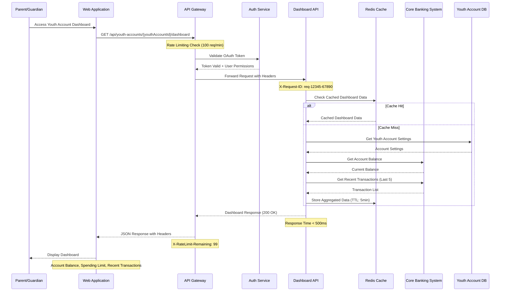
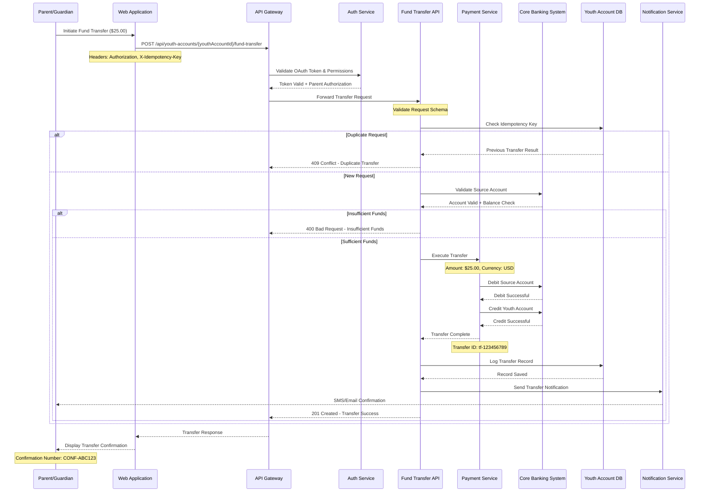
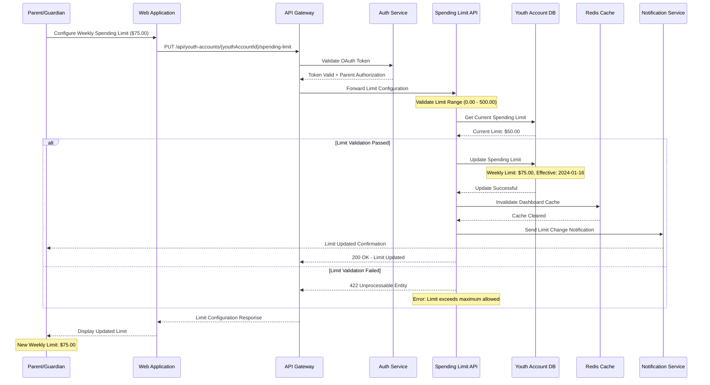
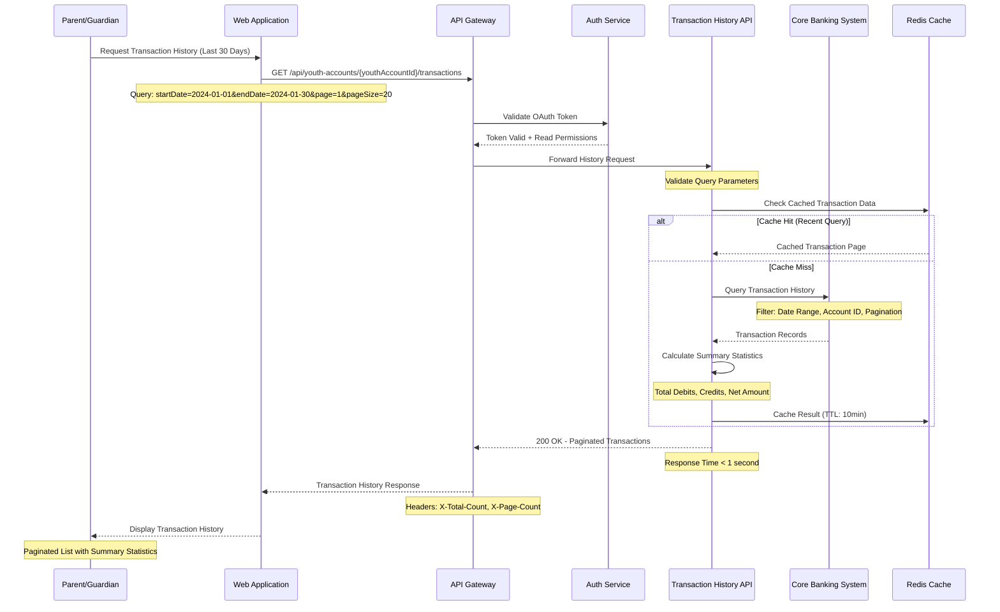
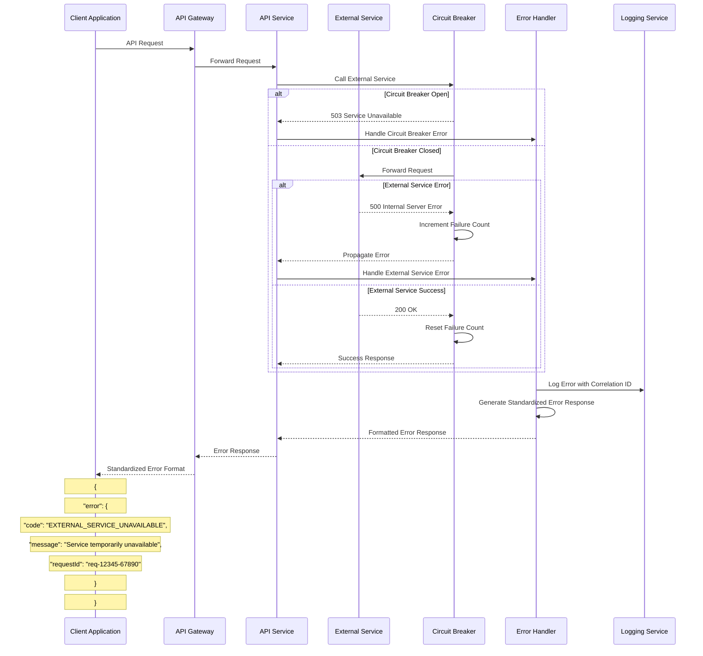
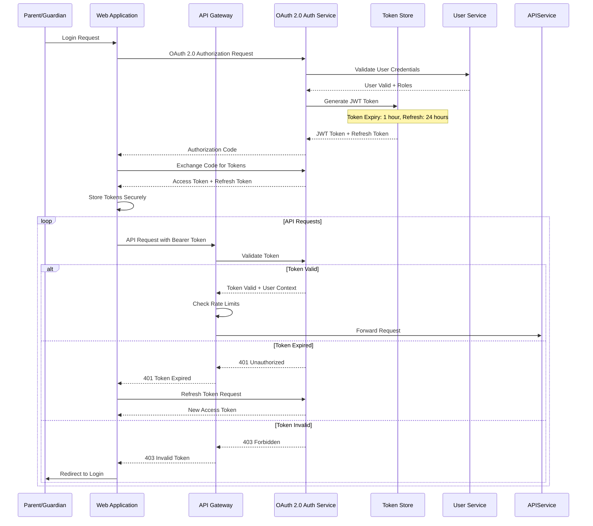

# Sequence Diagrams
## Youth Account Management System

### Document Information
- **Version**: 1.0
- **Date**: 2024
- **Generated From**: HLD Document and API Contract Outline
- **Related ADRs**: SCIB-26, SCIB-27, SCIB-28, SCIB-29, SCIB-30

---

## 1. Youth Account Dashboard Sequence Diagram
**Mapped to ADR**: SCIB-26

---

## 2. Fund Transfer Sequence Diagram
**Mapped to ADR**: SCIB-27

---

## 3. Spending Limit Configuration Sequence Diagram
**Mapped to ADR**: SCIB-28

---

## 4. Transaction History Retrieval Sequence Diagram
**Mapped to ADR**: SCIB-29

---

## 5. Error Handling Sequence Diagram
**Cross-Cutting Concern for All APIs**

---

## 6. Authentication & Authorization Sequence Diagram
**Security Flow for All Protected Endpoints**

---

## Sequence Diagram Standards & Compliance

### 1. Banking Compliance Integration
- **PCI-DSS**: All payment data flows show encryption and tokenization
- **SOX**: Audit trails included in all financial transaction sequences
- **GDPR**: Data access controls and consent validation shown
- **AML/KYC**: User validation steps included in authentication flows

### 2. Security Patterns
- **OAuth 2.0**: Standard authentication flow with JWT tokens
- **Rate Limiting**: API gateway enforces 100 requests/minute
- **Circuit Breaker**: Fault tolerance for external service failures
- **Idempotency**: Duplicate request handling for fund transfers

### 3. Performance Considerations
- **Caching**: Redis cache integration for dashboard and transaction data
- **Response Times**: Target response times noted for each API
- **Pagination**: Large dataset handling for transaction history
- **Async Processing**: Notification services operate asynchronously

### 4. Error Handling Standards
- **Standardized Errors**: Consistent error format across all APIs
- **HTTP Status Codes**: Proper status codes (200, 201, 400, 401, 403, 404, 409, 422, 429, 500)
- **Correlation IDs**: Request tracking with X-Request-ID headers
- **Graceful Degradation**: System continues with reduced functionality

### 5. Audit & Traceability
- **Request Correlation**: Unique request IDs for end-to-end tracing
- **Audit Logging**: All user actions and system events logged
- **Compliance Monitoring**: Regulatory reporting integration
- **Data Lineage**: Complete data flow tracking

---

**Sequence Diagrams Document End**