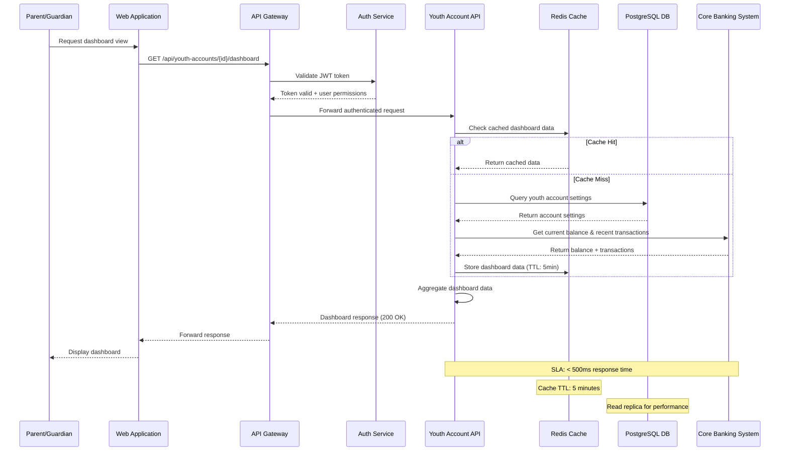
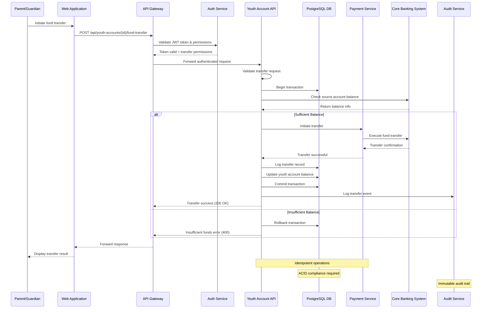
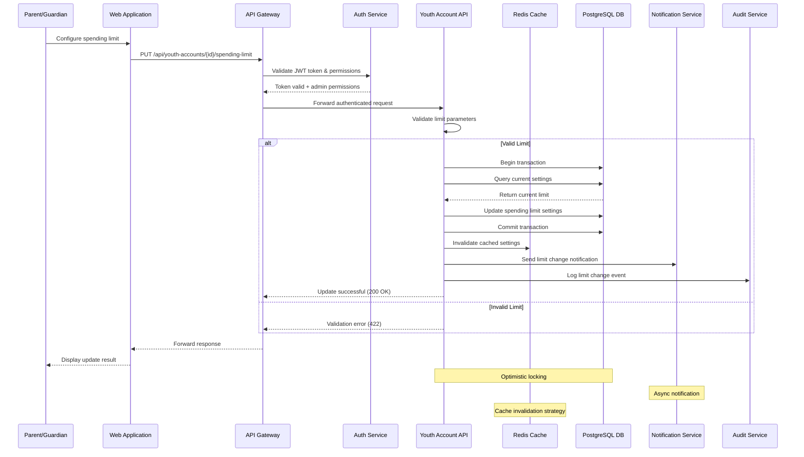
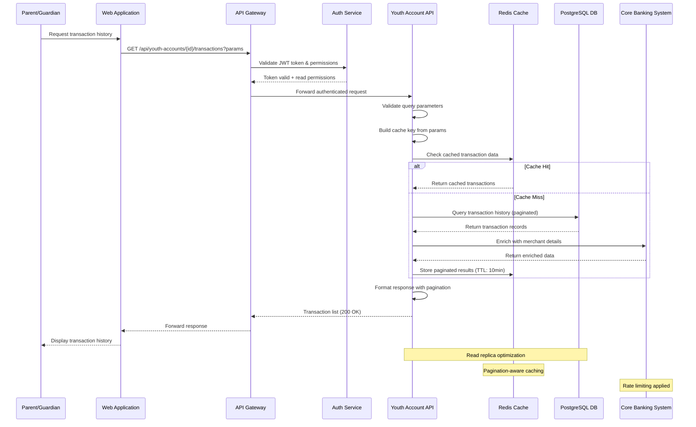
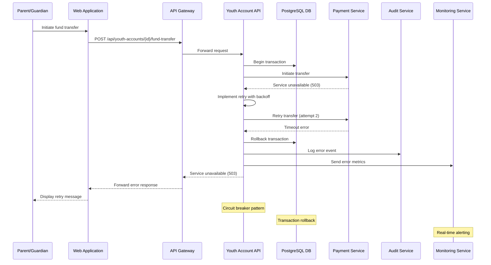
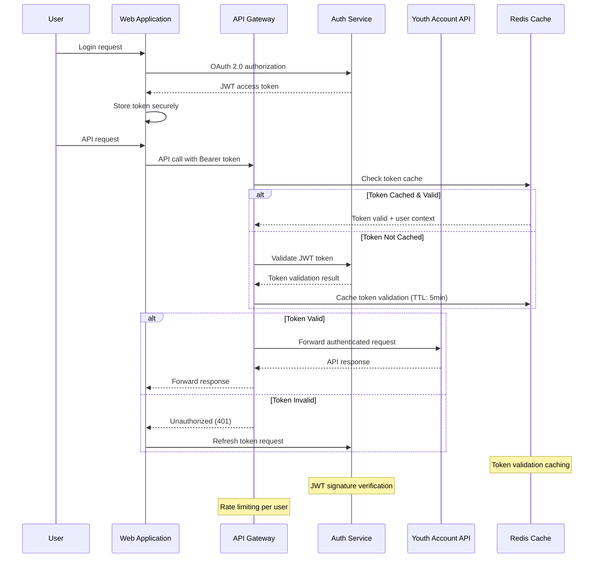

# Sequence Diagrams
# Youth Account Management System

## Overview
This document contains sequence diagrams for the Youth Account Management System API endpoints, illustrating the interaction flow between system components for each major operation.

## 1. Youth Account Dashboard - Sequence Diagram
**Reference**: SCIB-26 - Dashboard API Implementation
**Endpoint**: GET /api/youth-accounts/{youthAccountId}/dashboard

## 2. Fund Transfer - Sequence Diagram
**Reference**: SCIB-27 - Fund Transfer API Implementation
**Endpoint**: POST /api/youth-accounts/{youthAccountId}/fund-transfer

## 3. Spending Limit Configuration - Sequence Diagram
**Reference**: SCIB-28 - Spending Limit API Implementation
**Endpoint**: PUT /api/youth-accounts/{youthAccountId}/spending-limit

## 4. Transaction History - Sequence Diagram
**Reference**: SCIB-29 - Transaction History API Implementation
**Endpoint**: GET /api/youth-accounts/{youthAccountId}/transactions

## 5. Error Handling - Sequence Diagram
**Scenario**: System Error During Fund Transfer

## 6. Authentication Flow - Sequence Diagram
**Scenario**: OAuth 2.0 Token Validation

## Sequence Diagram Design Principles

### 1. Performance Considerations
- **Caching Strategy**: Redis cache with appropriate TTL values
- **Database Optimization**: Read replicas for query operations
- **Response Time SLAs**: < 500ms for dashboard, < 3s for transfers
- **Connection Pooling**: Efficient database connection management

### 2. Security Measures
- **Token Validation**: JWT token validation at API Gateway
- **Permission Checks**: Role-based access control (RBAC)
- **Audit Logging**: Complete audit trail for all operations
- **Input Validation**: Request validation before processing

### 3. Reliability Patterns
- **Transaction Management**: ACID compliance for financial operations
- **Retry Logic**: Exponential backoff for transient failures
- **Circuit Breaker**: Protection against cascading failures
- **Idempotent Operations**: Safe retry mechanisms

### 4. Monitoring & Observability
- **Request Correlation**: Unique request IDs across services
- **Performance Metrics**: Response time and throughput monitoring
- **Error Tracking**: Comprehensive error logging and alerting
- **Business Metrics**: Financial transaction monitoring

### 5. Scalability Features
- **Horizontal Scaling**: Stateless API design
- **Load Balancing**: Even distribution across instances
- **Async Processing**: Non-blocking operations where possible
- **Resource Optimization**: Efficient resource utilization

---

**Document Version**: 1.0
**Last Updated**: [Current Date]
**Created By**: Senior Solution Architect
**Compliance**: SOC2, PCI-DSS, GDPR
**Review Date**: [Quarterly Review]