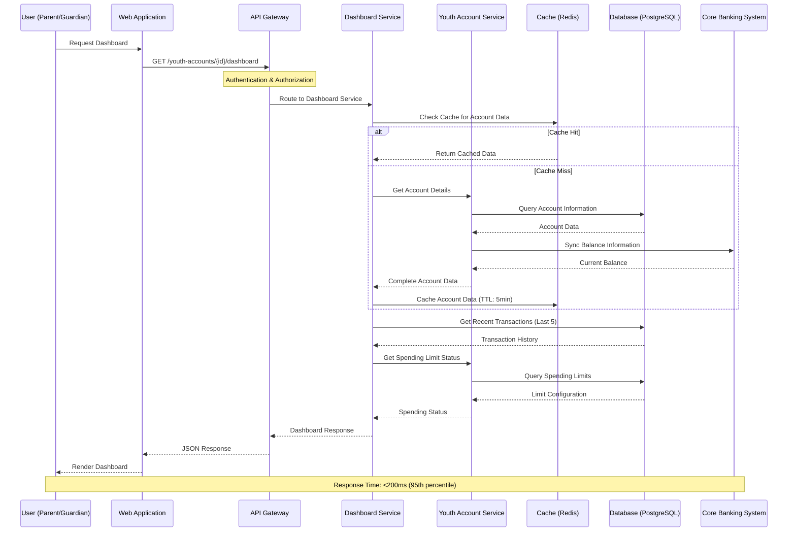
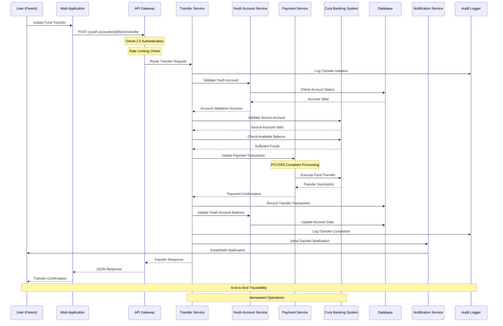
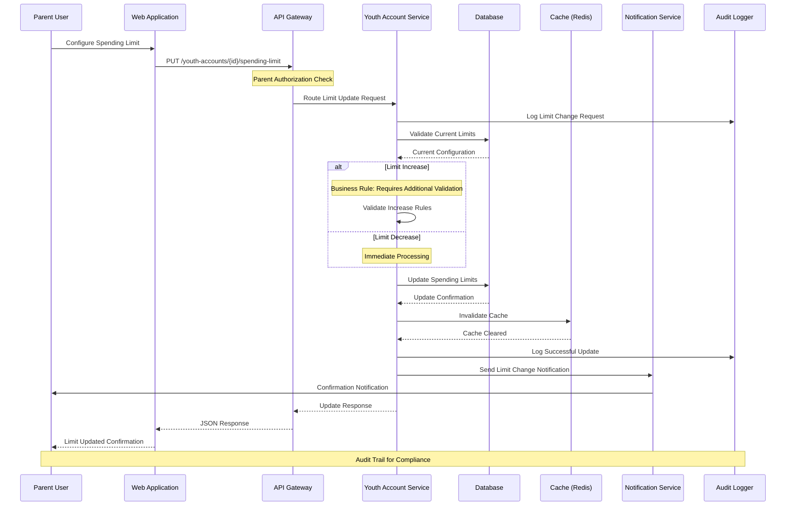
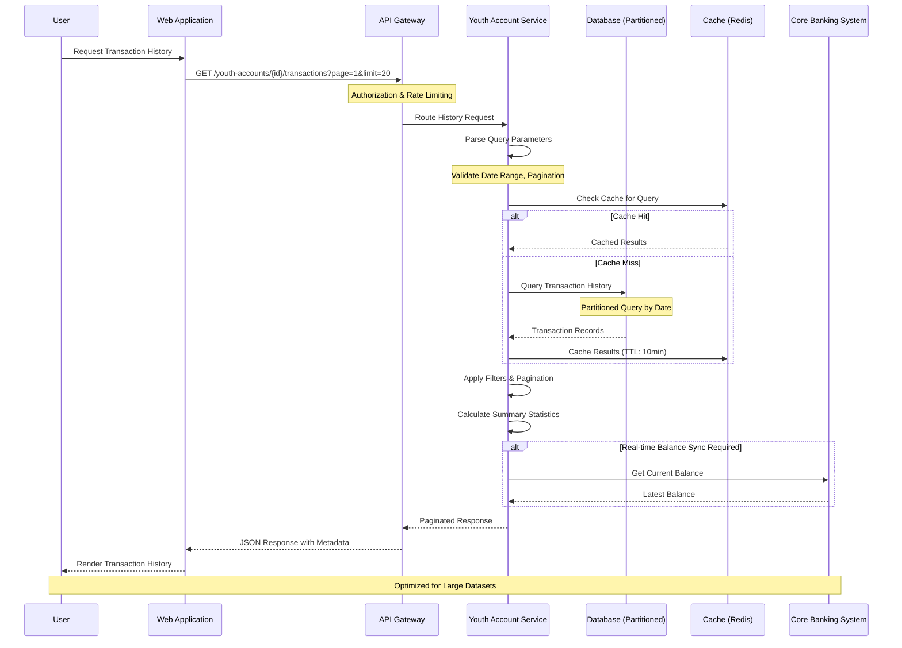
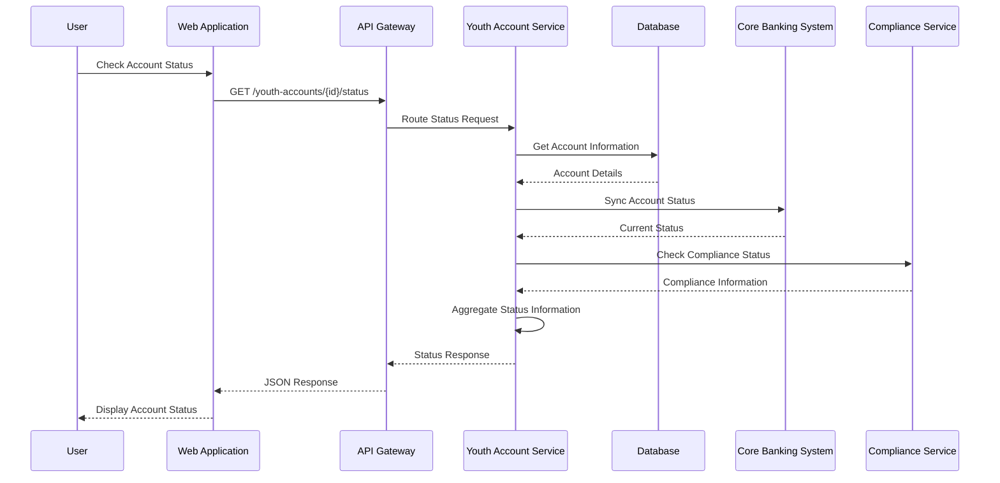
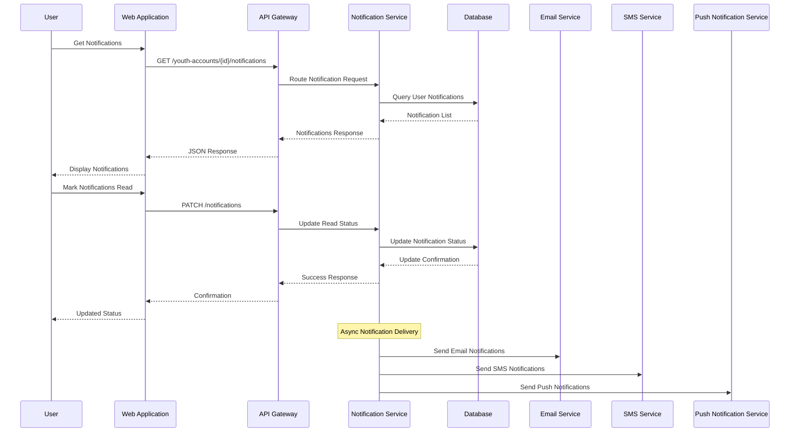
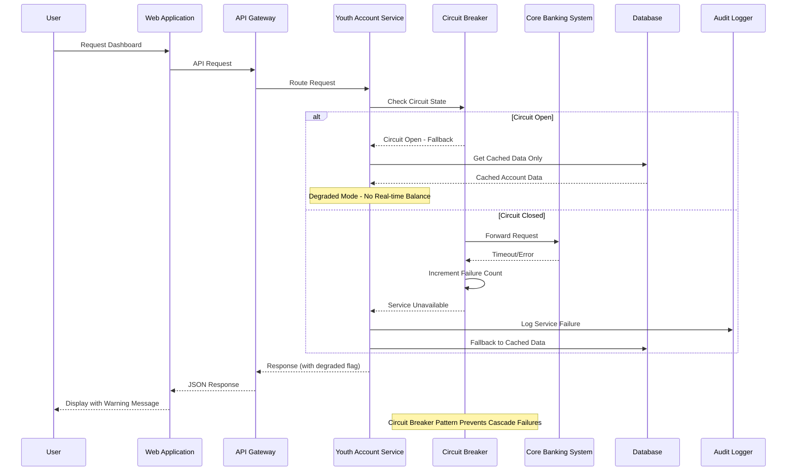
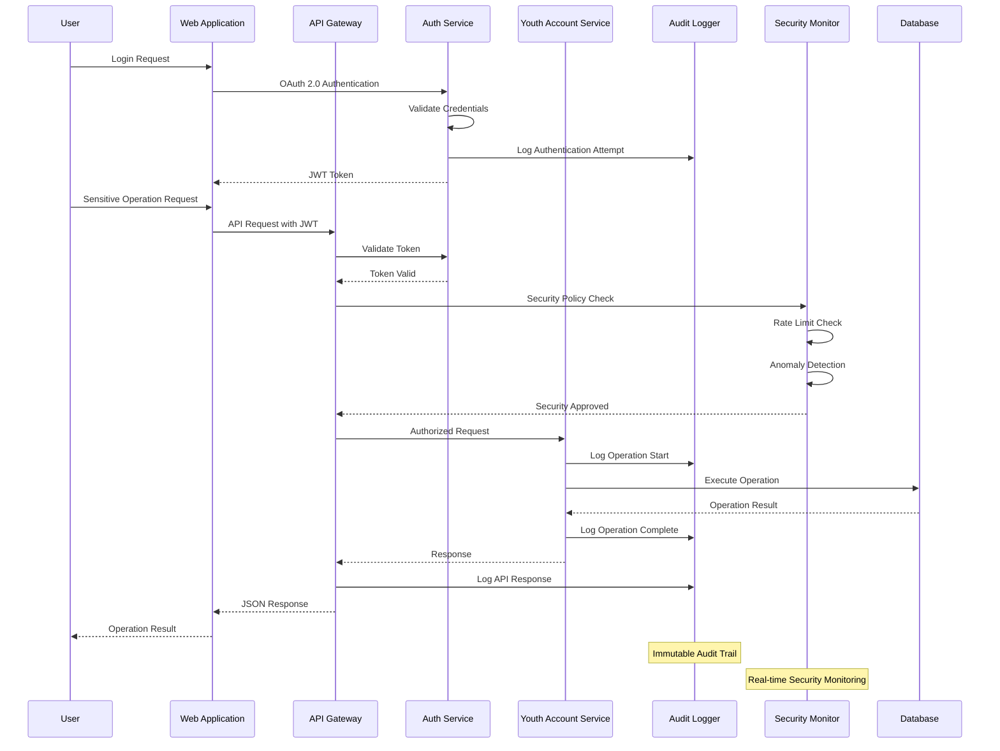

# Sequence Diagrams
## Youth Account Management System

### Version: 1.0
### Date: 2024
### Generated from: HLD Document and API Contract Outline

---

## 1. Youth Account Dashboard Sequence Diagram

---

## 2. Fund Transfer Sequence Diagram

---

## 3. Spending Limit Configuration Sequence Diagram

---

## 4. Transaction History Retrieval Sequence Diagram

---

## 5. Account Status Check Sequence Diagram

---

## 6. Notification Management Sequence Diagram

---

## 7. Error Handling and Circuit Breaker Sequence Diagram

---

## 8. Security and Audit Sequence Diagram

---

## Sequence Diagram Standards and Conventions

### Naming Conventions
- **Participants**: Abbreviated service names (YS = Youth Service)
- **Messages**: RESTful API patterns with HTTP methods
- **Notes**: Performance targets and business rules

### Performance Annotations
- Response time targets included in notes
- Cache TTL values specified
- Timeout configurations documented

### Security Considerations
- Authentication flows clearly marked
- Authorization checkpoints identified
- Audit logging points highlighted

### Error Handling Patterns
- Circuit breaker implementations
- Fallback mechanisms
- Graceful degradation scenarios

### Compliance Markers
- PCI-DSS compliance points
- Audit trail requirements
- Data protection measures

---

## Integration with Architecture

These sequence diagrams directly map to:
- **HLD Document**: Section 4 (Component Design)
- **API Contract**: All 6 major endpoints
- **ADR References**: SCIB-26 through SCIB-197
- **NFR Requirements**: Performance and security targets

---

*Generated from Youth Account Management System HLD Document v1.0*
*Compliant with OpenAPI 3.0 and enterprise architecture standards*