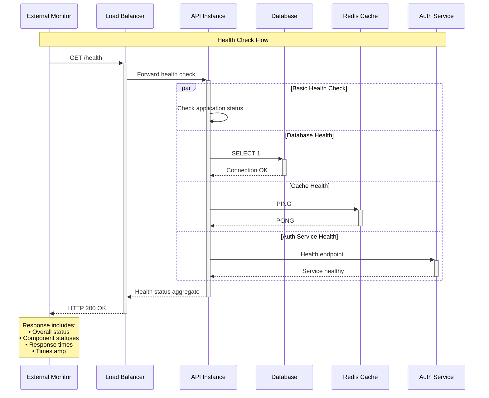
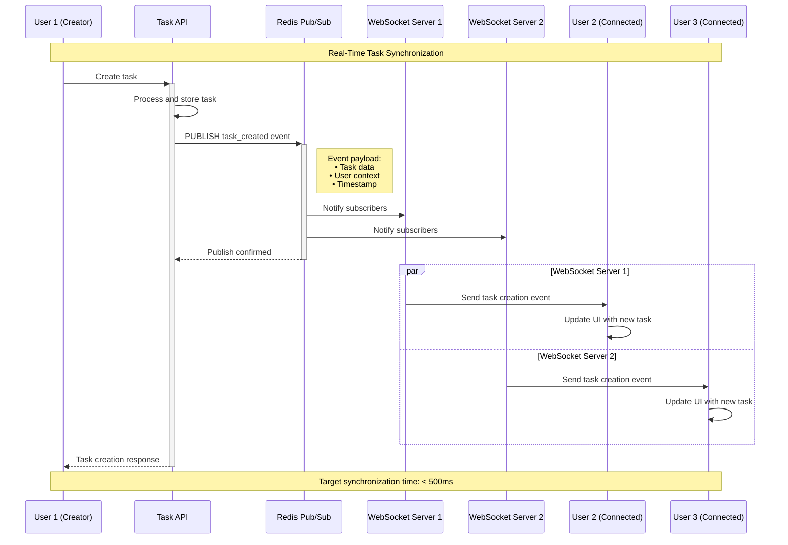

# Sequence Diagrams - Task Management API System

## Overview
This document contains sequence diagrams for the Task Management API system, illustrating the interaction flows between components for key operations.

---

## 1. Task Creation Sequence Diagram

### Description
This sequence diagram shows the complete flow of creating a new task through the POST /api/tasks endpoint, including authentication, validation, business logic processing, and real-time synchronization.

```mermaid
sequenceDiagram
    participant Client as API Consumer
    participant LB as Load Balancer
    participant Gateway as API Gateway
    participant Auth as Authentication Service
    participant Controller as Task Controller
    participant DTO as CreateTaskDto
    participant Service as Task Service
    participant Validator as Data Validator
    participant Sanitizer as Data Sanitizer
    participant DB as PostgreSQL Database
    participant Cache as Redis Cache
    participant Audit as Audit Service
    participant Monitor as Monitoring System
    participant WS as WebSocket Service
    participant Clients as Connected Clients

    Note over Client, Clients: Task Creation Flow - POST /api/tasks
    
    Client->>+LB: POST /api/tasks
    Note right of Client: Request Headers:<br/>Authorization: Bearer {jwt}<br/>Content-Type: application/json<br/>X-Request-ID: {uuid}
    
    LB->>+Gateway: Route request
    Gateway->>+Auth: Validate JWT token
    Auth-->>-Gateway: Token validation result
    
    alt Token Valid
        Gateway->>+Controller: Forward request
        Controller->>+DTO: Validate request payload
        
        alt Validation Success
            DTO-->>-Controller: Validated data
            Controller->>+Service: createTask(createTaskDto)
            
            Service->>+Validator: Validate business rules
            Note right of Validator: • Due date future validation<br/>• User assignment validation<br/>• Duplicate task check
            Validator-->>-Service: Business validation result
            
            alt Business Rules Valid
                Service->>+Sanitizer: Sanitize input data
                Note right of Sanitizer: • HTML tag stripping<br/>• XSS prevention<br/>• SQL injection prevention
                Sanitizer-->>-Service: Sanitized data
                
                Service->>+DB: BEGIN TRANSACTION
                Service->>DB: INSERT INTO tasks
                Service->>DB: UPDATE user_stats
                Service->>+Cache: Cache task data
                Cache-->>-Service: Cache confirmation
                Service->>DB: COMMIT TRANSACTION
                DB-->>-Service: Task created with ID
                
                Service->>+Audit: Log task creation
                Note right of Audit: • User ID<br/>• Task ID<br/>• Timestamp<br/>• Action: CREATE
                Audit-->>-Service: Audit logged
                
                Service->>+Monitor: Record metrics
                Note right of Monitor: • Response time<br/>• Success count<br/>• User activity
                Monitor-->>-Service: Metrics recorded
                
                Service->>+WS: Broadcast task creation
                Note right of WS: Real-time synchronization<br/>Target: < 500ms
                WS->>Clients: New task notification
                WS-->>-Service: Broadcast complete
                
                Service-->>-Controller: Task creation result
                Controller-->>-Gateway: HTTP 201 Created
                
                Note over Controller: Response includes:<br/>• Task ID and metadata<br/>• HATEOAS links<br/>• Location header
                
            else Business Rules Invalid
                Validator-->>Service: Validation errors
                Service-->>-Controller: Business rule violation
                Controller-->>-Gateway: HTTP 422 Unprocessable Entity
            end
            
        else Validation Failed
            DTO-->>-Controller: Validation errors
            Controller-->>-Gateway: HTTP 400 Bad Request
            Note over Controller: Detailed field-level<br/>validation errors
        end
        
    else Token Invalid
        Auth-->>Gateway: Authentication failed
        Gateway-->>-LB: HTTP 401 Unauthorized
    end
    
    Gateway-->>-LB: Response
    LB-->>-Client: Final response
    
    Note over Client, Clients: Response Time Target: < 200ms (95th percentile)
```

---

## 2. Error Handling Sequence Diagram

### Description
This sequence diagram illustrates the comprehensive error handling flow for various failure scenarios in the Task Management API.

```mermaid
sequenceDiagram
    participant Client as API Consumer
    participant Gateway as API Gateway
    participant Controller as Task Controller
    participant Service as Task Service
    participant DB as Database
    participant Monitor as Monitoring
    participant Logger as Logging Service

    Note over Client, Logger: Error Handling Flow
    
    Client->>+Gateway: POST /api/tasks (Invalid data)
    Gateway->>+Controller: Process request
    Controller->>+Service: createTask(invalidData)
    
    alt Database Connection Error
        Service->>+DB: Database operation
        DB-->>-Service: Connection timeout
        Service->>+Logger: Log database error
        Logger-->>-Service: Error logged
        Service->>+Monitor: Record error metric
        Monitor-->>-Service: Metric recorded
        Service-->>-Controller: Database error
        Controller-->>-Gateway: HTTP 500 Internal Server Error
        
    else Validation Error
        Service->>Service: Validate business rules
        Service-->>-Controller: Validation failed
        Controller->>+Logger: Log validation error
        Logger-->>-Controller: Error logged
        Controller-->>-Gateway: HTTP 400 Bad Request
        
    else Rate Limit Exceeded
        Gateway->>Gateway: Check rate limits
        Gateway->>+Logger: Log rate limit violation
        Logger-->>-Gateway: Error logged
        Gateway->>+Monitor: Record rate limit metric
        Monitor-->>-Gateway: Metric recorded
        Gateway-->>-Client: HTTP 429 Too Many Requests
        
    else Duplicate Task Conflict
        Service->>+DB: Check for duplicates
        DB-->>-Service: Duplicate found
        Service->>+Logger: Log conflict
        Logger-->>-Service: Error logged
        Service-->>-Controller: Conflict detected
        Controller-->>-Gateway: HTTP 409 Conflict
    end
    
    Gateway-->>-Client: Error response with details
    
    Note over Client: All errors include:<br/>• Error code<br/>• Human-readable message<br/>• Request correlation ID<br/>• Timestamp
```

---

## 3. Health Check Sequence Diagram

### Description
This sequence diagram shows the health monitoring flow for the Task Management API system.



---

## 4. Bulk Task Creation Sequence Diagram

### Description
This sequence diagram illustrates the flow for bulk task creation operations with batch processing and transaction management.

```mermaid
sequenceDiagram
    participant Client as API Consumer
    participant Controller as Task Controller
    participant Service as Task Service
    participant Validator as Batch Validator
    participant DB as Database
    participant Cache as Redis Cache
    participant WS as WebSocket Service
    participant Clients as Connected Clients

    Note over Client, Clients: Bulk Task Creation Flow
    
    Client->>+Controller: POST /api/tasks/bulk
    Note right of Client: Batch size limit: 100 tasks
    
    Controller->>+Service: createBulkTasks(taskArray)
    Service->>+Validator: Validate all tasks
    
    alt All Tasks Valid
        Validator-->>-Service: Validation passed
        Service->>+DB: BEGIN TRANSACTION
        
        loop For each task batch (10 tasks)
            Service->>DB: INSERT batch into tasks
            Service->>Cache: Cache batch data
        end
        
        Service->>DB: COMMIT TRANSACTION
        DB-->>-Service: Bulk insert complete
        
        Service->>+WS: Broadcast bulk creation
        WS->>Clients: Bulk task notification
        WS-->>-Service: Broadcast complete
        
        Service-->>-Controller: Bulk creation result
        Controller-->>-Client: HTTP 201 Created
        
    else Validation Errors
        Validator-->>-Service: Validation errors
        Service-->>-Controller: Partial validation failed
        Controller-->>-Client: HTTP 400 Bad Request
        Note over Controller: Response includes:<br/>• Failed task indices<br/>• Specific error messages<br/>• Successful task count
    end
```

---

## 5. Real-Time Synchronization Sequence Diagram

### Description
This sequence diagram shows the real-time synchronization flow when tasks are created and need to be broadcast to all connected clients.



---

## Sequence Diagram Standards and Conventions

### 1. Participant Naming
- Use clear, descriptive names for all participants
- Follow consistent naming conventions across diagrams
- Group related components logically

### 2. Message Types
- **Synchronous calls**: Solid arrows (->>) 
- **Asynchronous calls**: Dashed arrows (-->>)
- **Return messages**: Dashed arrows with return values
- **Self-calls**: Loops back to same participant

### 3. Notes and Annotations
- Include timing requirements where applicable
- Document important data structures in notes
- Highlight error conditions and edge cases
- Reference related architectural decisions

### 4. Error Handling
- Use alternative flows (alt/else) for error scenarios
- Include comprehensive error response details
- Show logging and monitoring integration
- Document retry and fallback mechanisms

### 5. Performance Considerations
- Include response time targets
- Show parallel processing where applicable
- Document caching strategies
- Highlight bottlenecks and optimization points

---

## Compliance and Traceability

### ADR Mappings
- **DEMO-2350**: Task creation endpoint implementation
- **HLD-TASK-API-001**: High-level design alignment
- **API-CONTRACT-001**: API contract compliance

### Non-Functional Requirements
- **Performance**: < 200ms response time (95th percentile)
- **Availability**: 99.99% uptime requirement
- **Security**: JWT authentication and authorization
- **Scalability**: Horizontal scaling support
- **Monitoring**: Comprehensive observability

### Quality Attributes
- **Maintainability**: Clear separation of concerns
- **Testability**: Well-defined interaction points
- **Reliability**: Comprehensive error handling
- **Security**: Authentication and input validation
- **Performance**: Optimized data flow and caching

---

**Document Information**
- **Version**: 1.0
- **Last Updated**: 2024
- **Prepared By**: Senior Solution Architect
- **Review Status**: Ready for Technical Review
- **Compliance**: Enterprise Architecture Standards