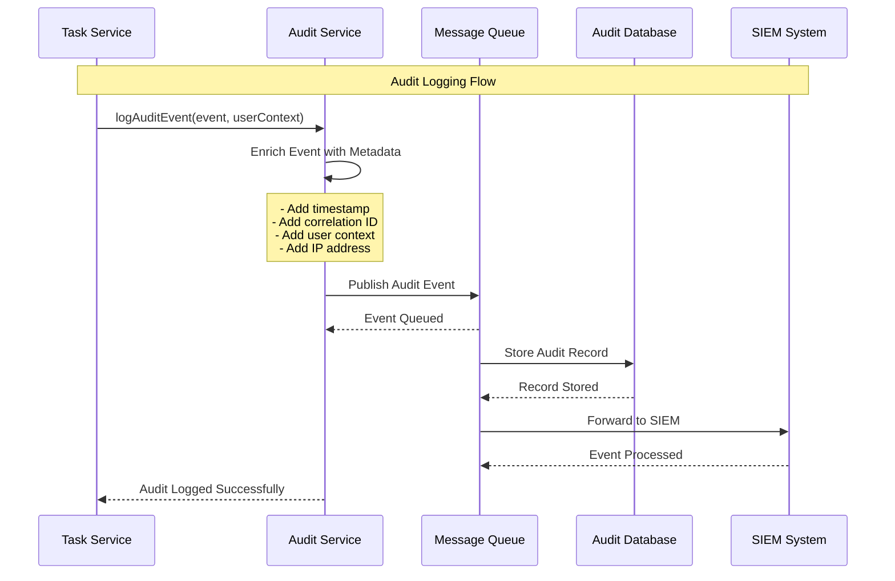

# Sequence Diagram - Task Management API System

## Overview
This sequence diagram illustrates the complete flow for the task creation endpoint (POST /api/tasks) as specified in DEMO-2350, including authentication, validation, business logic processing, and data persistence.

## Primary Flow: Task Creation

```mermaid
sequenceDiagram
    participant Client as Client Application
    participant Gateway as API Gateway
    participant Auth as Auth Service
    participant Controller as Task Controller
    participant Validator as Validation Service
    participant Service as Task Service
    participant DAL as Data Access Layer
    participant DB as PostgreSQL Database
    participant Cache as Redis Cache
    participant Audit as Audit Service
    participant Notification as Notification Service

    Note over Client, Notification: Task Creation Flow (POST /api/tasks)
    
    Client->>Gateway: POST /api/tasks<br/>Authorization: Bearer {token}<br/>Content-Type: application/json
    
    Gateway->>Auth: Validate JWT Token
    Auth-->>Gateway: Token Valid + User Context
    
    Gateway->>Controller: Route Request + User Context
    
    Controller->>Validator: Validate CreateTaskDto
    Note over Validator: - IsNotEmpty(title)<br/>- MaxLength(255)<br/>- IsEnum(status)<br/>- IsDateString(dueDate)
    
    alt Validation Success
        Validator-->>Controller: Validation Passed
        
        Controller->>Service: createTask(dto, userContext)
        
        Service->>Service: Apply Business Rules
        Note over Service: - Check user permissions<br/>- Validate due date not in past<br/>- Check duplicate tasks<br/>- Apply default values
        
        alt Business Rules Valid
            Service->>DAL: Create Task Entity
            
            DAL->>DB: BEGIN TRANSACTION
            DAL->>DB: INSERT INTO tasks
            DAL->>DB: INSERT INTO task_history
            DAL->>DB: COMMIT TRANSACTION
            
            DB-->>DAL: Task Created (ID: uuid)
            DAL-->>Service: Task Entity with ID
            
            Service->>Cache: Cache Task Data
            Cache-->>Service: Cache Updated
            
            Service->>Audit: Log Task Creation
            Audit-->>Service: Audit Logged
            
            Service->>Notification: Send Task Notification
            Notification-->>Service: Notification Queued
            
            Service-->>Controller: TaskResponseDto
            Controller-->>Gateway: HTTP 201 Created + Task Data
            Gateway-->>Client: HTTP 201 Created<br/>{
              "id": "uuid",
              "title": "Task Title",
              "status": "TODO",
              "createdAt": "timestamp"
            }
            
        else Business Rule Violation
            Service-->>Controller: BusinessRuleException
            Controller-->>Gateway: HTTP 422 Unprocessable Entity
            Gateway-->>Client: HTTP 422<br/>{
              "error": {
                "code": "BUSINESS_RULE_VIOLATION",
                "message": "Business rule validation failed"
              }
            }
        end
        
    else Validation Failed
        Validator-->>Controller: ValidationException
        Controller-->>Gateway: HTTP 400 Bad Request
        Gateway-->>Client: HTTP 400<br/>{
          "error": {
            "code": "VALIDATION_ERROR",
            "validationErrors": []
          }
        }
    end
```

## Error Handling Flows

### Authentication Error Flow

```mermaid
sequenceDiagram
    participant Client as Client Application
    participant Gateway as API Gateway
    participant Auth as Auth Service

    Client->>Gateway: POST /api/tasks<br/>Authorization: Bearer {invalid_token}
    Gateway->>Auth: Validate JWT Token
    Auth-->>Gateway: Token Invalid/Expired
    Gateway-->>Client: HTTP 401 Unauthorized<br/>{
      "error": {
        "code": "UNAUTHORIZED",
        "message": "Authentication required"
      }
    }
```

### Database Error Flow

```mermaid
sequenceDiagram
    participant Service as Task Service
    participant DAL as Data Access Layer
    participant DB as PostgreSQL Database
    participant Controller as Task Controller
    participant Gateway as API Gateway
    participant Client as Client Application

    Service->>DAL: Create Task Entity
    DAL->>DB: BEGIN TRANSACTION
    DAL->>DB: INSERT INTO tasks
    DB-->>DAL: Database Connection Error
    DAL->>DB: ROLLBACK TRANSACTION
    DAL-->>Service: DatabaseException
    Service-->>Controller: InternalServerError
    Controller-->>Gateway: HTTP 500 Internal Server Error
    Gateway-->>Client: HTTP 500<br/>{
      "error": {
        "code": "INTERNAL_SERVER_ERROR",
        "message": "An unexpected error occurred"
      }
    }
```

### Rate Limiting Flow

```mermaid
sequenceDiagram
    participant Client as Client Application
    participant Gateway as API Gateway
    participant RateLimit as Rate Limiter

    Client->>Gateway: POST /api/tasks (Request #101)
    Gateway->>RateLimit: Check Rate Limit
    RateLimit-->>Gateway: Limit Exceeded (100/min)
    Gateway-->>Client: HTTP 429 Too Many Requests<br/>{
      "error": {
        "code": "RATE_LIMIT_EXCEEDED",
        "message": "Rate limit exceeded",
        "retryAfter": 60
      }
    }
```

## Task Retrieval Flow

```mermaid
sequenceDiagram
    participant Client as Client Application
    participant Gateway as API Gateway
    participant Controller as Task Controller
    participant Service as Task Service
    participant Cache as Redis Cache
    participant DAL as Data Access Layer
    participant DB as PostgreSQL Database

    Note over Client, DB: Task Retrieval Flow (GET /api/tasks/{id})
    
    Client->>Gateway: GET /api/tasks/{id}
    Gateway->>Controller: Route Request
    Controller->>Service: getTaskById(id, userContext)
    
    Service->>Cache: Check Cache for Task
    
    alt Cache Hit
        Cache-->>Service: Task Data from Cache
        Service-->>Controller: TaskResponseDto
        Controller-->>Gateway: HTTP 200 OK + Task Data
        Gateway-->>Client: Task Data
        
    else Cache Miss
        Cache-->>Service: Cache Miss
        Service->>DAL: Find Task by ID
        DAL->>DB: SELECT FROM tasks WHERE id = ?
        
        alt Task Found
            DB-->>DAL: Task Record
            DAL-->>Service: Task Entity
            Service->>Cache: Update Cache
            Service-->>Controller: TaskResponseDto
            Controller-->>Gateway: HTTP 200 OK + Task Data
            Gateway-->>Client: Task Data
            
        else Task Not Found
            DB-->>DAL: No Records Found
            DAL-->>Service: null
            Service-->>Controller: NotFoundException
            Controller-->>Gateway: HTTP 404 Not Found
            Gateway-->>Client: HTTP 404<br/>{
              "error": {
                "code": "TASK_NOT_FOUND",
                "message": "Task not found"
              }
            }
        end
    end
```

## Task Update Flow

```mermaid
sequenceDiagram
    participant Client as Client Application
    participant Gateway as API Gateway
    participant Controller as Task Controller
    participant Service as Task Service
    participant DAL as Data Access Layer
    participant DB as PostgreSQL Database
    participant Cache as Redis Cache
    participant Audit as Audit Service

    Note over Client, Audit: Task Update Flow (PUT /api/tasks/{id})
    
    Client->>Gateway: PUT /api/tasks/{id}<br/>If-Match: version-2
    Gateway->>Controller: Route Request + Version Header
    Controller->>Service: updateTask(id, dto, version, userContext)
    
    Service->>DAL: Find Task with Version Check
    DAL->>DB: SELECT FROM tasks WHERE id = ? AND version = ?
    
    alt Version Match
        DB-->>DAL: Task Record
        DAL-->>Service: Current Task Entity
        
        Service->>Service: Apply Updates + Increment Version
        Service->>DAL: Update Task Entity
        
        DAL->>DB: BEGIN TRANSACTION
        DAL->>DB: UPDATE tasks SET ... WHERE id = ? AND version = ?
        DAL->>DB: INSERT INTO task_history
        DAL->>DB: COMMIT TRANSACTION
        
        DB-->>DAL: Update Successful
        DAL-->>Service: Updated Task Entity
        
        Service->>Cache: Invalidate/Update Cache
        Service->>Audit: Log Task Update
        
        Service-->>Controller: Updated TaskResponseDto
        Controller-->>Gateway: HTTP 200 OK + Updated Task
        Gateway-->>Client: Updated Task Data
        
    else Version Mismatch
        DB-->>DAL: No Records Found
        DAL-->>Service: Version Conflict
        Service-->>Controller: ConflictException
        Controller-->>Gateway: HTTP 409 Conflict
        Gateway-->>Client: HTTP 409<br/>{
          "error": {
            "code": "VERSION_CONFLICT",
            "message": "Task has been modified by another user"
          }
        }
    end
```

## Health Check Flow

```mermaid
sequenceDiagram
    participant Monitor as Monitoring System
    participant Gateway as API Gateway
    participant Controller as Health Controller
    participant Service as Health Service
    participant DB as PostgreSQL Database
    participant Cache as Redis Cache
    participant External as External Services

    Note over Monitor, External: Health Check Flow (GET /health/detailed)
    
    Monitor->>Gateway: GET /health/detailed
    Gateway->>Controller: Route Health Check
    Controller->>Service: performDetailedHealthCheck()
    
    par Database Check
        Service->>DB: SELECT 1
        DB-->>Service: DB Status: OK
    and Cache Check
        Service->>Cache: PING
        Cache-->>Service: Cache Status: OK
    and External Services Check
        Service->>External: Health Check Endpoints
        External-->>Service: External Status: OK
    end
    
    Service->>Service: Aggregate Health Status
    Service-->>Controller: HealthStatusDto
    Controller-->>Gateway: HTTP 200 OK + Health Status
    Gateway-->>Monitor: {
      "status": "healthy",
      "components": {
        "database": "healthy",
        "cache": "healthy",
        "external": "healthy"
      },
      "timestamp": "2024-01-01T10:00:00Z"
    }
```

## Audit Logging Flow


```mermaid
sequenceDiagram
    participant Service as Task Service
    participant Audit as Audit Service
    participant Queue as Message Queue
    participant AuditDB as Audit Database
    participant SIEM as SIEM System

    Note over Service, SIEM: Audit Logging Flow
    
    Service->>Audit: logAuditEvent(event, userContext)
    
    Audit->>Audit: Enrich Event with Metadata
    Note over Audit: - Add timestamp<br/>- Add correlation ID<br/>- Add user context<br/>- Add IP address
    
    Audit->>Queue: Publish Audit Event
    Queue-->>Audit: Event Queued
    
    Queue->>AuditDB: Store Audit Record
    AuditDB-->>Queue: Record Stored
    
    Queue->>SIEM: Forward to SIEM
    SIEM-->>Queue: Event Processed
    
    Audit-->>Service: Audit Logged Successfully
```

## Performance Metrics

### Response Time Targets
- **API Gateway Processing**: < 10ms
- **Authentication**: < 50ms
- **Validation**: < 20ms
- **Business Logic**: < 50ms
- **Database Operations**: < 100ms
- **Cache Operations**: < 10ms
- **Total Response Time**: < 200ms (95th percentile)

### Throughput Targets
- **Peak Load**: 10,000 requests/second
- **Sustained Load**: 5,000 requests/second
- **Concurrent Users**: 50,000 users

## Security Considerations

### Authentication Flow
- JWT token validation at API Gateway
- Token expiration and refresh handling
- Multi-factor authentication for sensitive operations

### Authorization Flow
- Role-based access control (RBAC)
- Resource-level permissions
- Audit logging for all access attempts

### Data Protection
- TLS 1.3 for all communications
- AES-256 encryption at rest
- PII data masking in logs

## Error Handling Standards

### HTTP Status Codes
- **200 OK**: Successful GET, PUT requests
- **201 Created**: Successful POST requests
- **400 Bad Request**: Validation errors
- **401 Unauthorized**: Authentication required
- **403 Forbidden**: Insufficient permissions
- **404 Not Found**: Resource not found
- **409 Conflict**: Version conflicts, duplicate resources
- **422 Unprocessable Entity**: Business rule violations
- **429 Too Many Requests**: Rate limiting
- **500 Internal Server Error**: Unexpected errors

### Error Response Format
All error responses follow a consistent structure:
```json
{
  "error": {
    "code": "ERROR_CODE",
    "message": "Human-readable message",
    "details": "Additional details",
    "timestamp": "2024-01-01T10:00:00.000Z",
    "correlationId": "uuid",
    "path": "/api/tasks"
  }
}
```

## Compliance and Audit

### GDPR Compliance
- Data subject consent tracking
- Right to be forgotten implementation
- Data portability support
- Privacy by design principles

### SOC2 Compliance
- Comprehensive audit logging
- Access control monitoring
- Data integrity verification
- Security incident tracking

### ISO 27001 Compliance
- Information security management
- Risk assessment and mitigation
- Security control implementation
- Continuous monitoring and improvement

---

**Document Information**
- **Version**: 1.0
- **Created**: 2024
- **Last Updated**: 2024
- **Owner**: Enterprise Architecture Team
- **Reviewers**: Security Team, Development Team, Operations Team

**Compliance**: This sequence diagram complies with enterprise architecture standards, OpenAPI 3.0 specification, and regulatory requirements including GDPR, SOC2, and ISO 27001.

**Traceability**: All flows are traceable to DEMO-2350 requirements and HLD document specifications.