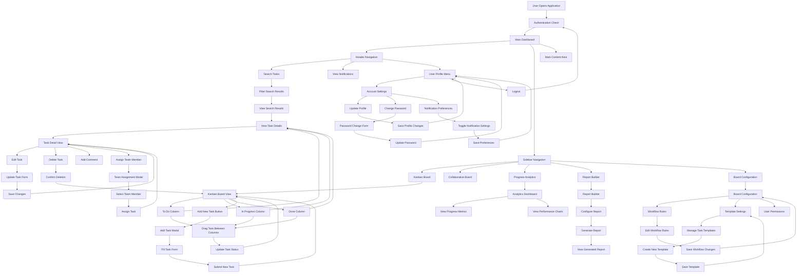

# User Flow Diagram

```mermaid
flowchart TD
    Start[User Opens Application]
    Start --> Login[Authentication Check]
    Login --> Dashboard[Main Dashboard]
    
    Dashboard --> Header[Header Navigation]
    Dashboard --> Sidebar[Sidebar Navigation]
    Dashboard --> MainContent[Main Content Area]
    
    Header --> Search[Search Tasks]
    Header --> Notifications[View Notifications]
    Header --> UserProfile[User Profile Menu]
    
    Sidebar --> KanbanNav[Kanban Board]
    Sidebar --> CollabNav[Collaborative Board]
    Sidebar --> AnalyticsNav[Progress Analytics]
    Sidebar --> ReportsNav[Report Builder]
    Sidebar --> ConfigNav[Board Configuration]
    
    KanbanNav --> KanbanBoard[Kanban Board View]
    KanbanBoard --> TodoColumn[To Do Column]
    KanbanBoard --> InProgressColumn[In Progress Column]
    KanbanBoard --> DoneColumn[Done Column]
    
    TodoColumn --> ViewTask[View Task Details]
    InProgressColumn --> ViewTask
    DoneColumn --> ViewTask
    
    TodoColumn --> DragTask[Drag Task Between Columns]
    InProgressColumn --> DragTask
    DoneColumn --> DragTask
    
    KanbanBoard --> AddTaskBtn[Add New Task Button]
    AddTaskBtn --> AddTaskModal[Add Task Modal]
    AddTaskModal --> FillTaskForm[Fill Task Form]
    FillTaskForm --> SubmitTask[Submit New Task]
    SubmitTask --> KanbanBoard
    
    ViewTask --> TaskDetail[Task Detail View]
    TaskDetail --> EditTask[Edit Task]
    TaskDetail --> DeleteTask[Delete Task]
    TaskDetail --> AddComment[Add Comment]
    TaskDetail --> AssignUser[Assign Team Member]
    
    EditTask --> UpdateTaskForm[Update Task Form]
    UpdateTaskForm --> SaveTask[Save Changes]
    SaveTask --> TaskDetail
    
    DeleteTask --> ConfirmDelete[Confirm Deletion]
    ConfirmDelete --> KanbanBoard
    
    DragTask --> UpdateStatus[Update Task Status]
    UpdateStatus --> KanbanBoard
    
    AssignUser --> TeamModal[Team Assignment Modal]
    TeamModal --> SelectMember[Select Team Member]
    SelectMember --> AssignTask[Assign Task]
    AssignTask --> TaskDetail
    
    AnalyticsNav --> AnalyticsDash[Analytics Dashboard]
    AnalyticsDash --> ViewMetrics[View Progress Metrics]
    AnalyticsDash --> ViewCharts[View Performance Charts]
    
    ReportsNav --> ReportBuilder[Report Builder]
    ReportBuilder --> ConfigReport[Configure Report]
    ConfigReport --> GenerateReport[Generate Report]
    GenerateReport --> ViewReport[View Generated Report]
    
    ConfigNav --> BoardConfig[Board Configuration]
    BoardConfig --> WorkflowRules[Workflow Rules]
    BoardConfig --> TemplateSettings[Template Settings]
    BoardConfig --> UserPermissions[User Permissions]
    
    WorkflowRules --> EditWorkflow[Edit Workflow Rules]
    EditWorkflow --> SaveWorkflow[Save Workflow Changes]
    SaveWorkflow --> BoardConfig
    
    TemplateSettings --> ManageTemplates[Manage Task Templates]
    ManageTemplates --> CreateTemplate[Create New Template]
    CreateTemplate --> SaveTemplate[Save Template]
    SaveTemplate --> TemplateSettings
    
    Search --> FilterResults[Filter Search Results]
    FilterResults --> ViewSearchResults[View Search Results]
    ViewSearchResults --> ViewTask
    
    UserProfile --> AccountSettings[Account Settings]
    UserProfile --> Logout[Logout]
    Logout --> Login
    
    AccountSettings --> UpdateProfile[Update Profile]
    AccountSettings --> ChangePassword[Change Password]
    AccountSettings --> NotificationPrefs[Notification Preferences]
    
    UpdateProfile --> SaveProfile[Save Profile Changes]
    SaveProfile --> UserProfile
    
    ChangePassword --> PasswordForm[Password Change Form]
    PasswordForm --> UpdatePassword[Update Password]
    UpdatePassword --> UserProfile
    
    NotificationPrefs --> ToggleNotifications[Toggle Notification Settings]
    ToggleNotifications --> SaveNotificationPrefs[Save Preferences]
    SaveNotificationPrefs --> UserProfile
```