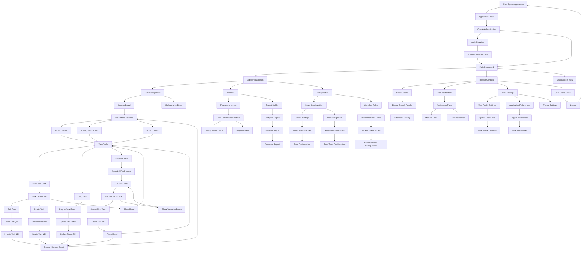

# User Flow Diagram

```mermaid
flowchart TD
    Start[User Opens Application]
    Start --> LoadApp[Application Loads]
    LoadApp --> CheckAuth[Check Authentication]
    CheckAuth --> Login[Login Required]
    CheckAuth --> Dashboard[Main Dashboard]
    
    Login --> AuthSuccess[Authentication Success]
    AuthSuccess --> Dashboard
    
    Dashboard --> Sidebar[Sidebar Navigation]
    Dashboard --> Header[Header Controls]
    Dashboard --> MainContent[Main Content Area]
    
    Sidebar --> TaskMgmt[Task Management]
    Sidebar --> Analytics[Analytics]
    Sidebar --> Config[Configuration]
    
    TaskMgmt --> KanbanBoard[Kanban Board]
    TaskMgmt --> CollabBoard[Collaborative Board]
    
    Analytics --> ProgressAnalytics[Progress Analytics]
    Analytics --> ReportBuilder[Report Builder]
    
    Config --> BoardConfig[Board Configuration]
    Config --> WorkflowRules[Workflow Rules]
    
    Header --> Search[Search Tasks]
    Header --> Notifications[View Notifications]
    Header --> Settings[User Settings]
    Header --> UserMenu[User Profile Menu]
    
    KanbanBoard --> ViewColumns[View Three Columns]
    ViewColumns --> TodoColumn[To Do Column]
    ViewColumns --> InProgressColumn[In Progress Column]
    ViewColumns --> DoneColumn[Done Column]
    
    TodoColumn --> ViewTasks[View Tasks]
    InProgressColumn --> ViewTasks
    DoneColumn --> ViewTasks
    
    ViewTasks --> SelectTask[Click Task Card]
    ViewTasks --> DragTask[Drag Task]
    ViewTasks --> AddNewTask[Add New Task]
    
    SelectTask --> TaskDetail[Task Detail View]
    TaskDetail --> EditTask[Edit Task]
    TaskDetail --> DeleteTask[Delete Task]
    TaskDetail --> CloseDetail[Close Detail]
    
    EditTask --> SaveChanges[Save Changes]
    SaveChanges --> UpdateAPI[Update Task API]
    UpdateAPI --> RefreshBoard[Refresh Kanban Board]
    
    DeleteTask --> ConfirmDelete[Confirm Deletion]
    ConfirmDelete --> DeleteAPI[Delete Task API]
    DeleteAPI --> RefreshBoard
    
    DragTask --> DropZone[Drop in New Column]
    DropZone --> UpdateStatus[Update Task Status]
    UpdateStatus --> StatusAPI[Update Status API]
    StatusAPI --> RefreshBoard
    
    AddNewTask --> OpenModal[Open Add Task Modal]
    OpenModal --> FillForm[Fill Task Form]
    FillForm --> ValidateForm[Validate Form Data]
    ValidateForm --> SubmitTask[Submit New Task]
    ValidateForm --> ShowErrors[Show Validation Errors]
    
    ShowErrors --> FillForm
    
    SubmitTask --> CreateAPI[Create Task API]
    CreateAPI --> CloseModal[Close Modal]
    CloseModal --> RefreshBoard
    
    Search --> SearchResults[Display Search Results]
    SearchResults --> FilterTasks[Filter Task Display]
    
    Notifications --> NotificationPanel[Notification Panel]
    NotificationPanel --> MarkRead[Mark as Read]
    NotificationPanel --> ViewNotification[View Notification]
    
    Settings --> UserProfile[User Profile Settings]
    Settings --> AppPreferences[Application Preferences]
    Settings --> ThemeSettings[Theme Settings]
    
    UserProfile --> UpdateProfile[Update Profile Info]
    UpdateProfile --> SaveProfile[Save Profile Changes]
    
    AppPreferences --> ToggleSettings[Toggle Preferences]
    ToggleSettings --> SavePreferences[Save Preferences]
    
    ProgressAnalytics --> ViewMetrics[View Performance Metrics]
    ViewMetrics --> MetricCards[Display Metric Cards]
    ViewMetrics --> Charts[Display Charts]
    
    ReportBuilder --> ConfigReport[Configure Report]
    ConfigReport --> GenerateReport[Generate Report]
    GenerateReport --> DownloadReport[Download Report]
    
    BoardConfig --> ColumnSettings[Column Settings]
    BoardConfig --> TeamAssignment[Team Assignment]
    
    ColumnSettings --> ModifyColumns[Modify Column Rules]
    ModifyColumns --> SaveColumnConfig[Save Configuration]
    
    TeamAssignment --> AssignMembers[Assign Team Members]
    AssignMembers --> SaveTeamConfig[Save Team Configuration]
    
    WorkflowRules --> DefineRules[Define Workflow Rules]
    DefineRules --> SetAutomation[Set Automation Rules]
    SetAutomation --> SaveWorkflow[Save Workflow Configuration]
    
    RefreshBoard --> ViewColumns
    CloseDetail --> ViewTasks
    CloseModal --> ViewTasks
    
    UserMenu --> Logout[Logout]
    Logout --> Start
```