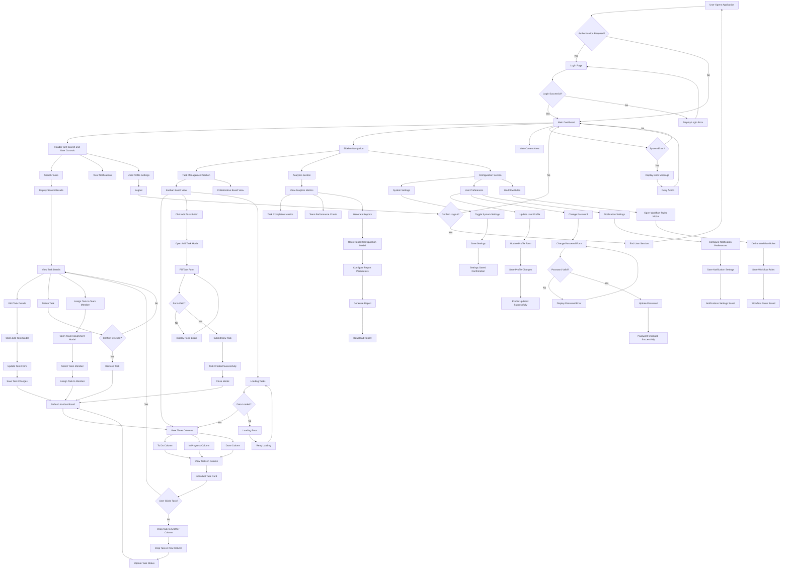

# User Flow Diagram

```mermaid
flowchart TD
    Start[User Opens Application]
    Start --> Auth{Authentication Required?}
    Auth -->|Yes| Login[Login Page]
    Auth -->|No| Dashboard[Main Dashboard]
    Login --> LoginSuccess{Login Successful?}
    LoginSuccess -->|Yes| Dashboard
    LoginSuccess -->|No| LoginError[Display Login Error]
    LoginError --> Login
    
    Dashboard --> Header[Header with Search and User Controls]
    Dashboard --> Sidebar[Sidebar Navigation]
    Dashboard --> MainContent[Main Content Area]
    
    Header --> Search[Search Tasks]
    Header --> Notifications[View Notifications]
    Header --> UserProfile[User Profile Settings]
    
    Search --> SearchResults[Display Search Results]
    SearchResults --> TaskDetails[View Task Details]
    
    Sidebar --> TaskManagement[Task Management Section]
    Sidebar --> Analytics[Analytics Section]
    Sidebar --> Configuration[Configuration Section]
    
    TaskManagement --> KanbanBoard[Kanban Board View]
    TaskManagement --> CollaborativeBoard[Collaborative Board View]
    
    KanbanBoard --> ViewColumns[View Three Columns]
    ViewColumns --> TodoColumn[To Do Column]
    ViewColumns --> InProgressColumn[In Progress Column]
    ViewColumns --> DoneColumn[Done Column]
    
    TodoColumn --> ViewTasks[View Tasks in Column]
    InProgressColumn --> ViewTasks
    DoneColumn --> ViewTasks
    
    ViewTasks --> TaskCard[Individual Task Card]
    TaskCard --> TaskClick{User Clicks Task?}
    TaskClick -->|Yes| TaskDetails
    TaskClick -->|No| DragTask[Drag Task to Another Column]
    
    DragTask --> DropTask[Drop Task in New Column]
    DropTask --> UpdateTaskStatus[Update Task Status]
    UpdateTaskStatus --> RefreshBoard[Refresh Kanban Board]
    RefreshBoard --> ViewColumns
    
    KanbanBoard --> AddTaskButton[Click Add Task Button]
    AddTaskButton --> AddTaskModal[Open Add Task Modal]
    AddTaskModal --> FillTaskForm[Fill Task Form]
    FillTaskForm --> TaskFormValidation{Form Valid?}
    TaskFormValidation -->|No| FormErrors[Display Form Errors]
    FormErrors --> FillTaskForm
    TaskFormValidation -->|Yes| SubmitTask[Submit New Task]
    SubmitTask --> TaskCreated[Task Created Successfully]
    TaskCreated --> CloseModal[Close Modal]
    CloseModal --> RefreshBoard
    
    TaskDetails --> EditTask[Edit Task Details]
    TaskDetails --> DeleteTask[Delete Task]
    TaskDetails --> AssignTask[Assign Task to Team Member]
    
    EditTask --> EditTaskModal[Open Edit Task Modal]
    EditTaskModal --> UpdateTaskForm[Update Task Form]
    UpdateTaskForm --> SaveTaskChanges[Save Task Changes]
    SaveTaskChanges --> RefreshBoard
    
    AssignTask --> TeamAssignModal[Open Team Assignment Modal]
    TeamAssignModal --> SelectTeamMember[Select Team Member]
    SelectTeamMember --> AssignToMember[Assign Task to Member]
    AssignToMember --> RefreshBoard
    
    DeleteTask --> ConfirmDelete{Confirm Deletion?}
    ConfirmDelete -->|Yes| RemoveTask[Remove Task]
    ConfirmDelete -->|No| TaskDetails
    RemoveTask --> RefreshBoard
    
    Analytics --> ViewMetrics[View Analytics Metrics]
    ViewMetrics --> TaskMetrics[Task Completion Metrics]
    ViewMetrics --> TeamPerformance[Team Performance Charts]
    ViewMetrics --> ReportGeneration[Generate Reports]
    
    ReportGeneration --> ReportConfigModal[Open Report Configuration Modal]
    ReportConfigModal --> ConfigureReport[Configure Report Parameters]
    ConfigureReport --> GenerateReport[Generate Report]
    GenerateReport --> DownloadReport[Download Report]
    
    Configuration --> SystemSettings[System Settings]
    Configuration --> UserPreferences[User Preferences]
    Configuration --> WorkflowRules[Workflow Rules]
    
    SystemSettings --> ToggleSettings[Toggle System Settings]
    ToggleSettings --> SaveSettings[Save Settings]
    SaveSettings --> SettingsConfirmation[Settings Saved Confirmation]
    
    UserPreferences --> UpdateProfile[Update User Profile]
    UserPreferences --> ChangePassword[Change Password]
    UserPreferences --> NotificationSettings[Notification Settings]
    
    WorkflowRules --> WorkflowModal[Open Workflow Rules Modal]
    WorkflowModal --> DefineRules[Define Workflow Rules]
    DefineRules --> SaveWorkflow[Save Workflow Rules]
    SaveWorkflow --> WorkflowConfirmation[Workflow Rules Saved]
    
    UpdateProfile --> ProfileForm[Update Profile Form]
    ProfileForm --> SaveProfile[Save Profile Changes]
    SaveProfile --> ProfileUpdated[Profile Updated Successfully]
    
    ChangePassword --> PasswordForm[Change Password Form]
    PasswordForm --> PasswordValidation{Password Valid?}
    PasswordValidation -->|No| PasswordError[Display Password Error]
    PasswordError --> PasswordForm
    PasswordValidation -->|Yes| UpdatePassword[Update Password]
    UpdatePassword --> PasswordChanged[Password Changed Successfully]
    
    NotificationSettings --> NotificationPrefs[Configure Notification Preferences]
    NotificationPrefs --> SaveNotifications[Save Notification Settings]
    SaveNotifications --> NotificationsSaved[Notifications Settings Saved]
    
    UserProfile --> Logout[Logout]
    Logout --> LogoutConfirm{Confirm Logout?}
    LogoutConfirm -->|Yes| EndSession[End User Session]
    LogoutConfirm -->|No| Dashboard
    EndSession --> Start
    
    %% Error Handling Flows
    Dashboard --> ErrorState{System Error?}
    ErrorState -->|Yes| ErrorDisplay[Display Error Message]
    ErrorState -->|No| Dashboard
    ErrorDisplay --> RetryAction[Retry Action]
    RetryAction --> Dashboard
    
    %% Loading States
    KanbanBoard --> LoadingState[Loading Tasks]
    LoadingState --> DataLoaded{Data Loaded?}
    DataLoaded -->|Yes| ViewColumns
    DataLoaded -->|No| LoadingError[Loading Error]
    LoadingError --> RetryLoad[Retry Loading]
    RetryLoad --> LoadingState
```