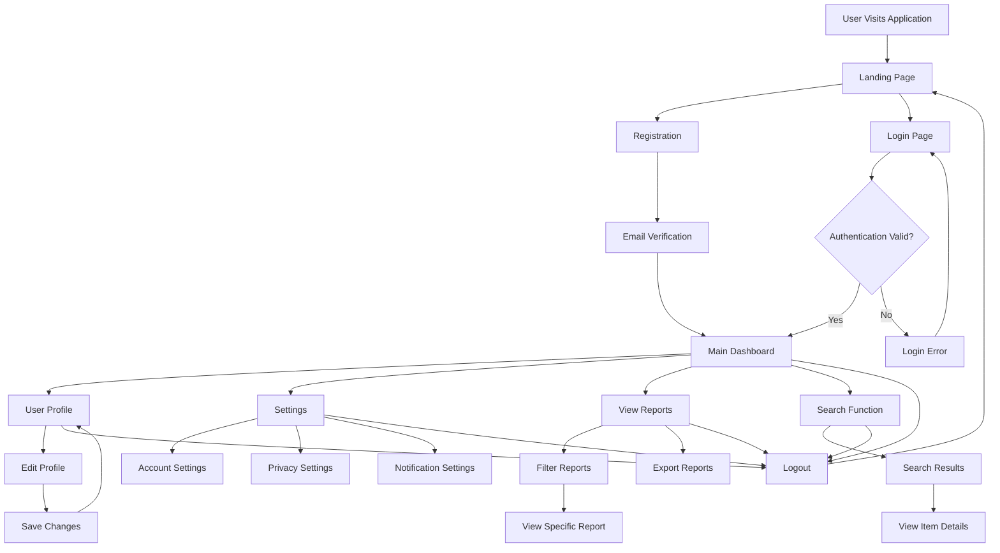

# User Flow Diagram

```mermaid
flowchart TD
    Start[User Visits Application]
    Start --> Landing[Landing Page]
    Landing --> Register[Registration]
    Landing --> Login[Login Page]
    
    Register --> EmailVerify[Email Verification]
    EmailVerify --> Dashboard[Main Dashboard]
    
    Login --> AuthCheck{Authentication Valid?}
    AuthCheck -->|Yes| Dashboard
    AuthCheck -->|No| LoginError[Login Error]
    LoginError --> Login
    
    Dashboard --> Profile[User Profile]
    Dashboard --> Settings[Settings]
    Dashboard --> Reports[View Reports]
    Dashboard --> Search[Search Function]
    
    Profile --> EditProfile[Edit Profile]
    EditProfile --> SaveProfile[Save Changes]
    SaveProfile --> Profile
    
    Settings --> AccountSettings[Account Settings]
    Settings --> PrivacySettings[Privacy Settings]
    Settings --> NotificationSettings[Notification Settings]
    
    Reports --> FilterReports[Filter Reports]
    Reports --> ExportReports[Export Reports]
    FilterReports --> ViewReport[View Specific Report]
    
    Search --> SearchResults[Search Results]
    SearchResults --> ViewItem[View Item Details]
    
    Dashboard --> Logout[Logout]
    Profile --> Logout
    Settings --> Logout
    Reports --> Logout
    Search --> Logout
    
    Logout --> Landing
```