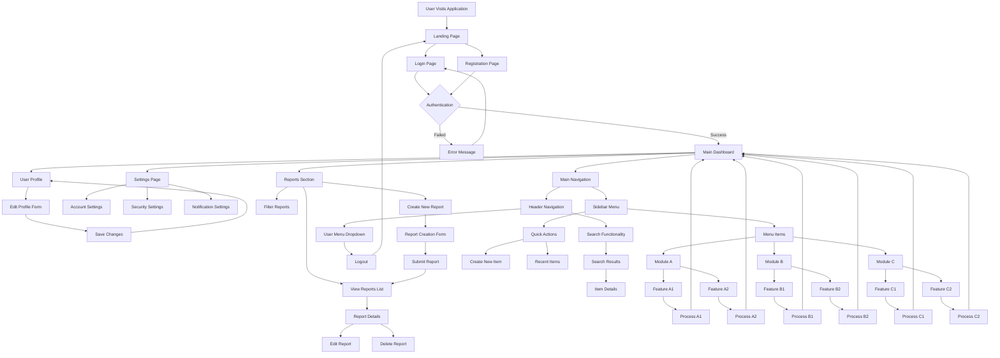

# User Flow Diagram

```mermaid
flowchart TD
    Start[User Visits Application]
    Start --> Landing[Landing Page]
    Landing --> Login[Login Page]
    Landing --> Register[Registration Page]
    
    Login --> Auth{Authentication}
    Register --> Auth
    Auth -->|Success| Dashboard[Main Dashboard]
    Auth -->|Failed| Error[Error Message]
    Error --> Login
    
    Dashboard --> Profile[User Profile]
    Dashboard --> Settings[Settings Page]
    Dashboard --> Reports[Reports Section]
    Dashboard --> Navigation[Main Navigation]
    
    Profile --> EditProfile[Edit Profile Form]
    EditProfile --> SaveProfile[Save Changes]
    SaveProfile --> Profile
    
    Settings --> AccountSettings[Account Settings]
    Settings --> SecuritySettings[Security Settings]
    Settings --> NotificationSettings[Notification Settings]
    
    Reports --> ViewReports[View Reports List]
    Reports --> CreateReport[Create New Report]
    Reports --> FilterReports[Filter Reports]
    
    ViewReports --> ReportDetails[Report Details]
    ReportDetails --> EditReport[Edit Report]
    ReportDetails --> DeleteReport[Delete Report]
    
    CreateReport --> ReportForm[Report Creation Form]
    ReportForm --> SubmitReport[Submit Report]
    SubmitReport --> ViewReports
    
    Navigation --> Sidebar[Sidebar Menu]
    Navigation --> Header[Header Navigation]
    
    Sidebar --> QuickActions[Quick Actions]
    Sidebar --> MenuItems[Menu Items]
    
    Header --> UserMenu[User Menu Dropdown]
    Header --> SearchBar[Search Functionality]
    
    UserMenu --> Logout[Logout]
    Logout --> Landing
    
    SearchBar --> SearchResults[Search Results]
    SearchResults --> ItemDetails[Item Details]
    
    QuickActions --> NewItem[Create New Item]
    QuickActions --> RecentItems[Recent Items]
    
    MenuItems --> ModuleA[Module A]
    MenuItems --> ModuleB[Module B]
    MenuItems --> ModuleC[Module C]
    
    ModuleA --> FeatureA1[Feature A1]
    ModuleA --> FeatureA2[Feature A2]
    
    ModuleB --> FeatureB1[Feature B1]
    ModuleB --> FeatureB2[Feature B2]
    
    ModuleC --> FeatureC1[Feature C1]
    ModuleC --> FeatureC2[Feature C2]
    
    FeatureA1 --> ProcessA1[Process A1]
    FeatureA2 --> ProcessA2[Process A2]
    
    FeatureB1 --> ProcessB1[Process B1]
    FeatureB2 --> ProcessB2[Process B2]
    
    FeatureC1 --> ProcessC1[Process C1]
    FeatureC2 --> ProcessC2[Process C2]
    
    ProcessA1 --> Dashboard
    ProcessA2 --> Dashboard
    ProcessB1 --> Dashboard
    ProcessB2 --> Dashboard
    ProcessC1 --> Dashboard
    ProcessC2 --> Dashboard
```