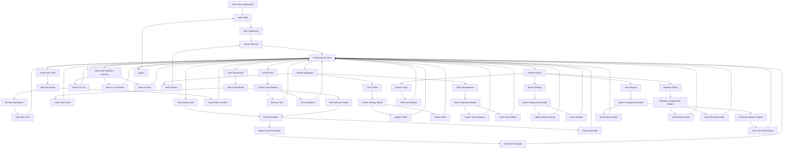

# User Flow Diagram

```mermaid
flowchart TD
    Start[User Opens Application]
    Start --> Login[Login Page]
    Login --> Dashboard[Main Dashboard]
    Dashboard --> BoardList[Board Selection]
    BoardList --> KanbanBoard[Kanban Board View]
    
    KanbanBoard --> ViewTask[View Task Details]
    KanbanBoard --> CreateTask[Create New Task]
    KanbanBoard --> EditTask[Edit Existing Task]
    KanbanBoard --> DeleteTask[Delete Task]
    KanbanBoard --> MoveTask[Move Task Between Columns]
    
    ViewTask --> TaskDetail[Task Detail Modal]
    TaskDetail --> EditFromDetail[Edit Task from Detail]
    TaskDetail --> CloseDetail[Close Task Detail]
    CloseDetail --> KanbanBoard
    
    CreateTask --> AddTaskModal[Add Task Modal]
    AddTaskModal --> FillTaskForm[Fill Task Information]
    FillTaskForm --> SaveTask[Save New Task]
    SaveTask --> KanbanBoard
    AddTaskModal --> CancelAdd[Cancel Task Creation]
    CancelAdd --> KanbanBoard
    
    EditTask --> EditTaskModal[Edit Task Modal]
    EditTaskModal --> UpdateTaskForm[Update Task Information]
    UpdateTaskForm --> SaveChanges[Save Task Changes]
    SaveChanges --> KanbanBoard
    EditTaskModal --> CancelEdit[Cancel Task Edit]
    CancelEdit --> KanbanBoard
    
    EditFromDetail --> EditTaskModal
    
    DeleteTask --> ConfirmDelete[Confirm Task Deletion]
    ConfirmDelete --> RemoveTask[Remove Task]
    RemoveTask --> KanbanBoard
    ConfirmDelete --> CancelDelete[Cancel Deletion]
    CancelDelete --> KanbanBoard
    
    MoveTask --> TodoColumn[Move to To Do]
    MoveTask --> InProgressColumn[Move to In Progress]
    MoveTask --> DoneColumn[Move to Done]
    TodoColumn --> KanbanBoard
    InProgressColumn --> KanbanBoard
    DoneColumn --> KanbanBoard
    
    KanbanBoard --> SidebarNav[Sidebar Navigation]
    SidebarNav --> SwitchBoard[Switch Board]
    SwitchBoard --> BoardList
    SidebarNav --> UserProfile[User Profile]
    UserProfile --> ProfileModal[Profile Settings Modal]
    ProfileModal --> UpdateProfile[Update Profile]
    UpdateProfile --> KanbanBoard
    ProfileModal --> CloseProfile[Close Profile]
    CloseProfile --> KanbanBoard
    
    SidebarNav --> TeamManagement[Team Management]
    TeamManagement --> TeamModal[Team Assignment Modal]
    TeamModal --> AssignMembers[Assign Team Members]
    AssignMembers --> KanbanBoard
    TeamModal --> CloseTeam[Close Team Modal]
    CloseTeam --> KanbanBoard
    
    KanbanBoard --> HeaderActions[Header Actions]
    HeaderActions --> SearchTasks[Search Tasks]
    SearchTasks --> FilterResults[Filter Task Results]
    FilterResults --> KanbanBoard
    HeaderActions --> BoardSettings[Board Settings]
    BoardSettings --> SettingsModal[Board Configuration Modal]
    SettingsModal --> UpdateSettings[Update Board Settings]
    UpdateSettings --> KanbanBoard
    SettingsModal --> CloseSettings[Close Settings]
    CloseSettings --> KanbanBoard
    
    HeaderActions --> ReportsView[View Reports]
    ReportsView --> ReportModal[Report Configuration Modal]
    ReportModal --> GenerateReport[Generate Analytics Report]
    GenerateReport --> ViewReport[View Generated Report]
    ViewReport --> KanbanBoard
    ReportModal --> CloseReport[Close Report Modal]
    CloseReport --> KanbanBoard
    
    HeaderActions --> WorkflowRules[Workflow Rules]
    WorkflowRules --> WorkflowModal[Workflow Configuration Modal]
    WorkflowModal --> SetRules[Set Workflow Rules]
    SetRules --> KanbanBoard
    WorkflowModal --> CloseWorkflow[Close Workflow Modal]
    CloseWorkflow --> KanbanBoard
    
    KanbanBoard --> Logout[Logout]
    Logout --> Login
```