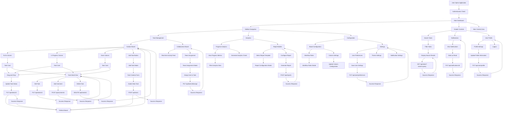

# User Flow Diagram

```mermaid
flowchart TD
    Start[User Opens Application]
    Start --> Login[Authentication Check]
    Login --> Dashboard[Main Dashboard]
    
    Dashboard --> Sidebar[Sidebar Navigation]
    Dashboard --> Header[Header Controls]
    Dashboard --> MainContent[Main Content Area]
    
    Sidebar --> TaskMgmt[Task Management]
    Sidebar --> Analytics[Analytics]
    Sidebar --> Config[Configuration]
    
    TaskMgmt --> KanbanBoard[Kanban Board]
    TaskMgmt --> CollabBoard[Collaborative Board]
    
    Analytics --> ProgressAnalytics[Progress Analytics]
    Analytics --> ReportBuilder[Report Builder]
    
    Config --> BoardConfig[Board Configuration]
    Config --> Settings[Settings]
    
    Header --> Search[Search Tasks]
    Header --> Notifications[Notifications]
    Header --> UserProfile[User Profile]
    
    KanbanBoard --> TodoColumn[To Do Column]
    KanbanBoard --> InProgressColumn[In Progress Column]
    KanbanBoard --> DoneColumn[Done Column]
    
    TodoColumn --> TaskCard1[Task Card]
    InProgressColumn --> TaskCard2[Task Card]
    DoneColumn --> TaskCard3[Task Card]
    
    TaskCard1 --> DragDrop[Drag and Drop]
    TaskCard2 --> DragDrop
    TaskCard3 --> DragDrop
    
    DragDrop --> UpdateStatus[Update Task Status]
    UpdateStatus --> APICall1[PUT /api/tasks/id]
    APICall1 --> RefreshBoard[Refresh Board]
    
    TaskCard1 --> TaskDetail[Task Detail View]
    TaskCard2 --> TaskDetail
    TaskCard3 --> TaskDetail
    
    TaskDetail --> EditTask[Edit Task]
    TaskDetail --> AddComment[Add Comment]
    TaskDetail --> DeleteTask[Delete Task]
    
    EditTask --> APICall2[PUT /api/tasks/id]
    DeleteTask --> APICall3[DELETE /api/tasks/id]
    AddComment --> APICall4[POST /api/comments]
    
    KanbanBoard --> AddTaskBtn[Add Task Button]
    AddTaskBtn --> AddTaskModal[Add Task Modal]
    AddTaskModal --> TaskForm[Task Creation Form]
    TaskForm --> SubmitTask[Submit New Task]
    SubmitTask --> APICall5[POST /api/tasks]
    APICall5 --> RefreshBoard
    
    CollabBoard --> RealTimeActivity[Real-time Activity Feed]
    CollabBoard --> TeamAssign[Team Assignment]
    TeamAssign --> TeamModal[Team Assignment Modal]
    TeamModal --> AssignUser[Assign User to Task]
    AssignUser --> APICall6[PUT /api/tasks/id/assign]
    
    ProgressAnalytics --> ViewMetrics[View Progress Metrics]
    ProgressAnalytics --> GenerateCharts[Generate Analytics Charts]
    ViewMetrics --> FilterData[Filter Analytics Data]
    
    ReportBuilder --> SelectTemplate[Select Report Template]
    ReportBuilder --> ConfigReport[Configure Report]
    SelectTemplate --> ReportModal[Report Configuration Modal]
    ConfigReport --> GenerateReport[Generate Report]
    GenerateReport --> APICall7[POST /api/reports]
    
    BoardConfig --> WorkflowRules[Workflow Rules]
    BoardConfig --> ColumnSettings[Column Settings]
    WorkflowRules --> WorkflowModal[Workflow Rules Modal]
    ColumnSettings --> UpdateColumns[Update Column Configuration]
    
    Settings --> UserPrefs[User Preferences]
    Settings --> ThemeSettings[Theme Settings]
    Settings --> NotificationSettings[Notification Settings]
    UserPrefs --> SaveSettings[Save User Settings]
    SaveSettings --> APICall8[PUT /api/user/preferences]
    
    Search --> FilterTasks[Filter Tasks]
    FilterTasks --> SearchResults[Display Search Results]
    SearchResults --> APICall9[GET /api/tasks?search=query]
    
    Notifications --> ViewNotifications[View Notifications]
    ViewNotifications --> MarkAsRead[Mark as Read]
    MarkAsRead --> APICall10[PUT /api/notifications/id]
    
    UserProfile --> ProfileSettings[Profile Settings]
    UserProfile --> Logout[Logout]
    ProfileSettings --> UpdateProfile[Update Profile Information]
    UpdateProfile --> APICall11[PUT /api/user/profile]
    
    APICall1 --> Success1[Success Response]
    APICall2 --> Success2[Success Response]
    APICall3 --> Success3[Success Response]
    APICall4 --> Success4[Success Response]
    APICall5 --> Success5[Success Response]
    APICall6 --> Success6[Success Response]
    APICall7 --> Success7[Success Response]
    APICall8 --> Success8[Success Response]
    APICall9 --> Success9[Success Response]
    APICall10 --> Success10[Success Response]
    APICall11 --> Success11[Success Response]
    
    Success1 --> RefreshBoard
    Success2 --> TaskDetail
    Success3 --> KanbanBoard
    Success4 --> TaskDetail
    Success5 --> KanbanBoard
    Success6 --> CollabBoard
    Success7 --> ReportBuilder
    Success8 --> Settings
    Success9 --> SearchResults
    Success10 --> Notifications
    Success11 --> UserProfile
    
    RefreshBoard --> KanbanBoard
```