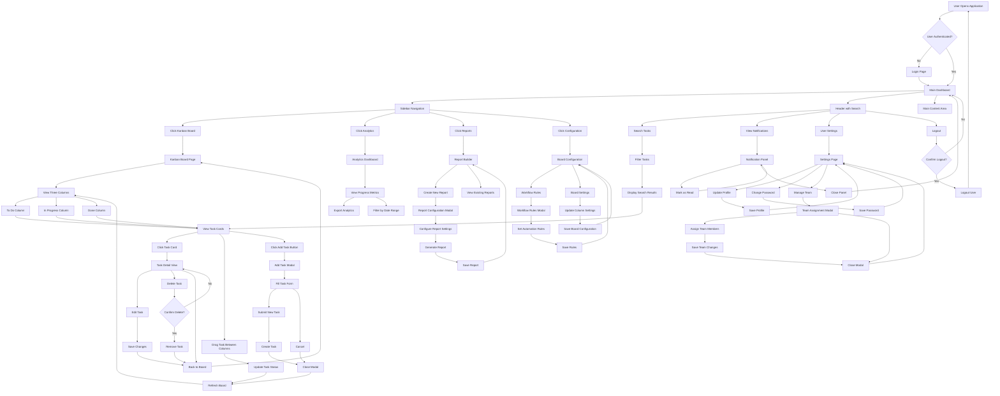

# User Flow Diagram

```mermaid
flowchart TD
    Start[User Opens Application]
    Start --> Auth{User Authenticated?}
    Auth -->|No| Login[Login Page]
    Auth -->|Yes| Dashboard[Main Dashboard]
    Login --> Dashboard
    
    Dashboard --> Sidebar[Sidebar Navigation]
    Dashboard --> Header[Header with Search]
    Dashboard --> MainContent[Main Content Area]
    
    Sidebar --> KanbanNav[Click Kanban Board]
    Sidebar --> AnalyticsNav[Click Analytics]
    Sidebar --> ReportsNav[Click Reports]
    Sidebar --> ConfigNav[Click Configuration]
    
    KanbanNav --> KanbanBoard[Kanban Board Page]
    AnalyticsNav --> AnalyticsPage[Analytics Dashboard]
    ReportsNav --> ReportsPage[Report Builder]
    ConfigNav --> ConfigPage[Board Configuration]
    
    Header --> Search[Search Tasks]
    Header --> Notifications[View Notifications]
    Header --> Settings[User Settings]
    Header --> Logout[Logout]
    
    KanbanBoard --> ViewColumns[View Three Columns]
    ViewColumns --> TodoColumn[To Do Column]
    ViewColumns --> InProgressColumn[In Progress Column]
    ViewColumns --> DoneColumn[Done Column]
    
    TodoColumn --> ViewTasks[View Task Cards]
    InProgressColumn --> ViewTasks
    DoneColumn --> ViewTasks
    
    ViewTasks --> ClickTask[Click Task Card]
    ViewTasks --> DragTask[Drag Task Between Columns]
    ViewTasks --> AddTask[Click Add Task Button]
    
    ClickTask --> TaskDetail[Task Detail View]
    TaskDetail --> EditTask[Edit Task]
    TaskDetail --> DeleteTask[Delete Task]
    TaskDetail --> BackToBoard[Back to Board]
    
    EditTask --> SaveChanges[Save Changes]
    SaveChanges --> BackToBoard
    
    DeleteTask --> ConfirmDelete{Confirm Delete?}
    ConfirmDelete -->|Yes| RemoveTask[Remove Task]
    ConfirmDelete -->|No| TaskDetail
    RemoveTask --> BackToBoard
    
    DragTask --> UpdateStatus[Update Task Status]
    UpdateStatus --> RefreshBoard[Refresh Board]
    RefreshBoard --> ViewColumns
    
    AddTask --> AddTaskModal[Add Task Modal]
    AddTaskModal --> FillForm[Fill Task Form]
    FillForm --> SubmitTask[Submit New Task]
    FillForm --> CancelTask[Cancel]
    
    SubmitTask --> CreateTask[Create Task]
    CreateTask --> CloseModal[Close Modal]
    CloseModal --> RefreshBoard
    
    CancelTask --> CloseModal
    
    Search --> FilterTasks[Filter Tasks]
    FilterTasks --> DisplayResults[Display Search Results]
    DisplayResults --> ViewTasks
    
    Notifications --> NotificationPanel[Notification Panel]
    NotificationPanel --> MarkRead[Mark as Read]
    NotificationPanel --> ClosePanel[Close Panel]
    MarkRead --> NotificationPanel
    ClosePanel --> Dashboard
    
    Settings --> SettingsPage[Settings Page]
    SettingsPage --> UpdateProfile[Update Profile]
    SettingsPage --> ChangePassword[Change Password]
    SettingsPage --> ManageTeam[Manage Team]
    
    UpdateProfile --> SaveProfile[Save Profile]
    SaveProfile --> SettingsPage
    
    ChangePassword --> SavePassword[Save Password]
    SavePassword --> SettingsPage
    
    ManageTeam --> TeamModal[Team Assignment Modal]
    TeamModal --> AssignMembers[Assign Team Members]
    TeamModal --> CloseTeamModal[Close Modal]
    AssignMembers --> SaveTeam[Save Team Changes]
    SaveTeam --> CloseTeamModal
    CloseTeamModal --> SettingsPage
    
    AnalyticsPage --> ViewMetrics[View Progress Metrics]
    ViewMetrics --> ExportData[Export Analytics]
    ViewMetrics --> FilterAnalytics[Filter by Date Range]
    
    ReportsPage --> CreateReport[Create New Report]
    ReportsPage --> ViewReports[View Existing Reports]
    CreateReport --> ReportModal[Report Configuration Modal]
    ReportModal --> ConfigureReport[Configure Report Settings]
    ConfigureReport --> GenerateReport[Generate Report]
    GenerateReport --> SaveReport[Save Report]
    SaveReport --> ReportsPage
    
    ConfigPage --> WorkflowRules[Workflow Rules]
    ConfigPage --> BoardSettings[Board Settings]
    WorkflowRules --> RulesModal[Workflow Rules Modal]
    RulesModal --> SetRules[Set Automation Rules]
    SetRules --> SaveRules[Save Rules]
    SaveRules --> ConfigPage
    
    BoardSettings --> UpdateColumns[Update Column Settings]
    UpdateColumns --> SaveBoardConfig[Save Board Configuration]
    SaveBoardConfig --> ConfigPage
    
    Logout --> ConfirmLogout{Confirm Logout?}
    ConfirmLogout -->|Yes| LogoutUser[Logout User]
    ConfirmLogout -->|No| Dashboard
    LogoutUser --> Start
    
    BackToBoard --> KanbanBoard
```