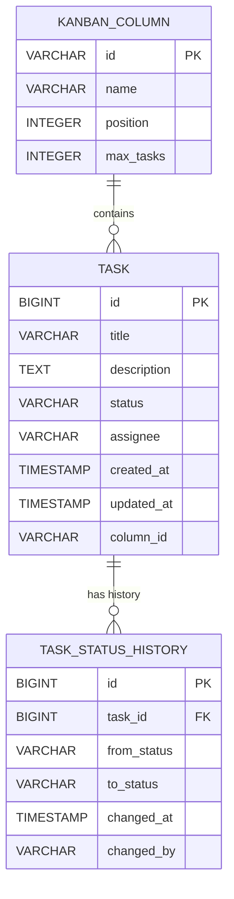

# SpringBoot Low Level Design - DEMO-222

## 1. Objective

This document outlines the SpringBoot backend implementation for enabling drag-and-drop functionality in a Kanban board system. The system allows users to move tasks from "In Progress" to "Done" status through drag-and-drop operations. The implementation ensures real-time status updates, task count management, and cross-browser compatibility for seamless user experience.

## 2. SpringBoot Backend Details

### 2.1 Controller Layer

#### REST API Endpoints

| Operation | Method | URL | Request Body | Response Body |
|-----------|--------|-----|--------------|---------------|
| Update Task Status | PUT | /api/v1/tasks/{taskId}/status | `{"status": "DONE", "columnId": "done-column"}` | `{"taskId": 123, "status": "DONE", "updatedAt": "2024-01-01T10:00:00Z", "message": "Task status updated successfully"}` |
| Get Task Details | GET | /api/v1/tasks/{taskId} | N/A | `{"taskId": 123, "title": "Task Title", "status": "IN_PROGRESS", "assignee": "user@example.com", "createdAt": "2024-01-01T09:00:00Z"}` |
| Get Column Tasks Count | GET | /api/v1/columns/{columnId}/count | N/A | `{"columnId": "in-progress", "taskCount": 5}` |
| Get All Tasks by Status | GET | /api/v1/tasks?status={status} | N/A | `[{"taskId": 123, "title": "Task Title", "status": "IN_PROGRESS"}]` |
| Validate Task Move | POST | /api/v1/tasks/{taskId}/validate-move | `{"fromStatus": "IN_PROGRESS", "toStatus": "DONE"}` | `{"valid": true, "message": "Move operation is valid"}` |

#### Controller Classes

| Class Name | Responsibility | Methods |
|------------|----------------|----------|
| TaskController | Handle task-related HTTP requests | updateTaskStatus(), getTaskById(), validateTaskMove() |
| KanbanColumnController | Manage column operations and task counts | getColumnTaskCount(), getTasksByColumn() |
| TaskStatusController | Handle status-specific operations | getTasksByStatus(), getAvailableStatuses() |

#### Exception Handlers

```java
@ControllerAdvice
public class KanbanExceptionHandler {
    
    @ExceptionHandler(TaskNotFoundException.class)
    public ResponseEntity<ErrorResponse> handleTaskNotFound(TaskNotFoundException ex) {
        return ResponseEntity.status(HttpStatus.NOT_FOUND)
            .body(new ErrorResponse("TASK_NOT_FOUND", ex.getMessage()));
    }
    
    @ExceptionHandler(InvalidStatusTransitionException.class)
    public ResponseEntity<ErrorResponse> handleInvalidStatusTransition(InvalidStatusTransitionException ex) {
        return ResponseEntity.status(HttpStatus.BAD_REQUEST)
            .body(new ErrorResponse("INVALID_STATUS_TRANSITION", ex.getMessage()));
    }
    
    @ExceptionHandler(ValidationException.class)
    public ResponseEntity<ErrorResponse> handleValidation(ValidationException ex) {
        return ResponseEntity.status(HttpStatus.BAD_REQUEST)
            .body(new ErrorResponse("VALIDATION_ERROR", ex.getMessage()));
    }
}
```

### 2.2 Service Layer

#### Business Logic Implementation

```java
@Service
@Transactional
public class TaskService {
    
    @Autowired
    private TaskRepository taskRepository;
    
    @Autowired
    private TaskStatusHistoryService statusHistoryService;
    
    @Autowired
    private NotificationService notificationService;
    
    public TaskDto updateTaskStatus(Long taskId, TaskStatusUpdateRequest request) {
        Task task = validateTaskExists(taskId);
        validateStatusTransition(task.getStatus(), request.getStatus());
        
        TaskStatus oldStatus = task.getStatus();
        task.setStatus(request.getStatus());
        task.setUpdatedAt(LocalDateTime.now());
        
        Task updatedTask = taskRepository.save(task);
        
        // Record status history
        statusHistoryService.recordStatusChange(taskId, oldStatus, request.getStatus());
        
        // Send notification
        notificationService.notifyStatusChange(updatedTask);
        
        return TaskMapper.toDto(updatedTask);
    }
    
    private void validateStatusTransition(TaskStatus from, TaskStatus to) {
        if (!isValidTransition(from, to)) {
            throw new InvalidStatusTransitionException(
                String.format("Cannot transition from %s to %s", from, to));
        }
    }
    
    private boolean isValidTransition(TaskStatus from, TaskStatus to) {
        return (from == TaskStatus.IN_PROGRESS && to == TaskStatus.DONE) ||
               (from == TaskStatus.TODO && to == TaskStatus.IN_PROGRESS) ||
               (from == TaskStatus.DONE && to == TaskStatus.IN_PROGRESS);
    }
}
```

#### Service Layer Architecture

- **TaskService**: Core business logic for task operations
- **KanbanColumnService**: Column-specific operations and task counting
- **TaskStatusHistoryService**: Audit trail for status changes
- **NotificationService**: Real-time notifications for status updates
- **ValidationService**: Business rule validation

#### Dependency Injection Configuration

```java
@Configuration
public class ServiceConfiguration {
    
    @Bean
    public TaskMapper taskMapper() {
        return new TaskMapperImpl();
    }
    
    @Bean
    public TaskValidator taskValidator() {
        return new TaskValidator();
    }
}
```

#### Validation Rules

| Field Name | Validation | Error Message | Annotation |
|------------|------------|---------------|------------|
| taskId | Not null, Positive | "Task ID must be a positive number" | `@NotNull @Positive` |
| status | Not null, Valid enum | "Status must be one of: TODO, IN_PROGRESS, DONE" | `@NotNull @ValidTaskStatus` |
| columnId | Not blank, Max 50 chars | "Column ID cannot be blank and must be less than 50 characters" | `@NotBlank @Size(max=50)` |
| title | Not blank, Max 255 chars | "Task title is required and must be less than 255 characters" | `@NotBlank @Size(max=255)` |
| assignee | Valid email format | "Assignee must be a valid email address" | `@Email` |

### 2.3 Repository / Data Access Layer

#### Entity Models

| Entity | Fields | Constraints |
|--------|--------|-------------|
| Task | id (Long), title (String), description (String), status (TaskStatus), assignee (String), createdAt (LocalDateTime), updatedAt (LocalDateTime), columnId (String) | id: Primary Key, Auto-generated; title: Not null, Max 255; status: Not null; createdAt: Not null |
| TaskStatusHistory | id (Long), taskId (Long), fromStatus (TaskStatus), toStatus (TaskStatus), changedAt (LocalDateTime), changedBy (String) | id: Primary Key, Auto-generated; taskId: Foreign Key; changedAt: Not null |
| KanbanColumn | id (String), name (String), position (Integer), maxTasks (Integer) | id: Primary Key; name: Not null, Max 100; position: Not null, Unique |

#### Repository Interfaces

```java
@Repository
public interface TaskRepository extends JpaRepository<Task, Long> {
    
    List<Task> findByStatus(TaskStatus status);
    
    List<Task> findByColumnId(String columnId);
    
    @Query("SELECT COUNT(t) FROM Task t WHERE t.status = :status")
    Long countByStatus(@Param("status") TaskStatus status);
    
    @Query("SELECT COUNT(t) FROM Task t WHERE t.columnId = :columnId")
    Long countByColumnId(@Param("columnId") String columnId);
    
    @Modifying
    @Query("UPDATE Task t SET t.status = :newStatus, t.updatedAt = :updatedAt WHERE t.id = :taskId")
    int updateTaskStatus(@Param("taskId") Long taskId, 
                        @Param("newStatus") TaskStatus newStatus, 
                        @Param("updatedAt") LocalDateTime updatedAt);
}

@Repository
public interface TaskStatusHistoryRepository extends JpaRepository<TaskStatusHistory, Long> {
    
    List<TaskStatusHistory> findByTaskIdOrderByChangedAtDesc(Long taskId);
    
    @Query("SELECT h FROM TaskStatusHistory h WHERE h.taskId = :taskId AND h.changedAt >= :since")
    List<TaskStatusHistory> findRecentStatusChanges(@Param("taskId") Long taskId, 
                                                   @Param("since") LocalDateTime since);
}
```

#### Custom Queries

```java
// Get tasks that can be moved to DONE status
@Query("SELECT t FROM Task t WHERE t.status = 'IN_PROGRESS' AND t.assignee IS NOT NULL")
List<Task> findTasksEligibleForCompletion();

// Get column statistics
@Query("SELECT new com.kanban.dto.ColumnStatsDto(t.columnId, COUNT(t), t.status) " +
       "FROM Task t GROUP BY t.columnId, t.status")
List<ColumnStatsDto> getColumnStatistics();
```

### 2.4 Configuration

#### Application Properties

```properties
# Database Configuration
spring.datasource.url=jdbc:h2:mem:kanbandb
spring.datasource.driver-class-name=org.h2.Driver
spring.datasource.username=sa
spring.datasource.password=

# JPA Configuration
spring.jpa.database-platform=org.hibernate.dialect.H2Dialect
spring.jpa.hibernate.ddl-auto=create-drop
spring.jpa.show-sql=true
spring.jpa.properties.hibernate.format_sql=true

# Server Configuration
server.port=8080
server.servlet.context-path=/kanban-api

# Logging Configuration
logging.level.com.kanban=DEBUG
logging.level.org.springframework.web=INFO

# CORS Configuration
kanban.cors.allowed-origins=http://localhost:3000,http://localhost:4200
kanban.cors.allowed-methods=GET,POST,PUT,DELETE,OPTIONS
kanban.cors.allowed-headers=*

# Task Configuration
kanban.task.max-title-length=255
kanban.task.max-description-length=1000
kanban.task.default-status=TODO
```

#### Spring Configuration Classes

```java
@Configuration
@EnableJpaRepositories(basePackages = "com.kanban.repository")
@EntityScan(basePackages = "com.kanban.entity")
public class DatabaseConfiguration {
    
    @Bean
    public DataSource dataSource() {
        HikariConfig config = new HikariConfig();
        config.setJdbcUrl("jdbc:h2:mem:kanbandb");
        config.setUsername("sa");
        config.setPassword("");
        config.setMaximumPoolSize(10);
        return new HikariDataSource(config);
    }
}

@Configuration
@EnableWebMvc
public class WebConfiguration implements WebMvcConfigurer {
    
    @Override
    public void addCorsMappings(CorsRegistry registry) {
        registry.addMapping("/api/**")
                .allowedOrigins("http://localhost:3000", "http://localhost:4200")
                .allowedMethods("GET", "POST", "PUT", "DELETE", "OPTIONS")
                .allowedHeaders("*")
                .allowCredentials(true);
    }
}
```

#### Bean Definitions

```java
@Configuration
public class ApplicationConfiguration {
    
    @Bean
    public ModelMapper modelMapper() {
        ModelMapper mapper = new ModelMapper();
        mapper.getConfiguration()
              .setMatchingStrategy(MatchingStrategies.STRICT)
              .setFieldMatchingEnabled(true)
              .setFieldAccessLevel(org.modelmapper.config.Configuration.AccessLevel.PRIVATE);
        return mapper;
    }
    
    @Bean
    public ObjectMapper objectMapper() {
        ObjectMapper mapper = new ObjectMapper();
        mapper.registerModule(new JavaTimeModule());
        mapper.disable(SerializationFeature.WRITE_DATES_AS_TIMESTAMPS);
        return mapper;
    }
}
```

### 2.5 Security

#### Authentication Mechanism

```java
@Configuration
@EnableWebSecurity
public class SecurityConfiguration {
    
    @Bean
    public SecurityFilterChain filterChain(HttpSecurity http) throws Exception {
        http.csrf().disable()
            .authorizeHttpRequests(authz -> authz
                .requestMatchers("/api/v1/tasks/**").authenticated()
                .requestMatchers("/api/v1/columns/**").authenticated()
                .requestMatchers("/h2-console/**").permitAll()
                .anyRequest().authenticated()
            )
            .oauth2ResourceServer(oauth2 -> oauth2.jwt());
        
        return http.build();
    }
}
```

#### Authorization Rules

- Users can only update tasks assigned to them
- Admin users can update any task
- Read operations are allowed for all authenticated users
- Task creation requires TASK_CREATE permission

#### JWT Token Handling

```java
@Component
public class JwtAuthenticationFilter extends OncePerRequestFilter {
    
    @Override
    protected void doFilterInternal(HttpServletRequest request, 
                                  HttpServletResponse response, 
                                  FilterChain filterChain) throws ServletException, IOException {
        
        String token = extractTokenFromRequest(request);
        if (token != null && jwtTokenProvider.validateToken(token)) {
            Authentication auth = jwtTokenProvider.getAuthentication(token);
            SecurityContextHolder.getContext().setAuthentication(auth);
        }
        
        filterChain.doFilter(request, response);
    }
}
```

### 2.6 Error Handling

#### Global Exception Handler

```java
@ControllerAdvice
public class GlobalExceptionHandler {
    
    @ExceptionHandler(TaskNotFoundException.class)
    public ResponseEntity<ErrorResponse> handleTaskNotFound(TaskNotFoundException ex) {
        ErrorResponse error = ErrorResponse.builder()
            .code("TASK_NOT_FOUND")
            .message(ex.getMessage())
            .timestamp(LocalDateTime.now())
            .build();
        return ResponseEntity.status(HttpStatus.NOT_FOUND).body(error);
    }
    
    @ExceptionHandler(InvalidStatusTransitionException.class)
    public ResponseEntity<ErrorResponse> handleInvalidTransition(InvalidStatusTransitionException ex) {
        ErrorResponse error = ErrorResponse.builder()
            .code("INVALID_STATUS_TRANSITION")
            .message(ex.getMessage())
            .timestamp(LocalDateTime.now())
            .build();
        return ResponseEntity.status(HttpStatus.BAD_REQUEST).body(error);
    }
    
    @ExceptionHandler(MethodArgumentNotValidException.class)
    public ResponseEntity<ErrorResponse> handleValidation(MethodArgumentNotValidException ex) {
        List<String> errors = ex.getBindingResult()
            .getFieldErrors()
            .stream()
            .map(FieldError::getDefaultMessage)
            .collect(Collectors.toList());
            
        ErrorResponse error = ErrorResponse.builder()
            .code("VALIDATION_ERROR")
            .message("Validation failed")
            .details(errors)
            .timestamp(LocalDateTime.now())
            .build();
        return ResponseEntity.status(HttpStatus.BAD_REQUEST).body(error);
    }
}
```

#### Custom Exceptions

```java
public class TaskNotFoundException extends RuntimeException {
    public TaskNotFoundException(Long taskId) {
        super(String.format("Task with ID %d not found", taskId));
    }
}

public class InvalidStatusTransitionException extends RuntimeException {
    public InvalidStatusTransitionException(String message) {
        super(message);
    }
}
```

#### HTTP Status Mapping

| Exception | HTTP Status | Error Code |
|-----------|-------------|------------|
| TaskNotFoundException | 404 NOT_FOUND | TASK_NOT_FOUND |
| InvalidStatusTransitionException | 400 BAD_REQUEST | INVALID_STATUS_TRANSITION |
| ValidationException | 400 BAD_REQUEST | VALIDATION_ERROR |
| AccessDeniedException | 403 FORBIDDEN | ACCESS_DENIED |
| InternalServerError | 500 INTERNAL_SERVER_ERROR | INTERNAL_ERROR |

## 3. Database Design

### ER Model (Mermaid)



### Table Schema

| Table | Columns | Data Types | Constraints |
|-------|---------|------------|-------------|
| task | id, title, description, status, assignee, created_at, updated_at, column_id | BIGINT, VARCHAR(255), TEXT, VARCHAR(20), VARCHAR(100), TIMESTAMP, TIMESTAMP, VARCHAR(50) | PK(id), NOT NULL(title, status, created_at), INDEX(status), INDEX(column_id) |
| task_status_history | id, task_id, from_status, to_status, changed_at, changed_by | BIGINT, BIGINT, VARCHAR(20), VARCHAR(20), TIMESTAMP, VARCHAR(100) | PK(id), FK(task_id), NOT NULL(task_id, to_status, changed_at), INDEX(task_id, changed_at) |
| kanban_column | id, name, position, max_tasks | VARCHAR(50), VARCHAR(100), INTEGER, INTEGER | PK(id), NOT NULL(name, position), UNIQUE(position) |

### Database Validations

- Task status must be one of: TODO, IN_PROGRESS, DONE
- Task title cannot be empty and must be less than 255 characters
- Assignee must be a valid email format when provided
- Column position must be unique and positive
- Task creation timestamp must not be in the future
- Status history changes must have valid from/to status combinations

## 4. Non Functional Requirements

### Performance

- **Response Time**: API endpoints must respond within 200ms for 95% of requests
- **Throughput**: System must handle 1000 concurrent drag-and-drop operations
- **Database Optimization**: Use database indexes on frequently queried columns (status, column_id, created_at)
- **Caching**: Implement Redis caching for task counts and column statistics
- **Connection Pooling**: Configure HikariCP with optimal pool size (10-20 connections)

### Security

- **Authentication**: JWT-based authentication with 1-hour token expiry
- **Authorization**: Role-based access control (USER, ADMIN roles)
- **Input Validation**: Sanitize all input parameters to prevent SQL injection
- **CORS**: Configure CORS to allow only trusted frontend domains
- **Rate Limiting**: Implement rate limiting (100 requests per minute per user)

### Logging and Monitoring

- **Application Logs**: Log all task status changes with user context
- **Performance Metrics**: Monitor API response times and database query performance
- **Error Tracking**: Comprehensive error logging with stack traces
- **Audit Trail**: Maintain complete audit trail of all task modifications
- **Health Checks**: Implement actuator endpoints for application health monitoring

```java
@Component
public class TaskStatusChangeLogger {
    
    private static final Logger logger = LoggerFactory.getLogger(TaskStatusChangeLogger.class);
    
    @EventListener
    public void handleTaskStatusChange(TaskStatusChangeEvent event) {
        logger.info("Task status changed: taskId={}, fromStatus={}, toStatus={}, user={}, timestamp={}",
                   event.getTaskId(), event.getFromStatus(), event.getToStatus(), 
                   event.getChangedBy(), event.getTimestamp());
    }
}
```

## 5. Dependencies

### Maven Dependencies

```xml
<dependencies>
    <!-- Spring Boot Starters -->
    <dependency>
        <groupId>org.springframework.boot</groupId>
        <artifactId>spring-boot-starter-web</artifactId>
    </dependency>
    <dependency>
        <groupId>org.springframework.boot</groupId>
        <artifactId>spring-boot-starter-data-jpa</artifactId>
    </dependency>
    <dependency>
        <groupId>org.springframework.boot</groupId>
        <artifactId>spring-boot-starter-validation</artifactId>
    </dependency>
    <dependency>
        <groupId>org.springframework.boot</groupId>
        <artifactId>spring-boot-starter-security</artifactId>
    </dependency>
    <dependency>
        <groupId>org.springframework.boot</groupId>
        <artifactId>spring-boot-starter-oauth2-resource-server</artifactId>
    </dependency>
    <dependency>
        <groupId>org.springframework.boot</groupId>
        <artifactId>spring-boot-starter-actuator</artifactId>
    </dependency>
    
    <!-- Database -->
    <dependency>
        <groupId>com.h2database</groupId>
        <artifactId>h2</artifactId>
        <scope>runtime</scope>
    </dependency>
    <dependency>
        <groupId>com.zaxxer</groupId>
        <artifactId>HikariCP</artifactId>
    </dependency>
    
    <!-- Mapping and Utilities -->
    <dependency>
        <groupId>org.modelmapper</groupId>
        <artifactId>modelmapper</artifactId>
        <version>3.1.1</version>
    </dependency>
    <dependency>
        <groupId>org.projectlombok</groupId>
        <artifactId>lombok</artifactId>
        <optional>true</optional>
    </dependency>
    
    <!-- JSON Processing -->
    <dependency>
        <groupId>com.fasterxml.jackson.core</groupId>
        <artifactId>jackson-databind</artifactId>
    </dependency>
    <dependency>
        <groupId>com.fasterxml.jackson.datatype</groupId>
        <artifactId>jackson-datatype-jsr310</artifactId>
    </dependency>
    
    <!-- Testing -->
    <dependency>
        <groupId>org.springframework.boot</groupId>
        <artifactId>spring-boot-starter-test</artifactId>
        <scope>test</scope>
    </dependency>
    <dependency>
        <groupId>org.springframework.security</groupId>
        <artifactId>spring-security-test</artifactId>
        <scope>test</scope>
    </dependency>
    <dependency>
        <groupId>org.testcontainers</groupId>
        <artifactId>junit-jupiter</artifactId>
        <scope>test</scope>
    </dependency>
</dependencies>
```

## 6. Assumptions

1. **Task Status Flow**: Tasks can only move from IN_PROGRESS to DONE status as per the requirement. Reverse transitions (DONE to IN_PROGRESS) are allowed for flexibility.

2. **Authentication**: The system assumes JWT-based authentication is already implemented and tokens are provided in the Authorization header.

3. **Database**: H2 in-memory database is used for development and testing. Production deployment would use PostgreSQL or MySQL.

4. **Frontend Integration**: The frontend application will handle the drag-and-drop UI interactions and make appropriate API calls to update task status.

5. **Real-time Updates**: Task count updates are handled synchronously. For high-volume scenarios, consider implementing asynchronous processing with message queues.

6. **Browser Compatibility**: Cross-browser compatibility is primarily handled by the frontend application. The backend provides consistent REST APIs.

7. **Concurrency**: Basic optimistic locking is assumed sufficient. For high-concurrency scenarios, implement pessimistic locking or event sourcing.

8. **Data Validation**: All input validation is performed at the API layer with appropriate error responses for invalid data.

9. **Audit Requirements**: Complete audit trail is maintained for all task status changes for compliance and debugging purposes.

10. **Scalability**: The current design supports moderate load. For high-scale deployments, consider implementing caching, database sharding, and microservices architecture.